# Example: Defining the North Star Metric for Acme Analytics

> Real-world scenario showing how to define an NSM and its input metric tree end-to-end.

## Context

Acme Analytics is a Series-C B2B SaaS (~$48M ARR, ~3,400 paying workspaces). The CEO and CPO have aligned on a new strategy: shift Acme from "the analytics tool you log into" to "the analytics surface stakeholders interact with". Translation: their product needs to drive its own viral loops, with end-customers' stakeholders becoming aware of Acme.

Their dashboard has 47 metrics. Engineering optimizes activation. Marketing optimizes signups. CS optimizes retention. Nobody agrees on what "winning" looks like. The new CPO (Hana Aoki) wants a single NSM by 2026-06-01.

The PM lead for the NSM exercise (Devi Rao) needs to define the NSM, decompose it into input metrics, identify leading indicators, and surface counter-metrics. Output: a Mermaid metric tree the entire company can rally around.

## Inputs

- Strategic direction: stakeholder-facing analytics
- 47 existing metrics across 6 dashboards
- Current closest-thing-to-NSM: WAU (weekly active users, internal-Acme definition)
- Customer interviews (n=22) framing value as "knowing what's working without asking"
- Tool: `metric_tree_builder.py`

## Applying the skill

1. **Ran the 5-test screen** on candidate NSMs. WAU failed "customer value" (active without value is noise). MAU failed "leading". Revenue failed "movable in a quarter".
2. **Chose archetype**: Productivity (a value-action archetype) because Acme's value is "you got something done with data" -- not entertainment or transaction.
3. **Crafted candidate NSMs** for review with leadership:
   - "Weekly active workspaces that share at least one insight with a stakeholder" -- chosen
   - "Weekly insights consumed by stakeholders"
   - "Paid workspaces with weekly external stakeholder engagement"
4. **Decomposed into 4 input metrics**: workspaces creating insights, workspaces sharing insights, stakeholders engaging shared insights, recipients converting to viewers in subsequent weeks.
5. **Defined 2-3 leading indicators per input.**
6. **Surfaced 3 counter-metrics**: insight spam (don't game by creating low-value insights), share-fatigue NPS (don't burn recipients), and dashboard-render quality (don't sacrifice user experience).
7. **Rendered the metric tree** as a Mermaid diagram for the strategy doc.

Key decision quoted: *"The NSM has 'stakeholder' in the name. If your work doesn't touch a stakeholder somewhere in the chain, it's not advancing the NSM. The entire product team should be able to articulate that connection."*

## The artifact

````markdown
# Acme Analytics -- North Star Metric & Input Tree (v1)

**CPO:** Hana Aoki
**NSM author:** Devi Rao (PM lead)
**Date:** 2026-05-22
**Lock target:** 2026-06-01 (leadership review)
**Status:** Draft for review

## The North Star Metric

**Weekly Active Workspaces with External Stakeholder Engagement (WAWSE).**

> The number of paying workspaces in which at least one external stakeholder (outside the workspace) consumed at least one shared insight in the past 7 days.

### Definition (operational)

- "Paying workspace" = any workspace on Pro tier or above
- "External stakeholder" = an identity that is NOT a member of the workspace, identified by share-link recipient or guest-view session
- "Shared insight" = a Shared Dashboard view, Insight-card share, or scheduled report view
- "Consumed" = at least one render event with > 5 seconds of view time
- Measurement window: rolling 7 days, reset weekly

Current baseline (week of 2026-05-15): **412 workspaces** out of ~3,400 paying. Q4 target: 1,500.

### Passes the 5 tests

| Test | Result | Why |
|---|---|---|
| Customer value | Pass | A stakeholder engaged with an insight = the customer got value from Acme reaching their own audience |
| Strategic alignment | Pass | Directly maps to the stakeholder-facing strategy |
| Leading, not lagging | Pass | Stakeholder engagement leads NRR by ~2 quarters |
| Single number | Pass | A count, computable weekly |
| Movable | Pass | Inputs are: who creates insights (PM team), who shares (PM team), who consumes (PMM + product), who returns (retention loop) |

### NSM archetype

**Productivity**. Customers are using Acme to do their job and produce value (insights) consumed by people in their orbit. Mixing this with Attention or Transaction archetypes would produce incoherent priorities.

## The metric tree

```mermaid
graph TD
  NSM[NSM: Weekly active workspaces with<br>external stakeholder engagement<br>Target Q4: 1,500]

  IN1[Input 1: Workspaces creating<br>>= 1 insight / week]
  IN2[Input 2: Workspaces sharing<br>>= 1 insight to external / week]
  IN3[Input 3: External stakeholders<br>engaging shared insights]
  IN4[Input 4: Recipients returning<br>in subsequent weeks]

  NSM --> IN1
  NSM --> IN2
  NSM --> IN3
  NSM --> IN4

  L11[Lead: Insight creation rate<br>per active user]
  L12[Lead: Workspaces with<br>activated insight UX]

  L21[Lead: Share-link generation rate]
  L22[Lead: Time-to-first-share<br>after workspace creation]
  L23[Lead: % of insights with<br>>= 1 share action]

  L31[Lead: Open rate of share links]
  L32[Lead: Median view time<br>on shared insights]
  L33[Lead: Recipient NPS]

  L41[Lead: Return rate within 14 days]
  L42[Lead: Recipients with multiple<br>distinct source workspaces]

  IN1 --> L11
  IN1 --> L12
  IN2 --> L21
  IN2 --> L22
  IN2 --> L23
  IN3 --> L31
  IN3 --> L32
  IN3 --> L33
  IN4 --> L41
  IN4 --> L42

  CM1[Counter: Insight spam<br>< 5% low-quality flagged]
  CM2[Counter: Recipient share-fatigue<br>NPS >= 30]
  CM3[Counter: Dashboard render<br>p95 < 1.5s]

  NSM -.guards.-> CM1
  NSM -.guards.-> CM2
  NSM -.guards.-> CM3

  classDef nsm fill:#1f6feb,stroke:#fff,color:#fff,stroke-width:2px
  classDef input fill:#0a3d62,stroke:#fff,color:#fff
  classDef lead fill:#3a4a5f,stroke:#fff,color:#fff
  classDef counter fill:#a93232,stroke:#fff,color:#fff
  class NSM nsm
  class IN1,IN2,IN3,IN4 input
  class L11,L12,L21,L22,L23,L31,L32,L33,L41,L42 lead
  class CM1,CM2,CM3 counter
```



## Input metrics (the levers)

### Input 1: Workspaces creating >= 1 insight per week

- **Owner:** Insights squad (PM: Yuki)
- **Current:** 1,180 workspaces
- **Q4 target:** 2,000
- **Math:** Multiplies into NSM via share rate (Input 2 / Input 1)

### Input 2: Workspaces sharing >= 1 insight externally per week

- **Owner:** Sharing & Distribution squad (PM: Devi)
- **Current:** 412 workspaces
- **Q4 target:** 1,500
- **Math:** This IS the NSM at first measurement (numerator)

### Input 3: External stakeholders engaging shared insights

- **Owner:** Growth squad (PM: Hugo)
- **Current:** 1,840 distinct external stakeholders / week
- **Q4 target:** 6,000
- **Math:** A share without an open is not value; engagement is what makes a shared insight count

### Input 4: Recipients returning in subsequent weeks

- **Owner:** Growth squad (PM: Hugo)
- **Current:** 22% of recipients return within 14 days
- **Q4 target:** 40%
- **Math:** Long-term lift; compounds over quarters

## Leading indicators (the early signals)

| Indicator | Source | Cadence | Owner |
|---|---|---|---|
| Insight creation rate per active user | Amplitude | Weekly | Yuki |
| Workspaces with activated insight UX | Amplitude | Weekly | Yuki |
| Share-link generation rate | Amplitude | Daily | Devi |
| Time-to-first-share after workspace creation | Amplitude | Weekly | Devi |
| % of insights with >= 1 share action | Amplitude | Weekly | Devi |
| Open rate of share links | Pendo (custom) | Daily | Hugo |
| Median view time on shared insights | Pendo | Weekly | Hugo |
| Recipient NPS | In-link survey | Weekly | Devi |
| Return rate within 14 days | Pendo | Weekly | Hugo |
| Recipients with multiple distinct source workspaces | Pendo | Monthly | Hugo |

## Counter-metrics (the guardrails)

| Counter | Threshold | Why |
|---|---|---|
| Insight spam: % of created insights flagged as low-quality (low-engagement, short-text, single-data-point) | < 5% | Prevents gaming Input 1 by creating empty insights |
| Recipient share-fatigue NPS | >= 30 | Prevents driving Input 3 at the cost of recipient experience (sending more = more annoyance) |
| Dashboard render p95 latency | < 1.5s | Prevents trading off page performance for stakeholder volume |

If a counter-metric breaches threshold for 2 consecutive weeks, NSM movements are discounted until the counter recovers.

## Anti-metrics (the lagging measures we are NOT optimizing this quarter)

- Total seats sold (revenue lag indicator)
- Total dashboards created (counts output, not value)
- MAU (Activity != value)
- NPS in general (too lagging; recipient NPS is sufficient for this quarter)

These are tracked but are NOT levers the team pulls.

## What this looks like in practice

| Squad | Q3 priorities | Why it advances NSM |
|---|---|---|
| Insights | AI insight composer (auto-generate insight cards from data) | Lifts Input 1 (workspaces creating) |
| Sharing | Shared Dashboards GA + v1.1 (PDF export, white-label) | Lifts Input 2 (workspaces sharing) |
| Growth | In-link micro-survey + onboarding for recipients | Lifts Input 3 + Input 4 (engagement, return) |
| Platform | Dashboard render performance | Protects CM3 (latency counter) |
| Trust | PII-redaction on shared insights | Protects against safety incidents that would freeze the NSM |

## Reporting

- **Weekly snapshot:** every Monday at 10:00, NSM and 4 inputs in `#product-strategy` Slack
- **Monthly review:** NSM + leading indicators + counter-metrics with CPO and squad PMs
- **Quarterly board update:** NSM + Q4 target progress in the board pack

## Risks to the NSM definition

| Risk | Mitigation |
|---|---|
| Definition drift -- somebody loosens "external stakeholder" to include guest seats already in workspace | Operational definition locked in this doc; changes require CPO sign-off |
| Measurement instrument changes (Pendo migration, etc) break baseline | Snapshot baseline at every measurement-tooling change |
| Strategy pivot -- if Acme moves away from stakeholder-facing | Revisit NSM at start of any new strategic direction; do not patch |
| Gaming via counter-metrics not being instrumented yet | Counter-metric instrumentation prioritized in Q3 |

## Decision rules

- If NSM is up but a counter-metric is breached, the NSM gain is discounted -- we are NOT shipping things that drive NSM at the cost of recipient trust or page performance.
- If NSM is flat but Input 3 (engagement) is up, treat as a leading-indicator signal that NSM will catch up -- stay the course.
- If NSM drops > 10% week-over-week, treat as a Sev2 product event -- root-cause within 5 business days.

## NSM lifecycle

- Reviewed quarterly for definition-fitness (does it still capture customer value?).
- Re-derived when company strategy materially changes (e.g., a major acquisition or pivot).
- Documented as v1.0; bumps to v1.1 require CPO sign-off and an explicit changelog.
````

## Why this works

- One number, computable weekly, with a clear operational definition that survives engineering review.
- Decomposes into 4 input metrics that **multiply** into the NSM, so each squad knows their lever.
- Three counter-metrics protect against the gaming patterns (spam, fatigue, performance) that productivity-archetype NSMs are prone to.
- The Mermaid tree makes the connection from "what I'm shipping" to "the company NSM" legible at one glance.
- Anti-metrics name what we are NOT optimizing -- MAU, total dashboards, vanity NPS -- to prevent dashboard creep.

## What's next

- Feed input metrics into Q3 OKR setting via [../brainstorm-okrs/](../brainstorm-okrs/) -- recipient NPS becomes a Q3 KR.
- Use [../outcome-roadmap/](../outcome-roadmap/) to ensure every Now/Next item maps to an input metric.
- Pair with [../status-update-generator/](../status-update-generator/) for the weekly NSM Monday post.
- Feed counter-metric breaches into [../post-mortem/](../post-mortem/) if any persist beyond 2 weeks.
- Pair with [../activation-funnel/](../activation-funnel/) for the recipient-engagement funnel (Input 3 + 4).
