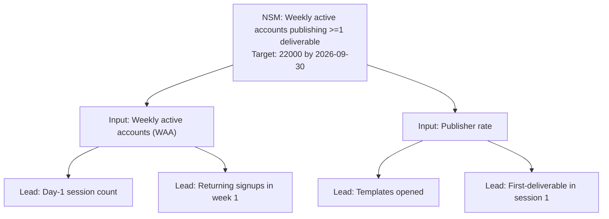

# NSM Playbook: Tests, Archetypes, Metric Tree, Guardrails, Workflow

Read this when you need the full operating detail of NSM work — the five quality tests, the Amplitude archetypes and real examples, the metric-tree structure and input math, leading indicators, anti-metrics and counter-metrics, the step-by-step workflow, the `metric_tree_builder.py` reference, troubleshooting, and success criteria.

## What makes a good North Star Metric

A defensible NSM passes five tests:

| Test | Question | If it fails... |
|------|----------|---------------|
| **Customer value** | Does this number going up mean a customer got more value? | Pick a different metric (e.g., move from "MAUs" to "weekly active accounts that completed a task") |
| **Strategic alignment** | Does it match how the company makes money? | Pick a metric closer to monetization (e.g., "paid weekly active" not "weekly active") |
| **Leading, not lagging** | Does it predict long-term success, not just measure last quarter? | Move upstream: revenue lags; activation leads |
| **Single number** | Can it be a single number on a dashboard? | Compress: "DAU/MAU ratio" is one number; "DAU and MAU separately" is two |
| **Movable** | Can the team affect it within a quarter? | Decompose into input metrics the team can move |

### NSM archetypes (Amplitude framework)

| Archetype | What value is | NSM example | Used by (kind of company) |
|-----------|---------------|-------------|---------------------------|
| **Attention** | Time spent or engagement depth | Time spent reading, video minutes watched | Media, social networks |
| **Transaction** | Purchases or trades | Gross merchandise volume, rides booked | Marketplaces, e-commerce |
| **Productivity** | Tasks completed | Weekly active teams creating >=1 deliverable | SaaS productivity tools |
| **Communication** | Messages or interactions | Messages sent per WAU | Messaging, social |
| **Subscriber** | Recurring revenue retention | Paid weekly active subscribers | Subscription products |

Pick the archetype that matches your business model. Mixing archetypes (e.g., chasing both "messages sent" and "subscribers") produces incoherent priorities.

### NSM examples (real companies)

| Company | NSM (publicly discussed) |
|---------|--------------------------|
| Airbnb | Nights booked |
| Spotify | Time spent listening |
| Slack | Active accounts sending >=2000 messages |
| Facebook (historically) | Daily active users with 7 friends in 10 days |
| Quora | Number of questions answered |

Each NSM directly represents the value the customer is getting -- not what the company is doing.

## The metric tree

An NSM alone is not actionable. It must decompose into **input metrics** the team can directly move. The metric tree formalizes this decomposition.

### Structure

```
                     North Star Metric
                            |
        ----------------------------------------
        |             |             |          |
    Input #1     Input #2     Input #3    Input #4
        |             |
   --------     --------
   |      |     |      |
 Lead   Lead  Lead   Lead
```

- **NSM at the top** -- the single number
- **Input metrics (3-5)** -- the levers the team can pull. These multiply or sum to the NSM
- **Leading indicators (2-3 per input)** -- the earliest measurable signals that an input is moving

### Input metrics: the math matters

Input metrics should have an explicit mathematical relationship to the NSM. The most common patterns:

| Pattern | Example |
|---------|---------|
| **Multiplicative** | Active users x Sessions per user x Actions per session = Total actions (NSM) |
| **Additive** | Web signups + Mobile signups + API signups = Total signups (NSM) |
| **Funnel** | Visitors -> Signups -> Activated -> Retained (each step is an input that gates the next) |
| **Ratio** | Engaged users / Total users = Engagement rate (NSM); inputs are engagement events and user counts |

Write the formula explicitly: `NSM = Input_1 * Input_2 * Input_3`. If you cannot write the formula, the inputs are not really inputs -- they are loosely related metrics.

### Leading indicators

A leading indicator is a metric that moves **before** an input metric does. It gives the team an early-warning signal.

| Input metric | Lagging signal | Leading indicator |
|--------------|----------------|-------------------|
| Weekly retention | Measured at day 7 | Day-1 retention; first-day session count |
| New paid users | Conversion at day 30 of trial | Day-3 activation; trial usage depth |
| Support ticket resolution | Average days to close | First-response time; auto-deflect rate |
| Revenue per account | Quarterly billing | Expansion features adopted; seats added |

Leading indicators are the team's daily/weekly dashboard. Inputs are the monthly review. The NSM is the quarterly headline.

## Anti-metrics and counter-metrics

The NSM is a powerful lever -- which means it can be gamed. Two guardrails prevent this.

### Anti-metrics

An **anti-metric** is a number that must NOT move (or must move in a specific bounded direction) while the NSM moves up. They protect customer outcomes that the NSM might inadvertently degrade.

Examples:

- **NSM: video minutes watched** -- Anti-metrics: complaint rate, time-to-skip, churn within 30 days of first watch
- **NSM: messages sent per WAU** -- Anti-metrics: messages reported as spam, abuse reports, blocked users
- **NSM: nights booked** -- Anti-metrics: cancellation rate, host complaints, "would not book again" rate

Set explicit thresholds. "Churn must not exceed 4%" is enforceable; "churn must stay low" is not.

### Counter-metrics

A **counter-metric** is the metric the team owns ensuring does NOT degrade because the NSM is chasing the wrong thing. Where anti-metrics protect the customer, counter-metrics protect the business.

Examples:

- **NSM: signups** -- Counter-metric: paid conversion rate (signups are useless if they do not convert)
- **NSM: time on site** -- Counter-metric: revenue per visit (time spent without purchase is loss)
- **NSM: messages sent** -- Counter-metric: server costs per message (engagement at infinite cost is bankruptcy)

Every NSM should ship with at least 2 anti-metrics and at least 1 counter-metric.

## Workflow

1. **Confirm the archetype.** Use the Amplitude framework to pick attention / transaction / productivity / communication / subscriber.
2. **Draft 3 candidate NSMs.** Score each against the five tests (Customer value / Strategic alignment / Leading / Single number / Movable).
3. **Pick the winner.** The team commits to one. Document the decision and the rejected alternatives.
4. **Decompose into 3-5 input metrics.** Write the explicit formula relating inputs to the NSM.
5. **Assign 2-3 leading indicators per input.** These become the daily dashboard.
6. **Define anti-metrics and counter-metrics.** At least 2 anti + 1 counter, each with an explicit threshold.
7. **Run `metric_tree_builder.py`.** Produce the Mermaid tree for the team wiki and the JSON for the dashboard config.
8. **Wire OKRs.** Each KR should target moving one input metric. The Objective is the NSM movement.
9. **Re-review quarterly.** NSMs are durable but not eternal; revisit when strategy shifts.

## Tools

| Tool | Purpose | Command |
|------|---------|---------|
| `metric_tree_builder.py` | Build the NSM + inputs + leaders + anti/counter metric spec; render as Mermaid, JSON, or Markdown | `python scripts/metric_tree_builder.py --input nsm_spec.json --format mermaid` |
| `metric_tree_builder.py --demo` | Inspect a worked example for a SaaS productivity NSM | `python scripts/metric_tree_builder.py --demo --format markdown` |

## Troubleshooting

| Symptom | Likely Cause | Resolution |
|---------|--------------|------------|
| Team has 5+ "NSM candidates" and cannot pick | Strategic disagreement, not metric ambiguity | Resolve the strategy decision first; the NSM debate is a proxy for "what business are we in" |
| NSM is going up but customers report dissatisfaction | NSM is being gamed; anti-metrics missing or not enforced | Add explicit anti-metrics with thresholds; review weekly alongside the NSM |
| Input metrics do not actually multiply/sum to the NSM | Inputs are loosely related, not mathematically derived | Rewrite the explicit formula; replace inputs that do not fit the formula |
| Leading indicators are the same as input metrics | Team confused lagging vs leading | A leading indicator must move BEFORE the input metric (in time); move upstream in the funnel |
| OKRs do not connect to NSM movement | OKRs set independently of the NSM | Rewrite Key Results so each one moves a specific input metric; the Objective is the NSM |
| NSM is "revenue" | Revenue is the lagging financial outcome, not the value delivered | Pick a metric closer to customer value (e.g., paid weekly active accounts); revenue follows |
| NSM changes every quarter | Team is not committing; or strategy is genuinely changing every quarter (deeper problem) | Commit to the NSM for at least 4 quarters; if strategy genuinely shifts that fast, the NSM exercise is premature |

## Success Criteria

- The team can state the NSM in one sentence with no hedging
- The NSM passes all 5 tests (customer value, strategic, leading, single number, movable)
- Inputs have an explicit mathematical relationship to the NSM (formula documented)
- Each input has 2-3 leading indicators that move days/weeks before the input
- At least 2 anti-metrics and 1 counter-metric, each with explicit thresholds
- Every OKR Key Result targets moving one input metric
- The NSM appears in every weekly status update and every quarterly review
- A new hire can explain the NSM and one path to move it within their first month

## Tool Reference

### metric_tree_builder.py

Builds a Mermaid tree of the NSM + inputs + leading indicators + anti-metrics + counter-metrics. Also outputs the spec as JSON or formatted Markdown.

| Flag | Type | Default | Description |
|------|------|---------|-------------|
| `--input` | string | (required unless `--demo`) | Path to JSON NSM spec file |
| `--demo` | flag | false | Use built-in SaaS productivity demo NSM |
| `--format` | choice | mermaid | Output: json, markdown, mermaid, confluence, notion, linear |
| `--output` | string | stdout | Output file path |

### Input JSON shape

```json
{
  "nsm": {
    "name": "Weekly active accounts that publish >=1 deliverable",
    "archetype": "productivity",
    "formula": "WAA * (publishers / WAA)",
    "current": 12400,
    "target": 22000,
    "due": "2026-09-30"
  },
  "inputs": [
    {
      "name": "Weekly active accounts (WAA)",
      "formula_role": "WAA",
      "current": 28000,
      "target": 40000,
      "leading_indicators": [
        "Day-1 session count for new signups",
        "Returning signups in week 1"
      ]
    },
    {
      "name": "Publisher rate (publishers / WAA)",
      "formula_role": "publishers / WAA",
      "current": 0.44,
      "target": 0.55,
      "leading_indicators": [
        "Templates opened by new users",
        "First-deliverable started within session 1"
      ]
    }
  ],
  "anti_metrics": [
    {"name": "Weekly churn", "threshold": "must stay below 4.0%"},
    {"name": "Time to publish (median)", "threshold": "must stay below 22 minutes"}
  ],
  "counter_metrics": [
    {"name": "Server cost per published deliverable", "threshold": "must stay below $0.08"}
  ]
}
```

### Mermaid output sample


