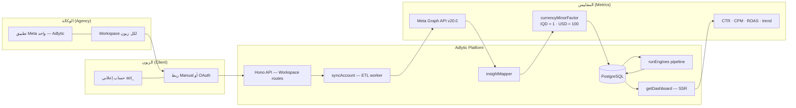
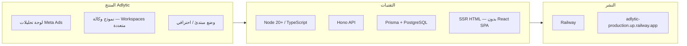
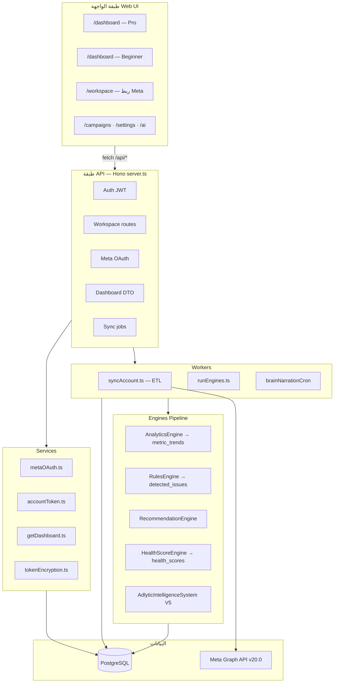
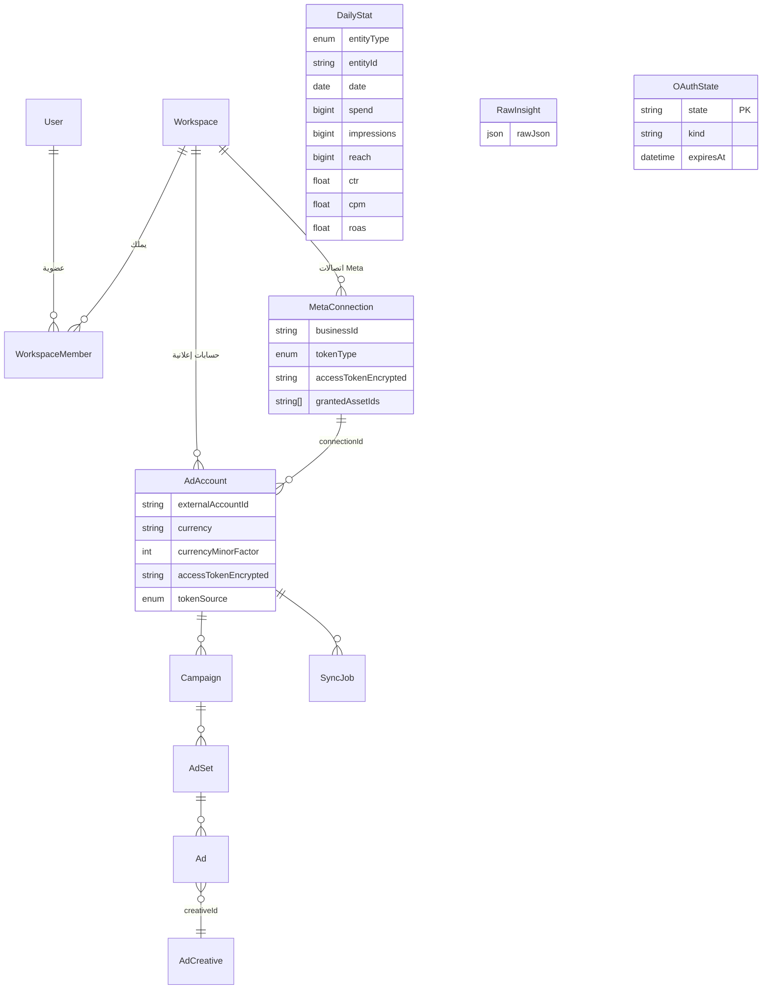
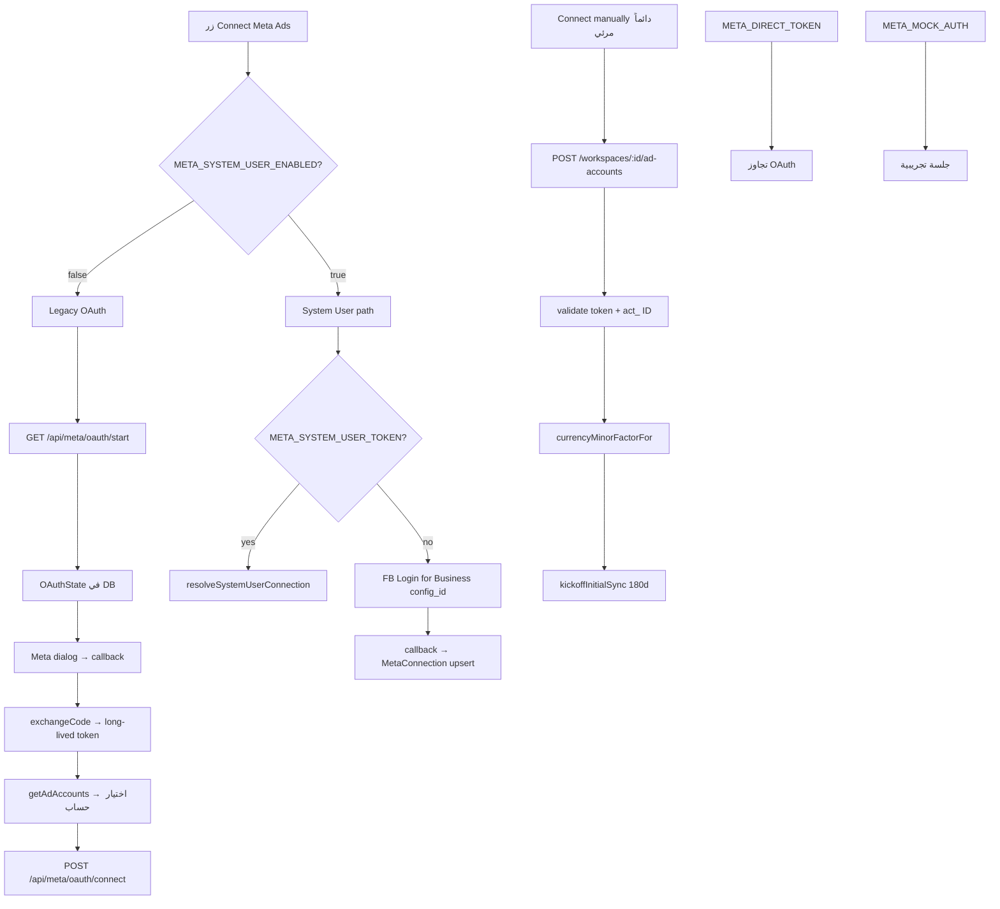
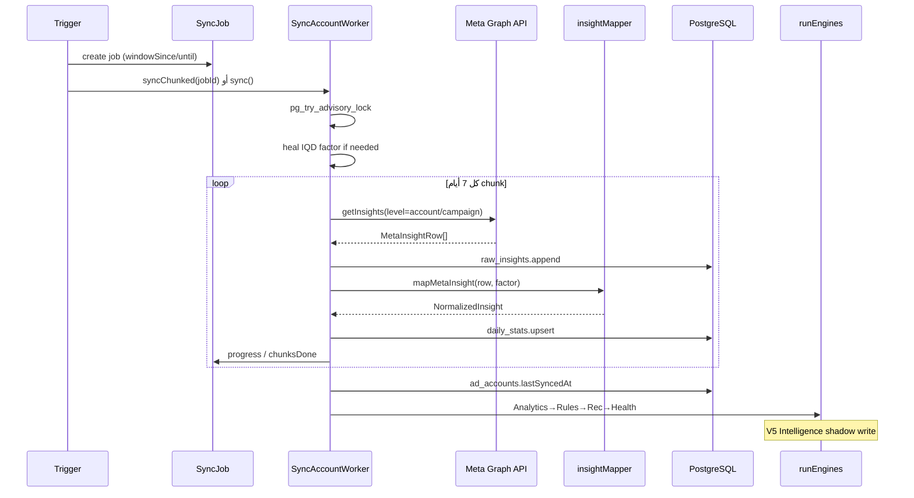
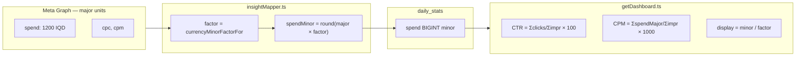
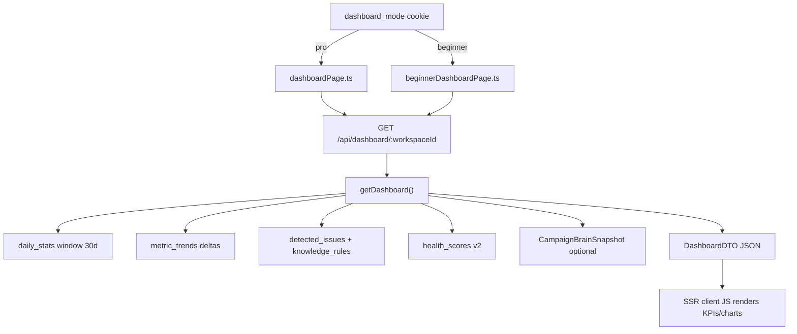
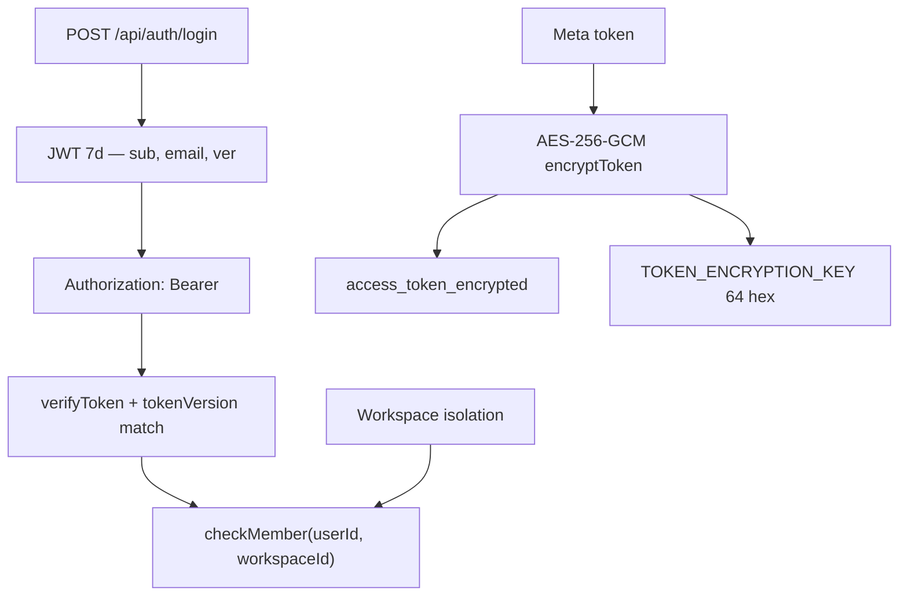

# Adlytic — دليل البنية المعمارية المرئي

> مرجع سريع للمحادثات الجديدة. آخر تحديث: 2026-06-26

**المخطط الرئيسي (نموذج الوكالة):** [MASTER_DIAGRAM.md](./MASTER_DIAGRAM.md)

## 1. نظرة عامة — Overview

## 2. البنية المعمارية — Architecture Layers

## 3. نموذج البيانات — Entity Diagram

## 4. تدفق الربط — Connection Paths

**Token resolution priority** (`accountToken.ts`):

- `tokenSource = SYSTEM_USER` + `connectionId` → token from `MetaConnection`
- else → `AdAccount.accessTokenEncrypted`

## 5. تدفق المزامنة — Sync / ETL

**Auto-sync** (`serve.ts`): every 6h, serial per account, 3-day backfill default.

## 6. الرياضيات والمقاييس — Formulas

| Metric | Formula | File |
|--------|---------|------|
| spendMinor | `round(spendMajor × factor)` | insightMapper |
| IQD factor | `1` | currency.ts |
| USD factor | `100` | currency.ts |
| CTR window | `Σclicks/Σimpressions×100` | getDashboard |
| CPM window | `(ΣspendMajor/Σimpressions)×1000` | getDashboard |
| ROAS | Meta `purchase_roas` OR `revenueMinor/spendMinor` | insightMapper |
| trend Δ% | `(current−prior)/prior` | analytics/trend |
| intraDaySpendPct | `todaySpend/todayBudget×100` | getDashboard |
| IQD repair | if `stored≈meta×100` → `meta×1` | iqdRepair |

## 7. لوحة التحكم — Dashboard Flow

## 8. الأمان — Security

**Meta 190 handling:**

- Legacy/manual → `AdAccount` PAUSED, token nulled
- System User → `MetaConnection` NEEDS_REGRANT
