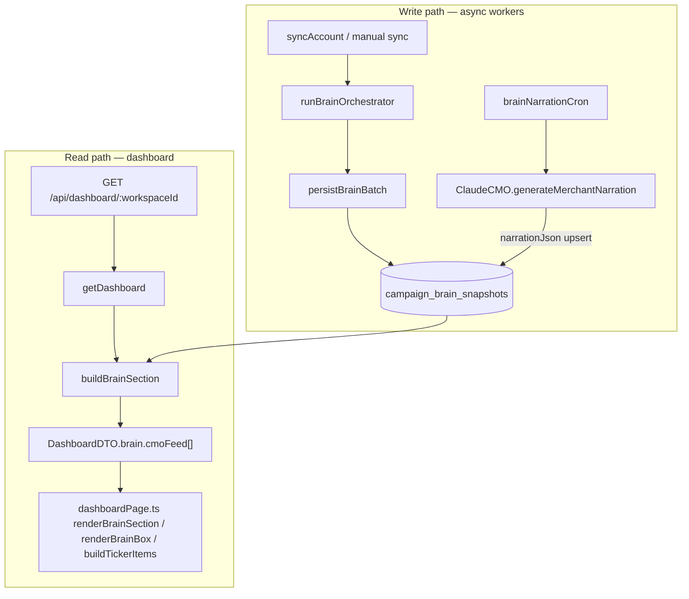

# CMO Feed — Architecture (Phase 1: Schema & Data Layer Only)

> **Scope of this document:** structural framework and data-layer schema for fixing repetitive, bloated Arabic text in the production dashboard CMO Feed (e.g. repeated `حملة جديدة: جاري جمع البيانات الأولية` for the same campaigns).  
> **Out of scope (explicit):** generator logic changes, dedupe implementation, UI fixes, and narration prompt edits — those belong to Phase 2–3.

---

## 1. Current State Analysis

### 1.1 End-to-end data flow



### 1.2 How feed items are generated

| Stage | File | Function | What it produces |
|-------|------|----------|------------------|
| Brain tick | `src/workers/runBrainOrchestrator.ts` | `runBrainOrchestrator` | One `BrainTickResult` per active campaign |
| Persist | `src/services/BrainPersistence.ts` | `persistBrainBatch` | Upsert `CampaignBrainSnapshot` on `(campaignId, tickDate)` |
| Narration | `src/workers/brainNarrationCron.ts` | `runBrainNarrationCron` | Writes `narrationJson` + `narrationGeneratedAt` via Claude or sentinel |
| LLM copy | `src/services/ClaudeCMO.ts` | `generateMerchantNarration` | `{ arabicTitle, arabicNarration, creativeDirective? }` |
| Feed assembly | `src/services/getDashboard.ts` | `buildBrainSection` | Maps snapshots → `BrainCmoFeedItem[]` (max 5) |
| HTTP | `src/api/server.ts` | `GET /api/dashboard/:workspaceId` | Full `DashboardDTO` JSON |
| Render | `src/web/pages/dashboardPage.ts` | `renderBrainSection`, `renderBrainBox`, `buildTickerItems` | HTML cards + ticker marquee |

There is **no dedicated feed-item table or builder module** today. The CMO Feed is a **derived view** over raw `CampaignBrainSnapshot` rows.

### 1.3 Storage model (today)

```570:598:prisma/schema.prisma
model CampaignBrainSnapshot {
  id                 String   @id @default(cuid())
  workspaceId        String   @map("workspace_id")
  campaignId         String   @map("campaign_id")
  externalCampaignId String   @map("external_campaign_id")
  tickDate           DateTime @map("tick_date") @db.Date
  action           String
  priority         String
  patternSignature String @map("pattern_signature")
  finalScore       Int    @map("final_score")
  payload Json
  narrationJson        Json?     @map("narration_json")
  narrationGeneratedAt DateTime? @map("narration_generated_at")
  ...
  @@unique([campaignId, tickDate])
}
```

- **One row per campaign per UTC day** at the DB layer (upsert-safe).
- Narration is a **JSON blob** on the same row, not a normalized feed entity.

### 1.4 Current DTO fields (feed-specific)

Defined in `src/services/getDashboard.ts`:

```122:135:src/services/getDashboard.ts
export interface BrainCmoFeedItem {
  campaignId: string;
  campaignName: string;
  priority: string;       // CRITICAL | HIGH | NORMAL
  action: string;
  narration: {
    arabicTitle: string;
    arabicNarration: string;
    creativeDirective?: string;
  } | null;
  generatedAt: string | null;
  tickDate: string;
}
```

Embedded under `DashboardDTO.brain.cmoFeed` inside `BrainSection` (also includes `livePulse`, `ledger`).

### 1.5 How feed items are fetched (read query)

```617:652:src/services/getDashboard.ts
  const snapshots = await prisma.campaignBrainSnapshot.findMany({
    where: { workspaceId, tickDate: { gte: ledgerSince } },  // 7-day ledger window
    orderBy: { tickDate: 'desc' },
  });
  ...
  const sortedByPriority = [...snapshots].sort((a, b) => { ... });
  const cmoFeed: BrainCmoFeedItem[] = sortedByPriority
    .slice(0, BRAIN_SECTION_CONFIG.CMO_FEED_LIMIT)  // 5
    .map(s => ({ ... }));
```

**Observations:**

- Query window = **7 days** (`LEDGER_LOOKBACK_DAYS`), shared with Interventions Ledger — not “today only” despite UI copy (“decisions for today”).
- Selection = **global priority sort + top 5** — no `campaignId` deduplication.
- No `id`, `insightType`, `dedupeKey`, or body length cap on the DTO.

### 1.6 How feed items are rendered

Three UI surfaces consume the **same** `brain.cmoFeed` array:

| Surface | Location | Behavior |
|---------|----------|----------|
| CMO Feed section | `dashboardPage.ts` ~998–1029 | Full card per item: title = `arabicTitle`, body = full `arabicNarration` |
| AI Brain Box | `dashboardPage.ts` ~714–720 | Top 3 feed items as strategy cards |
| AI Motion Ticker | `dashboardPage.ts` ~621–631 | Top 6 titles concatenated with campaign name |

No truncation, expand/collapse, or duplicate suppression on the client.

### 1.7 Root cause of duplication (production UX)

**Primary causes (stacked):**

1. **Read-path: no per-campaign deduplication**  
   The feed can include **multiple snapshots for the same `campaignId`** from different days within the 7-day window. A campaign with `HIGH` priority on Mon, Tue, Wed can occupy 3 of 5 slots with near-identical narrations.

2. **Comment/code mismatch: “today” vs 7-day window**  
   Code comment says “top critical/high snapshots from today (or most recent tick)” but implementation uses **all snapshots ≥ ledgerSince (7d)** without filtering to `tickToday`.

3. **Generator: cold-start template homogeneity**  
   `ClaudeCMO.ts` system prompt mandates a safe cold-start title template:

   ```265:267:src/services/ClaudeCMO.ts
   - Frame the narration as an early-collection update. A safe template:
     title:     "حملة جديدة: جاري جمع البيانات الأولية"
   ```

   Many campaigns in `KEEP_COLLECTING` / `coldStart === true` produce **identical titles** and structurally similar bodies. This is intentional in the prompt but catastrophic in a multi-card feed without dedupe or copy differentiation.

4. **Triple rendering of the same DTO**  
   CMO Feed + Brain Box + Ticker all repeat the same `arabicTitle` text, amplifying perceived bloat.

5. **No preview length contract**  
   `arabicNarration` is rendered in full (2–4 Arabic sentences per prompt rules; no 150-char cap). Cards feel “bloated” even when titles differ.

**Not a DB duplicate-row bug:** `@@unique([campaignId, tickDate])` prevents multiple rows per campaign per day. Duplication is a **feed-selection and presentation** problem.

---

## 2. Proposed Feed Item Schema

Canonical TypeScript types live in `src/types/cmoFeed.ts`. Summary:

```typescript
interface CmoFeedItemDTO {
  id: string;
  campaignId: string;
  campaignName: string;
  insightType: CmoInsightType;   // recommend: decision.action initially
  date: string;                  // YYYY-MM-DD (tickDate)
  title: string;                 // max 150 @ DTO layer
  body: string;                  // max 150 @ DTO layer (preview)
  severity: CmoFeedSeverity;     // maps from priority
  dedupeKey: string;             // `${campaignId}:${insightType}:${date}`
  generatedAt: string | null;
  creativeDirective?: string;
  bodyFull?: string;             // optional when body truncated
}

interface CmoFeedDTO {
  items: CmoFeedItemDTO[];
  total: number;
  window: 'today' | 'rolling';
  maxPreviewChars: 150;
  truncated: boolean;
}
```

### Mapping from existing snapshot → proposed DTO

| Proposed field | Source today |
|----------------|--------------|
| `id` | `CampaignBrainSnapshot.id` |
| `campaignId` | `snapshot.campaignId` |
| `campaignName` | `Campaign.name` lookup |
| `insightType` | `snapshot.action` (Phase 2); optionally `action:patternSignature` if same action needs sub-types |
| `date` | `snapshot.tickDate` → `YYYY-MM-DD` |
| `title` | `narrationJson.arabicTitle` or fallback `campaignName` |
| `body` | `narrationJson.arabicNarration` (truncated) |
| `severity` | `snapshot.priority` |
| `dedupeKey` | computed |
| `generatedAt` | `narrationGeneratedAt` |

### Optional Prisma extension (Phase 2 decision)

**Option A — Dedupe at read time on `campaign_brain_snapshots` (minimal migration)**  
- Add composite index `(workspace_id, campaign_id, action, tick_date)` for efficient “latest per campaign per day” queries.  
- No new table; feed builder runs dedupe in `getDashboard` or a new service.

**Option B — Dedicated `cmo_feed_items` table (normalized feed cache)**  
- Written by narration cron or a post-brain materializer.  
- Enforces uniqueness on `dedupeKey` per workspace.

```prisma
// Phase 2+ — illustrative only, not migrated in Phase 1
model CmoFeedItem {
  id           String   @id @default(cuid())
  workspaceId  String   @map("workspace_id")
  campaignId   String   @map("campaign_id")
  insightType  String   @map("insight_type")
  date         DateTime @db.Date @map("feed_date")
  title        String   @db.VarChar(150)
  body         String   @db.VarChar(150)
  severity     String
  dedupeKey    String   @map("dedupe_key")
  snapshotId   String?  @map("snapshot_id")
  generatedAt  DateTime? @map("generated_at")
  createdAt    DateTime @default(now()) @map("created_at")
  updatedAt    DateTime @updatedAt @map("updated_at")

  @@unique([workspaceId, dedupeKey])
  @@index([workspaceId, date])
  @@map("cmo_feed_items")
}
```

**Recommendation:** Start with **Option A** (read-time dedupe + DTO truncation) for fastest fix; graduate to **Option B** if feed history, push notifications, or cross-surface caching require a stable feed cursor.

---

## 3. Deduplication Standard

### 3.1 Dedupe key

```
dedupeKey = `${campaignId}:${insightType}:${date}`
```

- `insightType` = `action` string from brain decision (`KEEP_COLLECTING`, `PAUSE_CAMPAIGN`, …).  
- `date` = UTC calendar day of `tickDate`.  
- Ensures at most **one feed card per campaign per insight type per day**.

### 3.2 Algorithm choice

| Strategy | When | Pros | Cons |
|----------|------|------|------|
| **Write-time** | On narration persist or dedicated materializer | Stable id; cheap reads; DB unique constraint | Requires migration/worker change |
| **Read-time** | In `buildBrainSection` / new `buildCmoFeed()` | No schema change; Phase 2 quick win | Recomputed every dashboard load |

**Phase 2 plan:** Implement **read-time dedupe first** (low risk), then optional **write-time** upsert into `cmo_feed_items` if performance or notification fan-out requires it.

### 3.3 Read-time dedupe pseudocode (Phase 2 — not implemented)

```
1. Fetch candidate snapshots (window = today only for feed; keep 7d for ledger)
2. Map each row → CmoFeedItemDTO candidate + dedupeKey
3. Group by dedupeKey; keep row with highest severity, then latest generatedAt
4. Secondary dedupe (optional): group by campaignId within window → keep latest date only
5. Sort by severity DESC, generatedAt DESC
6. slice(0, FEED_LIMIT)
7. Apply truncation policy (§4)
```

### 3.4 Unique constraint strategy

- **Snapshots (existing):** `@@unique([campaignId, tickDate])` — unchanged.  
- **Feed items (optional table):** `@@unique([workspaceId, dedupeKey])`.  
- **Application invariant:** API must never return two items with the same `dedupeKey` in `CmoFeedDTO.items`.

---

## 4. Backend Payload Contract — `CmoFeedDTO`

### 4.1 Max 150 character rule

Enforced at **DTO assembly** (server), not in the LLM prompt (Phase 3 may tighten generation).

| Field | Limit | Notes |
|-------|-------|-------|
| `title` | 150 chars | Arabic-safe grapheme count via existing string length (UTF-16 code units acceptable for Phase 2) |
| `body` (preview) | 150 chars | Primary card text |
| `creativeDirective` | 200 chars (recommended) | Separate from body budget; optional |

### 4.2 Truncation policy

- If `text.length > maxPreviewChars`:  
  - `body = text.slice(0, 147) + '…'` (ellipsis U+2026 or ASCII `...`)  
  - Set `truncated: true` on parent `CmoFeedDTO`  
  - Optionally attach `bodyFull` for expand UI (Phase 3 frontend)
- Never truncate mid-word when feasible: prefer break at last space before limit (Arabic-aware word break is Phase 3 polish).
- Titles truncate with same rule; do not append campaign name to title (campaign name is a separate UI field today).

### 4.3 Paragraph split rules

- **Preview (`body`):** single paragraph; strip internal newlines; collapse whitespace.  
- **Full text (`bodyFull`):** preserve up to 2 paragraphs separated by `\n\n`; more than 2 paragraphs → join with space in preview, keep full in `bodyFull`.  
- **creativeDirective:** never merged into `body`; rendered as sub-line (existing UI pattern).

### 4.4 Backward compatibility

During transition, `DashboardDTO.brain.cmoFeed` may remain as `BrainCmoFeedItem[]` while adding parallel `brain.cmoFeedV2: CmoFeedDTO`. Frontend switches in Phase 3. Alternatively, evolve `BrainCmoFeedItem` in place with additive fields (`id`, `dedupeKey`, truncated `title`/`body`).

---

## 5. API Layer

### 5.1 Current endpoint

| Method | Path | Handler | Feed field |
|--------|------|---------|------------|
| `GET` | `/api/dashboard/:workspaceId` | `server.ts` → `getDashboard` | `dto.brain.cmoFeed` |

Pulse endpoint (`GET /api/dashboard/pulse/:workspaceId`) **does not** include CMO Feed — by design.

### 5.2 Proposed changes (Phase 2+)

**Path A — Extend existing dashboard DTO (recommended first)**  
- Add `buildCmoFeed()` in `getDashboard.ts` (or `src/services/buildCmoFeed.ts`).  
- Replace raw snapshot slice in `buildBrainSection` with deduped `CmoFeedDTO`.  
- Keep `brain.livePulse` and `brain.ledger` logic unchanged.

**Path B — Dedicated endpoint (optional, for polling / mobile)**  

```
GET /api/dashboard/cmo-feed/:workspaceId
  → CmoFeedDTO
  Query: ?window=today|7d&limit=5
```

Same auth as dashboard (`bearerToken`, workspace membership). Useful if feed refresh decouples from full dashboard load.

### 5.3 Server route sketch (Phase 2 — not wired)

```typescript
// server.ts — illustrative
app.get('/api/dashboard/cmo-feed/:workspaceId', async (c) => {
  // auth identical to /api/dashboard/:workspaceId
  const feed = await buildCmoFeed(workspaceId, { prisma, window: 'today', limit: 5 });
  return c.json(feed);
});
```

---

## 6. Data Layer Adjustments

| Change | Phase | Required? |
|--------|-------|-----------|
| Read-time dedupe in feed builder | 2 | Yes (minimum fix) |
| Restrict feed window to `tickToday` | 2 | Strongly recommended |
| DTO truncation (`title`/`body` 150) | 2 | Yes |
| Index `(workspaceId, tickDate, priority)` | 2 | Optional perf |
| `cmo_feed_items` table + write-time upsert | 2–3 | Optional |
| Alter `narrationJson` schema | 3 | Only if generator stores `insightType` explicitly |
| Change `CampaignBrainSnapshot` uniqueness | — | **No** — keep one row per campaign per day |

**Narration storage:** Continue using `narrationJson` as the authoritative Arabic source; feed DTO is a **projection**, not a second source of truth, unless Option B table is adopted.

---

## 7. Rendering Standards (Phase 3 frontend)

| Rule | Target |
|------|--------|
| Max visible body lines | 3 lines CSS (`line-clamp: 3`) on preview |
| Expand/collapse | “عرض المزيد” when `truncated === true` or `bodyFull` present |
| No duplicate cards | Key React/DOM list by `dedupeKey` (or `id`) |
| Title display | Show `title` once; campaign name in meta line only (avoid `title + campaignName` redundancy in ticker) |
| Ticker | Dedupe by `dedupeKey` before marquee; prefer distinct campaigns |
| Brain Box | Share same deduped list as CMO Feed section (single source) |
| Empty state | Distinguish “no decisions today” vs “narration pending” |

---

## 8. Migration Plan

| Phase | Deliverable | Status |
|-------|-------------|--------|
| **Phase 1** | This architecture doc + `src/types/cmoFeed.ts` (interfaces only) | **Current** |
| **Phase 2** | Dedupe layer: read-time `dedupeKey`, today-window filter, `CmoFeedDTO` truncation in `getDashboard` / `buildCmoFeed`; optional DB index | Not started |
| **Phase 3** | Generator cleanup: cold-start copy differentiation, prompt length alignment, frontend line-clamp + expand; optional `cmo_feed_items` write path | Not started |

**Rollout:** Phase 2 can ship backend-only (smaller payloads, fewer duplicate cards) before Phase 3 UI polish.

**Verification checklist (post Phase 2):**

- Same campaign + same action + same day → exactly one feed item.  
- Feed window “today” matches UI meta copy.  
- No two items with identical `dedupeKey` in API response.  
- `title` and `body` ≤ 150 chars in JSON.

---

## 9. What NOT to Build Yet

Per user request — **do not implement in Phase 1:**

- Changes to `ClaudeCMO.generateMerchantNarration` or cold-start prompt templates  
- Changes to `brainNarrationCron` batch logic or sentinel text  
- `runBrainOrchestrator` / `AdlyticBrain` decision rules  
- Frontend card/ticker/brain-box rendering fixes  
- New `cmo_feed_items` Prisma migration (documented only)  
- Dedicated `/api/dashboard/cmo-feed` route wiring  
- Any dedupe or truncation **logic** in TypeScript (types only in `cmoFeed.ts`)

---

## Appendix A — Key file reference map

| Concern | File | Lines / symbol |
|---------|------|----------------|
| Feed DTO (current) | `src/services/getDashboard.ts` | `BrainCmoFeedItem` 122–135, `buildBrainSection` 602–734 |
| Dashboard API | `src/api/server.ts` | `GET /api/dashboard/:workspaceId` ~814–833 |
| CMO Feed UI | `src/web/pages/dashboardPage.ts` | `renderBrainSection` 998–1029, `renderBrainBox` 714–720, `buildTickerItems` 621–631 |
| Brain persist | `src/services/BrainPersistence.ts` | `persistBrainBatch` 52–102 |
| Brain orchestrator | `src/workers/runBrainOrchestrator.ts` | `runBrainOrchestrator` 71+ |
| Narration cron | `src/workers/brainNarrationCron.ts` | `runBrainNarrationCron` 62+ |
| LLM / cold-start template | `src/services/ClaudeCMO.ts` | `SYSTEM_PROMPT` 256–267, `generateMerchantNarration` 295+ |
| DB model | `prisma/schema.prisma` | `CampaignBrainSnapshot` 570–598 |
| Proposed types | `src/types/cmoFeed.ts` | `CmoFeedItemDTO`, `CmoFeedDTO` |

## Appendix B — Related types (narration source)

```typescript
// src/services/ClaudeCMO.ts
interface CmoNarration {
  campaignId: string;
  arabicTitle: string;
  arabicNarration: string;
  creativeDirective?: string;
}
```

Stored in DB as `narrationJson` without `campaignId`; dashboard joins campaign via snapshot row.
