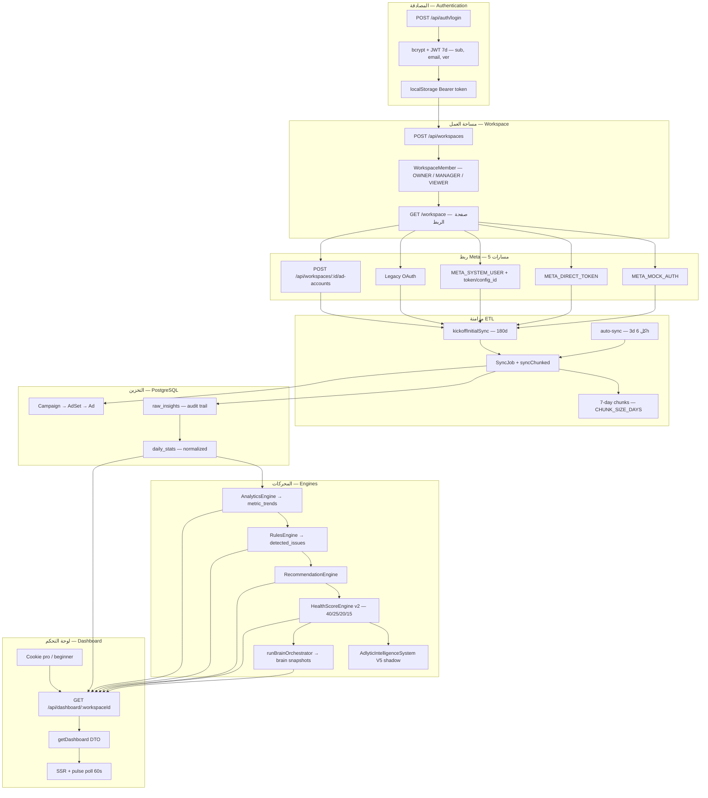
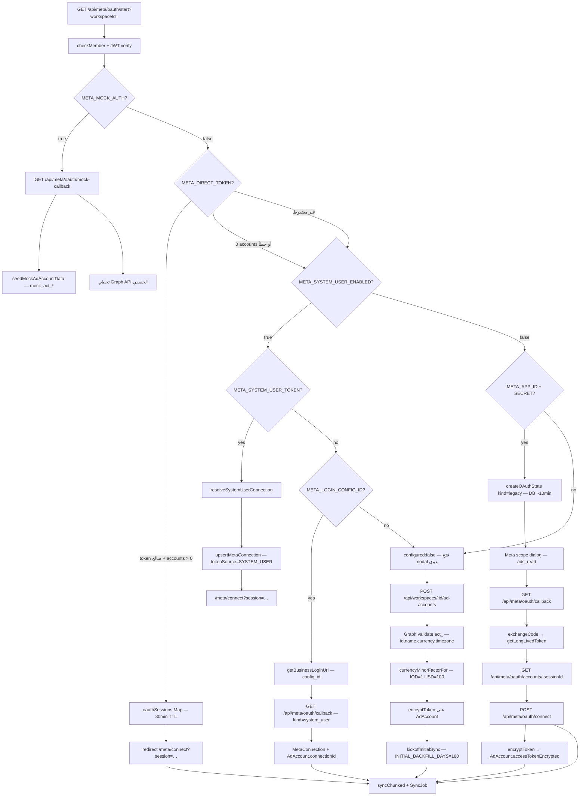
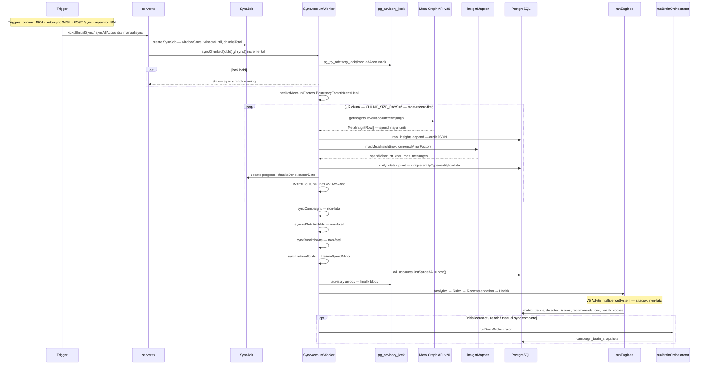
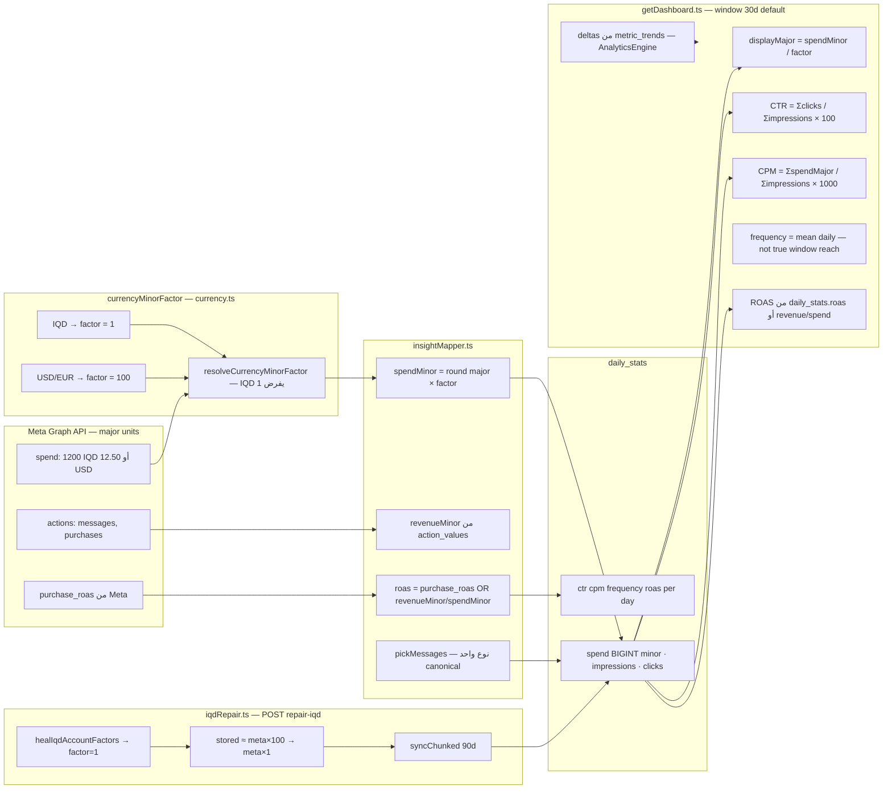
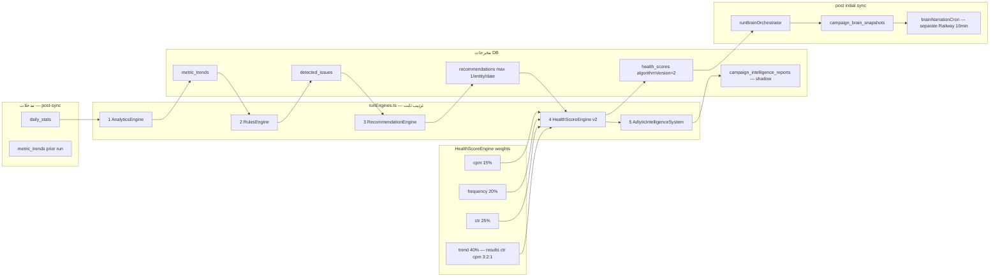
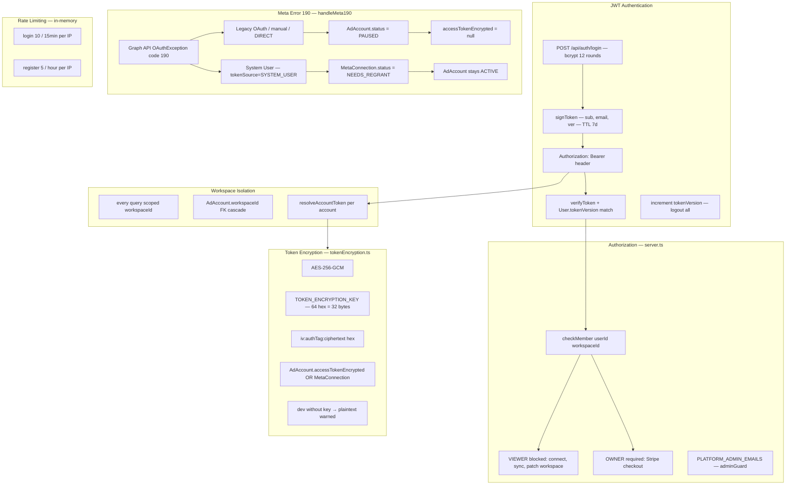
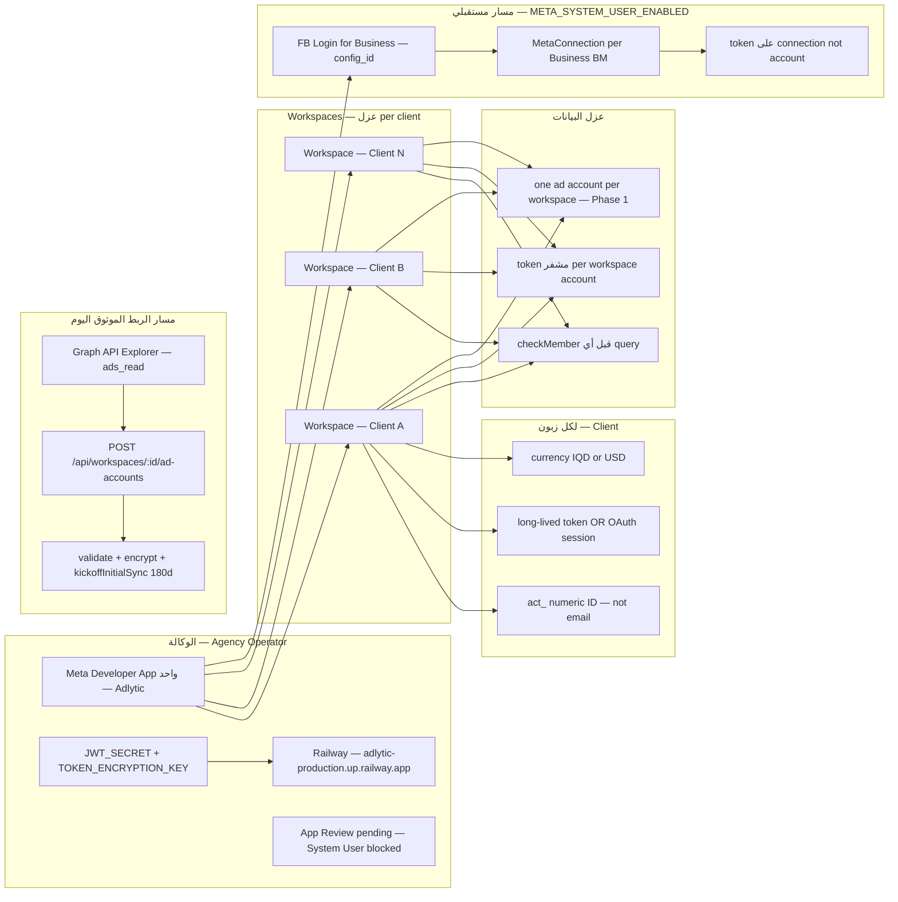

# Adlytic — الرسم التفصيلي للنظام

> مخططات Mermaid شاملة لدورة حياة Adlytic بالكامل — مستخرجة من الكود.
>
> **للتفاصيل النصية:** [HOW_IT_WORKS.md](./HOW_IT_WORKS.md)
>
> آخر مراجعة: 2026-06-26

---

## 1. نظرة عامة رئيسية — MASTER OVERVIEW



**شرح:** Adlytic منصة وكالة متعددة المستأجرين: المستخدم يسجّل الدخول بـ JWT، ينشئ Workspace، ويربط حساب Meta عبر أحد خمسة مسارات. بعد الربط تبدأ مزامنة ETL (180 يوماً أولاً، ثم 3 أيام تلقائياً كل 6 ساعات) وتُخزَّن البيانات في PostgreSQL. محركات التحليل تشتغل بعد كل sync ناجح، ثم `getDashboard` يجمّع DTO للوحة Pro أو Beginner.

---

## 2. مسارات ربط Meta — META CONNECTION



**شرح:** أولوية `oauth/start` ثابتة في الكود: Mock → Direct Token → System User → Legacy OAuth → تلميح يدوي. المسار اليدوي (`POST /ad-accounts`) متاح دائماً ويتحقق من `act_` عبر Graph API. كل مسار ناجح ينتهي بـ `syncChunked` لـ 180 يوماً.

**Token resolution** (`accountToken.ts`): `tokenSource=SYSTEM_USER` + `connectionId` → `MetaConnection.accessTokenEncrypted`؛ وإلا → `AdAccount.accessTokenEncrypted`.

---

## 3. خط أنابيب المزامنة — SYNC ETL



**شرح:** المزامنة الأولى تغطي **180 يوماً** بقطع **7 أيام** (الأحدث أولاً). Auto-sync كل **6 ساعات** يستخدم `sync()` بنافذة **3 أيام** فقط. Advisory lock يمنع sync متزامن لنفس الحساب. بعد ETL تُشغَّل المحركات بالترتيب الإلزامي، ثم Brain orchestrator عند الربط الأول.

---

## 4. نموذج البيانات — DATA MODEL

```mermaid
erDiagram
  User ||--o{ WorkspaceMember : "memberships"
  Workspace ||--o{ WorkspaceMember : "members"
  Workspace ||--o{ AdAccount : "adAccounts"
  Workspace ||--o{ MetaConnection : "metaConnections"
  Workspace ||--o{ PaymentEvent : "paymentEvents"
  Workspace ||--o{ RecommendationExecution : "executions"
  Workspace }o--o| IndustryProfile : "industryProfile"

  MetaConnection ||--o{ AdAccount : "connectionId"
  AdAccount ||--o{ Campaign : "campaigns"
  AdAccount ||--o{ SyncJob : "syncJobs"
  AdAccount ||--o{ AdCreative : "adCreatives"

  Campaign ||--o{ AdSet : "adSets"
  AdSet ||--o{ Ad : "ads"
  Ad }o--o| AdCreative : "creativeId"

  Recommendation ||--o| RecommendationExecution : "execution"
  IndustryProfile ||--o{ KnowledgeRule : "knowledgeRules"

  User {
    string id PK
    string email UK
    int tokenVersion
    enum locale
  }

  Workspace {
    string id PK
    string name
    enum tier
    enum subscriptionStatus
    string stripeCustomerId UK
  }

  WorkspaceMember {
    string workspaceId FK
    string userId FK
    enum role OWNER_MANAGER_VIEWER
  }

  AdAccount {
    string id PK
    string workspaceId FK
    string externalAccountId act_
    string currency
    int currencyMinorFactor
    string accessTokenEncrypted
    enum tokenSource
    string connectionId FK
    datetime lastSyncedAt
  }

  MetaConnection {
    string id PK
    string workspaceId FK
    string businessId
    enum tokenType
    string accessTokenEncrypted
    string[] grantedAssetIds
    enum status ACTIVE_REVOKED_NEEDS_REGRANT
  }

  OAuthState {
    string state PK
    string workspaceId
    string kind legacy_system_user
    datetime expiresAt
  }

  SyncJob {
    string id PK
    string adAccountId FK
    enum status
    int windowDays
    int chunksDone
    int chunksTotal
  }

  DailyStat {
    enum entityType ACCOUNT_CAMPAIGN_AD_SET_AD
    string entityId
    date date UK
    bigint spend
    bigint impressions
    float ctr cpm roas
  }

  RawInsight {
    enum entityType
    string entityId
    date date
    json rawJson
  }

  BreakdownStat {
    string breakdownKey
    string breakdownValue
    bigint spend impressions
  }

  MetricTrend {
    float ctrTrend cpmTrend resultsTrend
    int windowDays
  }

  DetectedIssue {
    enum issueCode
    enum severity
    json evidenceJson
  }

  KnowledgeRule {
    enum issueCode
    enum locale EN_AR
    json causesJson recommendationsJson
  }

  Recommendation {
    enum priority
    string actionCode
    json sourceIssuesJson
  }

  HealthScore {
    int score
    json breakdownJson
    int algorithmVersion
  }

  CampaignBrainSnapshot {
    string workspaceId
    string campaignId
    date tickDate
    json payload
    json narrationJson
  }

  CampaignIntelligenceReport {
    string adAccountId
    date date
    float healthScore
  }

  CampaignIntelligenceReport ||--o{ CampaignSignal : "signals"
  CampaignIntelligenceReport ||--o{ CampaignIssue : "issues"
  CampaignIntelligenceReport ||--o{ CampaignRecommendation : "recommendations"

  PaymentEvent {
    enum eventType
    enum source STRIPE_WHATSAPP
  }

  ProcessedStripeEvent {
    string id PK
    string type
  }
```

**شرح:** Prisma يعرّف عزل المستأجر عبر `Workspace` → `AdAccount`. التسلسل الهرمي Meta (`Campaign → AdSet → Ad`) يُ mirrored مع `DailyStat` لكل مستوى `EntityType`. مخرجات المحركات (`metric_trends`, `detected_issues`, `recommendations`, `health_scores`) منفصلة عن V5 shadow tables و V6 brain snapshots.

---

## 5. رياضيات المقاييس — METRICS MATH



**شرح:** Meta يرسل `spend` بوحدات major (دينار كامل أو دولار بكسور). `insightMapper` يحوّل إلى minor عبر `currencyMinorFactor` (IQD=1، USD=100). `getDashboard` يجمع نوافذ زمنية بـ Σ وليس mean-of-rates. إصلاح IQD يعالج legacy factor=100 ويعيد sync 90 يوماً.

---

## 6. خط أنابيب المحركات — ENGINES PIPELINE



**شرح:** ترتيب المحركات **لا يُغيَّر** — كل محرك يقرأ مخرجات السابق. Health v2 يوزّن trend 40%، ctr 25%، frequency 20%، cpm 15%. V5 shadow write غير fatal ولا يُقرأ من Dashboard الرئيسي. Brain orchestrator يعمل بعد sync الأولي/repair ويكتب snapshots؛ narration عبر cron منفصل.

**RulesEngine detectors:** audienceFatigue, decliningResults, risingCostPerResult, highFrequency, lowCtr.

---

## 7. لوحة التحكم — DASHBOARD

```mermaid
flowchart TB
  subgraph ENTRY["نقاط الدخول SSR"]
    R1["GET /dashboard"]
    R2["GET /campaigns · /recommendations · /settings"]
  end

  subgraph MODE["وضع العرض — Cookie"]
    C1["dashboard_mode=pro — default"]
    C2["dashboard_mode=beginner"]
    TOGGLE["POST /api/dashboard-mode — 1 year cookie"]
    C1 --> PRO["dashboardPage.ts — LTR full KPIs"]
    C2 --> BGN["beginnerDashboardPage.ts — RTL simplified"]
  end

  subgraph API["Dashboard API"]
    GD["GET /api/dashboard/:workspaceId"]
    GP["GET /api/dashboard/pulse/:workspaceId — 60s poll"]
    AUTH["JWT + checkMember"]
  end

  subgraph DTO["getDashboard DTO sections"]
    SEC1["workspace — Workspace + AdAccount + IndustryProfile"]
    SEC2["health — health_scores v2 latest"]
    SEC3["kpis — daily_stats 30d + metric_trends deltas"]
    SEC4["trendSeries — daily chart data"]
    SEC5["issues — detected_issues + KnowledgeEngine AR/EN"]
    SEC6["priorityAction — top recommendations"]
    SEC7["bestCampaign / worstCampaign"]
    SEC8["brain — CampaignBrainSnapshot optional"]
    EMPTY["empty:true — no ad account"]
  end

  subgraph PULSE["Live Pulse fields"]
    P1["burnRate — sum payload.v2.velocity"]
    P2["intraDaySpendPct — today spend / budget"]
    P3["dnaMatchPct — goldStandard mean"]
    P4["savedSpend — pause burnRate × 4h × 7d"]
  end

  subgraph RENDER["Client render"]
    JS["inline JS — apiFetch Bearer"]
    CHART["KPI cards + trend charts"]
    POLL["setInterval 60s → pulse endpoint"]
  end

  R1 --> MODE
  TOGGLE --> C1 & C2
  PRO & BGN --> GD
  GD --> AUTH
  AUTH --> SEC1 & SEC2 & SEC3 & SEC4 & SEC5 & SEC6 & SEC7 & SEC8
  AUTH --> EMPTY
  SEC3 --> RENDER
  GP --> PULSE --> POLL
  JS --> CHART
```



**شرح:** Pro و Beginner يستخدمان **نفس** `GET /api/dashboard/:workspaceId` — الفرق في SSR template و cookie فقط. DTO يجمع KPIs من `daily_stats`، trends من `metric_trends`، issues م localized، و brain section اختياري. Pulse يُ polled كل 60 ثانية للإنفاق اليومي.

---

## 8. الأمان — SECURITY



**شرح:** JWT يُ revoked عبر `tokenVersion`. توكنات Meta مشفّرة AES-256-GCM قبل التخزين. كل route workspace-scoped يمر بـ `checkMember`. خطأ Meta 190 (token منتهي) يُعالج حسب مصدر التوكن: legacy/manual يُ pause الحساب، System User يُ mark الاتصال NEEDS_REGRANT.

---

## 9. نموذج الوكالة — AGENCY MODEL



**شرح:** الوكالة (مثل ترجمان) تدير **تطبيق Meta واحد** على Railway وتنشئ **Workspace منفصل** لكل زبون. كل زبون يوفّر `act_<id>` و token (يدوي اليوم، OAuth/System User لاحقاً). البيانات معزولة بـ `workspaceId` — لا مشاركة tokens أو stats بين workspaces.

---

## مرجع سريع — Constants

| الثابت | القيمة | السياق |
|--------|--------|--------|
| `INITIAL_BACKFILL_DAYS` | 180 | connect / OAuth |
| `DEFAULT_INCREMENTAL_BACKFILL_DAYS` | 3 | auto-sync |
| `MAX_BACKFILL_DAYS` | 365 | manual sync cap |
| `CHUNK_SIZE_DAYS` | 7 | Meta API chunks |
| `SYNC_INTERVAL_MS` | 6h | serve.ts loop |
| `RAW_INSIGHTS_RETAIN_DAYS` | 90 | prune job |
| `HEALTH_ALGORITHM_VERSION` | 2 | health_scores |
| `META_API_VERSION` | v20.0 | Graph API |

---

## ملفات مرجعية — Key Files

| الموضوع | المسار |
|---------|--------|
| Boot + auto-sync | `src/api/serve.ts` |
| Routes + OAuth | `src/api/server.ts` |
| ETL worker | `src/workers/syncAccount.ts` |
| Engines | `src/workers/runEngines.ts` |
| Dashboard DTO | `src/services/getDashboard.ts` |
| Schema | `prisma/schema.prisma` |
| Token crypto | `src/services/tokenEncryption.ts` |
| Meta 190 | `src/services/accountToken.ts` |
