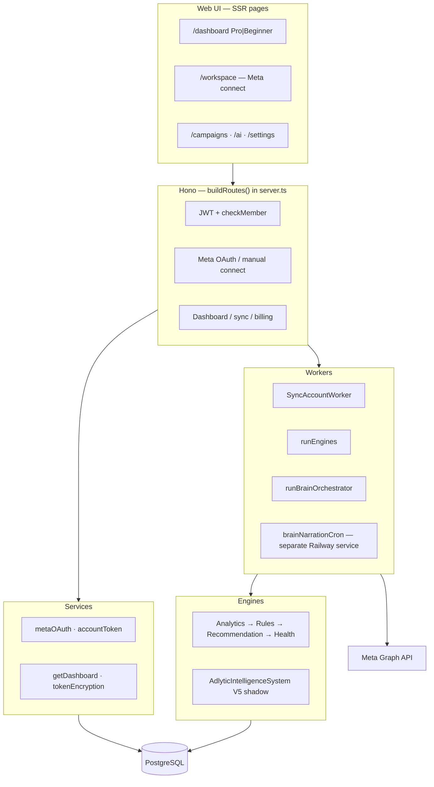
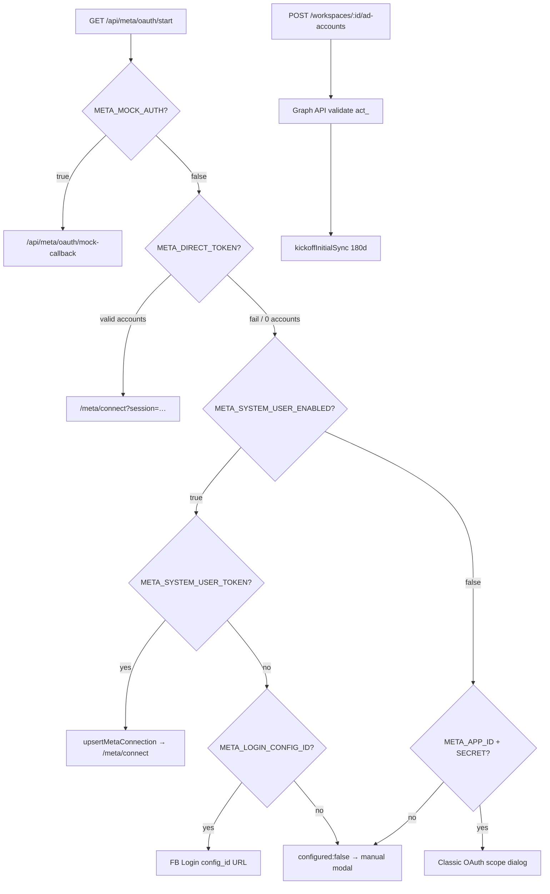

# Adlytic — How It Works

> Technical reference derived from the codebase at `/Users/aliahhed/Downloads/adlytic`.  
> Last reviewed against `main` documentation dated 2026-06-26.

---

## 1. Executive Summary

**Adlytic** is a Meta (Facebook) ads intelligence platform for **agency multi-tenant** operations: one Meta developer app serves many clients, each isolated in a **Workspace**.

| Aspect | Detail |
|--------|--------|
| **Product** | Dashboard + analytics + rule-based recommendations + health scoring + V5/V6 intelligence layers |
| **Primary KPI (Phase 1)** | Messaging conversations started |
| **Users** | Agency staff (owners/managers) connect client ad accounts; viewers can read |
| **Data flow** | Meta Graph API → ETL (`syncAccount`) → PostgreSQL → engines → `getDashboard` DTO → SSR HTML + client JS |
| **Production** | https://adlytic-production.up.railway.app (Railway + Postgres) |

Phase 1 assumes **one ad account per workspace** (`getDashboard.ts`, `server.ts` `getAccount()`).

---

## 2. Technology Stack

From `package.json` and `src/api/serve.ts`:

| Layer | Technology |
|-------|------------|
| Runtime | Node.js ≥ 20 |
| Language | TypeScript 5.5 |
| HTTP framework | Hono 4.x via `@hono/node-server` |
| ORM | Prisma 7.8 + `@prisma/adapter-pg` |
| Database | PostgreSQL (`pg` driver) |
| Auth | `bcryptjs` (passwords), `jsonwebtoken` (JWT, 7-day TTL) |
| Token encryption | Node `crypto` AES-256-GCM (`tokenEncryption.ts`) |
| Meta API | REST Graph API (default `v20.0`) |
| AI (optional) | `@anthropic-ai/sdk` — chat + brain narration cron |
| Billing (optional) | Stripe 22.x |
| UI | Server-rendered HTML strings in `src/web/pages/*` — **no React SPA** |
| Build | `prisma generate && tsc` |
| Start (prod) | `prisma migrate deploy && node dist/src/api/serve.js` |

---

## 3. System Architecture

### 3.1 Layers



### 3.2 Boot sequence (`serve.ts`)

1. `reportConfig()` — validates `JWT_SECRET`, `TOKEN_ENCRYPTION_KEY`, `DATABASE_URL`; **exits in production** on failure (`config.ts`).
2. Create `pg.Pool` (SSL for external hosts; skip for `*.railway.internal`).
3. `PrismaClient` with `PrismaPg` adapter; `$connect()` with warning on failure.
4. `buildRoutes(prisma)` → Hono app; listen on `PORT` (default **3001**).
5. Log Meta OAuth status via `getMetaOAuthConfigStatus()`.
6. Start **auto-sync loop** (`scheduleSyncLoop`) after first `SYNC_INTERVAL_MS` (default **6h**).
7. Start **raw insights retention** (30s delay, then every 24h; default retain **90 days**).
8. Register `SIGINT`/`SIGTERM` → `prisma.$disconnect()`.

### 3.3 Request lifecycle (authenticated API)

1. CORS (`ALLOWED_ORIGINS` or `*` if unset).
2. Security headers (CSP, HSTS on HTTPS, etc.).
3. `honoToApiRequest()` extracts `Authorization: Bearer`.
4. `getUserId()` — `verifyToken()` + DB `tokenVersion` match (`server.ts`).
5. `checkMember(userId, workspaceId)` — workspace isolation.
6. Role checks where needed (`VIEWER` blocked from writes/sync/connect).
7. Handler → Prisma / Meta / workers → JSON or HTML.

---

## 4. Data Model

All entities in `prisma/schema.prisma`. Key relationships:

| Entity | Purpose |
|--------|---------|
| **User** | Email/password; `tokenVersion` for JWT revocation |
| **Workspace** | Tenant; `tier`, `subscriptionStatus`, Stripe IDs (V6) |
| **WorkspaceMember** | `userId` + `workspaceId` + `role` (OWNER/MANAGER/VIEWER) |
| **AdAccount** | Meta ad account; encrypted token, `currencyMinorFactor`, `connectionId`, `tokenSource` |
| **MetaConnection** | Workspace-scoped Business connection (System User / FB Login path) |
| **OAuthState** | Persistent CSRF `state` (~10 min TTL) for OAuth |
| **Campaign → AdSet → Ad** | Meta hierarchy mirror |
| **AdCreative** | Deduped creative metadata (`adAccountId` + `externalCreativeId`) |
| **RawInsight** | Append-only Meta JSON audit trail |
| **DailyStat** | Normalized daily metrics (unique: `entityType, entityId, date`) |
| **BreakdownStat** | Per-dimension slices (age, gender, etc.) |
| **MetricTrend** | Period-over-period deltas from AnalyticsEngine |
| **DetectedIssue** | Rule engine output |
| **KnowledgeRule** | Localized issue text (EN/AR + optional industry) |
| **Recommendation** | At most one prioritized action per entity/date |
| **HealthScore** | 0–100 score + `breakdownJson`; versioned (`algorithmVersion`) |
| **CampaignIntelligenceReport** (+ signals/issues/recommendations) | V5 shadow tables |
| **CampaignBrainSnapshot** | V6 brain tick + optional `narrationJson` |
| **SyncJob** | Async chunked ETL progress |
| **PaymentEvent**, **ProcessedStripeEvent** | Subscription ledger + webhook idempotency |

**EntityType enum:** `ACCOUNT | CAMPAIGN | AD_SET | AD`

**Platform enum:** `META` only.

---

## 5. Authentication & Authorization

### 5.1 Passwords (`jwtAuth.ts`)

- New hashes: **bcrypt, 12 rounds**.
- Legacy: SHA-256 hex (64 chars) — upgraded to bcrypt on successful login.

### 5.2 JWT

| Field | Meaning |
|-------|---------|
| `sub` | User ID |
| `email` | User email |
| `ver` | Must equal `User.tokenVersion` |
| TTL | **7 days** |

Revocation: increment `tokenVersion` (password change, logout-all).

### 5.3 Workspace authorization (`server.ts`)

- `checkMember()` — any membership grants read access to workspace routes.
- **VIEWER** cannot: patch workspace, add/remove members, Meta connect/disconnect, manual connect, sync, repair-iqd.
- **OWNER** required for Stripe checkout.
- **Platform admin**: `PLATFORM_ADMIN_EMAILS` allowlist (`adminGuard.ts`); fails closed if unset.

### 5.4 Rate limiting

- Login: 10 attempts / 15 min per IP.
- Register: 5 / hour per IP.
- In-memory maps — **single-instance** (`server.ts` comment).

---

## 6. Meta Connection

All paths originate from workspace UI or API. Priority at `GET /api/meta/oauth/start`:



### 6.1 Legacy OAuth (default: `META_SYSTEM_USER_ENABLED=false`)

| Step | Route / function |
|------|------------------|
| Start | `GET /api/meta/oauth/start?workspaceId=` → `createOAuthState(kind:'legacy')` → `MetaOAuth.getAuthorizationUrl(state)` |
| Callback | `GET /api/meta/oauth/callback` → `consumeOAuthState` → `exchangeCode` → `getLongLivedToken` → `getAdAccounts` |
| Session | In-memory `oauthSessions` Map (30 min TTL, `pruneOAuth`) |
| Pick account | `GET /api/meta/oauth/accounts/:sessionId` |
| Connect | `POST /api/meta/oauth/connect` → encrypt token on `AdAccount` → `syncChunked` 180d |

### 6.2 FB Login for Business / System User (`META_SYSTEM_USER_ENABLED=true`)

| Sub-path | Behavior |
|----------|----------|
| **Env bypass** | `META_SYSTEM_USER_TOKEN` → `resolveSystemUserConnection` → `upsertMetaConnection` → session → `/meta/connect` |
| **OAuth** | `META_LOGIN_CONFIG_ID` → `getBusinessLoginUrl` → callback creates `MetaConnection`, links `AdAccount` with `tokenSource=SYSTEM_USER`, token on connection not account |
| **Discovery** | `/me/adaccounts`, `/me/businesses`, `owned_ad_accounts`, `client_ad_accounts` (`metaOAuth.ts`) |

### 6.3 Manual connect (always available)

`POST /api/workspaces/:workspaceId/ad-accounts`

Body: `{ accessToken, externalAccountId, name?, currency?, timezone? }`

- Normalizes ID to `act_<digits>`.
- Validates via Graph `/{act_id}?fields=id,name,currency,timezone_name,account_status`.
- Sets `currencyMinorFactor` via `currencyMinorFactorFor()`.
- Encrypts token on `AdAccount`; `kickoffInitialSync(..., 'manual-connect')`.

### 6.4 `META_DIRECT_TOKEN` (dev/ops)

- At oauth/start: lists accounts via `fetchMetaAdAccountsByToken`, skips Facebook dialog.
- **Not for multi-tenant production** (global token bypasses per-workspace OAuth).

### 6.5 `META_MOCK_AUTH` (dev/demo)

- `isMockAuthEnabled()` in `mockMeta.ts`.
- Mock callback → `MOCK_ACCESS_TOKEN` + `MOCK_ACCOUNTS` → `seedMockAdAccountData` instead of real sync.
- Mock account IDs use `mock_act_*` prefix.

### 6.6 Disconnect

`DELETE /api/workspaces/:workspaceId/ad-accounts/:accountId` — deletes `AdAccount` row (cascade).

---

## 7. Token Management

### 7.1 Encryption (`tokenEncryption.ts`)

- Algorithm: **AES-256-GCM**.
- Key: `TOKEN_ENCRYPTION_KEY` — 64 hex chars (32 bytes); validated in `config.ts`.
- Ciphertext: `iv:authTag:data` (hex).
- Dev without key: **plaintext storage** (warned at boot).
- `TokenDecryptError` — distinct from Meta error 190.

### 7.2 Resolution priority (`accountToken.ts`)

| Condition | Token source |
|-----------|--------------|
| `tokenSource === SYSTEM_USER` && `connectionId` | `MetaConnection.accessTokenEncrypted` |
| Otherwise | `AdAccount.accessTokenEncrypted` |

### 7.3 Meta error 190 (`handleMeta190`)

| Account type | Action |
|--------------|--------|
| System User | `MetaConnection.status = NEEDS_REGRANT` (account stays ACTIVE) |
| Legacy / manual / OAuth | `AdAccount.status = PAUSED`, `accessTokenEncrypted = null` |

Used in `serve.ts` auto-sync and `POST .../sync`.

---

## 8. Sync & ETL Pipeline

### 8.1 Triggers

| Trigger | Window | Mechanism |
|---------|--------|-----------|
| **Auto-sync** | 3 days (`sync()` default `backfillDays`) | `serve.ts` every `SYNC_INTERVAL_MS` (6h) |
| **Initial connect** | **180 days** | `INITIAL_BACKFILL_DAYS` → `syncChunked` + `SyncJob` |
| **Manual sync** | 1–365 days (default **3**) | `POST /api/workspaces/:id/sync` body `{ windowDays? }` |
| **repair-iqd** | **90 days** | `POST /api/workspaces/:id/repair-iqd` |
| **Incremental `sync()`** | 3 days | Auto-sync path only (not full chunked pipeline) |

Constants in `server.ts`: `DEFAULT_INCREMENTAL_BACKFILL_DAYS=3`, `MAX_BACKFILL_DAYS=365`, `INITIAL_BACKFILL_DAYS=180`.

### 8.2 Worker (`SyncAccountWorker` in `syncAccount.ts`)

**Pipeline per run:**

1. `pg_try_advisory_lock(hash(adAccountId))` — non-blocking; skip if held.
2. IQD factor auto-heal if `currencyFactorNeedsHeal`.
3. **Extract:** `MetaClient.getInsights` (account level; campaigns in chunked path).
4. **Transform:** `mapMetaInsight(row, { currencyMinorFactor })`.
5. **Load:** `raw_insights` append + `daily_stats` upsert.
6. Update `lastSyncedAt` on success.

**Chunked sync (`syncChunked`):**

- Chunks of **7 days** (`CHUNK_SIZE_DAYS`), most-recent-first.
- `INTER_CHUNK_DELAY_MS = 300` between chunks.
- Updates `SyncJob` progress/chunksDone/cursorDate.
- After account chunks: `syncCampaigns`, `syncAdSetsAndAds`, `syncBreakdowns` (each **non-fatal** on failure).
- On completion: caller runs `runEngines` + optionally `runBrainOrchestrator`.

**Other:**

- `syncLifetimeTotals` — one Meta `lifetime` preset call → `AdAccount.lifetimeSpendMinor`.
- Meta code **17** retry once after 2s (`withCode17Retry`).
- Invalid breakdown combinations skipped (code 100).

### 8.3 Advisory locks

Session-scoped Postgres advisory lock per `adAccountId` (`advisoryLockId()` FNV-style hash). Released in `finally`; auto-released on connection drop.

### 8.4 Retention

`pruneRawInsights()` deletes `raw_insights` where `fetchedAt` older than `RAW_INSIGHTS_RETAIN_DAYS` (default 90). `daily_stats` retained.

---

## 9. Currency & Metrics Mathematics

### 9.1 Minor units (`currency.ts`, `insightMapper.ts`)

Meta returns **major** units in insights (`spend`, `cpc`, `cpm`).

| Currency | `currencyMinorFactor` | Example |
|----------|----------------------|---------|
| **IQD** | **1** | `"1200"` IQD → `spendMinor = 1200` |
| USD, etc. | **100** | `"12.50"` USD → `spendMinor = 1250` |

```text
spendMinor = round(spendMajor × factor)     // insightMapper.mapMetaInsight
displayMajor = spendMinor / factor          // getDashboard money()
```

`resolveCurrencyMinorFactor(currency, storedFactor)` — IQD always forces factor **1**.

**Budget fields** (`daily_budget`, `lifetime_budget`): stored as Meta's smallest billable unit (no extra multiply) — comment in `currency.ts`.

### 9.2 IQD repair (`iqdRepair.ts`, `POST .../repair-iqd`)

1. `healIqdAccountFactors()` — set `currencyMinorFactor=1` where currency=IQD and factor≠1.
2. `rescaleIqdSpendFromRaw()` — if `stored ≈ metaMajor×100` (within 2%), rewrite `daily_stats.spend` to `metaMajor×factor`.
3. Enqueue 90-day `syncChunked` job.

Auto-heal also runs in `getDashboard`, `sync()`, `syncChunked`, `getAccount()`.

### 9.3 Dashboard aggregation (`getDashboard.ts`)

| Metric | Formula |
|--------|---------|
| Window CTR | `Σclicks / Σimpressions × 100` |
| Window CPM | `(ΣspendMajor / Σimpressions) × 1000` |
| Trend deltas | From `metric_trends` (AnalyticsEngine output) |
| Frequency (dashboard) | Mean of daily `frequency` — **not true window reach** (documented limitation) |
| ROAS | Meta `purchase_roas` preferred; else `revenueMinor/spendMinor` (`insightMapper`) |
| Messages | Single canonical action type (`pickMessages`) — not summed across types |

### 9.4 Trend math (`engines/analytics/trend.ts`)

```text
trend = (current - prior) / prior   // null if prior=0 or insufficient signal
```

Default analytics window: **7 days vs prior 7**, lagged **2 days** for Meta attribution backfill (`AnalyticsEngine`).

---

## 10. Analytics Engines

### 10.1 Pipeline order (`runEngines.ts`) — **must not change**

| Order | Engine | Writes |
|-------|--------|--------|
| 1 | `AnalyticsEngine` | `metric_trends` |
| 2 | `RulesEngine` | `detected_issues` |
| 3 | `RecommendationEngine` | `recommendations` (max 1 per entity/date) |
| 4 | `HealthScoreEngine` | `health_scores` |
| 5 | `AdlyticIntelligenceSystem` | V5 tables (shadow; non-fatal) |

Post-sync (connect/manual/repair): **`runBrainOrchestrator`** → `campaign_brain_snapshots`.

### 10.2 Rules detectors (`RulesEngine.ALL_DETECTORS`)

1. `detectAudienceFatigue`
2. `detectDecliningResults`
3. `detectRisingCostPerResult`
4. `detectHighFrequency`
5. `detectLowCtr`

Issue codes in schema: `LOW_CTR`, `HIGH_CPM`, `HIGH_FREQUENCY`, `AUDIENCE_FATIGUE`, `DECLINING_RESULTS`, `BUDGET_BURNING_FAST`, `LOW_REACH`, `RISING_COST_PER_RESULT`, `STALLED_DELIVERY`.

### 10.3 Health score v2 (`HealthScoreEngine.ts`)

**Algorithm version:** `HEALTH_ALGORITHM_VERSION = 2`

| Facet | Weight | Input |
|-------|--------|-------|
| trend | **40%** | `resultsTrend`, `ctrTrend`, `cpmTrend` (weighted 3:2:1 inside facet) |
| ctr | **25%** | Window impression-weighted CTR |
| frequency | **20%** | Mean frequency |
| cpm | **15%** | CPM trend movement |

v1 retired recommendation facet (double-counting). v1 rows remain queryable by `algorithmVersion`.

Band mapping in `getDashboard`: ≥90 excellent, ≥70 good, ≥50 attention, else poor.

### 10.4 V5 intelligence (`AdlyticIntelligenceSystem.ts`)

Shadow write to `campaign_intelligence_reports` + children. **Nothing reads these tables in the main dashboard yet** (Strangler Fig). Non-fatal in `runEngines`.

### 10.5 V6 brain (`runBrainOrchestrator.ts`)

Per campaign: assemble V2 context → `runBrainForCampaign` → `persistBrainBatch`. Narration via separate **`brainNarrationCron`** (not in orchestrator).

---

## 11. Dashboard

### 11.1 Entry points

| Route | Handler |
|-------|---------|
| `GET /api/dashboard/:workspaceId` | `getDashboard(prisma)` |
| `GET /api/dashboard/pulse/:workspaceId` | `getDashboardPulse()` — 60s poll target |

### 11.2 `DashboardDTO` (`getDashboard.ts`)

| Section | Source tables |
|---------|---------------|
| `workspace` | Workspace, AdAccount, IndustryProfile |
| `health` | `health_scores` v2 latest |
| `kpis` | `daily_stats` window (default **30d**) + `metric_trends` deltas |
| `trendSeries` | Daily series for chart |
| `issues` | `detected_issues` + `KnowledgeEngine` localization |
| `priorityAction` | Top `recommendations` + issue text |
| `bestCampaign` / `worstCampaign` | Campaign `daily_stats` + `health_scores` |
| `brain` (optional) | `CampaignBrainSnapshot` — CMO feed, Live Pulse, Interventions Ledger |

Returns `{ empty: true }` when no ad account.

### 11.3 Pro vs Beginner

| Mode | Mechanism |
|------|-----------|
| **Pro** | Default; `dashboardPage.ts` |
| **Beginner** | Cookie `dashboard_mode=beginner`; `beginnerDashboardPage.ts` |
| Toggle | `POST /api/dashboard-mode { mode: 'pro' \| 'beginner' }` — 1-year cookie |

Both call same `/api/dashboard/:workspaceId`.

### 11.4 Live Pulse (`buildBrainSection` / `getDashboardPulse`)

| Field | Derivation |
|-------|------------|
| `burnRate` | Sum of `payload.v2.velocity.burnRate` across today's brain snapshots |
| `intraDaySpendPct` | `Σ(campaign spend today) / Σ(dailyBudget) × 100` |
| `dnaMatchPct` | Mean `payload.v2.goldStandard.dnaMatchPercentage` |
| `savedSpend` (ledger) | Sum `burnRate × 4h` for pause actions over 7d (conservative estimate) |

Client polls `/api/dashboard/pulse/:workspaceId` every **60s** (`dashboardPage.ts`).

---

## 12. Web UI

### 12.1 SSR routes (`server.ts`)

| Path | Page module |
|------|-------------|
| `/` | Redirect → `/dashboard` |
| `/login`, `/register` | Auth pages |
| `/dashboard` | Pro or Beginner (cookie) |
| `/campaigns` | Campaign inspector |
| `/recommendations` | Recommendations UI |
| `/workspace` | Meta connect + manual modal |
| `/meta/connect` | Post-OAuth account picker |
| `/ai` | Claude chat |
| `/settings` | Profile, billing, members |
| `/admin` | Platform admin stats |

### 12.2 Client behavior

- JWT stored in browser (localStorage pattern in shared page JS).
- `apiFetch()` attaches `Authorization: Bearer`.
- Dashboard loads DTO JSON, renders KPIs/charts client-side.
- Workspace page: OAuth start, manual token modal, sync status polling via `GET /api/sync-jobs/:jobId`.
- No frontend build step — inline JS in HTML template strings.

---

## 13. Background Jobs

| Job | Where | Schedule |
|-----|-------|----------|
| **Auto-sync** | `serve.ts` `syncAllAccounts()` | Recursive `setTimeout` every `SYNC_INTERVAL_MS` (6h); serial per account |
| **Raw insight prune** | `serve.ts` | Startup +24h interval |
| **Initial/chunked sync** | `SyncAccountWorker.syncChunked` | On connect, manual sync, repair |
| **Engines** | `runEngines` | After successful sync |
| **Brain orchestrator** | `runBrainOrchestrator` | After initial sync / repair / manual sync completion |
| **Narration cron** | `runNarrationWorker.ts` | **Separate Railway service** — `*/10 * * * *` (`railway.worker.json`); requires `ANTHROPIC_API_KEY` |

Auto-sync uses `sync()` (3-day window), **not** full chunked 180d backfill.

---

## 14. Configuration

### 14.1 Centralized (`config.ts`)

| Variable | Purpose | Default |
|----------|---------|---------|
| `NODE_ENV` | production vs dev behavior | `development` |
| `PORT` | HTTP port | `3001` |
| `DATABASE_URL` | Postgres (**required prod**) | — |
| `JWT_SECRET` | JWT signing (**required prod**, min 32) | dev insecure fallback |
| `TOKEN_ENCRYPTION_KEY` | AES key 64 hex (**required prod**) | null → plaintext |
| `META_APP_ID` / `META_APP_SECRET` | OAuth | optional |
| `META_REDIRECT_URI` | OAuth callback | `http://localhost:3001/api/meta/oauth/callback` |
| `META_OAUTH_SCOPE` | OAuth scope | `ads_read` |
| `META_API_VERSION` | Graph version | `v20.0` |
| `META_DIRECT_TOKEN` | Global token bypass | — |
| `META_SYSTEM_USER_ENABLED` | System User plumbing | `false` |
| `META_LOGIN_CONFIG_ID` | FB Login config_id | — |
| `META_SYSTEM_USER_TOKEN` | Pre-minted system user token | — |
| `SYNC_INTERVAL_MS` | Auto-sync interval | `21600000` (6h) |
| `RAW_INSIGHTS_RETAIN_DAYS` | Raw insight TTL | `90` |

### 14.2 Read outside `config.ts` (also important)

| Variable | File | Purpose |
|----------|------|---------|
| `META_MOCK_AUTH` | `mockMeta.ts`, `server.ts` | Demo OAuth |
| `ALLOWED_ORIGINS` | `server.ts` | CORS allowlist |
| `PUBLIC_APP_URL` | `server.ts` | Stripe redirect URLs |
| `ANTHROPIC_API_KEY` | `claudeClient.ts`, narration worker | AI |
| `STRIPE_*` | `stripeClient.ts` | Billing |
| `PLATFORM_ADMIN_EMAILS` | `adminGuard.ts` | Admin access |
| `META_ACCESS_TOKEN` / `META_ACCOUNT_ID` | CLI scripts only | Legacy sync scripts |

---

## 15. Deployment

| Item | Detail |
|------|--------|
| **Host** | Railway (Nixpacks builder) |
| **Start command** | `npx prisma migrate deploy; node dist/src/api/serve.js` (`railway.json`, `package.json` `start`) |
| **Health check** | `GET /api/health` |
| **Migrations** | `prisma migrate deploy` on every deploy |
| **Production URL** | https://adlytic-production.up.railway.app |
| **OAuth redirect** | `https://adlytic-production.up.railway.app/api/meta/oauth/callback` |
| **Worker service** | `railway.worker.json` — narration cron every 10 min |
| **SSL DB** | External hosts use `rejectUnauthorized: false`; internal Railway host skips SSL |

Local dev: `npm run start:dev` → `tsx --env-file=.env src/api/serve.ts`.

---

## 16. Agency Operating Model

| Party | Responsibility |
|-------|----------------|
| **Agency** | One Meta app (Adlytic); Railway hosting; `TOKEN_ENCRYPTION_KEY`, `JWT_SECRET`; optional System User setup after Business portfolio link |
| **Per client** | One **Workspace**; client provides **long-lived token** or completes OAuth; numeric **`act_<id>`** (not email) |
| **Reliable path today** | Manual connect via Graph API Explorer token + `POST .../ad-accounts` |
| **Future path** | FB Login for Business + System User per Business (`MetaConnection`) when `META_SYSTEM_USER_ENABLED=true` and Meta App Review complete |
| **IQD clients** | Set currency IQD; verify spend vs Ads Manager; run `repair-iqd` if legacy factor=100 |

Data isolation: every query scoped by `workspaceId` via `checkMember()`.

---

## 17. Known Limitations

From **current code** (not outdated docs):

| Limitation | Source |
|------------|--------|
| **One ad account per workspace** | `getDashboard`, `getAccount()` |
| **OAuth post-callback sessions in-memory** | `oauthSessions` Map, 30 min TTL — **breaks multi-instance** unless sticky sessions; `OAuthState` is DB-backed but session tokens are not |
| **Rate limiter single-instance** | `server.ts` |
| **Auto-sync uses 3-day `sync()`, not full chunked pipeline** | `serve.ts` — no campaign/breakdown refresh on 6h cycle unless manual sync |
| **Dashboard frequency** | Mean of daily values, not true window frequency (`getDashboard.ts` comment) |
| **V5 intelligence shadow-only** | `AdlyticIntelligenceSystem.ts`, `runEngines.ts` |
| **Health thresholds not calibrated for Iraqi market** | `facets.ts` `because:` comments |
| **Brain savedSpend hero** | Conservative 4h × burnRate assumption (`getDashboard.ts`) |
| **System User / FB Login blocked on Meta ops** | `SESSION_HANDOFF.md` — app not in Business portfolio |
| **COMPLETION_REPORT.md is stale** | Claims no OAuth/RBAC — superseded by current `server.ts` |

---

## Appendix: Key file index

| Concern | Path |
|---------|------|
| Boot | `src/api/serve.ts` |
| Routes | `src/api/server.ts` |
| Config | `src/config.ts` |
| Schema | `prisma/schema.prisma` |
| ETL | `src/workers/syncAccount.ts` |
| Engines | `src/workers/runEngines.ts` |
| Mapper | `src/mappers/insightMapper.ts` |
| Currency | `src/lib/currency.ts`, `src/lib/iqdRepair.ts` |
| Dashboard DTO | `src/services/getDashboard.ts` |
| Tokens | `src/services/accountToken.ts`, `src/services/tokenEncryption.ts` |
| Meta OAuth | `src/services/metaOAuth.ts` |
