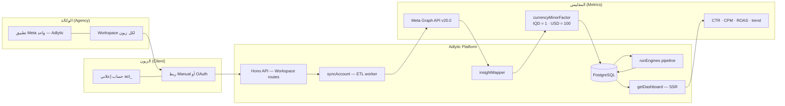
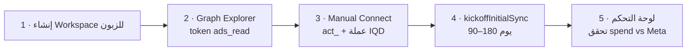

# Adlytic — المخطط المعماري الرئيسي

> نموذج الوكالة العربية — تطبيق Meta واحد، Workspace لكل زبون، ربط يدوي/OAuth، ETL، ومقاييس موحّدة.
>
> مرجع الكود: `ARCHITECTURE_VISUAL.md` · `SESSION_HANDOFF.md` · آخر تحديث: 2026-06-26

---

## المخطط الرئيسي — Hero Architecture

---

## التدفق التشغيلي — زبون بجانبك الآن

مسار عملي عند وجود زبون أمامك مباشرة (Manual Connect كمسار موثوق اليوم):

---

## دليل الرموز — Legend

| الرمز / المصطلح | المعنى |
|-----------------|--------|
| **تطبيق Meta واحد** | تطبيق Adlytic الواحد على developers.facebook.com — الوكالة (ترجمان) تديره لكل الزبائن |
| **Workspace** | مساحة معزولة لكل زبون — `User` + `WorkspaceMember` + `AdAccount` |
| **Manual / OAuth** | `POST /api/workspaces/:id/ad-accounts` أو `GET /api/meta/oauth/start` |
| **Meta Graph API** | `getInsights` — spend بـ major units (مثلاً `"1200"` IQD) |
| **insightMapper** | `spendMinor = round(spendMajor × factor)` → `daily_stats` |
| **IQD = 1** | عملة بلا كسور عشرية — `currency.ts` |
| **USD = 100** | سنتات — factor افتراضي للعملات ذات منزلتين |
| **runEngines** | Analytics → Rules → Recommendation → Health (+ V5 shadow) |
| **getDashboard** | تجميع نوافذ زمنية: CTR = Σclicks/Σimpr×100، CPM، ROAS |
| **زبون بجانبك الآن** | تدفق تشغيلي فوري: workspace → token → connect → sync → verify |

---

## ملاحظات معمارية سريعة

- **عزل البيانات:** كل `AdAccount` مربوط بـ `workspaceId` — `checkMember()` قبل أي API.
- **حل التوكن:** `accountToken.ts` — `MetaConnection` (System User) أو `AdAccount.accessTokenEncrypted` (legacy/manual).
- **إصلاح IQD:** `iqdRepair.ts` + `POST /api/workspaces/:id/repair-iqd` عند factor خاطئ (=100).
- **مزامنة تلقائية:** `serve.ts` — كل 6 ساعات، backfill 3 أيام افتراضياً.
