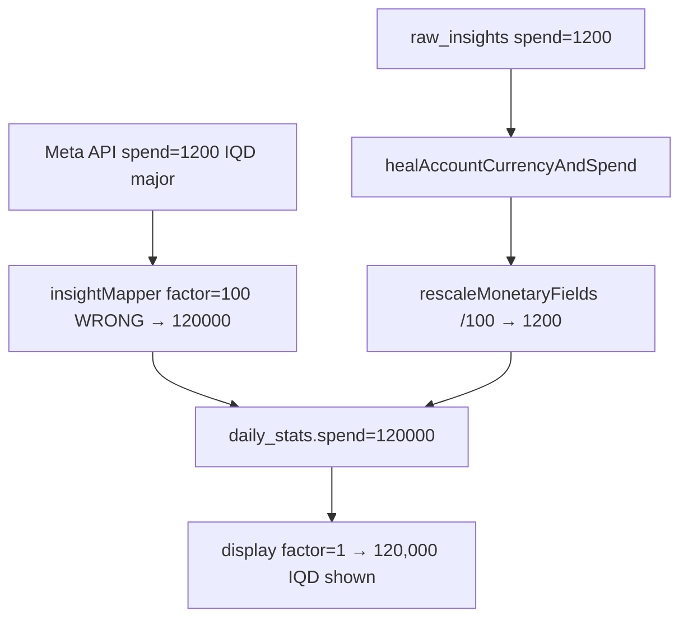

# Meta Metrics Translation Audit — Adlytic

**Date:** 2026-06-26 (re-audit against live code)  
**Scope:** Meta Graph API → `insightMapper` → `daily_stats` → engines → dashboard/UI  
**Method:** Line-by-line code verification; prior audit claims re-checked, not repeated blindly.

---

## 1. Executive summary

**Overall severity: HIGH** for historical IQD accounts with `currencyMinorFactor=100`; **MEDIUM** for aggregation/label mismatches that affect comparison to Meta Ads Manager even when currency math is correct.

The pipeline has a deliberate **cordon** (`insightMapper.ts`) and correct Meta field mapping at ingest. The ~70% “wrong translation” report is explained by **three independent failure classes**:

1. **IQD ×100 storage** — schema default 100 + sync before heal → spend/CPM/CPC stored and sometimes displayed 100× too high.
2. **Reach mis-aggregation** — summing daily reach or mislabeling “latest day” as window reach.
3. **Inconsistent ratio math** — dashboard KPIs use window totals; AnalyticsEngine trends use impression-weighted mean of daily rates.

### Bug counts (this audit)

| Severity | Count | Notes |
|----------|-------|-------|
| **P0** | 4 | 4 fixed in working tree (see §6) |
| **P1** | 7 | Open — aggregation, labels, trend deltas |
| **P2** | 5 | Polish — Arabic rounding, chart labels, docs |

---

## 2. Checklist A — Unit consistency

| # | Question | Verdict | Code evidence |
|---|----------|---------|---------------|
| A1 | Meta `spend` units for IQD vs USD | **Major units for both** — `"1200"` IQD, `"12.50"` USD | `currency.ts:4-6`, `insightMapper.ts:60-61` |
| A2 | `daily_budget` / `lifetime_budget` same as spend? | **No — offset/minor units** (whole IQD, USD cents); stored as-is | `currency.ts:8-9`, `syncAccount.ts:403-408`, `creativeMapper.ts:31-35` |
| A3 | `insightMapper` applies factor to spend, cpc, cpm? | **Yes** — `spendMajor × factor`, `nullableFloat(cpc/cpm, factor)` | `insightMapper.ts:60-61,106-107` |
| A4 | Budgets divided by factor incorrectly? | **No** — budgets are already offset; display uses `minor / factor` | `getDashboard.ts:610-624`, `campaignsPage.ts` `fmtMinor` |
| A5 | Double conversion (×100 twice)? | **No in mapper path** — single multiply at ingest, single divide at display. **Was** display-with-wrong-DB-factor (showing ×100) | `resolveCurrencyMinorFactor` forces IQD→1 at display |

**P0 root cause (historical IQD):** `prisma/schema.prisma:81` defaults `currencyMinorFactor` to **100**. Accounts created before OAuth/manual-connect set factor correctly synced with `×100`, storing e.g. Meta `1200` IQD as `120000`.

---

## 3. Checklist B — Aggregation correctness

| # | Metric | Dashboard / API | Correct window formula | Match Meta? |
|---|--------|-----------------|------------------------|-------------|
| B1 | **CTR** | `getDashboard.ts:304` — `Σclicks/Σimpr×100` | Same | ✅ KPI correct |
| B1b | CTR trends | `aggregate.ts:57-68` — weighted **mean of daily CTR** | Window total | ❌ **P1** — deltas disagree with KPI |
| B2 | **Reach** | `getDashboard.ts:281` — **last day** in window | Meta window reach (not in daily API) | ⚠️ **P1** — labeled “latest day” after fix; still ≠ Ads Manager 30d reach |
| B2b | Reach fallback | `dashboardPage.ts:1058-1074` — was **Σ daily reach** | Invalid | ✅ **Fixed** — latest day, same as server |
| B3 | **Frequency** | `getDashboard.ts:312` — mean of daily | Needs unique window reach | ⚠️ **P1** — approximate |
| B4 | **CPM** | `getDashboard.ts:306-307` — `(ΣspendMajor/Σimpr)×1000` | Same | ✅ when spend factor correct |
| B4b | CPM trends | `calculateCpmTrend.ts` — weighted mean of daily CPM | Window total | ❌ **P1** |
| B5 | **ROAS** | `insightMapper.ts:90-92` — Meta `purchase_roas` or `revenueMinor/spendMinor` | Same | ✅ |
| B6 | **Messages** | `pickMessages()` — single canonical action, not summed | Meta “Messaging conversations started” | ✅ |
| B6b | Iraqi WhatsApp types | Only `onsite_conversion.messaging_conversation_started_7d` + legacy | May miss region-specific types | ⚠️ **P2** — monitor `actions[]` in raw |

**Campaign cards:** `getDashboard.ts:447-456` use **latest single-day** snap for ctr/cpm/frequency — **P1** snapshot vs window.

---

## 4. Checklist C — DB integrity

| # | Issue | Severity | Evidence |
|---|-------|----------|----------|
| C1 | Schema default factor=100 | P0 (mitigated) | `schema.prisma:81`; OAuth `server.ts:2371`, manual connect `2662` set `currencyMinorFactorFor()` |
| C2 | Heal on read vs write race | P2 | Heal runs on sync, dashboard, workspace GET — idempotent upsert on sync |
| C3 | raw_insights vs daily_stats | OK | Account sync writes both; repair compares raw Meta `spend` to stat |
| C4 | Entity level mixing | OK by design | Account KPIs from `EntityType.ACCOUNT`; inspector from `CAMPAIGN` |
| C5 | Campaign stats not rescaled | P0 | **Fixed** — `iqdRepair.ts` `rescaleIqdCampaignRows()` |
| C6 | cpc/cpm/revenue not rescaled on repair | P0 | **Fixed** — `rescaleMonetaryFields()` on account + campaign rows |
| C7 | `lifetimeSpendMinor` stale | P1 | **Partial fix** — `healLifetimeSpendMinor()` heuristic in heal path |

---

## 5. Checklist D — Display layer

| # | Issue | Severity | Evidence |
|---|-------|----------|----------|
| D1 | `money()` in getDashboard | OK | `getDashboard.ts:288-294` — IQD when `factor===1`, else `/factor` |
| D2 | Client re-formatting | OK with guard | `dashboardPage.ts:477-506` — `hydrateCurrencyState` forces IQD factor=1 |
| D3 | Arabic beginner labels | OK | `beginnerDashboardPage.ts:316-323` — uses server KPIs |
| D4 | Arabic CTR whole % | P2 | `beginnerDashboardPage.ts:276-278` — `Math.round` |
| D5 | Campaign card raw cpm | P1 | `getDashboard.ts:454` — minor float, no display format (advanced table only) |

---

## 6. Checklist E — Sync gaps

| # | Issue | Severity | Evidence |
|---|-------|----------|----------|
| E1 | Auto-sync 3-day only | P2 (by design) | `server.ts:82`, `syncAccount.ts:215` — attribution backfill; older days stale until full sync |
| E2 | Budget sync separate from spend | OK | `syncCampaigns()` upserts `daily_budget` from campaigns API, no factor multiply |
| E3 | Campaign sync no raw_insights | P1 | `syncAccount.ts:381-383` — repair uses heuristics for campaign rows |

---

## 7. P0 bugs — fixed (this audit)

| Bug | Root cause | Fix | Files |
|-----|------------|-----|-------|
| IQD heal updated factor but not `daily_stats` | `healAccountCurrencyAndSpend` only updated `ad_accounts` row | Rescale from `raw_insights` on heal | `iqdRepair.ts`, `getDashboard.ts`, `syncAccount.ts`, `server.ts` |
| Admin budget rollup ignored `resolveCurrencyMinorFactor` | Raw DB factor used | Use resolver | `getPlatformStats.ts:154` |
| Repair only fixed `spend`, not cpc/cpm/cost/revenue | Partial column update | `rescaleMonetaryFields()` divides all mapper-scaled fields by 100 | `iqdRepair.ts` |
| Campaign `daily_stats` stayed ×100 after heal | No raw_insights at campaign level | Heuristic campaign rescale + re-sync recommendation | `iqdRepair.ts` `campaignRowOverscaled()` |
| Dashboard fallback summed reach | Treated reach as additive count | Latest day (insights DESC) | `dashboardPage.ts:1058-1074` |

### Recommended pseudo-code (remaining P0 prevention)

```typescript
// On every ad account create/update — never rely on schema default alone
currencyMinorFactor: currencyMinorFactorFor(currencyFromMeta)

// On IQD heal — always rescale all monetary columns, not just spend
if (overScaled) dailyStat.update({ ...rescaleMonetaryFields(row) })

// After heal — trigger syncChunked to refresh campaign rows from Meta
await worker.syncChunked(jobId)
```

### Test cases to add

```typescript
// tests/iqdRepair.test.ts
test('rescaleMonetaryFields divides cpc/cpm/revenue when spend ×100');
test('campaignRowOverscaled detects IQD CPM > 200k');
test('healAccountCurrencyAndSpend rescales campaign rows');

// tests/insightMapper.test.ts (exists as test_worker.ts)
test('IQD spendMajor 1200 → spendMinor 1200 with factor 1');
test('USD spendMajor 12.50 → spendMinor 1250 with factor 100');
```

---

## 8. P1 bugs — open (recommended next)

| # | Bug | File:line | Recommended fix |
|---|-----|-----------|-----------------|
| P1-1 | Reach KPI ≠ Meta 30d window reach | `getDashboard.ts:281` | Label “Reach (latest day)” ✅ done; or fetch `reach` with `date_preset=last_30d` aggregate |
| P1-2 | Analytics CTR/CPM trends ≠ KPI math | `aggregate.ts:48-68`, `calculateCtrTrend.ts` | Add `windowCtr(current)` = Σclicks/Σimpr; use for trends |
| P1-3 | `aggregate.ts` comment says reach is SUM | `aggregate.ts:7` | Fix comment; never sum reach |
| P1-4 | Campaign cards use latest-day ratios | `getDashboard.ts:447-456` | Window aggregate or label “(latest day)” |
| P1-5 | Manual connect defaults USD if Meta verify fails | `server.ts:2653-2661` | Fail closed or require currency when verify fails |
| P1-6 | `lifetimeSpendMinor` heuristic may miss edge cases | `iqdRepair.ts` | Re-run `syncLifetimeTotals` after heal |
| P1-7 | Auto 3-day sync leaves 30d dashboard stale on old accounts | `syncAccount.ts:215` | Cron full 30d weekly or on-demand |

---

## 9. P2 bugs — polish

| # | Bug | File |
|---|-----|------|
| P2-1 | Beginner CTR rounds to whole % | `beginnerDashboardPage.ts:276` |
| P2-2 | `conversions` = messages-first, not objective-aware | `insightMapper.ts:82` |
| P2-3 | Chart dataset “Impressions” uses messages series | `dashboardPage.ts:1196` |
| P2-4 | `inline_link_clicks` fetched, not mapped | `metaClient.ts:33` |
| P2-5 | Demo IQD magnitudes confuse QA | `scripts/seed-demo.ts` |

---

## 10. Metric truth table

| Metric | Meta field | Meta units | Mapper | DB column | Display | Correct? |
|--------|------------|------------|--------|-----------|---------|----------|
| Spend | `spend` | Major | `× factor` | `spend` BigInt | `minor/factor` | ✅ when factor=1 for IQD |
| Impressions | `impressions` | Count | `int()` | BigInt | Sum | ✅ |
| Reach | `reach` | Daily unique | `int()` | BigInt | Latest day | ⚠️ not window |
| Clicks | `clicks` | Count | `int()` | BigInt | Sum | ✅ |
| CTR | `ctr` | Daily % | passthrough | Float | Window Σclk/Σimp | ✅ KPI |
| CPC | `cpc` | Major/click | `× factor` | Float minor | Derived in inspector | ✅ |
| CPM | `cpm` | Major/1k imp | `× factor` | Float minor | Window formula | ✅ KPI |
| Frequency | `frequency` | Daily | passthrough | Float | Mean daily | ⚠️ |
| Messages | `actions[]` | Count | `pickMessages` | BigInt | Sum | ✅ |
| Daily budget | `daily_budget` | Offset | as-is BigInt | `campaigns.daily_budget` | `minor/factor` | ✅ |
| Lifetime spend | `spend` maximum | Major | `× factor` | `lifetime_spend_minor` | Rare | ⚠️ heal heuristic |

---

## 11. IQD-specific flow



**Connect paths that set factor correctly:**

- OAuth select account: `server.ts:2371` — `currencyMinorFactorFor(accountCurrency)`
- Manual connect: `server.ts:2639-2662` — verifies Meta, then `currencyMinorFactorFor(resolvedCurrency)`
- Mock/seed: `prisma/seed.ts:246`, `scripts/seed-demo.ts:206`

---

## 12. Verification checklist

```bash
npx tsx test_currency.ts
npx tsx test_worker.ts
npx tsx test_analytics.ts
npm run build
DATABASE_URL=... npx tsx scripts/diagnose-iqd-full.ts
DATABASE_URL=... npx tsx scripts/compare-raw-vs-stats.ts
# POST /api/workspaces/:id/repair-iqd  (IQD workspace, Owner role)
```

| Check | Ads Manager | Adlytic | Pass |
|-------|-------------|---------|------|
| 30d spend (IQD) | Account spend | KPI Spend | ±1 IQD |
| Messages | Conversations started | KPI Messages | Exact |
| CTR 30d | CTR | KPI CTR | ±0.05% |
| Daily budget | Campaign budget | Campaigns table | Exact (800→800 IQD) |
| Reach 30d | Window reach | KPI Reach (latest day) | Expect mismatch |

---

## 13. Files reviewed

- `src/lib/currency.ts`, `src/lib/iqdRepair.ts`
- `src/mappers/insightMapper.ts`, `src/mappers/creativeMapper.ts`
- `src/services/metaClient.ts`, `getDashboard.ts`, `getPlatformStats.ts`
- `src/repositories/dailyStatsRepo.ts`
- `src/workers/syncAccount.ts`, `runBrainOrchestrator.ts`
- `src/engines/analytics/*`, `health/*`, `rules/*`
- `src/api/server.ts`
- `src/web/pages/dashboardPage.ts`, `beginnerDashboardPage.ts`, `campaignsPage.ts`
- `prisma/schema.prisma`
- `scripts/diagnose-iqd-full.ts`, `repair-iqd-factors.ts`, `compare-raw-vs-stats.ts`
