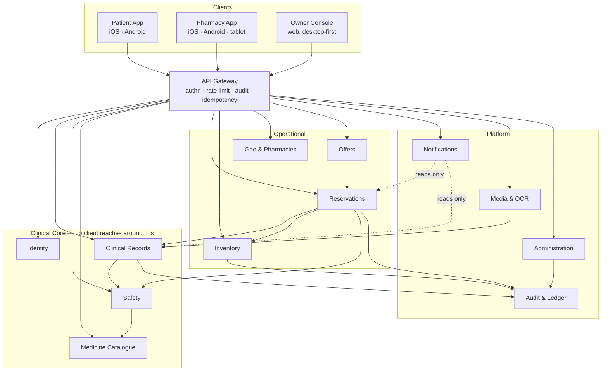

# 01 — Product Architecture

## The organising idea

Dawai is not a marketplace with a medical theme. It is a **clinical record
that happens to have a fulfilment loop attached**. That ordering decides every
architectural argument in this document: when convenience and clinical
integrity conflict, integrity wins, and the modules are drawn so that the
clinical core cannot be reached around.

Three surfaces, one core.

## Modules

### Clinical Core

The modules below own medical truth. They are the only writers of clinical
data, and no operational module may bypass them.

| Module | Owns | Never does |
|---|---|---|
| **Identity** | Accounts, sessions, roles, family links and their scopes, consent records | Store clinical data |
| **Clinical Records** | Medication timeline, dose schedules, dose events, prescriptions, allergies. Append-only. | Delete. Corrections are new records. |
| **Safety** | Interaction evaluation, severity tiering, attention events, alert lifecycle | Diagnose, calculate a dose, or propose a substitute |
| **Medicine Catalogue** | Canonical medicines, ingredients, forms, strengths, Arabic and Latin naming, normalisation | Hold stock or price |

**Safety returns four outcomes and only four:** `CLEAR`, `INFO`, `INTERRUPT`,
`UNAVAILABLE`. `UNAVAILABLE` is evaluated before any `CLEAR` can be returned,
so a failed check can never be rendered as an all-clear. Every consumer must
handle all four; a client that treats the outcome as a boolean is rejected at
the contract layer.

### Operational

| Module | Owns | Never does |
|---|---|---|
| **Reservations** | Request → offer → selection → hold → pickup lifecycle, expiry, cancellation, the pickup code | Decide clinical suitability — it asks Safety |
| **Inventory** | Additive movement ledger, SKU trust scoring, days-of-cover inference | Expose an editable quantity field |
| **Geo & Pharmacies** | Pharmacy records, branches, opening hours, coverage areas, distance and ETA | Reveal patient identity to a pharmacy before selection |
| **Offers** | Pharmacy responses to a request: price, readiness, substitution proposals | Bind stock — an offer is not a hold |

**Offer is not a hold.** This distinction is the entire trust model. A pharmacy
that sends an offer has promised nothing; a pharmacy that confirms a hold has
committed physical stock and starts a clock. Collapsing the two is how a
patient arrives to "we don't have it", which is the failure that destroys the
product.

### Platform

| Module | Owns | Never does |
|---|---|---|
| **Notifications** | Push tokens, delivery, channels, quiet hours, per-category preferences | Contain clinical logic — it renders what Safety and Reservations decided |
| **Media & OCR** | Prescription images, encryption at rest, confidence gating, provider abstraction | Accept an OCR line below the confidence gate, ever, on any path |
| **Audit & Ledger** | Immutable event log, evidence chain, access records | Be writable by anything but an append |
| **Administration** | Verification workflows, catalogue curation, support, moderation, system configuration | Mutate clinical records directly — it can only flag, escalate, and record |

**The Owner cannot silently edit a clinical record.** Administration acts on
the system, not inside a patient's history. Any correction it triggers arrives
through Clinical Records as a new, attributed, audited entry. An admin console
with a direct write path into a medical timeline is an audit failure waiting
for a subpoena.

## How modules communicate

Three mechanisms, chosen by what breaks when they fail.

| Mechanism | Used for | Failure behaviour |
|---|---|---|
| **Synchronous contract call** | Anything the user is waiting on and cannot proceed without: safety evaluation, hold confirmation, authorisation | Fails loudly. The user is told. Never silently degraded. |
| **Domain event** (append + subscribe) | Anything derived: notifications, trust recalculation, analytics, audit projections | Retried. Late is acceptable; lost is not. |
| **Read model / projection** | Anything listed or searched: nearby pharmacies, request inboxes, dashboards | May be stale. Every surface states its staleness. |

Rules that make this survivable:

1. **No module writes another module's tables.** Cross-module change is a
   contract call or an event, never a shared write.
2. **Every state-changing request carries an `Idempotency-Key`.** Offline
   replay, flaky mobile networks, and user double-taps are the normal case in
   Iraq, not the edge case. A duplicate dose event or duplicate hold is a
   clinical defect.
3. **Every clinical read is authority-checked at the service, not the route.**
   Authority checks that live in route middleware get bypassed the first time
   someone adds an internal caller.
4. **A missing link returns 404, not 403.** 403 confirms the record exists,
   which turns any list endpoint into an identity oracle.

## Module boundaries that are commonly violated, and the rule

These are named because they were violated in the prototype.

- **Inventory must not learn about patients.** It sees SKUs and branches. Tying
  a movement to a patient turns a passive ledger into a dispensing record and
  changes its legal weight.
- **Notifications must not compute clinical severity.** It receives a severity
  and renders it. A notification service that re-derives urgency will
  eventually disagree with Safety, and the user will trust whichever arrived
  first.
- **Offers must not read the clinical timeline.** A pharmacy sees the requested
  medicine and an approximate area — never a history, a name, or a phone
  number, until the patient selects them.
- **Geo must not know why a search is happening.** Distance is distance. A
  location service holding a reason becomes a surveillance record.
