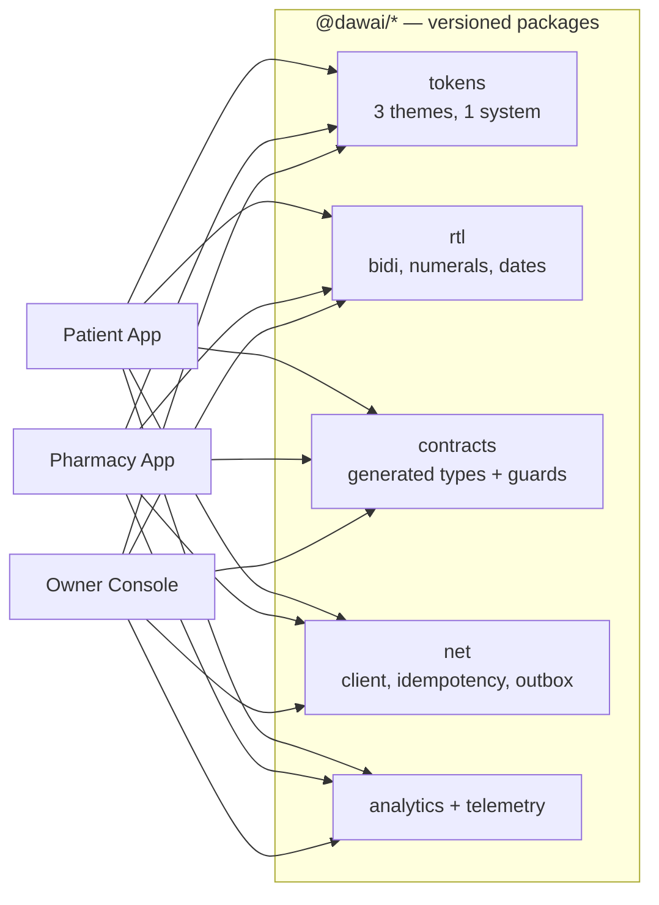

# 02 — User Types & Separation

## Decision: three applications, not one application with roles

**Recommendation: three separate binaries, sharing a core, never a shared shell
with a role flag.**

The argument is not aesthetic.

1. **A role flag is one bug from a leak.** In a shared bundle, patient and
   pharmacy screens are both present in memory and both reachable by the
   router. The prototype demonstrated this twice: a patient quick-action
   landed on the pharmacy compose screen, and "send offer" landed on the
   patient's offers list. Neither was caught by review; both were caught by a
   cross-persona navigation test that only exists because the leak happened.
   Separate binaries make the class of bug **unrepresentable** — the pharmacy
   screen is not in the patient's build.
2. **The three have opposite design goals.** The patient app must reduce
   anxiety: generous spacing, one decision per screen, calm colour. The
   pharmacy app must maximise throughput: dense, dark, keyboard- and
   thumb-fast, many decisions per screen. A shared design system that must
   express both ends up expressing neither.
3. **They ship on different clocks.** A pharmacy-side pricing change should not
   sit in an App Store review queue behind a patient-side onboarding
   experiment.
4. **They have different threat models.** A pharmacy device is shared, sits on
   a counter, and is used by staff who come and go. A patient device is
   personal. Same session model for both is wrong for both.

**Cost, stated honestly:** three release pipelines, three store listings for
two of them, and a shared-core versioning discipline that did not previously
exist. This is real work and it is the correct trade.

## What is shared

Shared means **primitives and contracts, never screens**. The moment a screen
is shared between two personas, the role flag is back and so is the leak.

## Patient

> Normal user. Frightened, often elderly, often ordering for a parent, usually
> on a poor connection.

**Design goal: reduce anxiety.** Success is the patient stopping worrying, not
the patient spending time in the app.

| Can | Cannot |
|---|---|
| Search medicines | See any pharmacy tool |
| Upload or photograph a prescription | See other patients |
| Request and reserve | See a pharmacy's stock levels or margins |
| Track a reservation live | See who else is bidding |
| Find nearby pharmacies, with distance and hours | Contact a pharmacy before selecting one |
| Receive notifications | Alter any clinical record retroactively |
| Manage family access, in both directions | Grant themselves access to anyone |
| Read their medication history | Delete history — they can only stop tracking |

**The unit of the market is the family, not the individual.** In Iraq the
person ordering is frequently not the person taking the medicine. Family mode
is a first-class dimension of the patient app — a persona switcher present on
the home surface — not a settings page. Every clinical read and write is
scoped to the *subject*, and the acting user is recorded separately.

## Pharmacy

> A workspace. One hand free, a customer physically waiting, the phone ringing.

**Design goal: fewer than fifteen seconds from request to answer.** Success is
measured in taps and seconds, not in features.

| Can | Cannot |
|---|---|
| Receive requests, area and medicine only | See a patient's name, phone, or prescription before being selected |
| Answer available / unavailable with a reason | See a patient's clinical history, ever |
| Compose an offer: price, readiness, substitution proposal | Bind stock by sending an offer |
| Confirm or decline a hold | Extend a hold silently |
| Record stock movements and spot counts | Type a stock quantity into an editable field |
| Set opening hours, coverage, and capacity | Appear open when closed |
| Publish offers and promotions | Promote a prescription-only medicine |
| See its own analytics and its own customers | See another pharmacy's anything |

**Staff model.** A pharmacy is an organisation, not a login. Roles: `owner`,
`manager`, `pharmacist`, `assistant`. Only a licensed `pharmacist` may confirm
a hold or record a substitution proposal — the prototype allowed an unverified
account to stamp pharmacist authorship, which is the most serious defect found
in any review round.

## Owner

> The platform operator's console. This is the largest single addition in this
> plan and it did not previously exist in any form.

**Design goal: see everything, change little, prove every change.** An
operations console is a set of levers over other people's medical data. Its
defining property is not power; it is **accountability**.

| Domain | Capability |
|---|---|
| Pharmacies | Verification queue, licence documents, suspension, coverage |
| Users | Search, support impersonation *with consent and a visible banner*, deactivation |
| Medicines | Catalogue curation, ingredient mapping, normalisation review, merges |
| Categories | Taxonomy, therapeutic classes |
| Offers | Policy limits, takedowns |
| Notifications | Broadcast composition, targeting, throttles, kill-switch |
| Support | Tickets, escalation, canned responses |
| Verification | Pharmacy licences, pharmacist credentials, expiry tracking |
| Reports | Regulatory, clinical safety, operational |
| Statistics | Cohorts, funnels, coverage maps, request fill rate |
| Logs | Full audit trail, immutable, searchable, exportable |
| Permissions | Role and grant management, break-glass approvals |
| System settings | Feature flags, release governance, knowledge releases |

**Non-negotiable properties of the Owner console:**

1. **No silent access to clinical data.** Every read of an identified
   patient's record is logged with actor, reason, and time, and is visible to
   the patient in their own access log. If the operator cannot justify a read
   to the patient, they should not perform it.
2. **Support impersonation is consented, banner-visible, time-boxed, and
   recorded.** Never a silent "view as user".
3. **Destructive actions are two-person or two-step**, and always reversible
   for a stated window.
4. **The console can never write clinical records directly.** It requests a
   correction; Clinical Records appends it with attribution.
5. **Owner is desktop-first web.** It is not a mobile app, and pretending
   otherwise produces a console nobody can actually operate during an
   incident.

## Separation rules, enforced not merely intended

| Rule | Enforced by |
|---|---|
| A patient build contains no pharmacy or owner screen | Separate binaries; CI asserts no cross-persona import |
| A pharmacy build contains no patient clinical view | Same |
| Cross-persona navigation is impossible | There is no route to navigate to |
| Persona is proven by token audience, not by a client claim | Gateway rejects a patient token at a pharmacy endpoint |
| A shared component that branches on persona is a defect | Lint rule: no `persona ===` / `role ===` inside `@dawai/ui` |
| Themes differ by construction | Each app imports exactly one theme; the token package exports three and never merges them |
