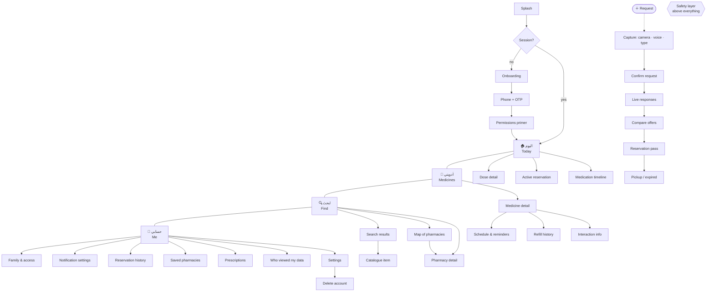
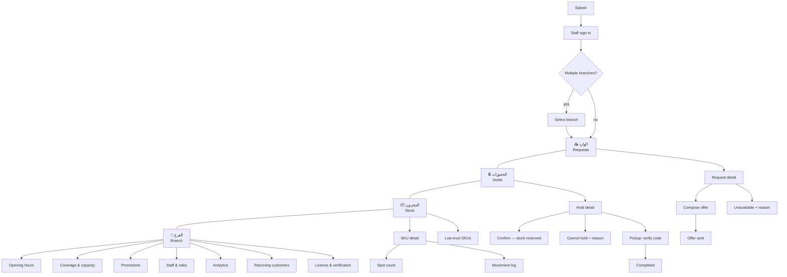

# 03 — Navigation Architecture

## Principles

1. **Tabs are destinations, not actions.** Anything that creates something is a
   floating action or a sheet, never a tab.
2. **Maximum depth is three from a tab root.** Deeper means the information
   architecture is wrong, not that the user needs another back button.
3. **A modal never leads to a tab.** Modals return to where they were opened.
4. **The safety layer is not navigation.** A severe alert is a layer over the
   entire app, unreachable by back, and does not participate in the stack.
5. **Every tab remembers its own stack.** Switching tabs and returning restores
   position — the Instagram/iOS convention users already have.
6. **Deep links resolve to a full stack, not a bare screen.** A push
   notification that opens a detail screen with no parent leaves the user
   trapped with no way back.

## Patient app

**Four tabs, chosen deliberately.** Today (what do I do now), Medicines (what
am I on), Find (I need something), Me. `Orders` is not a tab: a reservation is
either active — in which case it belongs on Today — or finished, in which case
it is history. A tab for a thing that is usually empty teaches the user to
ignore a tab.

**The FAB owns request creation.** One entry point for anything new, with
camera and voice **before** typing, because the target user photographs a
prescription far more readily than they type a drug name in Latin script.

## Pharmacy app

**Inbox is the root, not a dashboard.** A pharmacist opening the app has one
question: is there anything waiting for me. A dashboard of charts as the
landing screen is a product designed for the person who bought it rather than
the person who uses it.

**Holds are separated from Inbox** because they are a different commitment: an
inbox item costs nothing to ignore, a hold has physical stock behind it and a
customer walking towards the door.

## Owner console

```mermaid
graph TB
  Login[SSO + hardware 2FA] --> Overview

  Overview["Overview<br/>health · queues · incidents"]

  Overview --> Pharmacies
  Overview --> Users
  Overview --> Catalogue
  Overview --> Safety
  Overview --> Growth
  Overview --> Platform

  Pharmacies --> VerifyQ[Verification queue]
  Pharmacies --> PharmRec[Pharmacy record]
  PharmRec --> Branches
  PharmRec --> Licences
  PharmRec --> Suspend[Suspend / reinstate]

  Users --> UserSearch[User search]
  UserSearch --> UserRec[User record]
  UserRec --> Impersonate[Consented support session]
  UserRec --> AccessHistory[Access history]

  Catalogue --> Medicines
  Catalogue --> Ingredients
  Catalogue --> Categories
  Catalogue --> Merge[Duplicate review]
  Catalogue --> Knowledge[Knowledge releases]

  Safety --> Claims[Clinical claims]
  Safety --> Alerts[Alert analytics]
  Safety --> Interactions[Interaction rules]
  Safety --> Incidents[Safety incidents]

  Growth --> Coverage[Coverage map]
  Growth --> FillRate[Request fill rate]
  Growth --> Cohorts
  Growth --> Funnels

  Platform --> Flags[Feature flags]
  Platform --> Releases[Release governance]
  Platform --> Broadcast[Notification broadcast]
  Platform --> Support[Support tickets]
  Platform --> Roles[Roles & permissions]
  Platform --> Audit[Audit log]
  Platform --> Config[System settings]
```

**Six top-level areas, not thirteen menu items.** Thirteen flat items is a
list, not an information architecture; the operator scans it every time
instead of learning it. The grouping is by *question being asked*: who supplies
(Pharmacies), who uses (Users), what do we know (Catalogue), is it safe
(Safety), is it working (Growth), how is it configured (Platform).

**Overview is a triage screen, not a vanity dashboard.** It answers: what is
broken, what is queued, what needs a human today.
