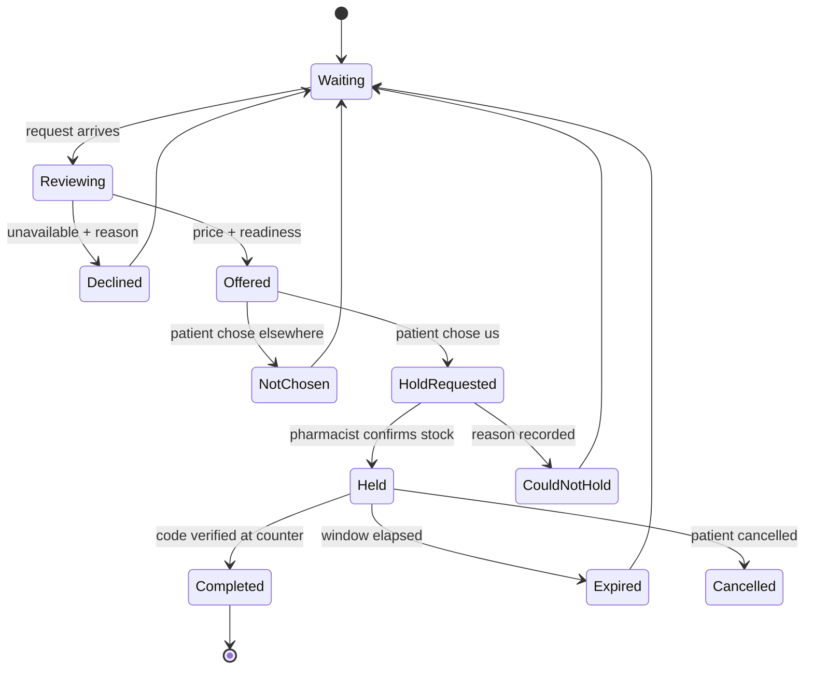
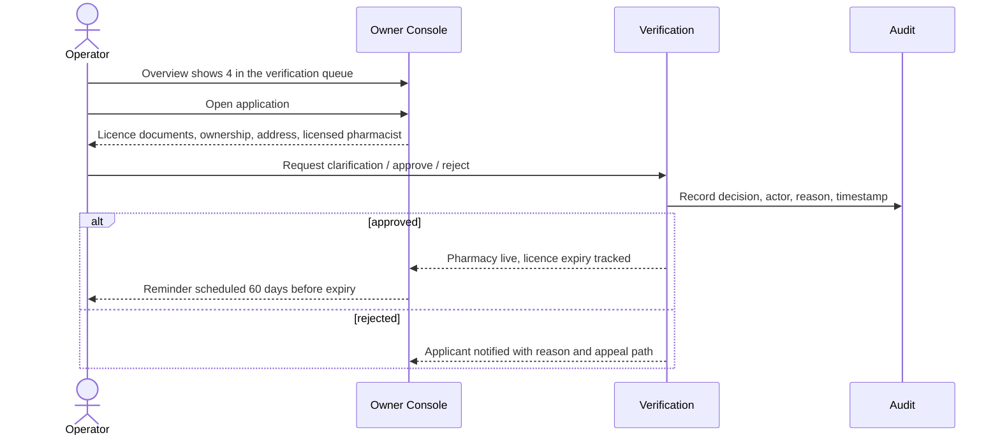
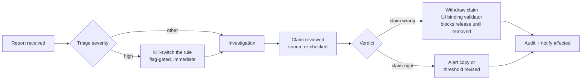

# 05 — User Journeys

## Journey 1 — Patient: "my mother needs her blood pressure medicine"

The journey the whole product exists for.

```mermaid
sequenceDiagram
  actor U as Son (acting)
  participant A as Patient App
  participant S as Safety
  participant R as Reservations
  participant P as Pharmacies

  U->>A: Opens app, switches subject to "mother"
  A-->>U: Today shows: Amlodipine, 4 days left
  U->>A: Tap "Reorder" (2 taps — the app knows everything)
  A->>S: Evaluate against her record
  alt INTERRUPT
    S-->>A: Severe interaction
    A-->>U: Safety layer. No dismiss. Route to pharmacist.
  else UNAVAILABLE
    S-->>A: Check failed
    A-->>U: "We could not check. Ask the pharmacist." NOT an all-clear.
  else CLEAR / INFO
    S-->>A: Proceed
  end
  A->>R: Create request (area only, no identity)
  R->>P: Fan out to nearby, open, in-coverage
  P-->>R: Offers arrive over ~90s
  A-->>U: Live: "3 pharmacies replied"
  U->>A: Compare and choose
  A->>R: Select offer
  R->>P: Ask chosen pharmacy to confirm the hold
  P-->>R: Confirmed — stock physically set aside
  R-->>A: Pass issued, clock starts NOW (not at selection)
  U->>A: Shows code at counter
  P->>R: Verify + complete
  R-->>A: Completed; refill history updated
```

**Decisions embedded in this journey:**

- **The clock starts at pharmacy confirmation, not at patient selection.** A
  timer that starts before anyone has committed stock is a countdown to a
  disappointment.
- **Identity is withheld until selection.** The pharmacy sees medicine +
  approximate area. Nothing else. This is the privacy promise and it is
  structural, not a setting.
- **Reorder is two taps.** The app already knows the medicine, the subject, the
  usual pharmacy, and the quantity. Asking again is asking the user to prove
  they are worth serving.

### Failure branches that need equal design

| Branch | Design obligation |
|---|---|
| Nobody replies | Say so before the user asks. Offer: widen radius, notify me when someone opens, call my usual pharmacy. |
| Pharmacy cannot hold after confirming | Immediate, apologetic, and it **re-opens the request automatically** — the patient must not have to start again. Record it against the pharmacy's reliability. |
| Patient arrives, medicine is not there | The trust-destroying case. Requires a policy, not a screen: what the pharmacy owes, what the patient gets. **Open question — see below.** |
| Hold expires | The pass expires visibly with the reason and a one-tap re-request. |
| Connection lost mid-request | The request survives in the outbox and sends on reconnect, exactly once. |

## Journey 2 — Pharmacy: "answer without leaving the counter"



**Only a licensed pharmacist may drive `HoldRequested → Held`.** The prototype
allowed any account on an unverified pharmacy to stamp pharmacist authorship.
That transition is the point where a clinical professional takes
responsibility, and it must be gated on a verified credential, not a role
string in a token.

**Declining is valuable and must be cheap.** "Unavailable" with a reason —
out of stock, we do not carry it, closing now — is the highest-quality
inventory and coverage signal in the system. If declining costs more taps than
ignoring, pharmacies will ignore, and the platform goes blind.

## Journey 3 — Owner: "a pharmacy applied to join"



**Licence expiry is a scheduled event, not a field.** A verification system
that checks once and never again is a verification system that is wrong within
a year.

### Owner journey 2 — "a patient reports a safety incident"



This is why UI claim bindings exist. When a claim is withdrawn, the validator
can prove no screen still renders it — the alternative is grep and hope.

## Cold start — the journey that decides whether any of this matters

Not a UX flow, but the journey that determines survival, so it belongs here.

A patient with no pharmacies is an empty app. A pharmacy with no patients is an
annoyance. Neither is solved by code.

**Architectural obligation:** the system must be operable **district by
district**, not nationally. That means:

- Coverage is a first-class concept with explicit boundaries, not an emergent
  property of who happened to sign up.
- The patient app must state honestly when it is outside coverage rather than
  returning zero results as though nothing exists.
- The Owner console's coverage map is a launch instrument, not a report.

Twenty pharmacies in one district that reliably answer beats two hundred spread
across the country that mostly do not. Build for density.
