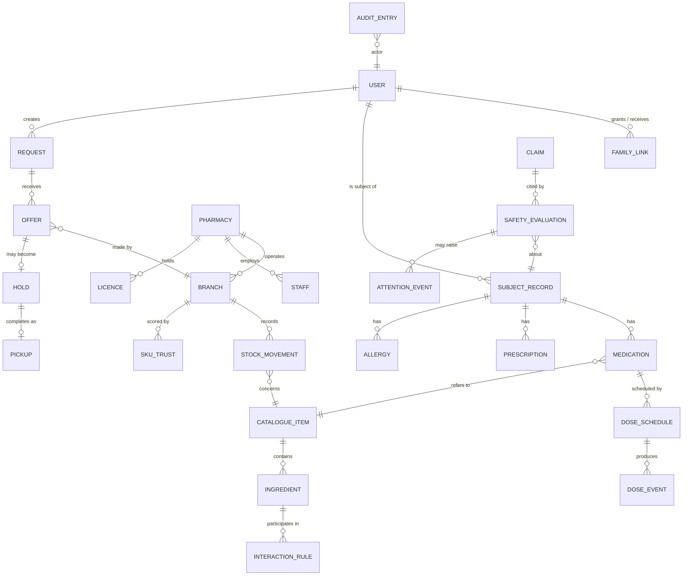

# 09 — Information Architecture

## The reorganising principle

The prototype organised by **object type** — medicines here, orders there,
pharmacies elsewhere. That is how a database is organised, not how a worried
person thinks.

The new organisation is by **question being asked**, per persona.

| Persona | Questions, in the order they are asked |
|---|---|
| Patient | What do I do now? · What am I on? · I need something · Who am I and who can see me? |
| Pharmacy | Is anything waiting? · What have I committed? · What do I have? · How is my branch set up? |
| Owner | What needs a human today? · Who supplies? · Who uses? · What do we know? · Is it safe? · Is it working? · How is it configured? |

Each question is a tab or a top-level area. Nothing is a tab that does not
answer a question a user actually asks on arrival.

## Domain model

### Entities that people get wrong, and the rule

- **USER vs SUBJECT_RECORD.** A user is who is holding the phone. A subject is
  whose medication it is. They are frequently different, and conflating them
  is how a son's allergy gets attached to his mother's record.
- **CATALOGUE_ITEM vs MEDICATION.** The catalogue is what exists in the world.
  A medication is *this subject taking that thing*. The prototype stored a free
  text `medicine_name`, which cannot be reasoned about clinically. Every
  medication resolves to a catalogue item.
- **OFFER vs HOLD.** Separate entities, not a status field. An offer promises
  nothing; a hold commits stock and starts a clock. A status field invites
  someone to skip a state.
- **STOCK_MOVEMENT is additive and never edited.** Quantity is derived. A
  `COUNT` movement with zero delta is legitimate and valuable — it is a
  reconciliation that agrees.
- **CLAIM is separate from INTERACTION_RULE.** The rule is behaviour; the claim
  is the reviewed assertion with a source and an expiry. Conflating them means
  a copy edit silently becomes a clinical change.

## Content organisation

### Patient — Today

Ordered by decreasing urgency, and nothing else. The order is derived, never
authored:

1. Safety requiring action
2. Active reservation with a running clock
3. Dose due now
4. Running out within the reorder window
5. Awaiting your decision (family request, offer to compare)
6. Everything else — collapsed

**A "recommended for you" card does not appear on this screen.** Today is a
work surface; anything that is not the user's own business dilutes it.

### Patient — Medicines

Grouped by subject first, then by status: running out, active, paused, ended.
Not alphabetical — alphabetical is a filing cabinet, and the user is not
filing.

### Pharmacy — Inbox

Ordered by decision urgency: expiring soonest, then nearest, then oldest.
Never by newest, which buries an expiring request under a fresh one.

### Owner — Overview

Three bands: **incidents** (something is wrong), **queues** (something waits
for a human), **trends** (something is changing). Everything else is a click
away. An overview that shows everything shows nothing.

## Naming rules

| Rule | Because |
|---|---|
| Use the word the user uses, not the word the database uses | "حجز" not "reservation entity"; "طلب" not "request record" |
| One concept, one word, everywhere | The same thing called "order" and "reservation" in two screens is two things to the user |
| Never claim government endorsement | "من صيدلية موثّقة في دوائي" — never "موثّق حكومياً". This is a legal boundary, not a copy preference. |
| Say what stopped, precisely | "Stop tracking" ends a reminder, not a medication. Copy that blurs this is a clinical risk. |
| State uncertainty rather than hiding it | "تعذّر الفحص" is an answer. Silence is not. |

## Search architecture

Search is the patient's primary entry to the catalogue and must handle how
Iraqi users actually type:

- **Arabic and Latin, interchangeably.** "بنادول" and "Panadol" find the same
  thing.
- **Brand and generic, interchangeably.** Most users know brands.
- **Orthographic tolerance.** Alef variants, taa marbuta, tatweel, harakat, and
  Arabic-Indic digits all normalise. Note that Arabic is **caseless** — a
  lowercasing normaliser does nothing, which the prototype learned the hard
  way.
- **Typo tolerance**, and misspelling is the norm for transliterated names.
- **Ranked by local availability**, not global relevance. A perfect match
  nobody stocks is a worse result than a good match available nearby.
- **Never autocorrect a drug name silently.** Show what was searched, show what
  was found, and let the user confirm. Silent correction on a drug name is a
  clinical hazard.
