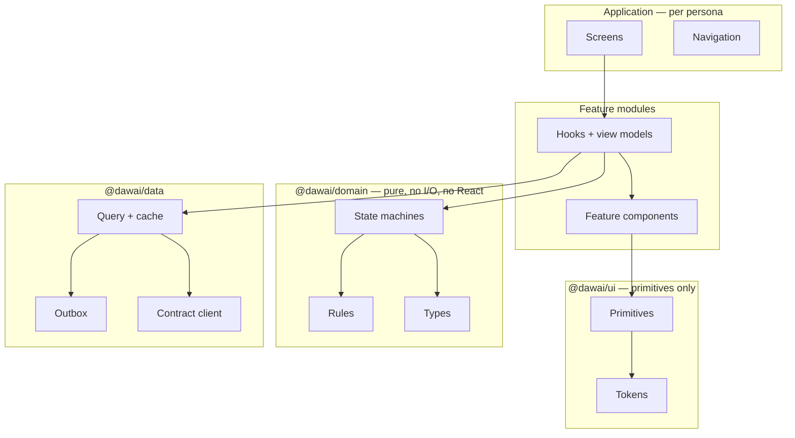

# 10 — Component Architecture

## Platform decision

**Recommendation: React Native, with Expo, for Patient and Pharmacy. React on
web for Owner.**

| Option | Verdict |
|---|---|
| Keep Capacitor | **No.** It ships a web view. Every native promise in [06](06-native-ux.md) — gestures, scroll physics, sheet detents, keyboard behaviour — must then be simulated, and simulated versions are what make an app feel wrong without users being able to say why. |
| Flutter | Strong native feel and excellent RTL support, but discards the existing TypeScript domain layer, contracts, and team knowledge. The right choice for a team starting cold; not for this one. |
| Native Swift + Kotlin | Best possible result, roughly double the cost, and two implementations of clinical logic — which is two places for a safety rule to diverge. Rejected on safety grounds as much as cost. |
| **React Native + Expo** | **Chosen.** Real native primitives, keeps the TypeScript contracts and domain layer, one clinical implementation, mature RTL, and config plugins for camera/Wallet/Live Activity. |

**Cost stated honestly:** this is a rewrite of the presentation layer, not a
port. The domain and contract layers carry over; no screen does.

## Layers



### Rules that keep the layers real

These are lint-enforced, not conventions. A convention survives until the first
deadline.

1. **`@dawai/domain` imports nothing.** No React, no network, no storage. It is
   pure functions and state machines, and it is where every clinical rule
   lives. Pure means testable without a browser, and identical on all three
   surfaces.
2. **`@dawai/ui` knows no domain concepts.** It has `Card`, not
   `MedicineCard`. The moment a primitive knows what a medicine is, it grows a
   persona branch.
3. **No component branches on persona.** `if (persona === …)` inside shared code
   is a build error. Divergence happens by composition in the app layer.
4. **Screens hold no business logic.** A screen composes; a hook decides. A
   screen with an `if` about clinical state is a screen that will disagree with
   another screen.
5. **Every network write goes through the outbox.** No component calls `fetch`.
6. **Tokens are the only source of raw values.** No literal colour, spacing,
   radius, or duration outside the token package.

## Component taxonomy

### Primitives (`@dawai/ui`) — domain-blind

`Text` · `Stack` · `Card` · `Button` · `IconButton` · `Field` · `Select` ·
`Stepper` · `Chip` · `Badge` · `Sheet` · `Dialog` · `ActionSheet` ·
`Snackbar` · `Skeleton` · `Avatar` · `Divider` · `TabBar` · `Header` ·
`ListRow` · `SegmentedControl` · `Switch` · `ProgressTrack` · `EmptyState` ·
`ErrorState` · `OfflineBanner` · `PullToRefresh`

**`EmptyState`, `ErrorState`, and `OfflineBanner` are primitives on purpose.**
Making them first-class removes the excuse for a screen not to have them.

### Clinical components — shared across personas, one implementation

These render clinical meaning and must be identical everywhere, because two
implementations of a severity rule is two rules.

| Component | Rule it enforces in code, not in review |
|---|---|
| `SafetyLayer` | One at a time; priority-ordered; `SEV_ALERT` renders **no** dismiss affordance |
| `InteractionOutcome` | Renders all four outcomes; `UNAVAILABLE` cannot render as clear |
| `ClaimBoundary` | Wraps any clinical output; carries claim, contract, knowledge release |
| `DoseState` | Due, taken, skipped, missed — with skip reason |
| `SupplyIndicator` | Days of cover, and its confidence; never a bare number |
| `TrustBadge` | How much we believe a stock figure |
| `LimitationsNote` | A clinical claim always states what it does not cover |

### Feature components — per persona, never shared

Patient: `SubjectSwitcher`, `TodayCard`, `MedicineRow`, `BlisterStrip`,
`RequestComposer`, `LiveResponders`, `OfferCompare`, `ReservationPass`,
`AccessGrantCard`.

Pharmacy: `RequestRow`, `AnswerBar`, `OfferComposer`, `HoldCard`,
`HandoverVerifier`, `MovementRow`, `CountSheet`, `CapacityControl`.

Owner: `QueueTable`, `RecordInspector`, `AuditTrail`, `CoverageMap`,
`FlagRow`, `BroadcastComposer`, `ImpersonationBanner`.

## The design token system

Three themes, one system, never merged at runtime.

```
@dawai/tokens
├── core/            primitive scales — never referenced by a component
│   ├── palette      raw colour ramps
│   ├── space        4pt grid
│   ├── radius · elevation · duration · easing
│   └── type         Arabic-first families and the scale
└── semantic/        what components actually use
    ├── patient/     calm, warm, generous
    ├── pharmacy/    dense, dark, high-contrast
    └── owner/       neutral, tabular
```

**Components consume semantic tokens only.** `color.surface.raised`, never
`palette.green.700`. A component that reaches into `core` has hard-coded a
persona.

**Every semantic token pair carries a measured contrast ratio in its
definition, and CI fails on a pair below threshold.** Contrast is measured, not
eyeballed — amber-on-cream failed at 4.08:1 in the prototype and looked fine.
