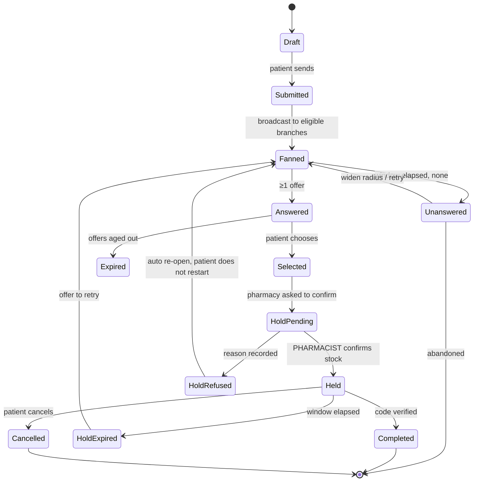
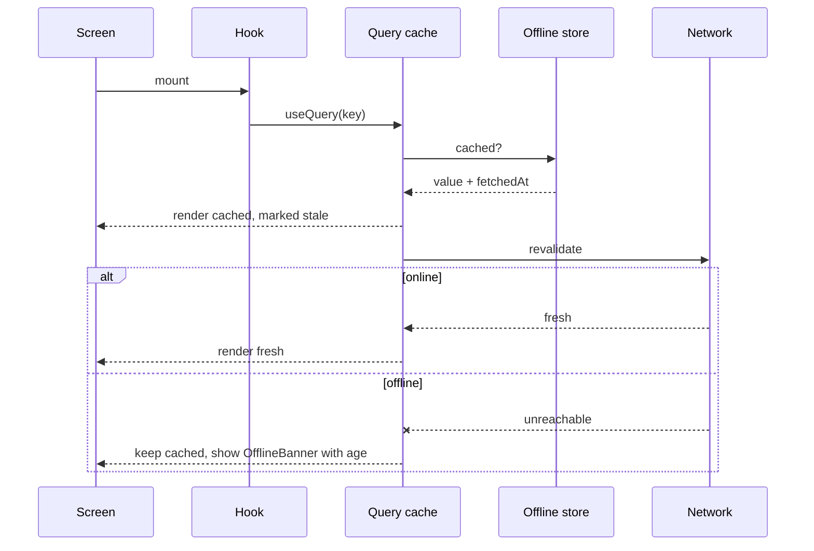
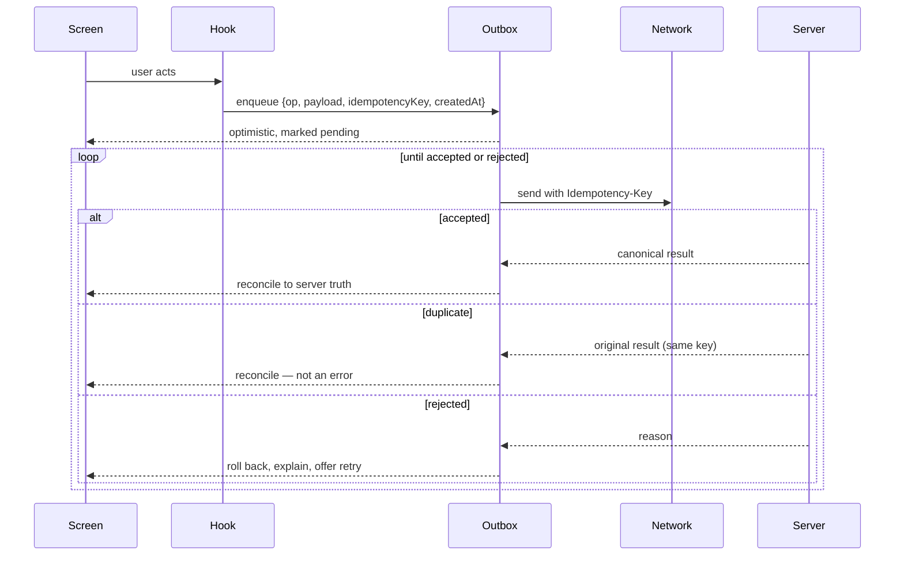

# 11 — State & Data Flow

## Four kinds of state, four different tools

Most state bugs come from storing one kind in a tool meant for another.

| Kind | Example | Tool | Rule |
|---|---|---|---|
| **Server state** | Medicines, offers, pharmacies | Query cache (TanStack Query) | Never copied into local state. A copy is a stale copy. |
| **Lifecycle state** | Reservation, request, hold | Explicit state machine (XState), **server-authoritative** | The client models it to render correctly; the server decides it. |
| **Session state** | Who is signed in, which subject, which branch | Small global store (Zustand) | Persisted in the secure enclave / keystore, never plain storage. |
| **Ephemeral UI state** | Is the sheet open, field text | Component-local | Never global. A global "isSheetOpen" is how two sheets open at once. |

**Clinical state is never client-owned.** The client renders it and may
optimistically show a *pending* marker, but it never asserts a clinical fact
the server has not accepted.

## The reservation state machine

The core of the product, and the thing most worth making explicit.

**Invariants the machine enforces:**

1. **`HoldPending → Held` requires a verified pharmacist.** Not a role string —
   a verified credential. This is where a professional accepts responsibility.
2. **The clock starts on entering `Held`, never earlier.** A countdown before
   anyone committed stock counts down to a disappointment.
3. **`HoldRefused` re-opens automatically.** The patient does not start again
   because a pharmacy changed its mind, and the refusal is recorded against
   that branch's reliability.
4. **No transition is client-initiated except the patient's own choices.**
   Submit, select, cancel. Everything else is server-decided.
5. **Every transition is an append to the audit log**, with actor, time, and
   reason where one exists.

## Data flow — a read

**A stale value is always labelled with its age.** An unlabelled stale number in
a medical context is a false statement, not a performance optimisation.

## Data flow — a write, offline-first

**Rules:**

1. **Every write carries a client-generated `Idempotency-Key`**, stable across
   retries. Double-taps and reconnect replays are the normal case.
2. **Optimism is designed backwards** — the rollback is designed before the
   optimistic render.
3. **Nothing clinical is optimistic.** A dose event may show as *pending*; it
   may never show as *recorded* before the server accepts it.
4. **The outbox is ordered per subject** so a schedule change cannot overtake
   the dose it applies to.
5. **The outbox survives app termination**, and a pending write is visible to
   the user rather than silently queued.

## What is deliberately unavailable offline

Being explicit prevents this being decided by accident later.

| Available offline | Unavailable offline, and why |
|---|---|
| Medication list, schedules, timeline | **Interaction checking** — a stale rule set is worse than an honest "we could not check" |
| Reservation pass and code | **Creating a request** — queued, but never shown as sent |
| Dose logging (queued) | **Nearby pharmacies and open/closed** — a stale "open" sends someone to a locked door |
| Cached pharmacy details, age-stamped | **Confirming a hold** (pharmacy side) — it commits physical stock |
| Prescription images already downloaded | **Anything the Owner console does** |

## Caching and freshness

| Data | Fresh for | Rationale |
|---|---|---|
| Catalogue | 24h | Changes rarely |
| Pharmacy profile | 1h | Hours change occasionally |
| Open/closed state | 60s | Wrong here sends a person to a locked door |
| Offers on a live request | Real-time (push/socket) | The user is watching |
| Hold countdown | Server time, never device | Device clocks are wrong and users change them |
| Medication timeline | 5m, invalidated on write | |
| Safety evaluation | **Never cached across a record change** | A cached all-clear after a new medicine is added is the worst bug this product could have |
| Stock and trust | 5m | Inferred anyway |

**Countdowns render from server time with a measured offset.** The prototype
used device time; a user changing their clock changed their reservation.

## Push and real-time

| Event | Transport | Delivery |
|---|---|---|
| Offer arrived | Socket if foregrounded, else push | Best-effort, coalesced |
| Hold confirmed | Push, high priority | Must arrive |
| Hold expiring in 5 min | Push + Live Activity update | Must arrive |
| Dose due | Local notification | Scheduled on-device so it survives no-network |
| Safety alert | Push, **may override quiet hours** | Must arrive |
| Family access request | Push, normal | Best-effort |

**Dose reminders are local notifications, not server push.** A reminder that
fails because the network is down is a reminder that fails on exactly the days
that matter.
