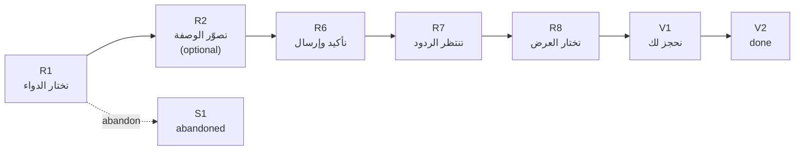
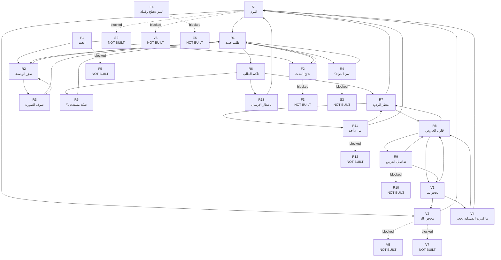
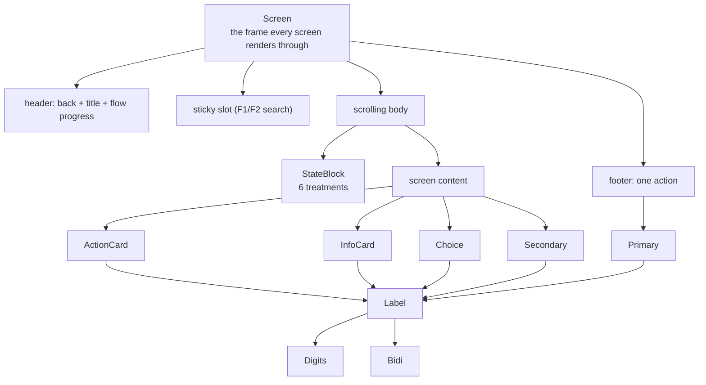
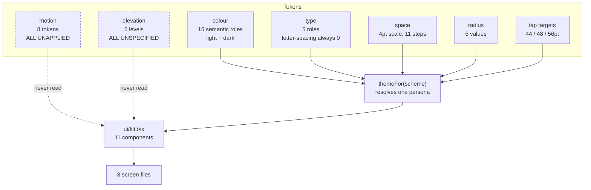
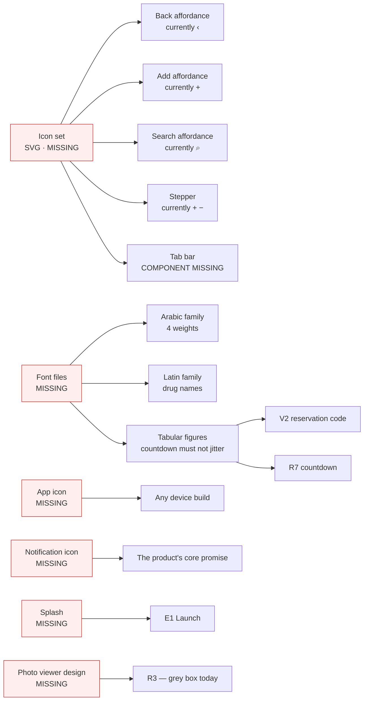
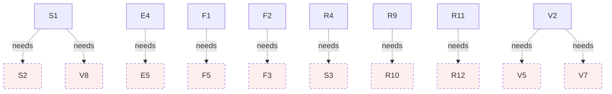

# Diagrams

> **Generated — do not edit.** Every diagram below is derived from the
> repository by `npm run design`. A hand-drawn diagram goes stale the first
> time a screen is added; these cannot.
>
> Rendered as Mermaid. GitHub, Figma's Mermaid plugins and most Markdown
> viewers render them directly.

---

## 1. Complete user journeys

Solid = built. Dashed = a Blueprint screen a later slice builds.

### Journey: request-medicine

_تطلب دواء وتحجزه من صيدلية قريبة_

---

## 2. Navigation graph

Every edge comes from a screen contract. Dotted edges point at screens this
build does not contain — **no control renders for them**, so a patient cannot
reach a dead end, but the design must eventually fill them.

- Entry points (reached without a parent — a tab bar, a notification, or a guard redirect): `S1`, `F1`, `V1`, `V2`, `V4`, `E4`, `S1`
- Unreachable screens: **0**
- Navigation traps: **0**
- Blocked exits: **10**

---

## 3. Component hierarchy

---

## 4. Design token relationships

Two token families are declared and **never read by any component**: motion
(8 tokens) and elevation (5 levels).
They are the two largest specification gaps.

---

## 5. Asset dependency map

---

## 6. Screen dependency map

Which built screens are waiting on which unbuilt ones. Each dotted edge is a
control that cannot be rendered today.

