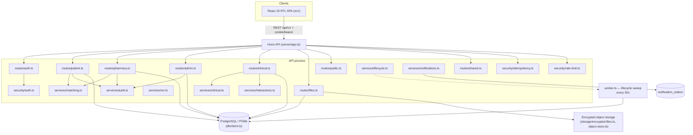
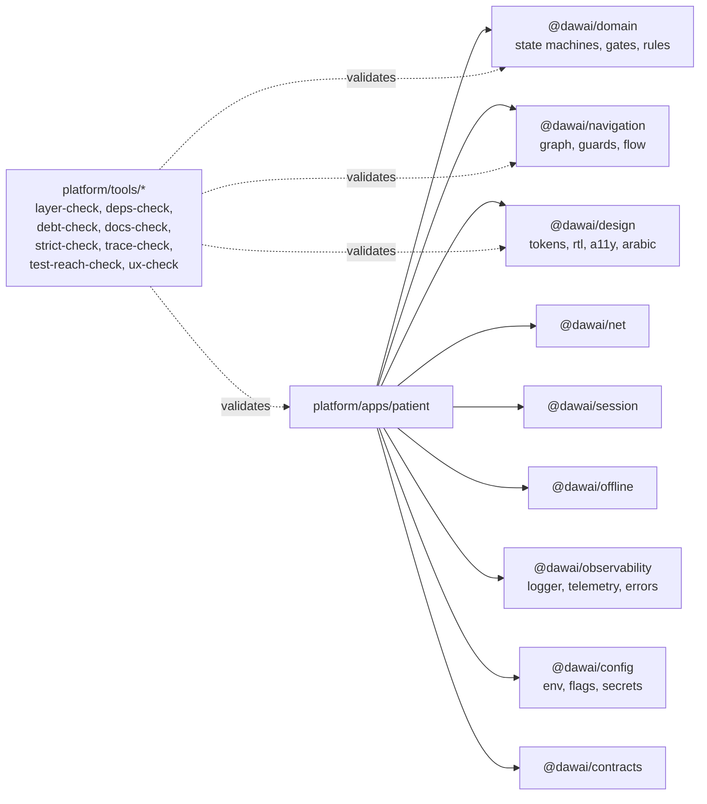

# 02 — Architecture

This repo contains two parallel architectures. See `START_HERE.md` §0 and `19-open-decisions.md` before assuming either describes "the" system.

## A. `dawai-platform/` — the shipped modular monolith

### Client — `dawai-platform/src/`

- `App.tsx`, `main.tsx` — entry, mounts `app/router.tsx`.
- `app/SessionContext.tsx`, `app/useApi.ts` — session state and typed fetch wrapper over `api/client.ts`.
- `components/AppShell.tsx` — shared chrome; `components/PillBar.tsx` — the attention-priority bar (SEV_ALERT/ACTION_REQUIRED/IN_PROGRESS/SUGGESTION state machine, `PillBar.test.tsx`).
- `pages/{PublicPages,PatientPages,PharmacyPages,AdminPages,TimelinePages}.tsx` — one file per audience; role isolation is by route grouping, not separate app bundles (contrast with Blueprint v3's structural "three separate builds" — see `08-navigation.md`).
- `styles.css` — hand-written CSS (not sourced from `platform/packages/design` tokens — that package feeds `platform/apps/patient` only).

### Server — `dawai-platform/server/`

- `app.ts` — Hono app: request-id middleware, `secureHeaders` (strict CSP, no inline scripts, `frameAncestors:'none'`), CORS locked to `config.webOrigin`, mounts all route modules under `/api/v1/*`.
- `config.ts` — env loading; fails closed in production if `DATABASE_URL`/`SESSION_PEPPER`/`STORAGE_ENCRYPTION_KEY`/`WEB_ORIGIN` are missing.
- `db/client.ts` — PostgreSQL client in production, PGlite (in-memory/embedded Postgres) in dev/test; `db/migrate.ts` runs `migrations/*.sql` in order, tracked in `schema_migrations`.
- `routes/*.ts` — one module per audience: `auth`, `patient`, `pharmacy`, `admin`, `clinical`, `files`, `public` (unauthenticated), `shared` (cross-role: conversations, notifications, device tokens, reports).
- `services/*.ts` — business logic: `matching.ts` (geo dispatch/scoring), `clinical.ts` (dose schedules, family proxy, days-of-cover, attention events), `interactions.ts` (drug-interaction checking), `lifecycle.ts` (expiration/hold sweeps, consumed by `worker.ts`), `notifications.ts` (durable notification + outbox), `ocr.ts` (OCR pipeline interface/gating), `audit.ts` (`writeAudit` helper), `sku-key.ts` (SKU name normalization for the inventory ledger).
- `security/{auth,idempotency,rate-limit}.ts` — Argon2id password hashing, opaque session tokens (SHA-256+pepper digest stored), CSRF, `Idempotency-Key` handling, rate limiting.
- `storage/{encrypted-files,object-store}.ts` — AES-256-GCM encrypted upload pipeline; pluggable backend (local `STORAGE_PATH` for one node, S3-compatible SigV4 adapter for multi-node).
- `worker.ts` — separate process; runs `runLifecycleSweep` every 30s (hold expiry, request expiry, offer expiry, notification retry) — see `05-state-machines.md` and `11-runtime.md`.
- `errors.ts`, `types.ts` — `ApiError`, shared `AppVariables` (Hono context typing).
- `tests/*.test.ts` — vitest integration tests exercising the real API + PGlite (not mocked network) — see `16-testing.md`.

### Deployment shape (`ARCHITECTURE.md`)

Production runs: 1 migration job, one-or-more stateless API processes, one-or-more idempotent lifecycle workers, managed PostgreSQL, private durable storage (single node) or object store (multi-node). `dawai-platform/Dockerfile`, `compose.yaml` define the container build; `dawai-platform/ops/backup-restore.md` covers the backup story.

## B. `platform/` — the parallel Blueprint v3 packages workspace (not wired to A)

Each package is a small, independently-owned TS library (`"main": "./src/index.ts"`, no build step):

- **`@dawai/domain`** (`platform/packages/domain/src/`) — the state machines and rules transcribed from Blueprint v3: `identity/{authority,family,machines,verification}.ts`, `marketplace/{machines,rules}.ts`, `pharmacy/machines.ts`, `clinical/gates.ts`, `shared/{machine,result,refusal,ids,instant}.ts`. `shared/machine.ts` provides `defineMachine()`, a generic typed-transition-table engine every other machine is built on — see `05-state-machines.md`.
- **`@dawai/navigation`** (`graph.ts`, `guards.ts`, `flow.ts`) — the v3 navigation graph and route guards (`requireSession`, `requireSubjectScope`, `blockMemorialised`, etc.) — see `08-navigation.md`.
- **`@dawai/design`** (`tokens/{color,motion,space,type}.ts`, `rtl.ts`, `arabic.ts`, `a11y.ts`, `ux/contract.ts`) — the design-token source of truth for `docs/design/DESIGN_TOKENS.md` (generated from these files) — see `12-design-system.md`.
- **`@dawai/net`**, **`@dawai/session`**, **`@dawai/offline`**, **`@dawai/observability`**, **`@dawai/config`**, **`@dawai/contracts`** — infrastructure primitives (typed fetch, session state, offline queue primitives, logging/telemetry/error taxonomy, env/flags/secrets loading, shared API contract types) intended to back `platform/apps/patient` and any future pharmacy/owner apps.
- **`platform/apps/patient/`** — the one app actually built on this stack: `App.tsx`, `app/store.ts` (state), `infra/{catalogue,flush,http,identity,marketplace,media,perform,requests}.ts` (I/O adapters), `model/{consent,draft,offers,onboarding,prescription,reservation,search,send,view}.ts` (pure domain logic per screen concern), `screens/{ConfirmScreen,DraftScreen,FindScreen,OfferDetailScreen,OffersScreen,OnboardingScreens,PrescriptionScreen,ReservationScreen}.tsx` — a Find→Draft→Offers→Confirm→Reservation flow matching the v3 screen groups F/R (`docs/design/SCREEN_INVENTORY.md`).
- **`platform/tools/*`** — architecture-conformance validators run against this tree only: `layer-check.mjs` (package boundary/layering rules), `deps-check.mjs`, `debt-check.mjs` (feeds `18-technical-debt.md`), `docs-check.mjs`, `strict-check.mjs`, `trace-check.mjs` (traces implementation back to Blueprint v3 references), `test-reach-check.mjs`, `ux-check.mjs`, plus `platform/tools/design/` and `platform/tools/devserver/` for local screen preview/design QA (feeds `docs/design/SCREEN_INVENTORY.md`, `DESIGN_FIDELITY_REPORT.md`).

## Dependency direction and boundaries

Within A (`dawai-platform`): `pages → api/client → server/routes → server/services → server/db`. Routes never talk to the DB directly except via `db/client`'s `Database`/transaction interface passed in; services are the only place business rules live (matching, clinical gates, interaction severity, lifecycle transitions). `server/security/*` is used by routes, not services.

Within B (`platform/`): `apps/patient → domain, navigation, design, net, session, offline, observability, config, contracts`. Packages must not import from `apps/*` (enforced by `layer-check.mjs`). `domain` has no dependency on `net`/`session` — it is pure state-machine logic, testable without I/O (`shared/machine.test.ts` et al. run as pure unit tests).

There is **no import edge between A and B** — no code in `dawai-platform` imports from `platform/packages/*`, and no code in `platform/` imports from `dawai-platform`. They are connected only conceptually, through the overlapping-but-diverging product blueprints. See `19-open-decisions.md` §1 for the implication.
