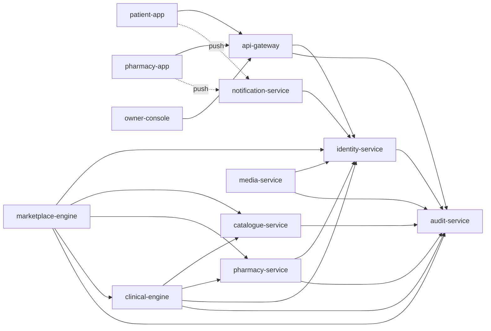
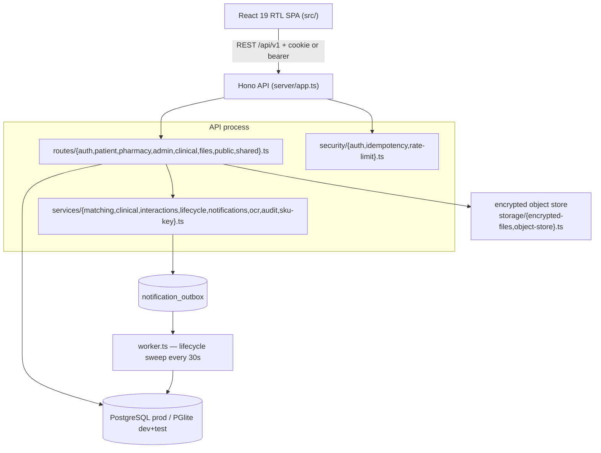

# 02 — Architecture

Every module, every package, every dependency, every service, every
responsibility, every boundary.

---

## 1. The shape, in one picture

```mermaid
graph TB
  subgraph host["HOST — the only place browser globals are touched"]
    WEB["apps/patient/web/host.ts<br/>clock · crypto.randomUUID · navigator.onLine<br/>localStorage · setTimeout · Math.random · camera"]
    MAIN_ENTRY["apps/patient/web/main.tsx<br/>createRoot(...).render(App)"]
    MOCK["apps/patient/web/mock.ts<br/>only when VITE_MOCK_API=1"]
  end

  subgraph root["COMPOSITION ROOT — the only place a clock is read"]
    RT["src/main/runtime.ts · createRuntime(host)"]
    HOSTIF["src/main/host.ts · the Host interface"]
  end

  subgraph infra["INFRASTRUCTURE — the only place I/O happens"]
    HTTP["infra/http.ts — one transport"]
    CAT["infra/catalogue.ts"]
    IDT["infra/identity.ts"]
    REQ["infra/requests.ts"]
    MKT["infra/marketplace.ts"]
    MED["infra/media.ts"]
    FLUSH["infra/flush.ts — the outbox engine"]
    PERF["infra/perform.ts — the effect runner"]
  end

  subgraph app["APPLICATION — pure"]
    STORE["app/store.ts · dispatch(state,intent,env,authority) → {state, effects}"]
  end

  subgraph model["PRESENTATION MODELS — ask the domain, never decide"]
    M["model/{draft,send,search,offers,reservation,consent,onboarding,prescription,view}.ts"]
  end

  subgraph screens["SCREENS"]
    CONTRACTS["screens/core-loop.contract.ts — 22 declared contracts"]
    GRAPH["screens/graph.ts — graph derived from contracts"]
    COMPONENTS["screens/*.tsx — 10 components"]
  end

  subgraph pkgs["PACKAGES"]
    DOM["@dawai/domain — every business rule. PURE."]
    DES["@dawai/design — tokens, a11y, RTL, screen contract type"]
    NAV["@dawai/navigation — flows, graph, guards"]
    SES["@dawai/session — session + pending intent"]
    OFF["@dawai/offline — the outbox"]
    NET["@dawai/net — retry policy + classify"]
    OBS["@dawai/observability — logger, telemetry, errors"]
    CFG["@dawai/config — env, secrets, flags"]
    CON["@dawai/contracts — types only, deliberately empty"]
  end

  MAIN_ENTRY --> RT
  MAIN_ENTRY -.->|flag| MOCK
  WEB -.implements.-> HOSTIF
  RT --> HOSTIF
  RT --> HTTP & CAT & IDT & REQ & MKT & MED & FLUSH
  RT --> DOM
  PERF --> CAT & IDT & MKT & MED
  STORE --> PERF
  STORE --> DOM & NAV & SES & OFF & OBS
  STORE --> M
  M --> DOM & DES & NAV
  COMPONENTS --> CONTRACTS & DES & M
  GRAPH --> CONTRACTS & NAV
  CAT & IDT & REQ & MKT & MED --> HTTP
  HTTP --> NET
  FLUSH --> NET & OFF
  NAV -.no dep.-> DOM
  DES -.forbidden.-> DOM
```



**Read the arrows that are missing.** `@dawai/design` may not import
`@dawai/domain` — a design token that knows a business rule is a rule in the UI,
which is Rule 3 inverted. `@dawai/navigation` does not import `@dawai/design`
either: it takes a *structural* `NavScreen` type so there is no cycle.

---

## 2. The nine architecture rules, and what enforces each

These are enforced by scripts, not by review. `npm run check` runs all of them.

| # | Rule | Enforced by | How it fails |
|---|---|---|---|
| 1 | Every module traces to Blueprint v3 | `tools/trace-check.mjs` | Every exporting `.ts` needs a `@blueprint` tag, and each reference must **resolve** against `register.js` (D01–D43), `phase0.js` (E1–O24), or `model.js` (entities, services, events, tables, endpoints, V1–V11, BD-1–BD-11, §1–§10) |
| 2 | Exactly one owner per module | `tools/trace-check.mjs` | `@owner` must name one of the 12 services or `platform-foundation`; a domain concept declared via `@implements` may be owned once |
| 3 | No business logic outside the domain | `tools/layer-check.mjs` | The domain may not import Node built-ins, `fetch`, `Date.now()`, `new Date()`, `Math.random()`, timers, `console`, `process.env`, or browser globals |
| 4 | The UI never makes a business decision | `tools/layer-check.mjs` | Apps may import only their rendering platform, the design system, the domain, navigation, session, offline, net, observability |
| 5 | No undocumented state transitions | Construction | A machine **is** a transition table; `transition()` is the only mover; `audit()` proves reachability, exits, determinism and per-edge Blueprint refs |
| 6 | Build hygiene | `tools/layer-check.mjs` | An emitted `.js` beside its `.ts` resolves first and makes every test run against the previous build — banned |
| 7 | Every feature independently testable | The purity of the domain | No infrastructure needed for any rule test |
| 8 | Every test file is actually run | `tools/test-reach-check.mjs` | A suite outside the runner's `include` globs is a suite that passes by not existing |
| 9 | A clean clone builds | `tools/deps-check.mjs` | Every script binary and build alias must resolve to a **declared** dependency |

Plus five more that are not numbered but are gates all the same:

- **UX**: `tools/ux-check.mjs` + `auditContract` — a contract must name a real
  Blueprint screen, cover every state the Blueprint declares for it, and leave
  no dead end.
- **Contrast**: `a11y.test.ts` measures all 84 renderable pairs across 3
  personas × 2 schemes. Contrast is measured, never eyeballed.
- **Navigation**: `unreachable`, `traps` and `danglingExits` are *graph
  properties a test checks*, derived from the contracts.
- **Docs**: `tools/docs-check.mjs` — `undefined`, `NaN` or `[object Object]` in a
  shipped artefact is a build failure.
- **Debt**: `tools/debt-check.mjs` — every `TD-n` referenced in source lands on
  exactly one register entry, and every inert control is named.
- **Strictness**: `tools/strict-check.mjs` — every project extends
  `tsconfig.base.json` and 12 required compiler flags stay on.

### The negative tests

`.github/workflows/platform.yml` writes deliberately-violating probe files into
`packages/domain/src/_probe/` and asserts each gate **rejects** them:

- a module with no docblock → `trace` must fail
- an unresolvable `@blueprint` reference → `trace` must fail
- duplicated ownership of a concept → `trace` must fail
- `Date.now()` in the domain → `layers` must fail
- `import from "node:fs"` in the domain → `layers` must fail

> *A guard that has never rejected anything is untested.*

---

## 3. Packages — responsibility, boundary, key exports

### `@dawai/domain` — the whole of the business

`@owner platform-foundation` · **PURE**: no I/O, no clock, no randomness.

```
src/shared/     result.ts  refusal.ts  instant.ts  ids.ts  machine.ts
src/marketplace/ rules.ts  machines.ts
src/clinical/    gates.ts
src/identity/    authority.ts  family.ts  machines.ts  verification.ts
src/pharmacy/    machines.ts
```

| Module | Owns |
|---|---|
| `shared/result.ts` | `Result<T,E>`, `ok`, `err`, `map`, `flatMap`, `all`. The domain's **only** way to fail. A boolean gets ignored; a throw loses the reason. |
| `shared/refusal.ts` | `REFUSAL` — the **closed** set of ~35 refusal codes, each traced to a decision. `Refusal.detail` is structured context, never a rendered string. |
| `shared/instant.ts` | `Instant` (branded epoch ms), `MINUTE/HOUR/DAY`, `Clock` as an explicit dependency, `fixedClock` for tests. |
| `shared/ids.ts` | 16 branded id types. Passing a `SubjectId` where an `AccountId` belongs is a compile error rather than a clinical incident. |
| `shared/machine.ts` | `defineMachine`, `transition`, `can`, `statesOf`, `eventsFrom`, `audit`. |
| `marketplace/rules.ts` | Windows, packs, line limits, routing, honoured band, offer answers, acceptance, coverage. |
| `marketplace/machines.ts` | `RequestMachine`, `OfferMachine`, `ReservationMachine`. |
| `clinical/gates.ts` | `gateRequestLine`, `mayConfirmReservation`, `mayProposeSubstitution`, `gateHandover`. |
| `identity/authority.ts` | `authorise()` — **one function, one refusal**. |
| `identity/family.ts` | Managed-subject limit, invite TTL, memorial reversal, claim outcome, deletion dispositions. |
| `identity/verification.ts` | `ChallengeMachine`, `MAX_ATTEMPTS = 5`, `CODE_LIFETIME_MS = 10min`, `submit()`, `consumeAttempt()`. |
| `identity/machines.ts` | `SubjectMachine`, `GrantMachine`. |
| `pharmacy/machines.ts` | `VerificationMachine`, `EligibilityMachine`. |

### `@dawai/design` — tokens, accessibility, RTL, the screen contract

`@owner platform-foundation` · **may not import `@dawai/domain`**.

- `tokens/space.ts` — the 4pt rhythm (`space[0..10]`), `radius`, `tap`, `frame`
  (`gutter`/`safeTop`/`safeBottom`), `elevation` as roles not shadow strings.
- `tokens/type.ts` — 7 roles; `letterSpacing` typed as literal `0`;
  `clinicalAllowed` per role; `tracking.tabularCode = 2` as the one named
  exception (LTR digit codes); `fontStack` (arabic / latin / tabular).
- `tokens/color.ts` — 3 personas × 2 schemes; `COLOR_ROLES` are **roles, never
  hues**; `CONTRACT_PAIRS` + `EXTRA_PAIRS` define exactly what the contrast test
  measures.
- `tokens/motion.ts` — 13 tokens each carrying a **required** `teaches`;
  `MAGNITUDE` (how far things move); `CURVE` (the four easings, once);
  `withReducedMotion` (a loop stops entirely rather than becoming flicker);
  `HAPTIC_EVENTS`.
- `a11y.ts` — `luminance`, `contrastRatio`, `meets`, `reportRatio` (rounded
  **down**, so a report never flatters a borderline pair).
- `rtl.ts` — `APP_DIRECTION`, logical edges (`start`/`end`, never left/right),
  `NEVER_MIRROR`, `toWesternDigits`, `formatDigits`, `isolate`, `needsIsolation`.
- `arabic.ts` — `plural()` / `counted()` over CLDR's four Arabic categories.
- `ux/contract.ts` — `ScreenContract`, `StateTreatment`, `auditContract`.

### `@dawai/navigation` — flows, the graph, route guards

`@owner patient-app` (the package is persona-agnostic; the *content* is not, and
patient wording lives in `apps/patient/src/screens/flows.ts` for that reason).

- `flow.ts` — `Flow`, `FlowStep`, `progressAt` (answers *where am I / what came
  before / what next / how far*, skipping optional steps the journey will not
  take), `auditFlow`.
- `graph.ts` — `buildGraph` (from contracts, never hand-wired), `unreachable`,
  `traps`, `danglingExits`, `resolveBack`, `stackFor` (a deep link resolves to a
  full stack, never a bare screen), `flowGaps`.
- `guards.ts` — `RedirectReason` (a **code**, not a sentence — navigation is
  persona-agnostic), `requireSession`, `requireOrderScope`, `blockMemorialised`,
  `runGuards` (first refusal wins), `guardDestinations`, `ROUTE_GUARDS`.

### `@dawai/session`

`SessionState` = `guest | authenticating | authenticated`. `PendingIntent`
carries the interrupted screen and an opaque draft. `interrupt`,
`beginVerification`, `abandonVerification`, `authenticate`, `takePending`
(returns *and clears* in one call), `signOut` (**D28** — the caller destroys the
encrypted cache key), `switchSubject`.

### `@dawai/offline` — the outbox

`OutboxState` = `queued | sending | accepted | rejected | cancelled`. There is
deliberately **no `duplicate` state**: a 409 means the server already has the
item, which is success, so `markDuplicate` resolves to `accepted`.

`readyToSend` returns **the oldest queued item per subject, and no more** — the
outbox is ordered *per subject*, so one subject's writes cannot overtake each
other while unrelated subjects do not block. `describe()` is the only wording
function (**D27**).

### `@dawai/net` — retry policy

`Outcome` = `accepted | duplicate | transient | permanent`. `classify(status)`:
2xx → accepted, 409 → duplicate, 408/425/429/5xx → transient, everything else →
permanent. `DEFAULT_POLICY` = 6 attempts, 1s base, 60s cap.
`delayFor(attempt, policy, random)` is exponential backoff **with full jitter** —
because when a cell tower returns, every queued device retries at once and
identical backoff turns a recovery into a thundering herd. `random` is a
parameter for the same reason the domain never calls `Math.random`.

### `@dawai/observability`

`BUSINESS_EVENT` — the **closed** set of 12 business events. Adding one is a
deliberate act with a Blueprint reference, not a line in a handler.
`TelemetryRecord` carries event, `at`, `correlationId` and **attributes that are
dimensions, never content** — a district id is a dimension, a medicine name is
not.

### `@dawai/config`

`env.ts`, `secrets.ts`, `flags.ts`. `PHASE_0_FLAGS = []`, deliberately.
`flagResolver` **throws** on an unregistered flag — returning `false` silently
would let a typo disable a feature with no signal.

### `@dawai/contracts`

Types only, currently `export type Empty = Record<never, never>`. Deliberately
empty: *an invented type here would be an invented contract.* It exists so the
domain can be imported by every layer at zero runtime cost.

---

## 4. The patient app, layer by layer

### `web/` — the host (excluded from the app layer rules by name)

`layer-check.mjs` carves out `apps/*/web/` and gives it **its own boundary**:
it may touch the platform, and it may not touch a screen. That is a *different*
rule, not a lighter one — holding a host to the contract rule would mean either
no host can ever be written or the rule gets quietly softened for everyone.

`host.ts` implements the `Host` interface against browser globals; `main.tsx`
builds the runtime and mounts `App`; `mock.ts` installs the **same** `handle`
the dev server runs (`tools/devserver/api.mjs`) so there is one implementation
of the contracts rather than two that drift.

### `src/main/` — the composition root

`host.ts` declares the `Host` interface: `baseUrl`, `clock`, `newId`, `online`,
`store`, `sleep`, `random`, `camera` (**or null**, honestly), `log`.

`runtime.ts` is **the only file allowed to read a clock or a random source**.
It wires every port, owns the watch loop, the tick loop, the telemetry sink, the
`authority()` answer and the effect-failure hook. `tools/layer-check.mjs`
enforces that it is the only door.

### `src/infra/` — the only place I/O happens

One transport (`http.ts`), five port adapters, the outbox engine (`flush.ts`),
the effect runner (`perform.ts`). Every adapter validates the response body with
a **type guard** before the bytes can reach a rule.

### `src/app/store.ts` — the pure reducer

917 lines, no I/O. `dispatch(state, intent, env, authority) → { state, effects }`.
40 intent kinds, 10 effect kinds. It contains **no permission logic of its own** —
it asks `runGuards`.

### `src/model/` — presentation models

Nine modules. Each decides what is *displayed*; every business question is asked
of `@dawai/domain`. Example: `model/draft.ts` `add()` asks
`Clinical.gateRequestLine` and `Marketplace.checkLineCount` and returns the
domain's `Refusal` unchanged.

### `src/screens/` — contracts, graph, components

`core-loop.contract.ts` declares **22** of the Blueprint's 133 patient screens.
`graph.ts` derives the navigation graph, `isBuilt` and `NOT_YET_BUILT` from those
contracts. Ten components render them.

### `src/ui/` — the kit

`kit.tsx` (956 lines of primitives), `layout.tsx` (the screen frame),
`motion.tsx` (`Enter`, `Pulse`, `Shake` — real `Animated` components with
native-driver and reduced-motion support), `theme.ts`, `refusal.ts` (the one
place a `RefusalCode` becomes Arabic).

---

## 5. The twelve services (target architecture)

`docs/technical/model.js` declares twelve services. Only `patient-app` exists as
code today; the rest are the shape the backend must take. Each carries
responsibilities, interfaces, consumed/produced events, dependencies and — most
usefully — an explicit **forbidden** list.

| Service | Kind | Owns | Notable prohibition |
|---|---|---|---|
| `patient-app` | client | Patient screens, encrypted local cache, the outbox, the pending action | May not decide any permission; may not present a queued request as sent |
| `pharmacy-app` | client | PA1–PA9, P1–P31, staff PIN + 30-min idle timeout | **May not see requester identity before acceptance**; may not read any clinical record |
| `owner-console` | client | O1–O24 and the four exit metrics | May not write into a clinical record — *no mechanism exists* |
| `api-gateway` | edge | TLS, authn, principal resolution, token-audience rejection, idempotency, rate limits, audit envelope | **May not contain business logic**, and may not perform the authority check itself |
| `identity-service` | core | Accounts, phone verification, sessions, device binding, subjects, guardianship, peer grants, **the single authority question** | May not distinguish a missing relationship from a forbidden one |
| `marketplace-engine` | core | Requests, routing, windows, offers, reservations, honoured rate, observed availability | May not rank branches; may not start a reservation clock before confirmation; may not hold stock |
| `clinical-engine` | core | The prescription gate, controlled refusal, substitution authorisation, handover checklist, **the only writer of the dispense record** | **May never return a clear result** — only ALLOWED or REFUSED, never SAFE |
| `catalogue-service` | core | Items, Arabic-first search, districts, unmatched searches, observed availability windows | May not hold a price; may not autocorrect a medicine name silently |
| `pharmacy-service` | core | Pharmacies, branches, verified map points, staff, licences, hours, coverage, capacity, eligibility | May not decide routing — it answers eligibility; may not allow the last manager to be removed |
| `notification-service` | delivery | Device registration, preferences, quiet hours, deferred branch notification, watches | May not send anything for engagement; may not compute clinical severity |
| `media-service` | core | Encrypted prescription storage, time-bounded access, revocation, deletion | May not machine-read an image; may not serve one after its reservation ends |
| `audit-service` | core | Append-only record of every action and every identified read | **Offers no update or delete to any principal, including the operator**; applies backpressure rather than dropping an entry |

### Service dependency graph



`audit-service` is a sink for everything and depends on nothing. That is
deliberate: an audit that depends on a service it audits can be starved by it.

---

## 6. Boundaries — the four that matter most

### 6.1 The domain boundary (Rule 3)

Nothing above the domain may re-implement a rule; the domain may import no I/O.
The check is textual and brutal — a regex list of banned constructs per layer in
`tools/layer-check.mjs`. It is why `Marketplace.windowEndsAt(sentAt, urgency)`
takes the instant rather than reading a clock.

### 6.2 The persona boundary (role isolation)

From `docs/technical/model.js` navigation:

> Role isolation is achieved by **shipping different navigators**, not by
> branching inside one. A patient build contains no pharmacy route, so the class
> of leak that v1 hit twice is unrepresentable.

Verified at release by an import check on each bundle.

### 6.3 The client/server boundary (§5 rule 1)

*Hidden UI is not a permission, and the client enforces nothing.* Guards exist so
a user is not shown a door that will be slammed. Consequences visible in code:

- `guards.ts` says it in its own docblock.
- `store.ts` `doSend` re-runs the R6 guard **at the action**: "a screen that was
  opened while permitted may be acted on after the grant was revoked, and the
  disabled button on R6 is a courtesy, not a control."
- `ports.ts` on `MarketplacePort.accept`: "the server refuses without it — the
  client's gate is a courtesy, the server's is the control."

### 6.4 The contract boundary

A port method may only return the responses the API contract declares. From
`ports.ts` on `AcceptResult`:

> The declared responses and nothing else — 201 `{ reservation, childRequestId? }`,
> 409 `offer_withdrawn`, 409 `offer_expired`, 400 `substitution_not_acknowledged`,
> 404 `not_found_or_not_yours` — **so a screen cannot receive an answer the
> contract does not contain.**

An undeclared response is a `failed` outcome, not a fifth variant invented at the
adapter.

---

## 7. Build, bundle and deploy

### TypeScript

`tsconfig.base.json` is extended by every project (`tools/strict-check.mjs`
enforces it) and turns on 12 flags beyond `strict`: `noUncheckedIndexedAccess`,
`exactOptionalPropertyTypes`, `noImplicitOverride`, `noImplicitReturns`,
`noFallthroughCasesInSwitch`, `noUnusedLocals`, `noUnusedParameters`,
`useUnknownInCatchVariables`, `verbatimModuleSyntax`, `isolatedModules`,
`composite`, `declaration`.

Path aliases map `@dawai/*` to **source**, not to build output — in
`tsconfig.base.json`, in `vitest.config.ts` and in the vite config. That is what
makes "a stale build beside a source" a *bannable* condition rather than a
mystery.

### Vitest

`react-native` is aliased to `tools/rn-test-double.tsx`, which maps each RN
primitive onto a host element of the same name and passes every prop through —
so a rendered tree still carries the real accessibility roles, labels and
handlers. Environment is `node`, because **the domain is pure**.

### Vite / Netlify

Repo root `netlify.toml` → `base = "platform"`, `publish = "dist-web"`,
`command = "npm ci && npm run build:web"`, `VITE_MOCK_API=1`, `NODE_VERSION=22`.
`platform/netlify.toml` additionally runs `tools/assemble-preview.mjs`, which
puts three surfaces on one URL:

```
/          the working patient app (vite build, mock API)
/design/   the full design prototype, exactly as delivered
/review/   the screen gallery — every contracted screen, every state
```

Routing is a 200 rewrite (not 301) so the address stays the one the visitor
typed, and the same rules are carried **twice** — in `netlify.toml` and in
`apps/patient/web/public/_redirects` / `_headers` — so a future change to which
config wins cannot take the front door down again. (It did once: an emptied
`platform/netlify.toml` took the redirects with it and the deployed site
answered 404 at its own front door.)

Security headers: `nosniff`, `strict-origin-when-cross-origin`, `SAMEORIGIN`,
and `Permissions-Policy: camera=(self), geolocation=(), microphone=()` —
**geolocation stays denied because the product asks for a district rather than
reading where anyone is.**

---

## 8. The other track: `dawai-platform/`

Documented so you can read it, not so you extend it.



- **7 migrations**: `0001_init` → `0002_production_hardening` →
  `0003_mvp_conformance` → `0004_clinical_core` → `0005_interaction_safety` →
  `0006_clinical_integrity` → `0007_review_round2`.
- **Auth**: Argon2id passwords, 32-byte opaque sessions stored as SHA-256+pepper
  digest, HttpOnly/Secure/SameSite=Lax cookie + rotating CSRF + exact Origin
  check; the same token works as `Authorization: Bearer` for a future native
  client.
- **State machine**: `ACTIVE → HOLD_PENDING → RESERVED → READY → COMPLETED`,
  with `NO_MATCH`, `CANCELLED`, `EXPIRED`, `BLOCKED`.
- **Files**: AES-256-GCM after magic-byte inspection, image re-encoding and EXIF
  stripping.
- **Deploy**: `Dockerfile`, `compose.yaml`, `fly.toml`, `render.yaml`, Node 24.

**Why it is not the current track:** it uses email+password rather than
phone+OTP, `users` with roles rather than `Account`/`Subject`/`Guardianship`,
different entity names throughout, and it *ships an interaction-safety engine*
(migrations 0005–0007) which **D16 explicitly removed from Phase 0**. These are
not two views of one system. See `19-open-decisions.md` §1.
