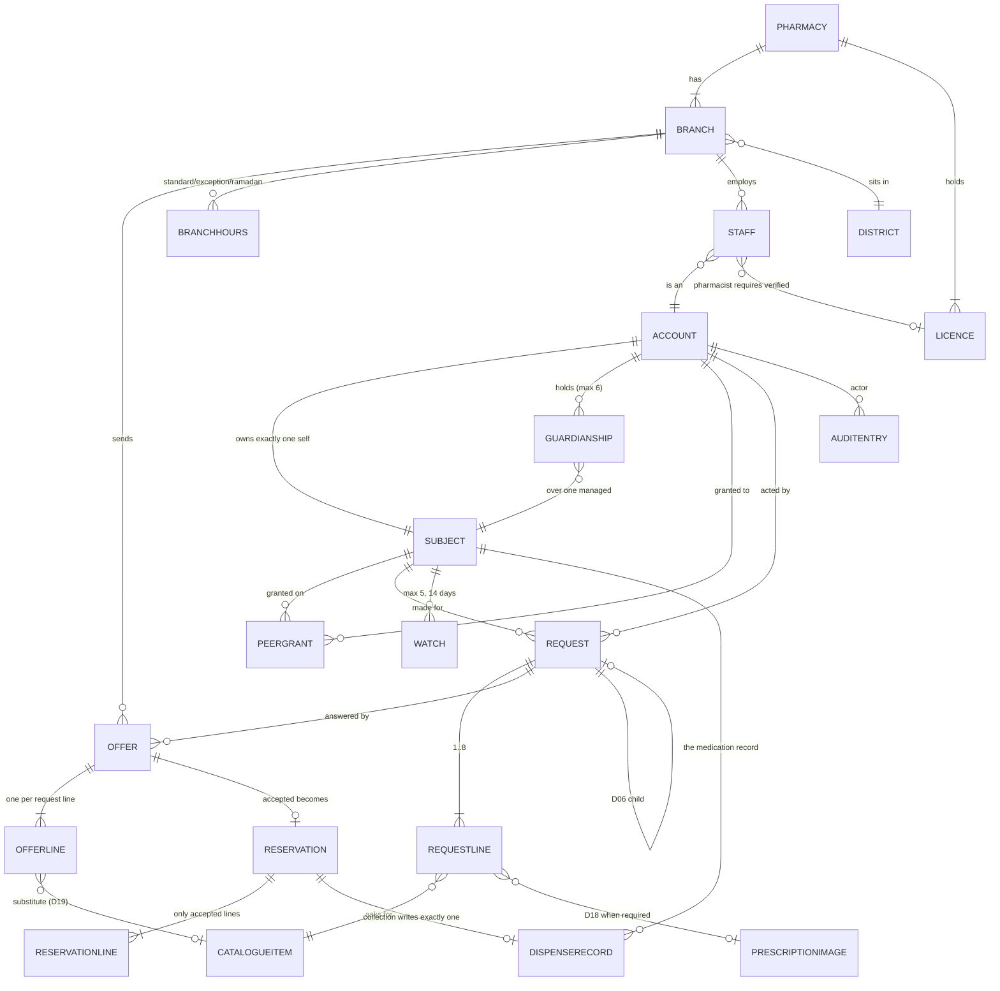

# 03 — Domain model

Every entity, every value object, every aggregate, every invariant — and why
each one exists.

Two sources: the frozen model (`docs/technical/model.js`, 21 entities, 22 tables)
and the implemented domain (`platform/packages/domain`). Where they differ, the
difference is stated.

---

## 1. The entity map

---

## 2. Identity aggregate

### Account

The thing that signs in. One per phone number (**D03**), `UNIQUE(phone_hash)`.
Phone stored as a **hash for lookup and encrypted for display** — the hash is
what indexes.

**Invariant (§9, §2):** an Account owns **exactly one** self Subject, created
**atomically with it** by `POST /v1/auth/verify`. Enforced in the database as
`UNIQUE(owner_account_id) WHERE type='self'`.

This invariant is load-bearing in the client. `main/runtime.ts` `authority()`
relies on it and says so at length: a client that has just been handed both ids
by `/v1/auth/verify` *knows* the self relationship holds, so it can supply that
fact to `Authority.authorise`, which still decides. A **grant over someone else's
record is NOT inferred** — `grants[]` comes from `GET /v1/me` and no port reads
it yet, so a guardian or peer still has no order scope in this build.

### Subject

**The person the medicine is for.** A Subject *need not authenticate*
(**D01**) — this is the change that made the product's primary persona
representable at all.

States: `self | managed | claim_pending | memorialised | deleted`.

| Invariant | Why | Enforced |
|---|---|---|
| A managed subject has exactly one active guardianship | Two guardians is two people with unresolvable authority over one medical record | `UNIQUE(subject_id) WHERE state='active'` on `guardianships` |
| A guardian holds at most **6** managed subjects | §4 S3. A household, not a directory | `Family.canAddManagedSubject` |
| On claim, **guardianship ENDS** — it does not weaken and is not retained silently | **D01**. The former guardian is left holding a revocable `view` peer grant | `SubjectMachine` edge `claim_pending --numberVerified--> self`; `Family.claim()` |
| A memorialised subject accepts no new activity but stays readable | **D04**. Only `order` is refused; `view` stays open for existing grant holders | `Authority.authorise` |
| Memorialisation reverses within **30 days**, and not after | **D04** | `Family.canReverseMemorialisation` |

The claim edge is the most consequential in the product. From
`identity/machines.ts`:

> Writing it as a table is what stops that being softened later by someone who
> finds ending it inconvenient.

### Guardianship

`guardian_account_id → subject_id`, with `state`, `ended_at`, `ended_reason`.
**Never deleted — ended.** The record that authority once existed survives.

### PeerGrant

An access grant from a Subject to another Account, at a scope.

- Scopes are exactly `view` and `order` — **there is no `confirm` scope in
  Phase 0**, because there are no dose events to confirm (§10 change 1).
- **D02**: an invitation to a number with **no account is the NORMAL case**, not
  an error. `GrantMachine` starts at `invited`; `invited --inviteeSignsIn-->
  pending`.
- Expires after **7 days** (`INVITE_TTL_MS`).
- **Never deleted — revoked**, so the record that it existed survives.
- A subject may `narrow` an active grant (`active --narrow--> active`).

---

## 3. Marketplace aggregate

### Request (aggregate root)

Carries lines; an Offer answers **per line**; a Reservation covers **one branch**
(**D06**).

| Invariant | Value | Why |
|---|---|---|
| Line count | **1..8** | `Marketplace.MAX_REQUEST_LINES`; `NO_LINES` / `TOO_MANY_LINES` |
| Urgency | exactly `now` \| `today` \| `soon` | **D09**. Mapping to 20m / 4h / 48h *exactly*. No other value exists |
| Idempotency | `UNIQUE(idempotency_key)` | The client mints it once at enqueue; a retry returns the original result |
| District | required | It drives routing; a request with `districtId: ""` is a request no branch can be found for — this was a real defect (TD-18) |

Lines the accepted offer did not fill become a **child request automatically**
(**D06**) so the patient never re-enters a line. The parent moves
`accepted --childCreated--> partially_filled` and the child re-broadcasts.

### RequestLine

`packs >= 1` (**D07** — the unit is the pack, defined by the catalogue, and there
is no other unit). `prescription_image_id NOT NULL` when the item requires one
(**D18**). The item must not be controlled (**D42**).

> **Open:** nothing bounds `packs` upward. `Marketplace.packs` refuses zero,
> negatives and non-integers and accepts 1,000,000. Blueprint v3 does not state
> a ceiling, and inventing one would be an invented business rule — registered as
> **TD-16** rather than guessed.

### Offer

One answer per branch per request: `UNIQUE(request_id, branch_id)`.

Each `OfferLine` carries exactly one of three answers (**D08**):

| Answer | Requires | Refusal if missing |
|---|---|---|
| `available` | integer `priceMinor > 0` | `PRICE_REQUIRED` |
| `unavailable` | a reason from `out_of_stock \| not_carried \| closing \| cannot_supply` | `UNAVAILABLE_REASON_REQUIRED` |
| `substitute` | price, `itemId`, a **non-empty note**, and a verified pharmacist author | `SUBSTITUTION_REQUIRES_PHARMACIST` |

**Invariant (D08):** the offer price **binds for the reservation window**.
Withdrawal is the correction path for a mistyped binding price and it exists
**only before acceptance** — `sent --withdraw--> withdrawn`, and there is no
edge out of `accepted`.

**Invariant (D19):** a substitute line carries `authorised_by_staff_id` with a
verified pharmacist licence. In the patient app this surfaces as
`Offers.ProposedBy { name, licenceVerified, branchName }` — because until it
existed, R9 showed **a clinical claim with no author**: a patient was asked to
accept a different medicine on the word of nobody in particular.

### Reservation

**Invariant (§6):** `held_at NOT NULL` before `expires_at` is set. **The clock
starts at `held`, never at `requested`.** `expires_at` is computed from
**server time only**.

**Invariant:** `UNIQUE(code) WHERE state='held'` — the code is the collection
right (**D14**) and two live holds may not share one.

**Invariant (D06):** `reservation_lines` contains **only lines the patient
accepted**. A refused or undecided substitution is not among them.

**D39** — when a branch confirms and then cannot hold: the parent request
**re-opens automatically**, and the refusal counts against the honoured rate
*unless it came within five minutes* of confirming.

### DispenseRecord — the medication record

**The most protected entity in the system.**

- **APPEND ONLY.** No UPDATE and no DELETE permission is granted to **any**
  role (§2 invariant 2). `clinical-engine`'s forbidden list: "Edit or delete a
  dispense record."
- `UNIQUE(reservation_id)` — a collection writes **exactly one**.
- Written by `clinical-engine` and by nothing else (**D22**). It is the *only*
  writer of the medication record.
- **D22**: built from completed pickups. **Phase 0 predicts nothing.**
- Removed only via the account-deletion cascade.

---

## 4. Catalogue aggregate

### CatalogueItem

`name_ar`, `name_latin`, `name_ku_reserved` (**D34** — the Kurdish slot is
reserved in the schema; the font stack is not, because a font stack for a
language we do not ship would be a claim we cannot honour), `form`, `strength`,
`pack_size`, `requires_prescription`, `is_controlled`, `state`, `version`.

**Invariant (§3 prerequisite 3):** `state='requestable'` requires `pack_size`,
`requires_prescription` **and** `is_controlled` all NOT NULL. An item lacking any
of the three cannot be published.

**This invariant has a client-side twin, and it was a real defect.** From
`infra/catalogue.ts`:

> `gateRequestLine` reads them as plain booleans, so a hit carrying
> `requestable: true` but **missing** `isControlled` was gated as ALLOWED, and
> D42's "this cannot be requested from the app" never fired for a controlled
> medicine.

The path that makes it more than theoretical is the **cache** — it stores what a
previous version wrote, so a device upgrading across a schema change replays old
rows straight into the gate with no server in the loop to correct them. The type
guard now requires all three booleans; **a row we cannot judge is a row we must
not offer**, and it is dropped.

Prohibitions: the catalogue **holds no price** (**D08**), **holds no stock**, and
**never autocorrects a medicine name silently**.

### District

**The area unit** (**D10**). `id, city, name_ar, name_latin`,
`UNIQUE(city, name_ar)`. A district is stored; **a GPS coordinate never is, and
no location history exists** (**D29**).

Branch location is verified during application — an operator sets the map point
at approval (**D10**), which is why `verified_point NOT NULL` is required before
`state='verified'`.

---

## 5. Pharmacy aggregate

| Entity | Key facts |
|---|---|
| **Pharmacy** | `owner_account_id` and `named_pharmacist_account_id` recorded **separately** (§3.3) — they are frequently different people. Closed, never removed |
| **Branch** | `verified_point NOT NULL` before verified (**D10**); `radius_km`, `capacity_open_reservations`, `paused_until`, `eligibility_reason` (**D13**) |
| **BranchHours** | `kind ∈ {standard, exception, ramadan}`. **Ramadan rows carry a `hijri_range`, not a Gregorian date** (**D33** — Ramadan is a scheduling model, not an exception list) |
| **Staff** | `role ∈ {assistant, pharmacist, manager}`; `role='pharmacist'` **requires a verified `licence_id`**; **at least one active manager per branch** (§10 change 5) |
| **Licence** | `expires_at`, indexed `WHERE state IN ('valid','expiring')` so the 60/30/7-day warnings can be found cheaply |

**Invariant:** a lapsed licence **stops routing but never cancels a live
reservation** — those are honoured. From `pharmacy/machines.ts`: *"That
distinction lives here so no cleanup job can forget it."*

---

## 6. Media

### PrescriptionImage

Encrypted at rest; **the key reference is stored apart from the object**. Hard
delete on patient request (§4 M5).

### PrescriptionAccess

The join that makes **D18** real: `image_id → branch_id + reservation_id`, with
`granted_at` and `revoked_at`. A branch may read the image **only while its
reservation is live**; `revoked_at` is set when the reservation resolves —
collected, expired or cancelled.

Both tables audit **all writes and all reads**.

---

## 7. Watch (notify-me)

**D30** makes notify-me an entity with a lifecycle rather than a checkbox.
`subject_id, item_id, district_id, state, expires_at`. **Max 5 active per
subject**; `expires_at = created_at + 14 days`. A match fires the watch and
closes it.

---

## 8. AuditEntry

`actor_account_id, actor_tombstone_id, subject_id, branch_id, action,
target_ref, reason, occurred_at, payload_digest`.

| Invariant | Why |
|---|---|
| **APPEND ONLY** — no principal, including the operator, holds UPDATE or DELETE | §5 platform matrix |
| **A digest, not the content** | The audit records *that* a read happened, never *what* was read |
| On account deletion the **actor is replaced by a tombstone and the entry is preserved** | **D05** — deletion must not erase the record that someone acted |
| Never dropped under load — backpressure instead | `audit-service` forbidden list |

It is projected into three surfaces: the patient access log (S12), the branch
access log (P26), and the operator audit log (O23/O24).

---

## 9. Value objects and primitives

### `Result<T, Refusal>`

The domain's **only** way to fail.

> A rule that returns a boolean will eventually be ignored by a caller who
> forgets to check it. A rule that throws loses the reason. Result carries the
> reason and **cannot be used without unwrapping**, so a caller cannot
> accidentally proceed on a refusal.

`all()` keeps the **first** error — ordering matters for reproducible refusals.

### `Refusal` — a closed set

~35 codes grouped by area, each traced to a decision. `detail` is
`Record<string, string|number|boolean>` — **structured context, never a rendered
string**, because the domain does not decide how a refusal is worded (Rule 4).

The most important one: **`NOT_FOUND_OR_NOT_YOURS`**. A missing relationship and
a forbidden one are the *same* refusal, so no lookup becomes an identity oracle
(§5 rule 3).

### `Instant` — branded epoch milliseconds

Always supplied by the caller. §21 requires every countdown to run on **server**
time, never the device's. Making time a parameter rather than an ambient global
is how that becomes structurally true instead of a convention, and it is what
lets every time-dependent rule be tested deterministically. `Clock` is an
explicit dependency; `fixedClock(at)` is what tests use.

### Branded ids

16 of them. From `shared/ids.ts`:

> Blueprint §2 invariant 1 says those are frequently different people. Branding
> makes passing one where the other is expected **a compile error rather than a
> clinical incident**.

Ids are **minted by infrastructure, never by the domain** — the domain is pure
and an id generator is a source of nondeterminism. `asAccountId(s)` only tags.

### `Packs`

`Marketplace.packs(n)` — a branded integer ≥ 1. **D07**: the unit is the pack and
there is no other unit.

### `HonouredBand`

`trusted | new | needs_attention | null`. **D11**: a band, **never** a decimal.
`null` means fewer than 10 samples — too few to say.

---

## 10. Where the implemented domain is narrower than the frozen model

Honest accounting of the delta:

| Frozen model has | Implemented domain has | Note |
|---|---|---|
| 21 entities | Rules and machines for Account, Subject, Guardianship, PeerGrant, Request, Offer, Reservation, Branch, Licence + verification challenges | No persisted entities anywhere — there is no server (TD-1) |
| `Watch` with D30 limits | `REFUSAL.WATCH_LIMIT` declared, no rule module | R12 is not in this slice |
| `DispenseRecord` | Not modelled in `packages/domain` | Written by `clinical-engine`, which does not exist yet |
| `AuditEntry` | Not modelled | Same |
| `BranchHours` / Ramadan (D33) | Not modelled | Pharmacy app is Stage 7 |
| 11 declared gaps (BD-1…BD-11) | Correctly absent | See `19-open-decisions.md` |

The patient app additionally carries **app-level value objects** that are not
domain entities and deliberately live in `apps/patient/src/model/`: `Draft`,
`Sent`, `SearchState`, `OfferSummary`, `Hold`, `ReservationView`, `ConsentState`,
`Capture`, `OnboardingState`. They are presentation models — they *ask* the
domain and never decide.
