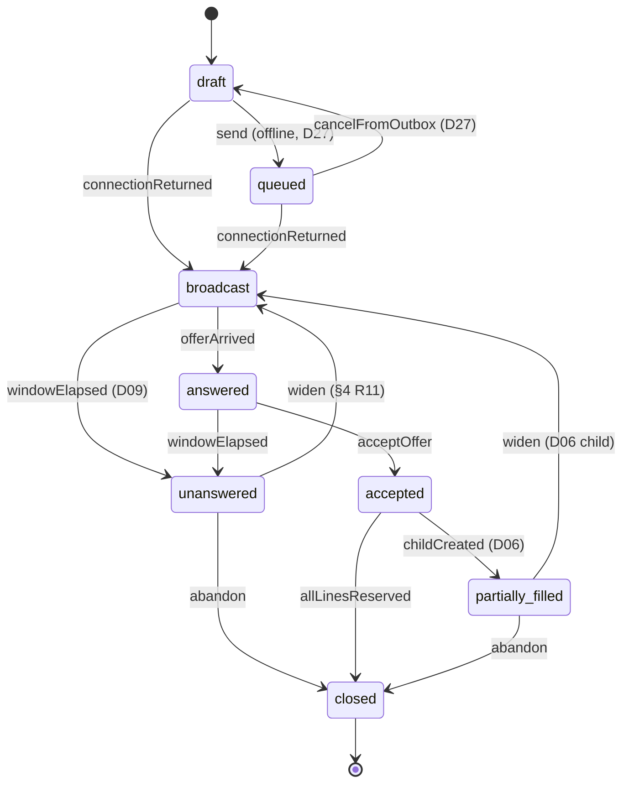
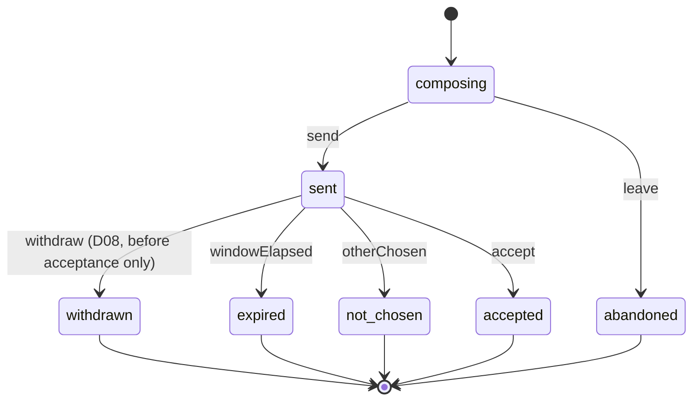
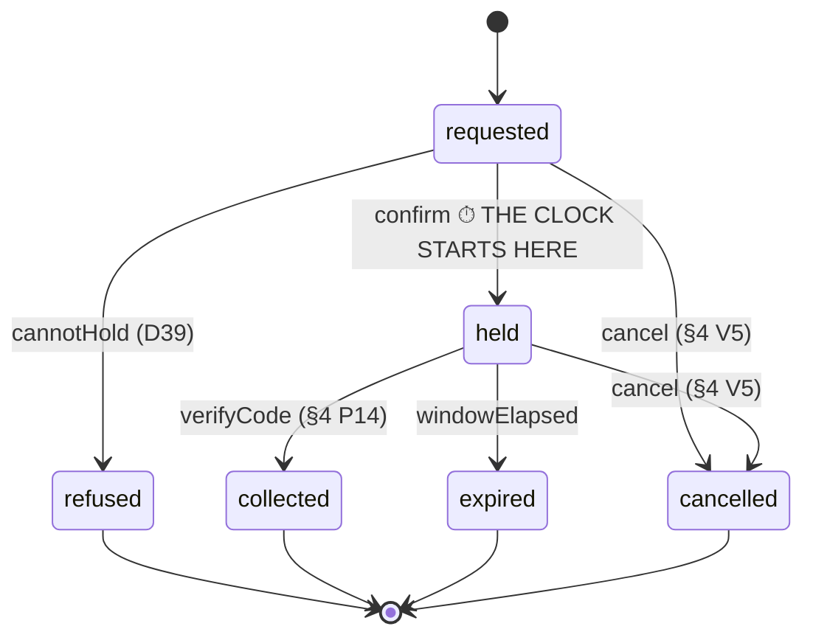
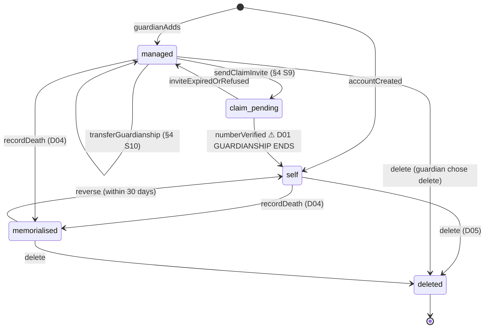
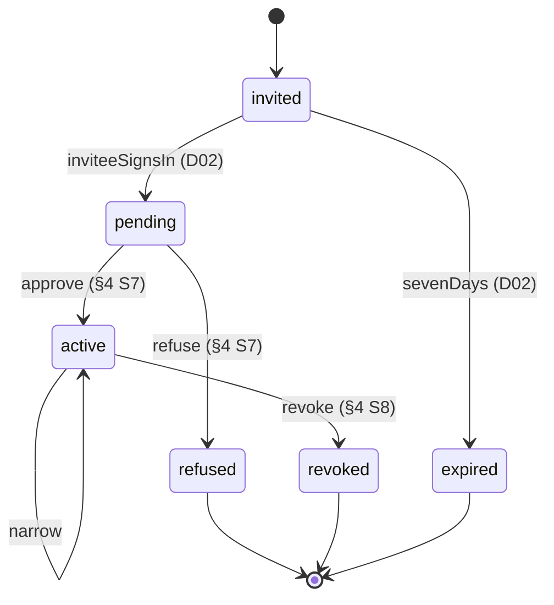
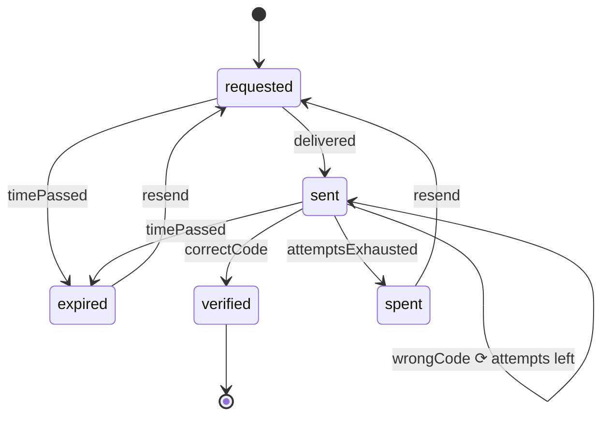
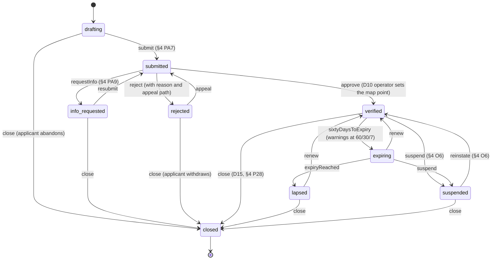
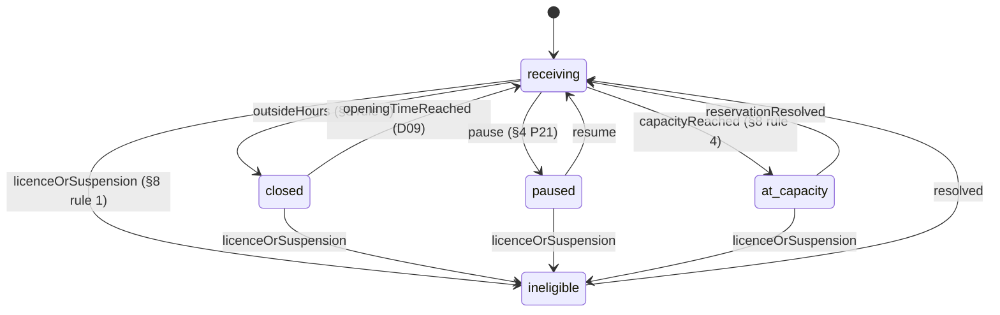
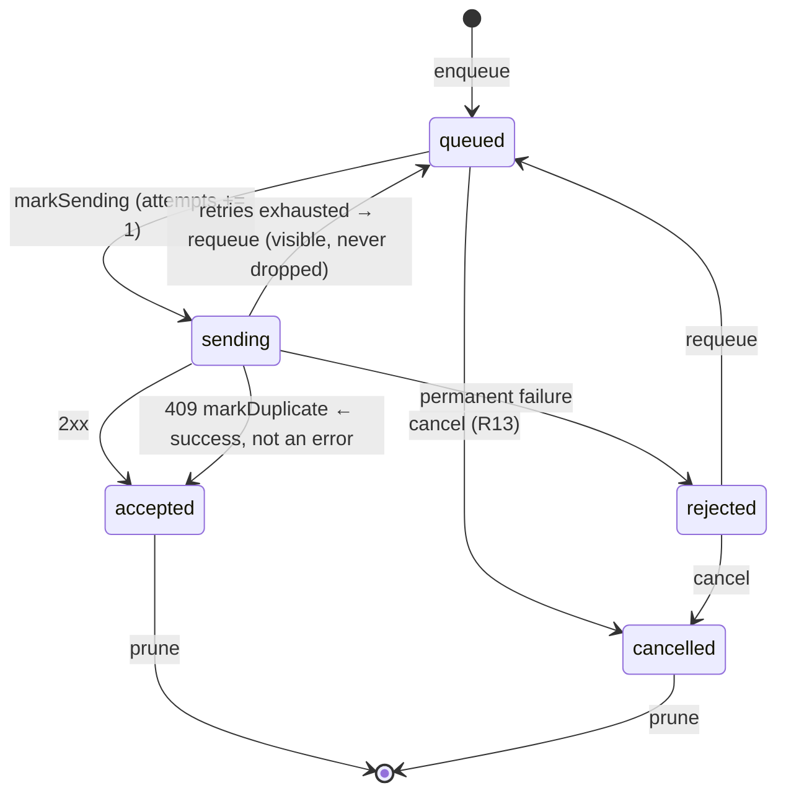

# 05 — State machines

Every machine, regenerated from its transition table, with initial states,
events, failure paths and terminal states.

---

## 0. How machines work here — Rule 5, enforced by construction

`packages/domain/src/shared/machine.ts`.

> Rule 5 says every state transition must come from the published state machine:
> no implicit transitions, no magic transitions, no undocumented transitions. A
> machine written as `if (state === "held") state = "collected"` cannot honour
> that — the transitions are scattered and nobody can list them. **Here a machine
> IS its transition table, so a transition that the Blueprint does not contain is
> unrepresentable rather than merely forbidden**, and the table can be diffed
> against the published diagram.

```ts
type Transition<S, E> = { from: S; on: E; to: S; bp: string }
type Machine<S, E> = { name; bp; initial: S[]; terminal: S[]; transitions: Transition<S,E>[] }

transition(m, from, on): Result<S, Refusal>   // the ONLY way to move
```

A failed transition returns `ILLEGAL_TRANSITION` **with the attempted edge in
the detail**, so the log names exactly what was tried.

`bp` is the Blueprint reference **for that edge, not for the machine** — so a
reviewer can check a single arrow against the diagram without reading the whole
file.

### `audit(machine)` — the structural test every machine passes

Returns the reasons a machine is not sound:

1. every state must be **reachable** from an initial state;
2. every non-terminal state must have an **exit**;
3. every transition must carry a **Blueprint reference**;
4. no two transitions may leave one state on one event (**determinism**);
5. at least one **terminal** state must be declared.

> Blueprint v3 §10 checked these by hand for every diagram. Running it as a test
> is how that check stays true after the tenth change.

**One machine deliberately fails rule 5**: `BranchEligibility` declares
`terminal: []` because a branch is never *finished* — it cycles. Read its entry
below.

### Eight machines in the domain, plus one client-only

| Machine | Module | Owner |
|---|---|---|
| Request | `marketplace/machines.ts` | marketplace-engine |
| Offer | `marketplace/machines.ts` | marketplace-engine |
| Reservation | `marketplace/machines.ts` | marketplace-engine |
| Subject | `identity/machines.ts` | identity-service |
| PeerGrant | `identity/machines.ts` | identity-service |
| Challenge | `identity/verification.ts` | identity-service |
| Verification (pharmacy licence) | `pharmacy/machines.ts` | pharmacy-service |
| BranchEligibility | `pharmacy/machines.ts` | pharmacy-service |

Plus one **client-only** machine with no server entity (BD-9, correctly): the
**Outbox** in `@dawai/offline`.

---

## 1. Request — §6 Request

**Initial:** `draft` · **Terminal:** `closed`



| State | Meaning | Exits |
|---|---|---|
| `draft` | Being assembled. Not sent to anyone | send, connectionReturned |
| `queued` | **In the outbox. Reached nobody.** R7 must not show a countdown | connectionReturned, cancelFromOutbox |
| `broadcast` | Asked of every eligible branch. The window is running | offerArrived, windowElapsed |
| `answered` | At least one offer exists | acceptOffer, windowElapsed |
| `unanswered` | The window closed with nothing. **R11's honest empty case** | widen, abandon |
| `accepted` | An offer was taken | childCreated, allLinesReserved |
| `partially_filled` | D06 — the unfilled lines became a child request | widen, abandon |
| `closed` | **Terminal** | — |

**Failure paths.** `windowElapsed` from either `broadcast` or `answered` is the
window closing — a branch that is asked and never answers is **ordinary**, which
is why D09 has a window at all and why R11 exists.

**Where this bites in the client.** `model/send.ts` moves `draft → queued` when
offline and `draft → broadcast` when online, **both via `transition()`**, and
returns the resulting state rather than a boolean — so D27's "never presented as
sent" is structural.

> **Known contradiction — TD-20.** `POST /v1/requests/{id}/cancel` is declared in
> the API model (200 / 404 / 409 `already_accepted`), but **this machine has no
> outgoing edge for a cancellation from `broadcast` or `answered`**. Its only two
> are `cancelFromOutbox` (a request that never left the device) and `abandon`
> (from `unanswered` or `partially_filled`). R7's «ألغِ الطلب» therefore does
> nothing. It cannot be built: calling the endpoint would return a request in a
> state the client has no edge to reach, and **adding that edge is inventing a
> state transition**. Two frozen documents disagree; one of them must move.

> **Known gap — TD-23.** Nothing fires `windowElapsed`. The store half is
> declared and buildable, but the screen it leads to is **R11, which is
> undesigned**. Moving the request with nowhere to land would change the state
> and nothing a patient can see, so the state is left honest.

---

## 2. Offer — §6 Offer

**Initial:** `composing` · **Terminal:** `withdrawn`, `expired`, `not_chosen`,
`accepted`, `abandoned`



**The load-bearing property:** there is **no edge out of `accepted`**.
Withdrawal is the correction path for a mistyped binding price and it exists
**only before acceptance**. After acceptance, **the price binds** (D08).

**Patient-visible subset.** `Offer["state"]` in the patient app is the narrower
set `sent | withdrawn | expired | not_chosen | accepted` — `composing` and
`abandoned` belong to the pharmacy's lifecycle and the patient never sees them.
`Offers.isDisplayable()` is the type guard that keeps a machine result inside
that set rather than a cast that would let either through to a screen with no
treatment for it.

**Only `sent` may be chosen** (`Offers.choosable`). An offer can leave the list
between render and tap — **R8's error state exists for exactly that** — and the
row is then marked unavailable rather than deleted.

---

## 3. Reservation — §6 Reservation

**Initial:** `requested` · **Terminal:** `refused`, `collected`, `expired`,
`cancelled`



**The one rule that matters most in this machine:**

> The clock starts HERE and nowhere earlier. **A countdown before anyone has
> committed stock counts down to a disappointment.**

Consequences:
- V1 (*"the moment between choosing and confirmation"*) shows **no timer at all**.
- The database enforces it: `held_at NOT NULL` before `expires_at` is set, and
  `expires_at` is computed from server time only.
- V1's contract declares `back: none` — *"a hold request is in flight; the screen
  resolves to V2 or V4 on its own."* Going back would leave the patient unsure
  whether it happened.

**Failure paths.**

| Path | Screen | What the patient is told |
|---|---|---|
| `cannotHold` → `refused` | V4 | **D39** — they confirmed and then could not. The parent request **re-opens automatically**, so V4's primary action moves the patient forward («شوف العروض الجديدة») rather than asking them to start again |
| `windowElapsed` → `expired` | — | The hold lapsed. Stock released, prescription access revoked |
| `cancel` → `cancelled` | V5 | The branch is told immediately |

**A network failure is not a refusal.** From `infra/perform.ts`: telling a
patient their pharmacy declined because a connection dropped would be the app
inventing a rejection nobody made. V1 keeps waiting, which is true — the
acceptance may still have landed, and the idempotency key means a retry returns
the original answer rather than a second reservation.

**A stray event cannot manufacture a hold.** `store.ts` `holdConfirmed` returns
unchanged if `reservationState === null`. The previous `?? "requested"`
**invented** the machine state the transition needed, which let a replayed server
event manufacture a held reservation the patient never asked for — and V2 would
then show a pickup code for it. *A machine state is either known or the event is
not ours; there is no third answer, and guessing one is inventing a transition.*

---

## 4. Subject — §6 Subject lifecycle

**Initial:** `self`, `managed` (two initial states) · **Terminal:** `deleted`



**The most consequential edge in the product** is
`claim_pending --numberVerified--> self`:

> **D01: guardianship ENDS here. It does not weaken, and it is not retained as an
> automatic grant** — the former guardian holds a revocable peer grant.

From `identity/machines.ts`: *"Writing it as a table is what stops that being
softened later by someone who finds ending it inconvenient."*

`Family.claim()` returns `formerGuardianGrantScope: "view"` — the **narrower** of
the two scopes, because *handing back `order` by default would make the claim
cosmetic.*

**`memorialised` is not terminal.** It reverses to `self` within 30 days (D04),
and while memorialised the subject accepts `view` but refuses `order`.

**`transferGuardianship` is a self-loop on `managed`** — authority moves in full,
the subject's state does not change.

---

## 5. PeerGrant — §6 Grant lifecycle

**Initial:** `invited` · **Terminal:** `refused`, `revoked`, `expired`



**D02: an invitation to a number with no account is the NORMAL case**, which is
why `invited` is the initial state and `inviteeSignsIn` is an ordinary edge
rather than an error path.

`active --narrow--> active` — **the subject may narrow the scope** of a grant
they have already given, without revoking it.

`revoked` is terminal and the **row survives**: `peer_grants` is never deleted,
so the record that access once existed remains (§9).

> **Known gap — BD-6.** Claim invites and staff invites are states **inside**
> other machines with no entity of their own, so an invite **cannot be listed,
> resent or cancelled**. Whether resending extends the 7-day expiry is
> unanswered.

---

## 6. Challenge — §9 Identity · E6

**Initial:** `requested` · **Terminal:** `verified`, `spent`, `expired`



**`sent --wrongCode--> sent` is a self-loop, and that is the whole point of
counting attempts** rather than burning the challenge on the first mistake.

**`resend` starts a NEW challenge; it does not revive a dead one.** Both `spent`
and `expired` route back to `requested`.

**Client behaviour** (`store.ts` `codeJudged`): the server picks the edge, but
only edges this machine contains exist. `attemptsLeft` from the server is
mirrored into `challenge.used` so the domain's count and the screen's sentence
cannot disagree. A verdict whose `challengeId` is not the current one is
**discarded** — it arrives whenever a patient presses resend while a submission
is in flight, and the old challenge's "wrong" would spend an attempt the patient
never made.

**`codeCheckFailed` is not a verdict.** It stops the spinner and asserts nothing:
E6's declared error is «الرمز مو صحيح», which is true of exactly one of its four
failures and is not true of a dropped connection.

---

## 7. Verification (pharmacy licence) — §6 Verification

**Initial:** `drafting` · **Terminal:** `closed`



**The rule this machine exists to protect:**

> Lapsing stops **ROUTING**. It does **not** cancel a live reservation — those
> are honoured. That distinction lives here so no cleanup job can forget it.

`branch.suspended`'s side effect says the same thing from the other direction:
routing stops, **live reservations must be resolved first**.

**D15 — a pharmacy has a way to leave.** `close` is reachable from six states,
including `drafting` and `info_requested` (an applicant abandons) and `rejected`
(an applicant withdraws). The export is offered *before* closure completes.

---

## 8. BranchEligibility — §6 Branch eligibility

**Initial:** `receiving` · **Terminal:** *none, deliberately*



**Why these are states rather than a predicate inside the router:**

> **D13: a branch is never silently filtered out.** Every non-receiving state
> **names itself on the branch home**, which is why they are states and not a
> predicate evaluated inside the router.

**Why `terminal` is empty.** A branch does not finish; it cycles. `audit()` will
report "no terminal state declared" for this machine, and that is the correct
answer — its lifecycle *ending* is the `Verification` machine's `closed`, not
this one's. If you add an `audit()` assertion for this machine, exempt that one
check by name rather than inventing a terminal state.

---

## 9. Outbox — §6 Session & outbox (client-only)

`@dawai/offline`. **BD-9** records that this machine has no entity in the ERD
*correctly*, since it is client-side only — "this gap is closed by explanation,
not by a decision."



**There is no `duplicate` state**, and the source explains why it was removed:

> A 409 means the server already has the item, which is success. The state
> existed anyway: **unreachable**, so every exhaustive switch had to handle a
> case that could not occur — and it was a latent leak, because `pendingCount`
> did not count it and `prune` did not remove it, so an item that ever reached it
> would have sat in the outbox forever, invisible.

**Cancellation has a known limit — TD-13.** `cancel` refuses **silently** while
an item is `sending`: it returns the outbox unchanged *by reference*, so the
reducer stores the same value, the screen re-renders identically, and the
patient's cancel produces no signal of any kind. With `DEFAULT_POLICY` that
window is roughly 30 seconds of backoff across six attempts, and `flush` only
re-reads the live outbox **between items**, never between retries. Whether an
in-flight write *should* be cancellable is a product question; that a function
which can refuse should **say so** is not.

---

## 10. Cross-machine choreography

The paths that span machines, in the order a patient experiences them:

```mermaid
sequenceDiagram
  participant P as Patient
  participant Req as Request machine
  participant Off as Offer machine
  participant Res as Reservation machine
  participant B as Branch

  P->>Req: send → queued or broadcast
  Req-->>B: request.broadcast (eligible branches, simultaneously)
  B->>Off: composing → sent
  Off-->>Req: offerArrived → answered
  P->>Off: accept → accepted
  Off-->>Req: acceptOffer → accepted
  Note over Req: D06 — unfilled lines → childCreated → partially_filled
  Off-->>Res: reservation.requested (no clock yet)
  B->>Res: confirm → held ⏱ clock starts, code issued, Rx access granted
  alt collected
    B->>Res: verifyCode → collected
    Res-->>P: dispense.recorded (append-only)
  else refused (D39)
    B->>Res: cannotHold → refused
    Res-->>Req: parent request re-opens
  else expired
    Res->>Res: windowElapsed → expired (stock released, Rx access revoked)
  end
```

Three cross-machine invariants worth memorising:

1. **`reservation.confirmed` is what grants prescription access**, and
   `collected`/`expired`/`cancelled` all revoke it (D18).
2. **`reservation.collected` is the only thing that writes a `DispenseRecord`**,
   and it writes exactly one (D22, `UNIQUE(reservation_id)`).
3. **`licence.lapsed` stops routing without touching a live reservation** — the
   `Verification` and `Reservation` machines are deliberately decoupled here.
