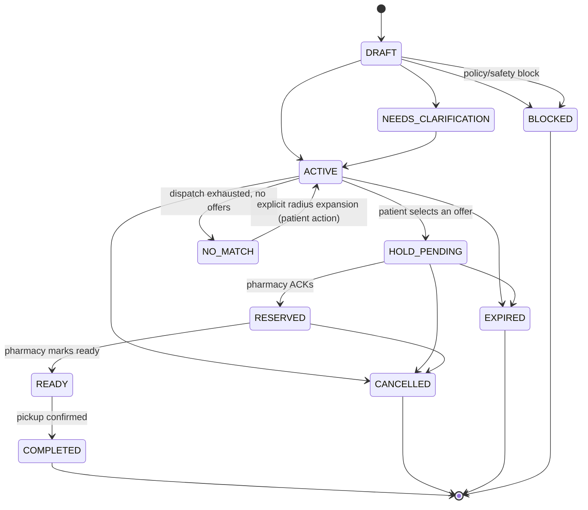
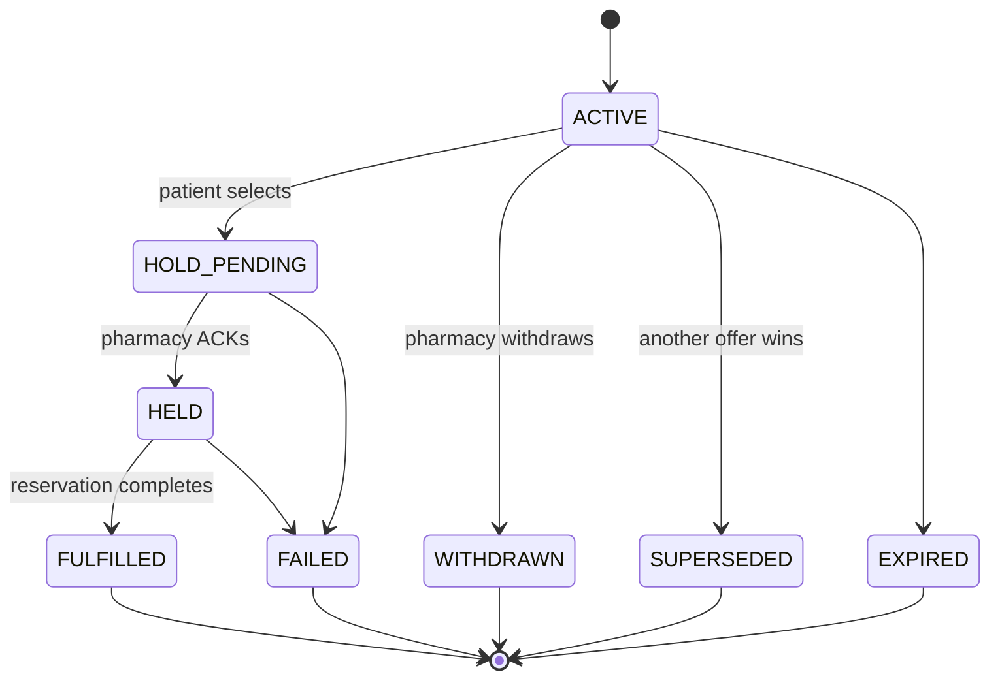
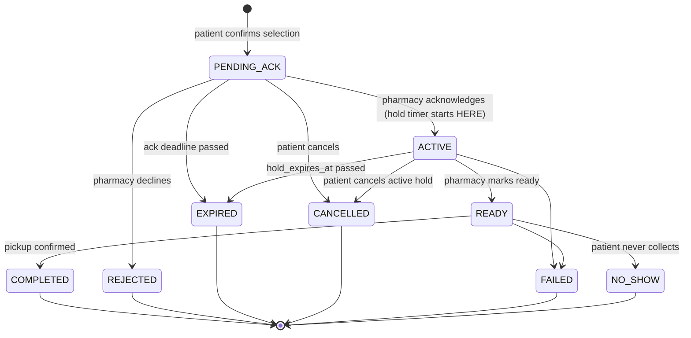
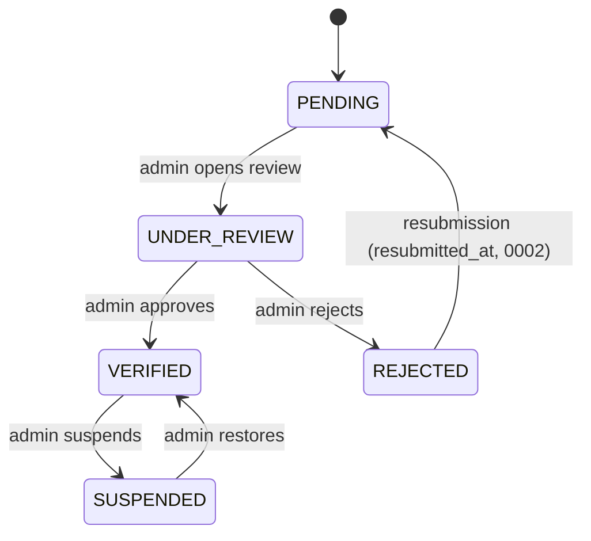

# 05 — State Machines

## A. As implemented in `dawai-platform` (authoritative for the shipped product)

Source: `ARCHITECTURE.md`, `migrations/0001_init.sql` CHECK constraints, `server/services/lifecycle.ts`.

### Medicine Request

Terminal states: `COMPLETED, CANCELLED, EXPIRED, BLOCKED`. `NO_MATCH → ACTIVE` requires an explicit patient action — never automatic. `docs/dawai/FINAL_MVP_READINESS.md` documents that `DRAFT`/`NEEDS_CLARIFICATION`/`READY(pre-dispatch)`/`ACTIVE_RADIUS_*` are compact-namespace approximations of a richer Blueprint-v1-flavored enum — see mapping table below.

### Pharmacy Offer

### Reservation

`acknowledgement_deadline` gates `PENDING_ACK → EXPIRED`; `hold_expires_at` gates `ACTIVE → EXPIRED`, and — critically — `hold_expires_at` is only populated on the `PENDING_ACK → ACTIVE` (ACK) transition, never before. Both timers are swept every 30s by `worker.ts` → `services/lifecycle.ts::runLifecycleSweep`.

### Pharmacy verification (branch/pharmacy-level)

### Blueprint-vs-implementation state name mapping (`FINAL_MVP_READINESS.md`)

| Blueprint-style name | Implementation |
|---|---|
| `DRAFT` | enum value only — creation goes straight to `ACTIVE`/`NEEDS_CLARIFICATION`/`BLOCKED` |
| `READY` (pre-dispatch) | immediate `ACTIVE` |
| `ACTIVE_RADIUS_*` | `ACTIVE` + `radius_km ∈ {2,5,10}` |
| `OFFERED` | request stays `ACTIVE`; offers are `ACTIVE` |
| `OFFER_SELECTED`/`HOLD_PENDING` | request/offer `HOLD_PENDING`; reservation `PENDING_ACK` |
| `HOLD_ACTIVE` | request `RESERVED`; offer `HELD`; reservation `ACTIVE` |
| `FULFILLED` | request `COMPLETED`; offer `FULFILLED` |

Documented as "behaviorally equivalent" to the Blueprint's richer enum vocabulary — not a defect.

## B. Blueprint v3 machines (`platform/packages/domain/src/{marketplace,identity,pharmacy}/machines.ts`) — separate track, not wired to A

These are generic-engine-backed (`shared/machine.ts::defineMachine`) transition tables, each edge carrying its Blueprint §-reference for traceability, enforced as the *only* way to move (`transition()` is the sole mutator).

### Request (v3)
`draft → queued/broadcast → answered/unanswered → accepted → partially_filled/closed`. Notably includes an explicit `queued` state for offline-sent requests (`send` while offline, `connectionReturned` to actually broadcast) — a distinction the `dawai-platform` schema does not model (no `medicine_requests` status represents "queued locally, not yet sent"). `partially_filled` implements the "child request" rule (D06): accepting a partial offer spins off a new request containing only the unfilled lines, which re-broadcasts.

### Offer (v3)
`composing → sent → withdrawn/expired/not_chosen/accepted/abandoned`. `withdrawn` only reachable from `sent` (§6 Offer: "withdrawal impossible after acceptance").

### Reservation, Subject, Grant, Verification, Branch eligibility, Outbox (v3)
Documented in `docs/technical/02-domain-model.html` and `09-testing-strategy.html`; notable invariants: `expires_at` is unset until a reservation is actually held (no premature countdown); `refused` always reopens the parent request; `collected` writes exactly one dispense record; grant `invited` grants nothing until approved and expires at 7 days; a claimed Subject *ends* guardianship rather than weakening it to a grant.

## Client-side attention/UI state machine (used in both tracks conceptually, implemented once)

`dawai-platform/src/components/PillBar.tsx` implements: `SEV_ALERT > ACTION_REQUIRED > IN_PROGRESS > SUGGESTION > IDLE` as a strict priority preemption ladder — only the highest-priority live `attention_events` row is ever shown, with a 380ms morph transition and a `prefers-reduced-motion` cross-fade fallback. `SEV_ALERT` has no dismiss transition at all (see `04-business-rules.md` rule 31).
