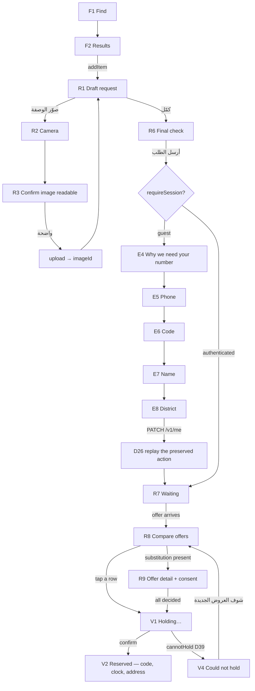
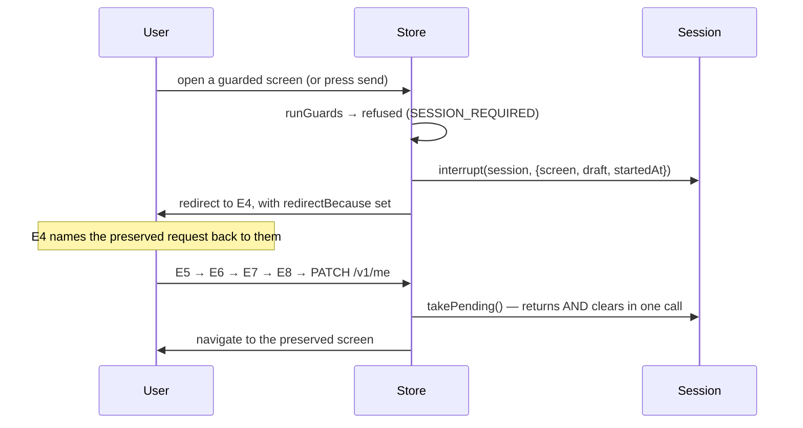

# 06 — User flows

Every workflow, for every persona, with start, steps, decision points,
alternative paths, failure paths and completion.

**Build status is marked on every flow.** ✅ = walkable today in
`npm run dev` · ⚠️ = partially built · 📋 = declared in Blueprint v3 and the
technical model, not built.

---

## 0. The one flow declared in code

`apps/patient/src/screens/flows.ts` declares exactly one `Flow` today, and it is
the core loop. Everything a screen says about *where am I / what came before /
what next / how far along* is derived from it by `progressAt()` — **no screen
hard-codes an answer.**

```ts
id:          "request-medicine"
goal:        "تطلب دواء وتحجزه من صيدلية قريبة"
steps:       R1 تختار الدواء
             R2 تصوّر الوصفة        (optional — skipped steps are not counted
                                     in the denominator, so «٢ من ٣» never
                                     counts a step that will not happen)
             R6 تأكيد وإرسال
             R7 تنتظر الردود
             R8 تختار العرض
             V1 نحجز لك
completesAt: V2
abandonsTo:  S1
```

Every flow **must** declare where success lands and where abandonment lands.
`auditFlow()` fails a flow that lands nowhere, that repeats a screen, that has a
step with no label, or whose steps are all optional — *"this is not a flow"*.

---

## 1. GUEST — browse and search without an account ✅

**§3.1: the account is requested at the first action that requires one, with the
reason stated. Never as a wall on launch.**

| | |
|---|---|
| **Start** | App opens on S1 (Today). No session |
| **Steps** | S1 → F1 (Find tab) → type a medicine → F2 (results) |
| **Guards** | `ROUTE_GUARDS.F1 = []`, `ROUTE_GUARDS.F2 = []` — **deliberately unguarded** |
| **Completion** | The guest has seen the catalogue and can add a line to a draft |

**Decision points**

- *Type a query* → normalised through six Arabic folding rules. Empty input
  returns to `idle` rather than searching for `""` (which would return the whole
  catalogue).
- *Tap a result* → `Search.availability()` asks the clinical gate **before the
  tap**, so a controlled item is refused on the row rather than after a round
  trip (D42).

**Alternative paths**

- **Cached results** — the network failed but the cache has this query: the rows
  show, **labelled with their age**, never presented as live (F2 `offline` state,
  `showsAge: true`).
- **No results** — F2's `empty` state says «ما لكيناه بقائمتنا — ممكن يكون
  موجود بالصيدليات» (*"we didn't find it in our list — it may exist in
  pharmacies"*) and offers «أطلبه بالاسم مع صورة». §13.1: **the catalogue is
  incomplete, not the patient wrong.** The miss emits `search.unmatched`, which
  feeds catalogue growth.

**Failure paths**

- **Search unreachable** → F2 `error`: «ما كدرنا نوصل للبحث» + «أعد المحاولة».
  A failure does **not** emit `search.unmatched` — counting a dropped connection
  as a missing medicine would send the catalogue team after items that exist.
- **A superseded search** — typing another letter aborts the in-flight request
  and the response is dropped by query, so results never change under the
  patient's thumb.

---

## 2. PATIENT — the core loop, end to end ✅

**The one flow that runs today.** Walk it with `node tools/devserver/smoke.mjs`.



### 2.1 Assemble the request (R1)

**Steps.** Add a line from F2 → the draft opens on R1 («The draft screen is where
the patient can see what they have. Going anywhere else after adding hides the
thing they just did»).

**Decision points**

| Decision | Rule | Refusal |
|---|---|---|
| Add a controlled item | D42 | `CONTROLLED_NOT_SUPPORTED`, inline, immediately |
| Add a 9th line | §2 Request | `TOO_MANY_LINES` (max 8) |
| Add the same medicine twice | — | Merged into one line with more packs |
| Set packs to 0 | — | **Removes the line** — a stepper that stops at one traps a user undoing a mis-tap |
| Change urgency (R5) | D09 | One of exactly three: now / today / soon. Default `today` — *"now" would overstate every request and "soon" would understate the frightened ones* |
| Change subject (R4) | — | **Does not clear the lines** |

**Failure path.** A prescription-required line with no image is *not* an error
while drafting; it is an error **at send**, and R1 says so inline rather than
letting the patient discover it at R6.

### 2.2 Photograph a prescription (R2 → R3)

**Start.** «صوّر الوصفة» from R1, or «صوّر وصفة» from F1.

**Steps.** R2 shutter → host camera (`<input type="file" accept="image/*"
capture="environment">` in the browser: the rear camera on a phone, a file picker
on a laptop where the paper has usually already been photographed) → R3 review →
«واضحة — كمّل» → **upload** → `imageId` → back to R1 with «الوصفة مرفقة».

**The critical sequencing rule.** Captured is **not** attached. R3 exists
precisely so the patient confirms legibility first — *skipping it means a blurred
photo travels to a pharmacist who then cannot dispense, and the patient discovers
it at the counter.* Phase 0 reads nothing (D18), so **the patient is the judge**,
and `LEGIBILITY_CHECKS` tells them what "clear" means: the drug name, the dose,
the doctor's stamp.

**Alternative path — camera refused.** Never a wall. R2 declares
`permissionRefused` with `stillUsable: true` and the alternative «تكدر تكتب اسم
الدواء بدل الصورة». `denied` and `restricted` are the same screen: the patient
cannot grant it here, so both offer the alternative rather than a settings link
that will not help.

**Failure paths**

| Failure | Response |
|---|---|
| Upload failed (network) | `Capture` → `failed`, **the photograph survives**. A patient who has already held paper up to a camera must not be asked to do it again because a connection dropped |
| 413 too large | Distinct from 415: a photo that is too big can be taken again smaller |
| 415 unsupported type | One in a format nobody accepts cannot |
| 201 with no `imageId` | Named as a failure, not a success the app cannot use — the draft would attach `undefined` |
| Local uri unreadable | **Permanent**, not transient: retrying will not make the uri resolve. R2 keeps the review state so the patient takes another |

Every failure message names **the condition, never the person** (D37):
«الإضاءة قليلة بالصورة», «الصورة مو واضحة», «الورقة مو كاملة بالصورة».

### 2.3 Send (R6 → R7)

**Decision point: the guard.** `doSend` re-runs the R6 guards **at the action**,
not only at the door — *a screen opened while permitted may be acted on after the
grant was revoked, and the disabled button is a courtesy, not a control.*

**Both paths enqueue.** Online or offline, the draft goes into the outbox.
*Sending directly and queueing only on failure produces two delivery routes with
two sets of bugs, and the second one is exercised only on the worst connections
— where it matters most and is tested least.*

| Connection | Machine edge | R7 shows |
|---|---|---|
| Online | `draft --connectionReturned--> broadcast` | A live countdown, «انرسل — ننتظر الردود» |
| Offline | `draft --send--> queued` (D27) | **No countdown.** `windowEndsAt` is null — a countdown on an unsent request counts down to nothing. R7's offline primary becomes «تمام — خبروني» |

`request.broadcast` telemetry is emitted **only when broadcast**, never when
queued — counting a queued request as broadcast would inflate the O12 fill rate
with requests no pharmacy has seen.

### 2.4 Wait (R7)

**R7's whole job is to make a wait legible.** It shows the countdown and the
responder breakdown: **asked / replied / thinking**. A screen that shows «٢
ردّوا» without «٣ لسه يفكرون» reads as though the answers have stopped.

**Alternative primaries by state** (`primaryWhen`):

| State | Primary | Why |
|---|---|---|
| ready, offers exist | «شوف العرض الواصل» → R8 | |
| `empty` (nothing yet) | **`null`** | «شوف العرض الواصل» over zero offers promises an offer that does not exist and leads to an empty list. The patient's only real option is to keep waiting, which needs no button |
| `offline` | «تمام — خبروني» → S1 | A queued request has reached nobody |

**Failure paths.** A dropped connection during the wait is **not** the end: the
window is still open, the pharmacies are still answering, and the next read is
the recovery. R7 keeps its countdown rather than claiming the request failed.

> **Two known gaps.** Offers arrive by **polling** every 3 s, not by push
> (TD-21) — so the app must be open and on screen. And **R7 never ends**
> (TD-23): nothing fires `windowElapsed`, because the screen it leads to (R11) is
> undesigned, so at zero the dial shows «٠» and R7's own promise —
> «إذا خلصت بدون رد، نكلّك الصدك ونقترح شنو تسوي» — is not kept.
> R7's «ألغِ الطلب» also does nothing (TD-20).

### 2.5 Compare (R8) and consent (R9)

**R8 has no screen-level primary, deliberately.**

> Every offer is its own action; a screen-level primary would choose a pharmacy
> on the patient's behalf, which D12 forbids.

Each row shows: pharmacy name, district, rough distance, **coverage** («يغطي ٢
من ٣») and which line is missing, the total for the lines it can actually supply,
a substitution flag, the honoured band, and whether it is open now.

**Decision point — a substitution is present.** Tapping the row does **not**
accept. `Consent.acceptance()` returns `blocked`, and the reducer sends the
patient to **R9**, where each proposal is a separate undecided question showing:
what they asked for (Arabic + Latin), what is offered instead (Arabic + Latin),
the price, **the pharmacist's note verbatim** — the app never paraphrases a
clinical statement — and **who proposed it and whether their licence is
verified** (D19).

A decision may be changed until acceptance: *a patient who agreed and then read
the note again must be able to say no.*

**Refusing loses nothing.** A refused substitution becomes an unfilled line and
joins the child request exactly as an out-of-stock line does — *which is what
makes saying no a real option.*

**Failure paths**

| Failure | Screen behaviour |
|---|---|
| The offer was withdrawn between render and tap | The row **stays, marked unavailable**, and R8's error state names the pharmacy: «هذا العرض انسحب قبل ثواني» |
| The offer expired | Same treatment, different cause — R8 says which |
| 404 / not yours | Byte-identical by design, so the app says only "it is not there for you" |
| The server refuses `substitution_not_acknowledged` | The client and server disagree, which is a defect and not the patient's mistake — they are sent to R9 to make the decision |

### 2.6 Reserve (V1 → V2 or V4)

**V1** shows no timer and cannot be popped: *a hold request is in flight and
going back would leave the patient unsure whether it happened.* It resolves to V2
or V4 on its own.

**V2 — the screen that must never fail (§4 V2).** It carries:

- the **pickup code**, at 76pt, grouped in pairs (`readableCode`) so it can be
  read aloud to a pharmacist over the phone — a six-character run read as one
  word is misheard;
- **whose hold it is** — «حجزك باسم أم علي» — because a patient often holds
  medicine for someone else and the counter asks;
- the countdown, worded the way people speak («ساعتين و١٥ دقيقة», not
  «١٣٥ دقيقة») and the wall-clock expiry in **Baghdad local time** («صالح لحد
  ٧:٠٠ م») — a patient walking to a pharmacy thinks in clock time;
- the pharmacy's address and phone, the line items and the total.

**Offline:** the code stays readable from cache and the countdown is labelled as
last known. *Presenting a cached countdown as live would send someone to a
pharmacy for a hold that had already lapsed.*

**V4 — D39.** The pharmacy confirmed and then could not. The request re-opens
automatically, so the primary action moves the patient **forward**
(«شوف العروض الجديدة» → R8) rather than asking them to start again.

**Completion:** the patient collects at the counter. **D14 — the code is the
collection right; identity is not checked.** The pharmacist verifies the code and
completes the handover checklist, which writes exactly one `DispenseRecord`.

> **TD-14:** V2's «الاتجاهات» and «اتصال بالصيدلية» are currently **inert** —
> there is no maps handoff and no dialer, because a device build does not exist.

---

## 3. PATIENT — onboarding (E4 → E8) ✅

**Start.** A guard refused an action that needs an account. The pending intent
was stored first (**D26**).

| Screen | Purpose | Failure states |
|---|---|---|
| **E4** | *Explain before the one hard ask.* Shows the preserved request by name («طلبك محفوظ: أموكسيسيلين + باراسيتامول») and promises the pharmacy sees **the first name only** | — |
| **E5** | Take a number | `MALFORMED_NUMBER` vs `UNSUPPORTED_COUNTRY` — two different sentences, because a number we cannot serve is our limit and a number typed wrong is a typo. **Offline: blocked** — an SMS leaves now or not at all |
| **E6** | Verify | **Four** declared failures with four different recoveries (see `04-business-rules.md` §11). Resend after 45 s. **Offline: blocked** |
| **E7** | *Minimum identity for a pickup counter* — the word *minimum* is the whole specification | `NAME_REQUIRED` |
| **E8** | Where to search from. **The bundled district list IS the route**, not a consolation prize for refusing GPS | `DISTRICT_REQUIRED`; `OUTSIDE_COVERAGE` (E12 — our failing, not theirs); `permissionRefused` → «اختر منطقتك من القائمة — ما نحتاج موقعك» |

**The ordering decision (TD-18, resolved).** Blueprint v3 draws E6 → E7 → E8 and
D26 says the interrupted action resumes; **which comes first was stated nowhere.**
Product answered: **the name and the district first.** Before that answer,
verification replayed immediately, E7 and E8 were unreachable, a patient never
gave the name E4 promises the pharmacy will see, and **every request went out
with `districtId: ""`**.

**E8's submit sends both answers in one call** (`PATCH /v1/me`), because an
account with a name and no district is one that cannot make a request, and two
calls would leave exactly that state if the second failed.

**Then, and only then, D26 replays.** The district is applied to the draft **the
guest built** before replaying it. A pending screen that this build no longer
contracts is **not** navigated to — the patient stays put rather than landing on
a blank page.

**E8 failure — TD-25.** A save that could not be *made* (network) has no declared
treatment. The control returns from busy and **says nothing**, deliberately: the
first version answered a dropped connection with `DISTRICT_REQUIRED`, which words
as «ما اخترت منطقة» — *telling a patient who did choose a district that they had
not.* Blaming someone for a network is the one thing this screen must not do.

---

## 4. PATIENT — offline send and the outbox (R13) ⚠️

**Start.** «أرسل الطلب» with no connection.

**Steps.** The draft is enqueued with a client-minted idempotency key → R7 shows
the queued state with **no countdown** → the flusher runs on connectivity change,
app open or manual retry → on success the request is broadcast and the watch
begins.

**Decision points**

- **Per-subject ordering** — only the oldest queued item per subject is
  attempted, and a subject with an in-flight item waits. *A stuck request for the
  father must not strand the child's.*
- **Cancel while queued** — R13's only action.

**Failure paths**

| Outcome | Handling |
|---|---|
| 2xx | `accepted`; the response body's `requestId` and `windowEndsAt` start the watch |
| **409** | **`accepted`** — the earlier attempt landed. *Treating it as an error is how a patient gets told their sent request failed* |
| 4xx (other) | `rejected` with the reason, visible on R13 |
| 5xx / timeout / no status | `transient` → exponential backoff with **full jitter**, 6 attempts |
| Retries exhausted | **Requeued**, visible with its attempt count. **Never dropped** |

> **R13 has no component in this build** (`NOT_DRAWN`), so nothing renders a
> control that leads to it. The engine underneath it is complete and tested.
> **TD-13:** cancel refuses silently while an item is `sending`.

---

## 5. GUARDIAN — managing another person's medicine 📋

The identity domain is fully implemented; **no screen in this slice renders it**
(R4 is `NOT_DRAWN`; S3–S11 are not in this slice).

### 5.1 Add a managed subject (S3)

Start: a guardian adds a person who does not have and may never have a phone
(**D01**, the persona v1 could not represent). Refusal at the 7th
(`MANAGED_SUBJECT_LIMIT`). Completion: `subject.created` with
`type: managed`.

### 5.2 Request for a managed subject

R4 chooses the subject; `Authority.authorise(..., "order", ...)` decides.
`blockMemorialised` refuses `order` on a memorialised subject while leaving
`view` open (**D04**).

### 5.3 Invite a peer (S6 → S7)

`grant.invited` → the invitee signs in → `grant.requested` → **the subject
approves** → `grant.activated`. Expires at **7 days** with no approval. The
subject may `narrow` an active grant or `revoke` it (S8) — access ends
immediately and **the record of the grant remains**.

### 5.4 Claim (S9) — the most consequential flow in the product

Start: the guardian sends a claim invite to the subject's own number.
`managed → claim_pending`. The subject verifies the number.

**Completion: `claim_pending --numberVerified--> self`. Guardianship ENDS.** The
former guardian is left holding a **revocable `view` grant** the new account
holder may remove. It does not weaken and it is not retained silently (**D01**).

**Failure paths:** the invite expires or is refused → back to `managed`.
`ALREADY_SELF` if the subject already has an account.

### 5.5 Transfer guardianship (S10)

`managed --transferGuardianship--> managed` on the receiver accepting. Authority
moves **in full**.

### 5.6 Memorialisation (D04)

`recordDeath` from `self` or `managed` → `memorialised`. Side effects: watches
stopped, new requests blocked, **all grant holders notified**. Reversible within
**30 days** and not after.

### 5.7 Account deletion (M13, D05)

Requires a **typed word** to confirm, then a **30-day window** — and **signing in
cancels it**.

**The blocking decision point:** deletion forces an **explicit choice for every
managed subject** — `transfer` or `delete`. There is **no default, deliberately**:
a default here silently decides the fate of another person's medical record.
Every subject must be decided **exactly once**, and a disposition naming a
subject this guardian does not manage is refused with `NOT_FOUND_OR_NOT_YOURS`.

On `account.deleted`: images deleted, reservations **pseudonymised**, **the audit
actor tombstoned and the entry preserved.**

---

## 6. PHARMACY — apply, answer, hold, hand over 📋

31 screens (P1–P31) plus 9 application screens (PA1–PA9). **Stage 7, blocked on
Stages 2, 3 and 5.** The domain rules and both machines are implemented and
tested.

### 6.1 Application and verification (PA1–PA9, D25)

`drafting --submit--> submitted`. The operator may `requestInfo`
(→ `info_requested` → `resubmit`), `reject` (**with a reason and an appeal
path**), or `approve` — and **at approval the operator sets the verified map
point** (D10), which is why `verified_point NOT NULL` is required before
`state='verified'`.

Warnings at **60 / 30 / 7 days** before licence expiry. On expiry:
`lapsed` — **routing stops, live reservations are honoured.**

### 6.2 Answer a request (P3 → P9)

Start: `request.broadcast` reaches the branch's inbox — **or is deferred to
opening time** if the branch opens inside the window (D09).

**The inbox contains no patient identity.** It cannot leak; **it is not there**
(§5 marketplace matrix).

Per requested line, the branch answers one of three (D08): **available** with a
binding price · **unavailable** with a reason from a fixed set · **substitute**
with a price, an item and a **note** — and only a **verified pharmacist** may
propose one (D19). For an assistant, **the control is absent, not disabled** — a
disabled control invites a workaround.

**Correction path:** `sent --withdraw--> withdrawn`, **before acceptance only**.
After acceptance the price binds.

**Failure paths:** at capacity, paused, closed, or licence lapsed → the branch
does not receive, **and is told which** (D13).

### 6.3 Confirm a hold (P10 → P13)

`reservation.requested` arrives with **no clock**. **Any signed-in staff member
may confirm** (D19) — confirming is commercial. On `confirm`: the clock starts,
a code is issued, and **prescription access is granted for the window**.

**Failure path — cannot hold (D39):** the parent request re-opens automatically,
and the refusal counts against the honoured rate **unless within five minutes**
of confirming (the honest "sold since" case).

### 6.4 Handover (P14, P15)

Verify the code (**D14** — the code is the collection right; identity is not
checked at the counter), read the prescription **only while the reservation is
live** (P15, D18), and complete the three-item checklist: `allergyAsked`,
`packsConfirmed` always; `prescriptionSeen` **only when a line required one, and
only a verified pharmacist may attest it.**

**Completion:** `reservation.collected` → `clinical-engine` writes exactly one
`DispenseRecord` → honoured rate updated → **prescription access revoked**.

### 6.5 Branch operations (P17–P31)

Hours including the **Ramadan alternative week** (D33 — a scheduling model with a
hijri range, not an exception list); coverage radius; capacity; pause/resume;
staff invite and role change (**the last active manager cannot be removed**);
performance (private, D11); access log and export (**D15**); close.

### 6.6 Offline (P31)

The pharmacy app owns its own outbox for offline answers.

---

## 7. OWNER / OPERATOR / ADMINISTRATOR — the console 📋

24 screens (O1–O24). **Stage 8.** In Blueprint v3 there is **one** operator
persona, not a separate "administrator"; `dawai-platform` has a distinct `ADMIN`
role, which is one of the two-track differences.

| Flow | Screens | Notes |
|---|---|---|
| Verification queue | O1, O2 | Decide an application; **set the map point** at approval (D10) |
| Suspend / reinstate a branch | O6 | Routing stops; **live reservations must be resolved first** |
| Catalogue curation | O8–O11 | Publish an item — which **evaluates matching watches**; withdraw one, which **closes open request lines for it and tells the patient** |
| Unmatched searches | O10 | 📋 **BD-4** — a retention promise (D29) and a screen with **no entity**. Cannot be built |
| The four exit metrics | O12–O15 | Fill rate · honoured rate · answer time · repeat rate (**D23**) |
| Consented support session | O19 | 📋 **BD-5** — a screen and rules with **no entity, no state machine and no consent-capture surface on the patient side.** An endpoint stub returns `awaitingConsent` |
| Support tickets | O20, O21 | 📋 **BD-3** — four screens, no entity, no states, no ownership |
| Price disputes | O22 | 📋 **BD-2** — a screen, a queue and a decision (D31) with no entity. `price.dispute.raised` is modelled as an event only |
| Audit log | O23, O24 | **Read only. No principal, including the operator, holds UPDATE or DELETE** |

**What the operator explicitly cannot do** (`owner-console` forbidden list):

- write into a clinical record — **no mechanism exists**;
- read identified clinical data outside a consented session;
- modify the audit log;
- broadcast, bulk-export or grant roles — **absent in Phase 0** (D20: no
  two-person controls, because Phase 0 has no action that needs one).

---

## 8. Cross-cutting flows

### 8.1 Interruption and resumption (D26) ✅



**Leaving an interruption returns you to what it interrupted.** E4's «مو هسه —
رجعني لطلبي» must land on the request, not on Today. A contract's `back` can only
name one fixed screen, so the reducer distinguishes the two cases by **whether a
pending action exists**: with one, it returns to the screen the patient was using
when the guard stopped them; without one, it lands exactly where the graph says.

**The pending intent is not the destination** — it records the screen the guard
*refused*, which is where D26 replays after sign-in. Sending them there on the
way *out* would push them forward into the refusal they just declined.

### 8.2 Sign-out (D28)

**Sign-out destroys the encrypted cache key, and therefore the cache.** No
residue of the previous account. `@dawai/session`'s `signOut()` returns the
session that must accompany the destruction; **the caller performs it.**

The model assumes a **shared phone**: one account per phone (D03), so a household
cache is expected and **sign-out is the boundary**.

### 8.3 Deep links

A deep link resolves to a **full stack, never a bare screen** (`stackFor`) —
landing on a detail with no parent traps the user, and a notification is the most
common way to arrive somewhere with no history.

| URL | Target | Stack |
|---|---|---|
| `dawai://reservation/{id}` | TodayStack → V2 | **Pushes S1 beneath, so back is never a dead end** |
| `dawai://request/{id}` | TodayStack → R7 or R8 | |
| `dawai://grant/{id}` | MeStack → S7 | |
| `dawai://watch/{id}` | MeStack → R12 | |

### 8.4 Notify-me (R12, D30) 📋

Max **5** active per subject, expiring at **14 days**. A match — from
`offer.sent` or `catalogue.item.published` — **fires the watch and closes it**.
Memorialisation stops all watches for that subject.

---

## 9. Flow status summary

| Flow | Status | Blocked by |
|---|---|---|
| Guest browse & search | ✅ walkable | — |
| Patient core loop (search → reserve → code) | ✅ walkable | — |
| Prescription capture & upload | ✅ walkable | — |
| Onboarding E4 → E8 with D26 replay | ✅ walkable | — |
| Offline queue & retry | ⚠️ engine complete, **R13 has no component** | Design (TD-13 for cancel) |
| Request expiry / R11 | ⚠️ machine ready, **nothing fires it** | R11 undesigned (TD-23) |
| Cancel a live request | ❌ **cannot be built** | API contract ↔ §6 machine contradiction (TD-20) |
| Widen the search | 📋 machine edge exists | R11 undesigned |
| Guardian / family / claim | 📋 domain complete, **no screens** | Stage 6 family slice |
| Watches | 📋 declared | Not in slice |
| Pharmacy (all) | 📋 domain + machines complete | Stages 2, 3, 5, 7 |
| Owner console (all) | 📋 | Stages 2, 3, 5, 8; BD-2/3/4/5 |
