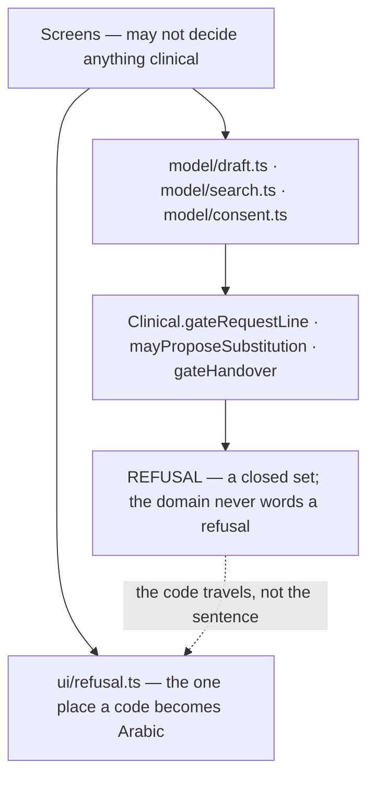

# 10 — Clinical safety

The most important document in this knowledge base. Read every section before
touching anything that could be mistaken for a clinical claim.

---

## 1. The governing principle

> **A partial check a user believes is complete is more dangerous than a stated
> absence.**

This is Blueprint v3 §7, and it is the reason the clinical module is defined by
what it *refuses to do*.

`packages/domain/src/clinical/gates.ts`:

> Blueprint v3 §7 is unusually explicit that Phase 0 performs **NO** automated
> clinical checking. This module therefore contains only refusals and
> authorisations — it never returns "safe", "clear" or "no interactions found",
> **and there is no code path that could.**

```ts
export type GateOutcome = "ALLOWED" | "REFUSED";
```

> There is deliberately no SAFE, no CLEAR and no CHECKED — D16 removed
> interaction checking from Phase 0 entirely, so **a value meaning "we looked and
> it is fine" would be a lie the type system permitted.**

`clinical-engine`'s forbidden list makes it a service-level prohibition:

> **Ever return a clear result; in Phase 0 it returns only ALLOWED or REFUSED,
> never SAFE.**

And `ALLOWED` itself is scoped:

> `ALLOWED` means only *"this line may be created"*. It carries no clinical claim
> whatsoever, **which is why the type is not called `SafetyResult`.**

---

## 2. What Phase 0 does NOT do — the refusal list

Every one of these is a **deliberate exclusion with a decision number**, not an
unbuilt feature. If you are asked to add one, the answer is that it requires a
Blueprint revision, not a pull request.

| Refused capability | Decision | Enforcement |
|---|---|---|
| **Drug interaction checking** | **D16** | `clinical-engine` forbidden: *"Perform any interaction check — Phase 0 has none"*. No code path, no type, no field |
| **Allergy data** | **D17** | Removed **entirely, including from the permission matrix**. There is no row because there is no data. `clinical-engine` forbidden: *"Hold or read allergy data — it does not exist in Phase 0"* |
| **Diagnosis** | §7 | `clinical-engine` responsibility list ends at gates; diagnosis is on the refusal list |
| **Dose calculation / advice** | §7 | Same |
| **Automatic substitution** | §7, D19 | A substitution requires a **verified pharmacist** to propose it and the **patient** to consent per line |
| **Machine-reading a prescription (OCR)** | **D18**, §7 | `media-service` forbidden: *"Machine-read an image"*. The dev server counts the bytes and discards them, logging «not stored (D18)» |
| **Controlled substances** | **D42** | Refused **outright**, at the moment the item is tapped |
| **Stock quantities** | §3 | `marketplace-engine` forbidden: *"Hold stock quantities — Phase 0 has no stock data"* |
| **Prediction of any kind** | **D22** | The record is built from **completed pickups**. Phase 0 predicts nothing |
| **Clinical severity in notifications** | §7 | `notification-service` forbidden: *"Compute clinical severity — Phase 0 has none, and it would eventually disagree with clinical-engine"* |

### The one Phase 3 gate

**D21** — *clinical governance authority and the 2am safety path are Phase 3
prerequisites.* Dawai may not offer clinical advice of any kind until a named
clinical governance authority exists. This is not a scheduling note; it is the
condition on which any future clinical feature depends.

---

## 3. The two gates that DO exist

### 3.1 The prescription gate — D18

**A prescription-required line cannot exist without a prescription image.**

```ts
gateRequestLine(item, hasPrescriptionImage):
  isControlled                             → CONTROLLED_NOT_SUPPORTED   (D42)
  !requestable                             → ITEM_NOT_REQUESTABLE
  requiresPrescription && !image           → PRESCRIPTION_REQUIRED      (D18)
  otherwise                                → ALLOWED
```

Order matters: **controlled is checked first**, so a controlled item is refused
for *being controlled* rather than for lacking a prescription.

Enforced in **four** places, deliberately:

| Where | Layer |
|---|---|
| `model/search.ts` `availability()` | Row-level, so the refusal is visible **before** the tap |
| `model/draft.ts` `add()` | Line creation |
| `model/draft.ts` `validate()` | **Again at send** — §5 rule 1 |
| `request_lines` constraint | `prescription_image_id NOT NULL when the item requires_prescription` |

**Why the gate is asked with different arguments.** At search time and while
drafting it is asked with `hasPrescriptionImage: true`, because the question then
is *"could this ever be requested?"* — *"answering 'no' to a prescription item a
patient is holding the paper for would be wrong."* Only `validate()` asks with
the real value, at send.

### 3.2 The controlled-substance gate — D42

**Controlled items cannot be requested from the app at all.**

The three clinical flags (`requestable`, `requiresPrescription`, `isControlled`)
are carried **on the catalogue row** rather than fetched separately, precisely so
that *"D42 refuses a controlled item at the moment it is tapped, not after a
round trip"*.

`request_lines` carries the constraint: *"item must not be `is_controlled`"*.

---

## 4. The defect that made the gate real

This is the single most important story in this document, from
`infra/catalogue.ts`. It is here because the same class of mistake will be
available again.

The catalogue port's type guard used to check `itemId` and `name` only. But the
gate reads three fields **as plain booleans**:

```ts
if (item.isControlled)  return CONTROLLED_NOT_SUPPORTED   // absent → falsy
if (!item.requestable)  return ITEM_NOT_REQUESTABLE
if (item.requiresPrescription && !image) return PRESCRIPTION_REQUIRED
```

> So a hit carrying `requestable: true` but **missing `isControlled`** was gated
> as **ALLOWED**, and D42's "this cannot be requested from the app" **never fired
> for a controlled medicine.** Missing `requiresPrescription` did the same to D18.
>
> The path that makes this more than theoretical is **the CACHE**. It stores
> whatever a previous version of the app wrote, so a device that upgrades across a
> schema change replays old rows — **with no server in the loop to correct them**
> — straight into the gate.

The fix, and the principle:

> **A row we cannot judge is a row we must not offer.** It is dropped.

`isHit` now requires all three booleans by `typeof === "boolean"` — **absent is
not false.** The same reasoning produced type guards in every other adapter:

| Adapter | What it refuses to guess |
|---|---|
| `infra/catalogue.ts` | A row missing any clinical flag |
| `infra/requests.ts` | An offer line whose `answer` cannot be read; a substitute missing its **name** (which would put «undefined» where a medicine name belongs); a `proposedBy` missing `licenceVerified` — *"an absent flag is not `false`; it is a line whose authority we cannot report"* |
| `infra/marketplace.ts` | A hold missing **any** field. *"A code that does not work at the counter is worse than being told the hold did not go through."* A hold line missing a field refuses **the whole hold** rather than quietly shortening it |
| `infra/media.ts` | A 201 with no `imageId` — *"a success the app cannot use"* |
| `infra/identity.ts` | A 400 with no `attemptsLeft` — because defaulting to 0 told a patient their first wrong digit had exhausted all five attempts |

---

## 5. Who may do what — D19

**Confirming a hold is commercial. Proposing a substitution is clinical.**

```ts
mayConfirmReservation(_staff) → ALLOWED   // unconditional, for any signed-in staff
mayProposeSubstitution(staff) →
  role !== "pharmacist" || !licenceVerified → SUBSTITUTION_REQUIRES_PHARMACIST
```

`mayConfirmReservation` keeps its unused parameter deliberately: *"so the call
site reads the same as its clinical sibling, and so this decision is visible at
the one place a reviewer would look for it."*

**Why v1's stricter rule was worse:**

> v1 required a pharmacist for every confirmation, which no real Iraqi pharmacy
> could honour on an evening shift — **producing an audit log full of
> attestations that were routinely false, which is worse than no control.**

That sentence is the clearest statement of this project's safety philosophy: a
control that cannot be honoured is not a control, it is a lie in the audit log.

**In the pharmacy UI the substitution control is ABSENT, not disabled** — *a
disabled control invites a workaround.*

Database-level: `offer_lines` requires `substitute → authorised_by_staff_id with
a verified pharmacist licence`. `staff` requires `role='pharmacist' → a verified
licence_id`.

---

## 6. Substitution consent — §4 R10

The rule this exists to enforce: **a flag on a row is not consent.**

Registered at **critical** as TD-5 and now resolved. `model/consent.ts`:

| Rule | Implementation |
|---|---|
| **Never pre-ticked** | `begin()` sets every proposal to `undecided`, and **there is no constructor that produces `agreed`** |
| **Per line, not per offer** | Agreeing to one substitution is not agreeing to another |
| **Undecided is not agreement** | `linesToReserve()` excludes refused **and** undecided — *"treating undecided as agreement is the exact failure §4 R10 exists to prevent"* |
| **Refusing loses nothing** | D06 sends the line to the child request, exactly as an out-of-stock line — *"a patient who believes refusing loses the order will agree to a brand they did not want"* |
| **Changeable until acceptance** | *"a patient who agreed and then read the note again must be able to say no"* |
| **Consent does not travel between offers** | Consent held for a different offer counts as **no consent** — *"carrying them across offers would be the app agreeing to a substitution on the patient's behalf"* |
| **Decided in one place** | `Consent.acceptance()` — the reducer had been composing this rule out of four parts, **twice in the same branch**, which is a business rule assembled inside the UI layer (Rule 4) |

### What the patient must be shown before consenting

`Comparison` carries all of it, in the order they need it:

- **what they asked for** — Arabic name **and Latin name**;
- **what is offered instead** — Arabic **and Latin**;
- **the price**;
- **the pharmacist's note, verbatim** — *"the app never paraphrases a clinical
  statement"*;
- **who proposed it and whether their licence is verified**.

That last field is D19 carried through to the patient's eyes. Until it existed:

> R9 showed **a clinical claim with no author** — a patient was asked to accept a
> different medicine on the word of nobody in particular, and had no way to weigh
> it.

`licenceVerified` is **the platform's registration record, never a
self-description**. A screen may say «صيدلي مُجاز» only when it is true; when it
is false **the note still shows, attributed and unqualified**, because hiding an
unverified author is worse than naming one.

**Why the Latin name is required.** *"A patient checking a substitute against a
box, a prescription or another pharmacist needs the Latin one."* And it is
**never fabricated from a transliteration** — *a guessed name is worse than an
absent one on a box.*

---

## 7. The handover checklist — §7 control 2

Three fixed items, all recorded:

```ts
gateHandover(checklist, anyLineRequiresPrescription, staff):
  !allergyAsked || !packsConfirmed        → REFUSED (checklist_incomplete)
  anyLineRequiresPrescription:
    !prescriptionSeen                     → REFUSED (prescription_not_seen)
    staff not a verified pharmacist       → REQUIRES_PHARMACIST
  otherwise                               → ALLOWED
```

`allergyAsked` is a **question the pharmacist asks the patient at the counter**,
recorded as having been asked. It is **not** allergy data — D17 removed that
entirely. The platform stores that the question was asked, never the answer.

`prescriptionSeen` is required **only** when a line was prescription-required,
and **only a verified pharmacist may attest it** — the one place where D19's
clinical/commercial split reappears at handover.

Emits `handover.checklist.recorded` with `prescriptionSeen, allergyAsked,
packsConfirmed`. Audit: **required**.

---

## 8. The medication record — D22

**The most protected data in the system.**

| Property | Enforcement |
|---|---|
| Built **only** from completed pickups | `dispense.recorded` is triggered by `reservation.collected` and by nothing else |
| **One writer, ever** | `clinical-engine`. *"This is its only writer."* |
| **APPEND ONLY** | *"No UPDATE and no DELETE permission is granted to any role"* (§2 invariant 2). `clinical-engine` forbidden: *"Edit or delete a dispense record"* |
| Exactly one per collection | `UNIQUE(reservation_id)` |
| Phase 0 **predicts nothing** | D22 |
| Removed only via account-deletion cascade | D05 |
| Immutable in the table declaration | `imm: "YES"` |

**Who may read it:** self, guardian, and a peer at `view` or `order`.
**Pharmacy staff may not** — the declared test names it: *"A pharmacist reading a
dispense history fails."*

---

## 9. Prescription images — D18, D28

| Stage | Rule |
|---|---|
| **Upload** | Encrypted at rest; **the key reference is stored apart from the object** |
| **Read** | **Only while the branch's reservation is live.** `prescription_access` records `granted_at` / `revoked_at` per `(image, branch, reservation)` |
| **Grant** | `reservation.confirmed` → `prescription.access.granted` with an `expiresAt` |
| **Revoke** | `reservation.collected` / `.expired` / `.cancelled` → `prescription.access.revoked` |
| **Retention** | `pharmacy-app` forbidden: *"Retain a prescription image after its reservation ends"* |
| **Delete** | Hard delete on patient request (M5) or account deletion. `prescription.deleted` → **bytes destroyed** |
| **Audit** | `prescription_images` and `prescription_access` audit **all writes AND all reads** |
| **Never read by a machine** | `media-service` forbidden: *"Machine-read an image"* |

**On the device — D28:** *one rule for clinical data on the device.* The local
cache is encrypted with an OS-backed key, and **sign-out destroys the key and
therefore the cache**. The model assumes a shared phone (D03), so **sign-out is
the boundary**.

---

## 10. Blameless failure language — D37

> **The failure names the fixable condition, never the person.**

`model/prescription.ts`:

| Cause | Says | Action |
|---|---|---|
| dark | «الإضاءة قليلة بالصورة» | «صوّر مرة ثانية بضوء أكثر» |
| blurred | «الصورة مو واضحة» | «ثبّت الكاميرا وصوّر مرة ثانية» |
| cropped | «الورقة مو كاملة بالصورة» | «صوّر الورقة كاملة» |
| upload | «ما وصلت الصورة» | «أعد المحاولة» |

> Every string here describes something the patient can change about the next
> photo. **None of them evaluates the patient, and none claims we read the
> prescription, because Phase 0 does not (D18).**

«الصورة مو واضحة» ("the image isn't clear"), never «صورة سيئة» ("bad photo").

The same principle governs three network-failure paths, each of which had a wrong
first version:

| Failure | Wrong answer that was removed | Why |
|---|---|---|
| `PATCH /v1/me` fails | `DISTRICT_REQUIRED` — «ما اخترت منطقة» | *Telling a patient who DID choose a district that they had not.* **Blaming someone for a network is the one thing this screen must not do** |
| `POST /v1/offers/{id}/accept` fails | D39's V4 «ما كدرت الصيدلية تثبّت الحجز» | *Would be the app inventing a rejection nobody made* |
| `POST /v1/auth/verify` fails | E6's «الرمز مو صحيح» | True of exactly one of E6's four failures, and not of this one |

And E12's out-of-coverage message: *"Not an error the patient made. We have not
arrived there yet, and that is our failing rather than theirs."*

---

## 11. The clinical layer boundary



Rule 4: the UI never makes a business decision. `model/draft.ts` `add()` **asks**
the gate and returns the domain's `Refusal` unchanged; the screen **words** it.
`tools/layer-check.mjs` fails a build where a screen re-implements a rule.

---

## 12. The clinical safety checklist for any change

Before you merge anything that touches a medicine, a prescription, a
substitution or a dispense:

- [ ] Does anything I added return a value that could be read as "safe" or
      "checked"? If so, remove it.
- [ ] Does anything claim to have **read** a prescription image? (D18 — nothing
      may.)
- [ ] Did I add a field the clinical gate reads? If so, is it in the **type
      guard** of every adapter that can produce it — including from **cache**?
- [ ] Does a missing field default to a permissive value anywhere? (Absent is not
      `false`.)
- [ ] Is a clinical action attributed to a **named, licence-verified** person?
- [ ] Is a substitution decision **per line, defaulting to undecided**, and does
      refusing cost the patient nothing?
- [ ] Is my failure message about a **condition**, not a person? (D37)
- [ ] Am I reporting a **network failure as a refusal**? (Never.)
- [ ] Does anything write, update or delete a `DispenseRecord` outside
      `clinical-engine` on collection?
- [ ] Does anything extend prescription image access beyond a live reservation?
- [ ] Does a countdown derive from a **device** clock? (Server time only.)
- [ ] If I could not implement it correctly, is it in the **debt register** with
      its impact stated?
