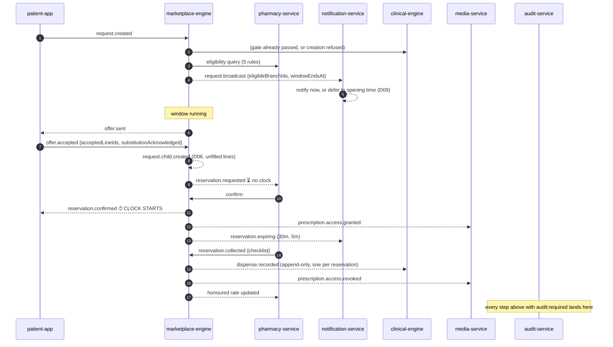

# 15 — Events

The 54 declared domain events, the 12 client telemetry events, and the rules
that govern both.

Authority: `docs/technical/model.js` (`TECH.events`) and
`docs/technical/04-event-architecture.html`.
Client set: `platform/packages/observability/src/telemetry.ts`.

---

## 1. The rules

Every declared event carries **eight** fields, and the last four are the ones
people forget:

| Field | Meaning |
|---|---|
| `n` | Name — `noun.verb`, past tense |
| `p` | **Producer — exactly one service** |
| `c` | Consumers |
| `bp` | Blueprint reference |
| `payload` | Fields carried |
| `trigger` | What causes it |
| `side` | **The side effect it is responsible for** |
| `audit` | `required` / `not-required` |
| `retry` | `at-least-once` / `best-effort` / `none` / `n/a — synchronous` |
| `idem` | **The idempotency key that makes at-least-once safe** |

Four consequences:

1. **One producer per event.** Two producers is two sources of truth about the
   same fact.
2. **`at-least-once` plus an idempotency key** is the delivery contract. An
   at-least-once event with no `idem` field would be a duplicate waiting to
   happen — and `account.deleted` says so explicitly:
   *"at-least-once, must be idempotent."*
3. **`audit: required` means the audit-service consumes it and the entry is
   append-only.** Retention and accountability are event-driven, not batch.
4. **`best-effort` is used only where a lost event costs nothing** —
   `search.unmatched`, `notification.sent`, `reservation.expiring`,
   `watch.expired`.

---

## 2. Identity — 13 events (`identity-service`)

| Event | Trigger | Side effect | Audit |
|---|---|---|---|
| `account.created` | Phone verification succeeds | **Self Subject created atomically** | ✅ |
| `account.deletion.scheduled` | Deletion confirmed with a **typed word** | **30-day timer armed; signing in cancels it** | ✅ |
| `account.deleted` | 30-day window elapses | Images deleted · reservations **pseudonymised** · **audit actor tombstoned** | ✅ |
| `subject.created` | Account created, or a guardian adds a person | — | ✅ |
| `subject.claimed` | Claim invite verified | **Guardianship ENDS; a revocable PeerGrant is created for the former guardian** (D01) | ✅ |
| `subject.memorialised` | Guardian or platform records a death | **Watches stopped, new requests blocked, all grant holders notified** | ✅ |
| `subject.memorialisation.reversed` | Reversal within 30 days | Prior state restored | ✅ |
| `guardianship.transferred` | Receiver accepts | **Authority moves in full** | ✅ |
| `grant.invited` | Invite sent | **SMS dispatched; nothing granted** | ✅ |
| `grant.requested` | Invitee signs in, or a peer requests access | Subject asked to approve | ✅ |
| `grant.activated` | Subject approves | Access begins | ✅ |
| `grant.revoked` | Subject or guardian revokes | **Access ends immediately; the record of the grant remains** | ✅ |
| `grant.expired` | 7 days without approval | — | ✅ |

Two payload details worth noting: `account.deletion.scheduled` carries
`dependentDisposition[]` — **D05's explicit per-subject choice travels with the
event**, so no consumer has to guess. And `subject.claimed` carries
`formerGuardianAccountId`, because the grant created for them is part of the same
transaction.

---

## 3. Catalogue — 3 events (`catalogue-service`)

| Event | Trigger | Side effect |
|---|---|---|
| `catalogue.item.published` | Operator publishes | **Matching Watches evaluated** |
| `catalogue.item.withdrawn` | Operator withdraws | **Open request lines for it are closed and the patient told** |
| `search.unmatched` | A search returns nothing | **Recorded — the only search data retained** (D29) |

`catalogue.item.published` carries `packSize, requiresPrescription, isControlled`
— the three clinical flags, because a consumer that has the item must be able to
gate it without a second call.

`search.unmatched` is `audit: not-required`, `retry: best-effort`, and idempotent
on **`term+district+day`** — one entry per term per district per day, not one per
keystroke.

> ⚠️ **BD-4.** There is **no table**. *D29 says the term is stored but not for how
> long or against what*, so **the retention promise is unverifiable and O10 cannot
> be built.**

---

## 4. Marketplace — 15 events (`marketplace-engine`)

| Event | Trigger | Side effect | Idempotency |
|---|---|---|---|
| `request.created` | Patient confirms a request | **Clinical gate already passed, or creation refused** | client `Idempotency-Key` |
| `request.broadcast` | Eligibility evaluated | Branches notified **now, or deferred to opening time (D09)** | `requestId+broadcastRound` |
| `request.unanswered` | Window elapses with no offer | Patient offered **widen / watch / retry** | `requestId` |
| `request.child.created` | An offer covering a subset is accepted | **Child request broadcast; the patient re-enters nothing** (D06) | `parentRequestId+lineSet` |
| `offer.sent` | Branch sends an answer | Coverage recomputed; **observed availability updated** | client key |
| `offer.withdrawn` | Branch withdraws **before acceptance** (D08) | Removed from comparison; **a patient mid-tap is told** | `offerId` |
| `offer.accepted` | Patient accepts | **Reservation requested; price binds; child request created for the rest** | client key |
| `reservation.requested` | Offer accepted | Branch asked to confirm. **No clock yet** | `offerId` |
| **`reservation.confirmed`** | **Any signed-in staff member confirms (D19)** | **CLOCK STARTS; prescription access granted for the window** | `reservationId` |
| `reservation.refused` | Branch cannot hold | **Parent request re-opens automatically; counts against honoured rate unless within 5 minutes** | `reservationId` |
| `reservation.expiring` | **30 and 5 minutes** before expiry | Patient notified | `reservationId+threshold` |
| `reservation.expired` | Window elapses | **Stock released; prescription access revoked** | `reservationId` |
| `reservation.cancelled` | Patient cancels | **Branch told immediately**; stock released; access revoked | `reservationId` |
| `reservation.collected` | Code verified and handover completed | **clinical-engine writes the DispenseRecord; honoured rate updated; access revoked** | `reservationId` |
| `price.dispute.raised` | Patient reports a difference | Recorded against the branch and surfaced to the operator | `reservationId` |

**`request.broadcast` carries `eligibleBranchIds[]` and `windowEndsAt`** — the
window is the server's answer, and the client reads it rather than computing
which of D09's three applies.

**`reservation.refused` carries `secondsSinceConfirm`** — the field that makes
D11's five-minute grace computable by a consumer.

> ⚠️ **BD-2.** `price.dispute.raised` is modelled **as an event only**, because
> D31 names the routing — but there is no persisted entity and no state machine,
> so a dispute *accumulates and never resolves*, and whether it affects the
> honoured rate (which D11 defines without it) is unanswered. **O22 cannot be
> built.**

---

## 5. Clinical — 5 events (`clinical-engine`)

| Event | Trigger | Side effect | Retry |
|---|---|---|---|
| `clinical.gate.refused` | A request line violates a gate | **Line creation refused with the reason shown** | `n/a — synchronous` |
| `substitution.authorised` | A **licensed pharmacist** proposes a substitute | OfferLine may carry a substitute | synchronous |
| `substitution.refused` | No licensed pharmacist is signed in | **The substitution control is ABSENT, not disabled** | synchronous |
| `handover.checklist.recorded` | Handover completes | — | at-least-once |
| **`dispense.recorded`** | **`reservation.collected`** | **The medication record grows. This is its only writer** (D22) | at-least-once, `reservationId` |

Four of the five are **synchronous** — they are gate outcomes, not asynchronous
facts, and they carry no retry semantic because there is nothing to retry.

`clinical.gate.refused` carries `reason(prescription_required|controlled)` — the
two Phase 0 gates and no third.

`dispense.recorded` is idempotent on `reservationId`, which is the same key as
`UNIQUE(reservation_id)` on the table: **one collection, one record, whatever the
delivery does.**

---

## 6. Media — 4 events (`media-service`)

| Event | Trigger | Side effect |
|---|---|---|
| `prescription.uploaded` | Patient uploads | **Encrypted at rest** |
| `prescription.access.granted` | **`reservation.confirmed`** | **Branch may read it while the reservation is live** (D18) |
| `prescription.access.revoked` | Reservation collected, expired **or** cancelled | Branch access ends |
| `prescription.deleted` | Patient deletes, or account deleted | **Bytes destroyed** |

All four are `audit: required` — and `prescription_images` / `prescription_access`
audit **reads** as well as writes.

**This quartet is how D18 becomes real at runtime.** Access is not a permission
check evaluated at read time; it is a *granted and revoked fact*, driven by the
reservation lifecycle, with a row recording when each happened.

---

## 7. Pharmacy — 8 events (`pharmacy-service`)

| Event | Trigger | Side effect |
|---|---|---|
| `branch.verified` | Operator approves | **Branch becomes routable** (carries `verifiedPoint` — D10) |
| `branch.suspended` | Operator suspends | Routing stops; **live reservations must be resolved first** |
| `branch.closed` | Manager closes the branch | Routing stops; **export offered before closure completes** (D15) |
| `branch.eligibility.changed` | Hours, pause, capacity or licence change | **Routing set updated; the branch is told why** (D13) |
| `licence.expiring` | Scheduled check | Branch warned at **60 / 30 / 7** days |
| `licence.lapsed` | Expiry reached | **Routing stops; live reservations are honoured** |
| `staff.invited` | Manager invites | SMS dispatched |
| `staff.role.changed` | Manager changes a role | **Pharmacist role takes effect only with a verified licence** |

`branch.eligibility.changed` is the only pharmacy event with
`audit: not-required` — it fires on every hours boundary and would otherwise
flood the audit log with facts that are already state.

---

## 8. Notifications — 4 events (`notification-service`)

| Event | Trigger | Retry |
|---|---|---|
| `notification.sent` | A consumed event matches preferences | best-effort |
| `notification.suppressed` | Blocked by a rule — `quiet_hours \| disabled \| branch_closed` | **none** |
| `watch.matched` | An offer or publication matches an active watch | **Watch fires and closes** |
| `watch.expired` | 14 days elapse | best-effort |

**`notification.suppressed` is a first-class event**, which is unusual and
deliberate: a notification that was *not* sent is a fact an operator needs, and
`branch_closed` is D09's deferred-notification rule leaving a trace.

`notification-service` consumes **eleven** events and produces four. Its
prohibitions matter as much as its behaviour:

- **May not compute clinical severity** — *Phase 0 has none, and it would
  eventually disagree with clinical-engine.*
- **May not notify a branch outside its opening hours**, except for a reservation
  it already confirmed (D09).
- **May not send anything for engagement.**
- **May not contain a category that cannot be disabled** — Phase 0 has no safety
  category (M6).

> ⚠️ **BD-8.** Push requires a **device registration entity the ERD does not
> contain**, and D35 removed the premium capabilities without stating the
> delivery fallback. **Push is unimplementable until answered; every
> notification-dependent flow degrades to in-app only.** In `platform/` today
> that degradation is TD-21's 3-second poll.

---

## 9. Platform — 2 events

| Event | Producer | Trigger | Audit |
|---|---|---|---|
| `api.request.received` | `api-gateway` | **Every authenticated request** | **required for identified reads** |
| `audit.appended` | `audit-service` | Any append | *n/a — it is the audit* |

`audit.appended` is consumed by `owner-console` and **projected into the patient
and branch access logs** — S12, P26, O23/O24 are three views of one append-only
stream.

`audit-service` consumes `"*"` and depends on **nothing**. That is deliberate: an
audit that depends on a service it audits can be starved by it. It **applies
backpressure rather than dropping an entry.**

---

## 10. Event flow for the core loop



**The refusal branch:** `reservation.refused` → parent request re-opens
automatically (D39) → prescription access revoked → honoured rate updated
**unless** `secondsSinceConfirm <= 300` (D11).

---

## 11. Client telemetry — the closed set

`packages/observability/src/telemetry.ts`. **Twelve** names.

> Closed on purpose: **adding one is a deliberate act with a Blueprint reference,
> not a line in a handler.** Blueprint v3 §3 defines four exit criteria for Phase
> 0 and puts the screens that measure them **inside** Phase 0. Those measurements
> need events, and the set is closed **so that a metric can never be computed from
> an ad-hoc counter somebody added in a controller.**

| Constant | Name | Feeds |
|---|---|---|
| `REQUEST_BROADCAST` | `request.broadcast` | **O12 fill rate** — the first exit criterion |
| `OFFER_SENT` | `offer.sent` | O12 |
| `REQUEST_ANSWERED` | `request.answered` | **O14 answer time** — median under 15 s |
| `REQUEST_UNANSWERED` | `request.unanswered` | O12 |
| `RESERVATION_CONFIRMED` | `reservation.confirmed` | **O13 honoured rate** — the trust metric |
| `RESERVATION_REFUSED` | `reservation.refused` | O13 |
| `RESERVATION_COLLECTED` | `reservation.collected` | O13 |
| `RESERVATION_EXPIRED` | `reservation.expired` | O13 |
| `DISPENSE_RECORDED` | `dispense.recorded` | **O15 repeat rate** — *the gate that tests the strategy's riskiest belief before Phase 2 is built on it* (D23) |
| `BRANCH_EXCLUDED_FROM_ROUTING` | `branch.excluded` | The branch eligibility panel and coverage |
| `CLINICAL_GATE_REFUSED` | `clinical.gate.refused` | Clinical gate observability |
| `SEARCH_UNMATCHED` | `search.unmatched` | Catalogue growth (§13.1) |

### The attribute rule

```ts
type TelemetryRecord = { event, at, correlationId, attributes }
```

> **Attributes are dimensions, never content. A district id is a dimension; a
> medicine name is content and does not belong here.**

Restated in the composition root: *"a record carries the event, when, a
correlation id and dimensions. Never content."*

### Emission is validated at the boundary

```ts
emit: (event, attributes) => {
  if (!Object.values(BUSINESS_EVENT).includes(event))
    host.log({ level: "error", message: "unregistered telemetry event", event });
  else host.log({ level: "info", message: event, attributes });
}
```

> The closed set is the contract (§8). **A name outside it is a defect in the
> caller, and saying so is more useful than sending it.**

### What the patient app emits today

| Event | Where | Precision that matters |
|---|---|---|
| `search.unmatched` | F2 | **On `empty` only, never on `error`.** *Counting a dropped connection as a missing medicine would send the catalogue team after items that exist* |
| `clinical.gate.refused` | R1 | With `code` and `item` |
| `request.broadcast` | R6 | **Only when the request is actually broadcast, never when queued.** *Counting a queued request as broadcast would inflate O12 fill rate with requests no pharmacy has seen* |
| `request.answered` | R7 | **On the FIRST offer only.** *That is the moment the wait stops being open-ended; later ones update the list silently* |
| `reservation.confirmed` | V2 | With `branch` |
| `reservation.refused` | V4 | With `reopened` |

The screen contracts declare which events each screen may emit
(`telemetry: [...]`), so the emission points are auditable from the contracts
alone.

---

## 12. Event-related gaps

| Gap | Effect |
|---|---|
| **BD-2** | `price.dispute.raised` has no entity — disputes accumulate and never resolve |
| **BD-4** | `search.unmatched` has no table — D29's retention promise is unverifiable |
| **BD-8** | No device registration — **push is unimplementable**; every notification-dependent flow degrades to in-app only |
| **TD-21** | In `platform/`, offers arrive by polling; **the app must be open and on screen** for a patient to learn anything |
| **TD-1** | No server exists in `platform/`, so **no server-side event is produced at all** — the telemetry above is logged to the console |
