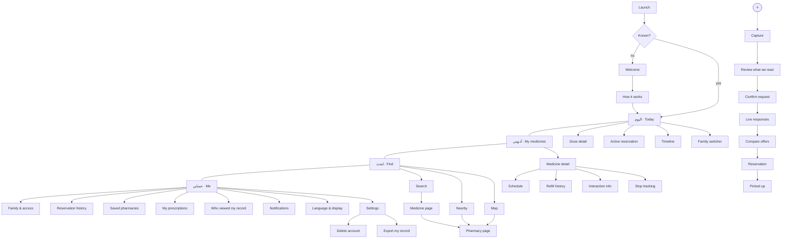
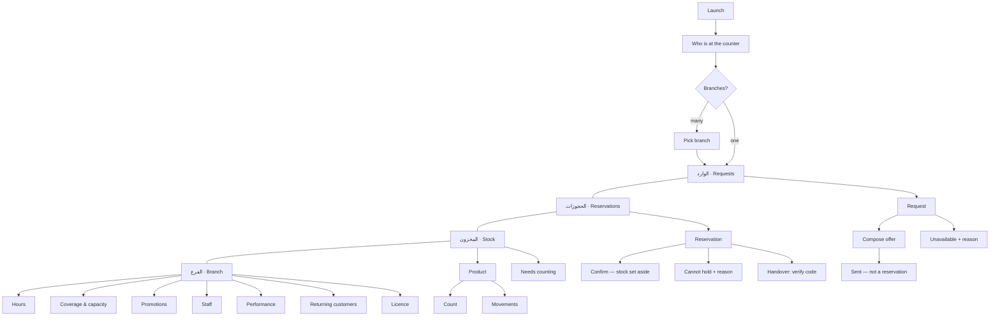
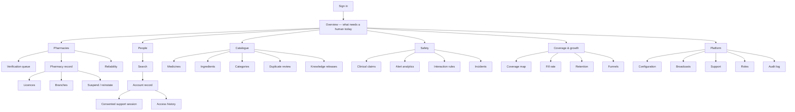
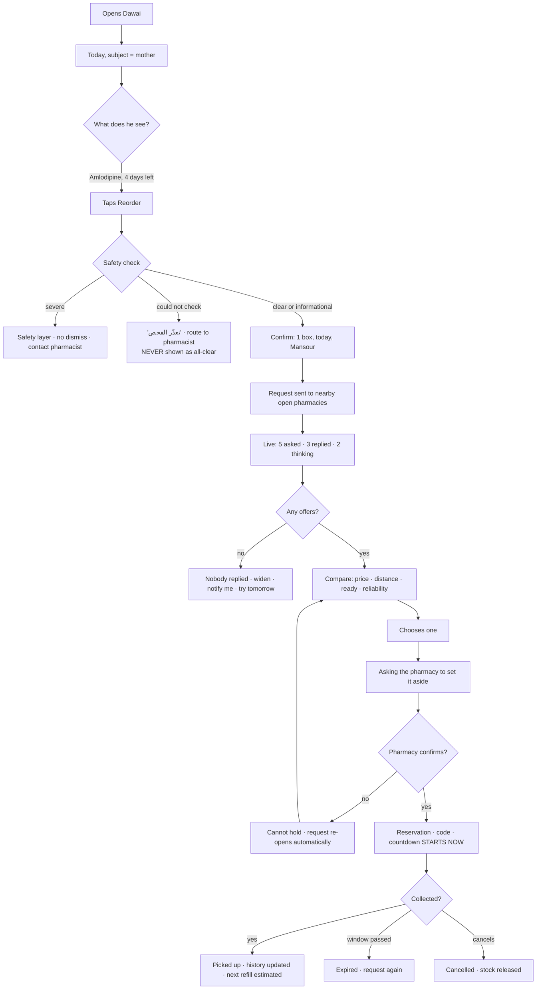
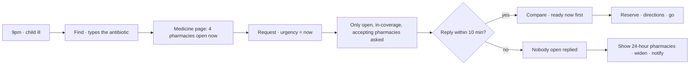
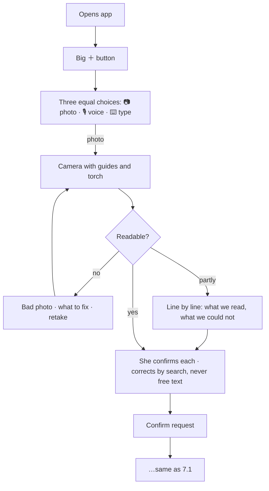
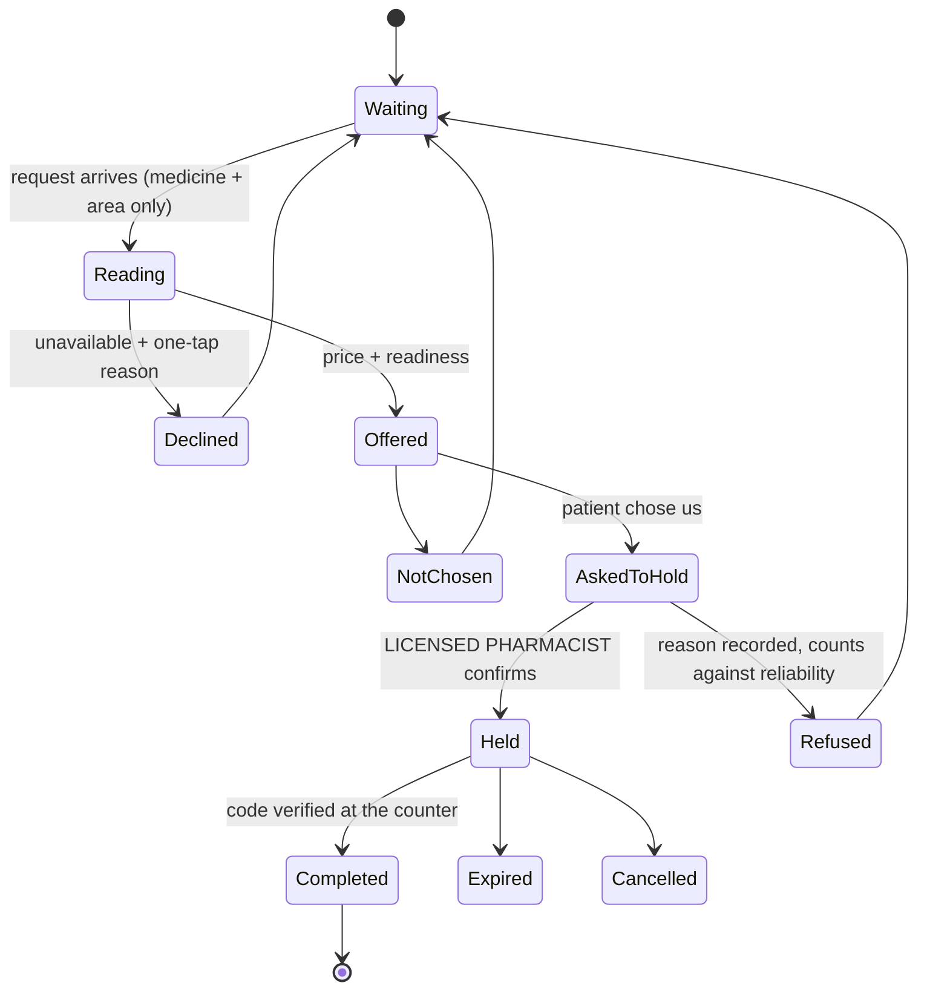
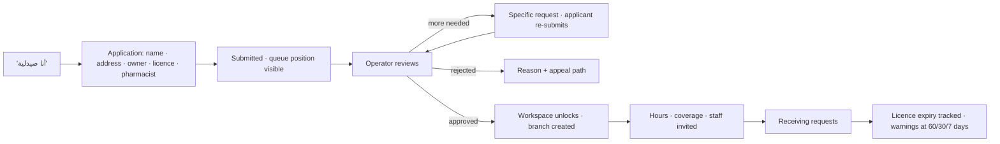
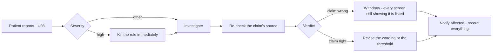
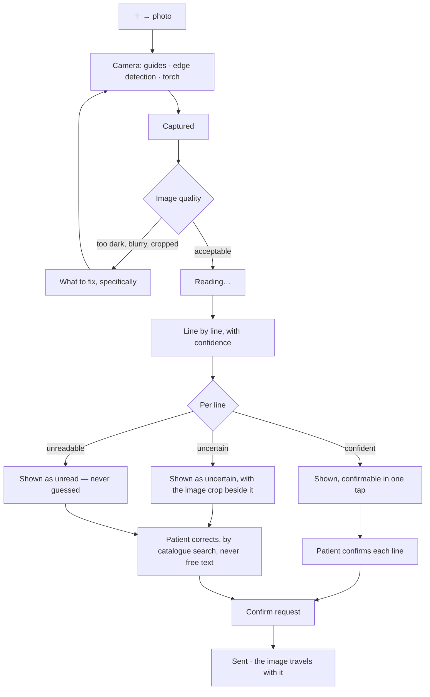

# Dawai — Product Blueprint v1.0

**Status: draft — NOT ready to build from.**
**This document contains no code and no technical decisions.**

> An independent review by 25 agents that had not seen the author's reasoning
> found **20 confirmed defects** and **23 further gaps** the reviewers
> themselves missed. Its verdict: *"an outstanding decision document and an
> incomplete specification."* Read
> [`review/INDEPENDENT_REVIEW.md`](review/INDEPENDENT_REVIEW.md) before acting
> on anything here — in particular §3, §6, §11, §17 and §28, which change
> materially once the ten decisions in that review's Part 7 are answered.

It is the single reference that answers every question about what the product
does and how it behaves. Architecture is written *after* this is approved, and
is derived *from* it.

### What this document deliberately does not decide

Named here so they cannot be decided by accident inside a paragraph:

- How many applications there are (one, two, three, or web plus mobile)
- What the client is built with
- How data is stored, transported, or cached
- What anything is called in a database

The blueprint speaks of three **experiences** — Patient, Pharmacy, Owner. How
those experiences are packaged is an architecture question, answered later,
using the requirements below as its input.

### Contents

| § | Section |
|---|---|
| 1 | [Product Vision](#1-product-vision) |
| 2 | [Personas](#2-personas) |
| 3 | [Identity Model — the questions that were never answered](#3-identity-model) |
| 4 | [Information Architecture](#4-information-architecture) |
| 5 | [Navigation Map](#5-navigation-map) |
| 6 | [Screen Inventory](#6-screen-inventory) |
| 7 | [User Flows](#7-user-flows) |
| 8 | [Onboarding](#8-onboarding) |
| 9 | [Search Strategy](#9-search-strategy) |
| 10 | [Pharmacy Discovery](#10-pharmacy-discovery) |
| 11 | [Medicine Reservation Flow](#11-medicine-reservation-flow) |
| 12 | [Prescription Upload Flow](#12-prescription-upload-flow) |
| 13 | [When the medicine does not exist](#13-when-the-medicine-does-not-exist) |
| 14 | [Patient Dashboard](#14-patient-dashboard) |
| 15 | [Pharmacy Dashboard](#15-pharmacy-dashboard) |
| 16 | [Owner Dashboard](#16-owner-dashboard) |
| 17 | [Permission Matrix](#17-permission-matrix) |
| 18 | [Feature Matrix](#18-feature-matrix) |
| 19 | [Data Ownership](#19-data-ownership) |
| 20 | [Notification Strategy](#20-notification-strategy) |
| 21 | [Offline Strategy](#21-offline-strategy) |
| 22 | [Empty States](#22-empty-states) |
| 23 | [Error States](#23-error-states) |
| 24 | [Edge Cases](#24-edge-cases) |
| 25 | [Design System](#25-design-system) |
| 26 | [Native Components](#26-native-components) |
| 27 | [Animations](#27-animations) |
| 28 | [Release Plan](#28-release-plan) |
| 29 | [Open Questions](#29-open-questions) |

---

## 1. Product Vision

### The sentence

**Dawai tells you which nearby pharmacy has your medicine, and holds it for
you — so you stop making eleven phone calls.**

### The problem, precisely

A patient in Baghdad needs a medicine. Today they phone pharmacies one by one,
or walk between them. For a chronic condition this repeats every month. For an
elderly parent, an adult child does it on their behalf. Nobody knows what is in
stock anywhere, including the pharmacies themselves.

The pharmacist has the mirror problem: the phone rings all day with "do you
have X", each call interrupting a customer standing at the counter.

**Both sides lose the same thing: time spent discovering availability.** That
is the market.

### What Dawai is

A **clinical record with a fulfilment loop attached** — in that order. The
medication history is the durable asset; the reservation is the daily reason to
open the app.

Ordering it the other way produces a marketplace that competes on price and
dies. Ordering it this way produces something a patient keeps for years.

### What Dawai is not, and will not become

| Not | Because |
|---|---|
| A delivery service | Delivering prescription medicine is a different legal product with a different regulatory profile |
| A payment platform | Introducing money changes what we are regulated as; it comes after the loop is proven |
| A diagnosis tool | We do not practise medicine |
| A dose calculator | Same |
| A pharmacy ERP | Pharmacists have no time to feed a stock system; every platform that demanded it died |
| A telemedicine service | Different product, different licensing |
| A prescription issuer | Different product entirely |

### Success, measured

| Horizon | Measure | Target |
|---|---|---|
| Immediate | A request receives at least one offer | ≥ 80% within 5 minutes |
| Immediate | Time from pharmacist opening a request to answering | median < 15 seconds |
| Short | A confirmed hold results in a successful pickup | ≥ 95% |
| Short | Patient repeats within 60 days | ≥ 50% of chronic users |
| Long | Phone calls a chronic patient makes per refill | from ~6 to 0 |
| Long | Pharmacies that open the app on a busy day | ≥ 70% of registered |

**The one that matters most is the third.** A confirmed hold that is not
honoured destroys more trust than ten unanswered requests.

### The five product principles

1. **Reduce anxiety, not clicks.** The patient is worried. Speed matters only
   because waiting is frightening.
2. **Never make the pharmacist a data-entry clerk.** Every feature is measured
   against the seconds it costs them.
3. **Say what we do not know.** "We could not check" is an answer. Silence
   pretending to be reassurance is not.
4. **The record belongs to the patient.** They can read it, export it, and see
   who else read it.
5. **Density before geography.** Twenty pharmacies in one district that reliably
   answer beat two hundred spread thinly. This is a product constraint, not an
   ops preference.

---

## 2. Personas

### P1 — Um Ali, 63, chronic

Takes Amlodipine, Metformin, and a statin. Reads Arabic, does not read Latin
script confidently. Holds the phone at arm's length. Uses WhatsApp fluently and
nothing else. Her daughter installed the app.

- **Wants:** to not run out, and to not be a burden.
- **Fears:** pressing the wrong thing, being charged, being seen as unable to
  manage.
- **Fails when:** text is small, Latin drug names are the only label, a screen
  has more than one decision, an error blames her.
- **Design consequence:** photograph and voice before typing; large targets;
  Arabic-first naming with Latin secondary; one decision per screen.

### P2 — Hussein, 34, the son

Works. Manages his mother's medicine and his own. He is the person who actually
opens the app most days.

- **Wants:** to handle it in under a minute, from work.
- **Fears:** finding out too late that she ran out.
- **Fails when:** switching between his record and hers is buried; a
  notification does not say who it is about.
- **Design consequence:** **the family switcher is a primary control, not a
  setting.** Every notification names the subject.

### P3 — Zainab, 28, acute need

Her child has an infection at 9pm. She needs a specific antibiotic tonight.

- **Wants:** to know who is open right now and has it.
- **Fears:** driving somewhere closed or out of stock.
- **Fails when:** hours are wrong, an offer comes from a closed pharmacy, or
  "available" turns out to mean "probably".
- **Design consequence:** open/closed is load-bearing; an offer must state
  readiness; urgency is an explicit input.

### P4 — Ahmed, 41, the pharmacist-owner

Owns one branch, employs two assistants. Behind the counter, one hand free,
customer waiting, phone ringing.

- **Wants:** fewer phone calls; customers who arrive knowing the price.
- **Fears:** committing stock he does not have; being compared on price alone;
  another system to maintain.
- **Fails when:** answering takes more than a few taps, or the app demands stock
  counts.
- **Design consequence:** answer in under 15 seconds; declining is one tap;
  **no quantity field, ever**.

### P5 — Noor, 24, the assistant

Works the counter. Not a licensed pharmacist. High turnover in this role.

- **Design consequence:** the workspace is shared and multi-user; some actions
  require a licensed pharmacist and the app must make that boundary obvious
  rather than punitive.

### P6 — The operator (you)

Runs the platform. Verifies pharmacies, curates the medicine catalogue, handles
support, watches coverage, responds to safety incidents.

- **Wants:** to see everything and prove every action.
- **Fears:** discovering a problem from a user rather than from the console.
- **Design consequence:** the Owner experience is a triage and accountability
  tool, not a vanity dashboard.

### Anti-persona — who we are not building for

- **The price shopper** who wants the cheapest medicine in the city. Serving
  them turns pharmacies into commodities and they stop answering.
- **The pharmacy chain wanting a full ERP.** Different product.
- **The tourist.** Every assumption here is about repeat, local, chronic use.

---

## 3. Identity Model

*Answering the questions the previous document skipped.*

### 3.1 Who is the first user when Dawai opens?

**A guest.** Not a patient, not a pharmacy — a person who has not told us
anything yet.

A guest can:

- Search the medicine catalogue
- Browse nearby pharmacies and see hours and distance
- Read a medicine page
- See how the product works

A guest cannot:

- Create a request
- Upload a prescription
- Have any record

**Why a guest state exists at all:** demanding a phone number before showing
value is the single largest install-to-abandon cause in this category. The
first screen must demonstrate worth before asking for anything.

### 3.2 How does a guest become a patient?

**By needing something, not by signing up.**

```
Guest browses  →  taps "reserve" or "upload prescription"
               →  we ask for a phone number, once, at the point of need
               →  OTP
               →  the request continues from exactly where it was
```

Rules:

1. **Never interrupt with a sign-up wall on launch.** The account is requested
   at the first action that requires one, with the reason stated: *"نحتاج رقمك
   حتى نخبرك عندما ترد الصيدليات."*
2. **The pending action survives authentication.** Losing the user's request
   because they had to authenticate is unforgivable and is the most common
   version of this mistake.
3. **A patient is not a separate role.** Any authenticated account is a
   patient. There is no "become a patient" step — you simply have a record.
4. A record is created empty and fills as they use the product. There is no
   medical-history questionnaire at the start; nobody completes it honestly.

### 3.3 How does a user become a pharmacy?

**A pharmacy is an organisation, not a role on a person.** The distinction
matters: staff join and leave, the pharmacy persists.

```
Applicant  →  "أنا صيدلية" (from the guest surface or a direct link)
           →  application: pharmacy name, address, owner, licence documents,
              the licensed pharmacist's credential
           →  status: SUBMITTED — visible to the applicant, with a queue position
           →  operator review (see §16)
           →  status: VERIFIED  |  NEEDS_INFO  |  REJECTED (with reason + appeal)
           →  on VERIFIED: pharmacy workspace unlocks, branch created,
              staff can be invited
```

Non-negotiable rules:

1. **An unverified pharmacy cannot receive requests, send offers, or hold
   stock.** It can only complete its application.
2. **The person who applies is not automatically the licensed pharmacist.**
   Owner and pharmacist are separate credentials; one person may hold both, but
   the system records them separately, because the pharmacist is the one who
   takes clinical responsibility.
3. **Verification expires.** A licence has an expiry date; the system tracks it
   and warns at 60, 30, and 7 days. Verification that happens once is wrong
   within a year.
4. **A person can hold a patient record and work at a pharmacy.** These are two
   memberships of one human, never merged into a hybrid interface. The
   experiences stay separate.

### 3.4 What are the Owner's real powers?

The honest answer is narrower than "everything", and it should be.

**The Owner can:**

| Power | Constraint |
|---|---|
| Verify, suspend, reinstate a pharmacy | Reason recorded; applicant notified; appealable |
| Curate the medicine catalogue | Changes versioned; clinical entries need clinical sign-off |
| Publish and withdraw clinical knowledge | Two-person for withdrawal; screens rendering a withdrawn claim are detectable |
| Send broadcast notifications | Two-person; throttled; a kill-switch exists |
| Open a support session on a user's account | **Only with the user's consent**, time-boxed, with a banner the user sees, fully logged, and visible in that user's own access log |
| Deactivate an account | Reversible for 30 days |
| Read the audit log | Cannot modify it |
| Manage roles and feature configuration | Two-person for anything reaching all users |

**The Owner cannot, and there is no mechanism to:**

- Edit or delete anything in a patient's clinical record
- Read an identified clinical record without consent and a logged reason
- Silently view as a user
- Alter the audit log
- Change history

> **The principle: the Owner acts on the system, never inside a patient's
> record.** A correction is *requested*, and appears in the record as a new,
> attributed entry. An operations console with a direct write path into medical
> history is an audit failure waiting for a court date.

### 3.5 Account states

| State | Meaning | Can |
|---|---|---|
| `guest` | No identity | Browse, search |
| `pending_otp` | Number given, not verified | Nothing yet |
| `active` | Verified account | Everything a patient can |
| `pharmacy_applicant` | Also applied as a pharmacy | Patient things + track the application |
| `pharmacy_member` | Staff at a verified pharmacy | Patient things + the pharmacy workspace, per staff role |
| `suspended` | Blocked | Read own record, export, contact support |
| `deletion_scheduled` | 30-day window | Cancel deletion by signing in |
| `deleted` | Gone | — |

---

## 4. Information Architecture

### The organising principle

The prototype organised by object type — medicines here, orders there. That is
how a database is arranged, not how a worried person thinks.

**Everything here is organised by the question the user is asking.**

| Experience | Questions, in the order they arise |
|---|---|
| Patient | What do I do now? · What am I taking? · I need something · Who am I, and who can see me? |
| Pharmacy | Is anything waiting? · What have I committed to? · What do I have? · How is my branch set up? |
| Owner | What needs a human today? · Who supplies? · Who uses? · What do we know? · Is it safe? · Is it working? · How is it set up? |

Nothing becomes a primary destination unless it answers a question a user
actually has on arrival.

### The concepts, in the user's words

These are product concepts. They are named as users name them.

| Concept | Arabic | Definition | Commonly confused with |
|---|---|---|---|
| Subject | الشخص | Whose medicine this is | The account holder — frequently a different person |
| Medicine | الدواء | An entry in the catalogue: what exists in the world | A medication |
| Medication | دوائي | *This subject takes that medicine* | A medicine |
| Schedule | المواعيد | When it is taken | A reminder |
| Dose event | الجرعة | A single taking, recorded | A schedule |
| Request | الطلب | "I need this" — broadcast to nearby pharmacies | A reservation |
| Offer | العرض | A pharmacy's reply: price and readiness. **Commits nothing.** | A reservation |
| Reservation | الحجز | A pharmacy has physically set stock aside. **A clock starts.** | An offer |
| Pickup | الاستلام | Collected at the counter | — |
| Movement | حركة مخزون | A change in stock, recorded as it happens | A stock count |
| Count | جرد | A physical recount, which may agree with the record | A correction |
| Grant | الوصول | Permission for a family member to see or act | Sharing |

> **Offer ≠ Reservation is the most important distinction in the product.** An
> offer promises nothing. A reservation commits physical stock and starts a
> clock. Collapsing them produces the patient arriving to *"ما عندي"* — the
> failure that ends the company.

### Content hierarchy — Patient home

Ordered by urgency, derived and never authored:

1. Safety requiring action
2. A reservation with a running clock
3. A dose due now
4. Something running out inside its reorder window
5. Awaiting your decision — a family request, offers to compare
6. Everything else, collapsed

**No recommendations, no promotions, no "for you" card on this surface.** It is
a work surface; anything that is not the user's own business dilutes it.

### Naming rules

| Rule | Reason |
|---|---|
| Use the user's word | «حجز» not "reservation record" |
| One concept, one word, everywhere | The same thing called "order" on one screen and "reservation" on another is two things to the user |
| Never claim state endorsement | *«من صيدلية موثّقة في دوائي»* — never *«موثّق حكومياً»*. A legal boundary, not a copy preference. |
| Say precisely what stopped | "Stop tracking" ends a reminder, not a medication. Blurring this is a clinical risk. |
| State uncertainty out loud | *«تعذّر الفحص»* is an answer. Silence is not. |

---

## 5. Navigation Map

### Rules that apply to all three experiences

1. **A primary destination is a place, never an action.** Anything that creates
   something is a floating action or a sheet.
2. **Three levels deep, maximum.** Deeper means the information architecture is
   wrong, not that another back button is needed.
3. **A modal returns where it opened.** It never leads into a primary
   destination.
4. **Safety is a layer, not a place.** A severe alert sits above everything,
   cannot be reached by going back, and does not participate in navigation.
5. **Each destination remembers its own position.** Leaving and returning
   restores where you were.
6. **A notification opens a full path, not a bare screen.** Landing on a detail
   with no parent traps the user.

### Patient



**Four destinations, argued:**

- **Today** — the only screen most users need most days.
- **My medicines** — the durable asset; the reason to stay after the errand.
- **Find** — the errand itself.
- **Me** — identity, family, privacy.

**Orders is deliberately not a destination.** A reservation is either live —
in which case it belongs on Today — or finished, in which case it is history
under Me. A destination that is usually empty teaches users to ignore a
destination.

**The create action owns request creation**, with camera and voice **before**
typing, because Um Ali will photograph a prescription and will not type
"Amlodipine".

### Pharmacy



**Requests is the landing place, not a dashboard.** A pharmacist opening this
has one question: is anything waiting for me. Charts on arrival is a product
designed for whoever bought it rather than whoever uses it.

**Reservations is separate from Requests** because they are different
commitments: ignoring an inbox item costs nothing; a reservation has physical
stock behind it and a customer walking to the door.

### Owner



**Six areas, not thirteen menu items.** Thirteen flat entries is a list, not an
architecture — the operator re-scans it every time instead of learning it. The
grouping is by question: who supplies, who uses, what do we know, is it safe,
is it working, how is it configured.

**Overview is triage.** What is broken, what is queued, what is changing.

---

## 6. Screen Inventory

**Every screen the product needs, with the one job it has, what it shows, what
can be done on it, and the states it must ship.**

A screen is not designed until every state in its row has been designed. The
prototype shipped happy paths and discovered the rest in production; this
inventory exists to end that practice.

**State codes:** `E` empty · `L` loading · `X` error · `O` offline ·
`P` permission refused · `S` stale · `!` a state unique to that screen, named
in the row.

**Totals: 197 screens** — 14 shared · 81 patient · 46 pharmacy · 56 owner.
Counted from the tables below, not estimated.

### 6.1 Shared & entry (14)

| # | Screen | Job | Key content | Actions | States |
|---|---|---|---|---|---|
| S01 | Launch | Decide where to go before anything is drawn | Brand mark only | — | L, X |
| S02 | Welcome | Show worth before asking for anything | One sentence, one image, one action | ابدأ · أنا صيدلية | — |
| S03 | How it works | Three panels: ask · compare · collect | Illustration per panel | Skip · Next | — |
| S04 | Guest home | Let a stranger get value | Search, nearby pharmacies | Search · Browse | E, L, O, P |
| S05 | Why we need your number | Explain before the ask | The reason, in one line | Continue · Not now | — |
| S06 | Phone entry | Take a number | Country prefix, numeric keypad | Send code | X |
| S07 | Code verification | Verify | 6 digits, resend timer | Verify · Resend · Change number | L, X, ! rate-limited |
| S08 | Your name | Minimum identity | Name, optional birth year | Continue | X |
| S09 | Your area | Where to search from | Map pin or district list | Use my location · Choose | P, X |
| S10 | Why we ask for location | Permission primer, before the OS dialog | What it is used for and what it is not | Allow · Later | — |
| S11 | Why we ask for notifications | Same, for alerts | Named categories | Allow · Later | — |
| S12 | Welcome back | Returning device | Which account | Continue · Different account | L, X |
| S13 | Blocked | Suspended, obsolete version, outside coverage | Reason and what to do | Contact support · Update | ! per reason |
| S14 | Language & script | Language and numeral system | Arabic / Kurdish / English; Arabic-Indic vs Western digits | Apply | — |

**S05, S10, S11 exist because a permission prompt with no explanation is
refused, and the OS gives exactly one chance.** These are the highest-leverage
screens in the product and are usually the least designed.

### 6.2 Patient — Today (12)

| # | Screen | Job | Key content | Actions | States |
|---|---|---|---|---|---|
| T01 | Today | What do I do right now | Urgency-ordered stack (§4) | Act on any card | E, L, X, O, S |
| T02 | Subject switcher | Change whose medicine | Me + family, with scope shown | Switch · Manage | E, P |
| T03 | Dose due | Confirm a dose | Medicine, time, image of the pill | Taken · Snooze · Skip | X, O |
| T04 | Skip reason | Why it was skipped — clinically more valuable than the rate | Reasons, plus free text | Save | — |
| T05 | Snooze | Delay meaningfully | 15m · 1h · tonight · tomorrow | Choose | — |
| T06 | Active reservation | Where it is, how long is left | Pharmacy, code, countdown, address | Directions · Call · Cancel | L, X, O, S, ! expired |
| T07 | Running low | What is about to finish | Medicine, days remaining, confidence | Reorder · Snooze · Stop | O |
| T08 | Awaiting you | Decisions queued for you | Family requests, offers to compare | Open | E |
| T09 | Timeline | What has happened | Reverse-chronological clinical events | Filter · Open | E, L, X, O |
| T10 | Timeline entry | One event in full | What, when, who recorded it, source | Report a problem | — |
| T11 | Safety layer | Interrupt for a severe interaction | What, why, what to do next | Contact pharmacist · **no dismiss** | ! severe |
| T12 | Attention detail | The full reason behind an alert | Explanation, source, limitations | Resolve · Ask pharmacist | L, X, ! UNAVAILABLE |

**T11 has no dismiss affordance at all — not disabled, absent.** It clears by
resolving its cause. A dismissible severe alert trains the dismissal reflex,
and the reflex is what kills someone.

### 6.3 Patient — My medicines (11)

| # | Screen | Job | Key content | Actions | States |
|---|---|---|---|---|---|
| M01 | My medicines | What am I on | Grouped: running out · active · paused · ended | Open · Add | E, L, X, O |
| M02 | Medicine detail | Everything about one | Name (Arabic + Latin), form, strength, image, supply, schedule | Reorder · Edit schedule · Stop | L, X, O |
| M03 | Add a medicine | Start tracking something | Search, scan a box, from a prescription | Add | X |
| M04 | Schedule editor | When it is taken | Times, days, with/without food, course length | Save | X |
| M05 | Reminder settings | How I am reminded | Sound, persistence, quiet hours | Save | — |
| M06 | Refill history | When did I last get it | Dates, pharmacy, price, quantity | Open reservation | E, L, O |
| M07 | Supply detail | How we know it is running out | Basis, confidence, what would improve it | Record a correction | ! low-confidence |
| M08 | Interaction info | What it interacts with | Severity-tiered list, source, limitations | Ask pharmacist | L, X, ! UNAVAILABLE |
| M09 | Stop tracking | End the reminder — not the medicine | Explicit wording, consequences | Confirm · Cancel | — |
| M10 | Course finished | A course ended | Summary, adherence without judgement | Archive · Restart | — |
| M11 | Medicine image guide | Which pill is which | Photos, shapes, markings | — | E |

**M08's `UNAVAILABLE` state is mandatory and is the single most important state
in the product.** "We could not check" must never be rendered as "no
interactions found". It has its own visual treatment and routes to a
pharmacist.

**M07 exists because a number without its confidence is a lie in a medical
context.** "4 days left" derived from two data points is not the same claim as
"4 days left" derived from twelve.

### 6.4 Patient — Find & request (24)

| # | Screen | Job | Key content | Actions | States |
|---|---|---|---|---|---|
| F01 | Find | Start anything | Search field, scan, nearby, recent | Search · Scan · Nearby | E, O |
| F02 | Search results | Catalogue matches | Arabic + Latin names, availability nearby | Open · Request | E, L, X, O, ! no-match |
| F03 | Search suggestions | Help while typing | Recent, popular, corrections offered not applied | Choose | — |
| F04 | Scan a box | Identify from packaging | Camera with barcode and text recognition | Capture · Enter manually | P, X, ! unreadable |
| F05 | Medicine page | What this medicine is | Names, form, strength, uses in plain Arabic, availability nearby, price range | Request · Track · Save | L, X, O |
| F06 | Alternatives | Same ingredient, other brands | Ingredient equivalence, **information only** | Open | E |
| F07 | Nearby pharmacies | Who is near and open | Distance, open/closed, hours today, history with them | Open · Directions · Save | E, L, X, O, P |
| F08 | Map | The same, spatially | Pins with open/closed, clustering, my location | Open · Recentre · Filter | L, X, P, ! location-off |
| F09 | Pharmacy page | Should I go here | Hours, distance, licence status, my history, current promotions | Request from here · Directions · Call · Save | L, X, O |
| F10 | Pharmacy hours | Full week and exceptions | Week grid, holidays, "closes in 20 min" | — | — |
| F11 | Capture | Create a request | Three equal paths: photo · voice · type | Choose | P |
| F12 | Camera capture | Photograph a prescription | Live edge detection, guides, torch | Capture · Retake · Gallery | P, X, ! poor-light |
| F13 | Voice request | Say what you need | Waveform, live transcript, Iraqi Arabic | Stop · Retry · Type instead | P, X, ! not-understood |
| F14 | Type request | Write it | Field with catalogue autocomplete | Continue | — |
| F15 | Reading your prescription | What we could read | Image beside extracted lines, confidence per line | Confirm each · Correct · Retake | L, X, ! low-confidence |
| F16 | Correct a line | Fix what we misread | Original crop, catalogue search | Save | — |
| F17 | Confirm request | Final check before sending | Medicines, quantity, subject, urgency, area | Send | X, O |
| F18 | Who is it for | Subject selection | Me + family with ORDER scope | Choose | E |
| F19 | How urgent | Set expectations honestly | Now · today · this week | Choose | — |
| F20 | Live responses | Make the wait legible | Who was asked, who replied, who is thinking, typical time | Wait · Cancel · Widen | E, L, X, O |
| F21 | Compare offers | Choose, with the reasons visible | Price, distance, readiness, reliability, substitutions | Choose · Ask | E, L, X |
| F22 | Offer detail | One offer in full | Everything, including substitution rationale | Reserve · Back | — |
| F23 | Substitution offered | A different brand, same ingredient | Requested vs offered, **pharmacist's** note | Accept · Refuse · Ask | ! requires acknowledgement |
| F24 | Nobody replied | The honest empty case | What was tried, what to do next | Widen · Notify me · Try tomorrow | — |

**F20 is the highest-anxiety screen in the product** and in the prototype it
was dead time. Making the wait legible — naming who was asked and who is still
thinking — is worth more than shaving seconds off it.

**F23 never auto-accepts.** A substitution is a clinical decision presented by
a pharmacist and acknowledged by a patient. We never quietly swap a brand.

### 6.5 Patient — Reservation (8)

| # | Screen | Job | Key content | Actions | States |
|---|---|---|---|---|---|
| R01 | Reserving | The moment between choosing and confirmation | Honest progress: "asking the pharmacy to set it aside" | Cancel | L, ! refused |
| R02 | Reservation | The code, the clock, the address | Code/QR, countdown, pharmacy, price, what to bring | Directions · Call · Wallet · Cancel | L, X, O |
| R03 | Reservation expired | The window passed | What happened, what it cost, what now | Request again · Contact | — |
| R04 | Pharmacy could not hold | They confirmed then could not | Plain apology, **automatic re-open**, reason | See new offers · Stop | ! auto-reopened |
| R05 | Cancel reservation | Withdraw | Consequences, reason capture | Confirm · Back | X |
| R06 | Picked up | Done | Summary, added to history, next refill estimate | Rate · Done | — |
| R07 | Rate the visit | Was it as promised | Was it ready · was the price right · was the wait short | Submit · Skip | — |
| R08 | Reservation history | Everything past | Grouped by month, filterable | Open · Reorder | E, L, O |

**R04 re-opens the request automatically.** The patient must never have to start
over because a pharmacy changed its mind, and the refusal is recorded against
that branch's reliability.

### 6.6 Patient — Me, family & privacy (16)

| # | Screen | Job | Key content | Actions | States |
|---|---|---|---|---|---|
| A01 | Me | Account root | Name, subject, quick links | Open | L, O |
| A02 | Profile | My details | Name, phone, area, birth year | Edit | X |
| A03 | Family & access | Who sees me, who I see | Two lists, both directions, scope shown | Invite · Manage | E, L, X |
| A04 | Invite a family member | Grant access | Phone number, scope chooser, message | Send | X |
| A05 | Choose scope | How much access | View · View+Order · View+Order+Confirm, each explained plainly | Choose | — |
| A06 | Incoming request | Someone wants access | Who, claimed relationship, requested scope | Approve · Refuse · Change scope | X |
| A07 | Access granted | Confirmation and control | What they can now do | Change scope · Revoke | — |
| A08 | Revoke access | Withdraw | What stops immediately, what history remains | Confirm · Back | ! two-step |
| A09 | Who viewed my record | Make the privacy promise checkable | Every access: who, when, why, which part | Report | E, L |
| A10 | Report an access | Something looks wrong | Which access, what concerns you | Submit | — |
| A11 | Saved pharmacies | My usual places | List, with the default marked | Set default · Remove | E, L |
| A12 | My prescriptions | Documents I uploaded | Thumbnails, date, which request | Open · Delete | E, L, X |
| A13 | Prescription viewer | Read one | Full image, zoom, extracted text | Share with pharmacist · Delete | L, X |
| A14 | Notification settings | Per category, with quiet hours | Categories, quiet-hours window, **safety cannot be disabled — stated plainly** | Save | — |
| A15 | Language & display | How it reads | Language, numeral system, text size, contrast | Save | — |
| A16 | Settings | The rest | Sections | Open | — |

**A09 is not optional.** An access log is what makes the privacy promise
checkable rather than merely stated, and it is the single strongest trust
feature available to this product.

### 6.7 Patient — Account lifecycle (7)

| # | Screen | Job | Key content | Actions | States |
|---|---|---|---|---|---|
| L01 | Export my record | Take it with me | What is included, format, delivery | Request export | L, X |
| L02 | Export ready | Collect it | Link, expiry | Download · Share | ! expired |
| L03 | Sign out | Leave this device | What stays on the device (nothing clinical) | Confirm | — |
| L04 | Delete account | End it | Exactly what is deleted, what is legally retained, the 30-day window | Continue | — |
| L05 | Confirm deletion | Deliberate friction | Type «حذف»; the button stays disabled until then | Delete · Cancel | X |
| L06 | Deletion scheduled | It is happening | Date, how to cancel, what already stopped | Cancel deletion | — |
| L07 | Deletion cancelled | Reversed | What was restored | Continue | — |

**L04–L07 is an App Store requirement and, in the prototype, a dialog that did
nothing.** The user believed their account was deleted when it was not — the
worst possible class of defect, because it looks like success.

### 6.8 Patient — support (3)

| # | Screen | Job | Actions | States |
|---|---|---|---|---|
| U01 | Help | Answer the common questions without a human | Search · Open · Contact | E |
| U02 | Contact support | Reach a human with context already attached | Send | X, O |
| U03 | Report a safety problem | A dedicated, fast path | Submit | X |

**U03 is separate from U02 on purpose.** A safety report buried inside general
support arrives too slowly.

### 6.9 Pharmacy — access & requests (14)

| # | Screen | Job | Key content | Actions | States |
|---|---|---|---|---|---|
| Y01 | Staff sign-in | Who is at the counter now | Staff picker or PIN | Sign in | X |
| Y02 | Branch picker | Which branch | Branches with today's status | Choose | E |
| Y03 | Requests | Is anything waiting | Cards ordered by decision urgency | Answer · Open | E, L, X, O, S |
| Y04 | Request detail | Decide in seconds | Medicine, quantity, approximate area, urgency, time left. **No identity.** | Available · Unavailable | L, X |
| Y05 | Compose offer | Answer in under 15 seconds | Price (numeric pad), readiness chips, quantity | Send | X, O |
| Y06 | Suggest a substitute | Same ingredient, different brand | Alternatives, a required note, **pharmacist only** | Attach · Cancel | P |
| Y07 | Unavailable — why | One tap, valuable signal | Out of stock · we do not carry it · closing · cannot supply | Choose | — |
| Y08 | Offer sent | Confirm, and be clear it is not a reservation | Explicit wording, what happens next | Back | — |
| Y09 | Not selected | The patient chose elsewhere | Optional anonymous reason | Back | — |
| Y10 | Requests — paused | We are not accepting | Why, and when it resumes | Resume | — |
| Y11 | Requests — closed | Outside opening hours | Next opening | Open early | — |
| Y12 | Request expired | The window passed | — | Back | — |
| Y13 | Bulk answer | Several identical requests at once | Grouped by medicine | Answer all · Individually | E |
| Y14 | Search my catalogue | Do we carry this at all | Search with a carried/not-carried marker | Mark carried | E, L |

**Y04 contains no patient identity, and cannot** — not by policy, but because
the pharmacy view does not include it. Identity appears only after selection.

**Y07 costs one tap.** Declines are the highest-quality coverage and inventory
signal in the system; if declining costs more than ignoring, pharmacies ignore,
and the platform goes blind.

### 6.10 Pharmacy — reservations (10)

| # | Screen | Job | Key content | Actions | States |
|---|---|---|---|---|---|
| Z01 | Reservations | What have I committed to | Ordered by pickup deadline | Open | E, L, X, O |
| Z02 | Reservation detail | Confirm, decline, or hand over | Medicine, quantity, price, customer's first name, deadline | Confirm · Cannot hold | L, X |
| Z03 | Confirm hold | The moment of commitment | Explicit: this sets stock aside and starts a clock. **Licensed pharmacist only.** | Confirm | X, P |
| Z04 | Cannot hold — why | Reason capture; this is a trust event | Sold since · not found · wrong strength · damaged | Choose | — |
| Z05 | Prescription viewer | Read the prescription — only while the hold is live | Image, extracted text, **access ends with the hold** | Close | L, X, P |
| Z06 | Handover | Verify and complete | Scan QR or enter code, checklist | Complete · Mismatch | X, ! mismatch |
| Z07 | Code mismatch | Wrong code presented | What to check | Retry · Search | — |
| Z08 | Completed | Done | Summary, stock movement recorded automatically | Back | — |
| Z09 | Expired | Nobody came | Stock released, recorded | Back | — |
| Z10 | Customer cancelled | They withdrew | Stock released | Back | — |

**Z03 is the single most important permission boundary in the product.** Only a
verified licensed pharmacist may confirm a hold; this is where a professional
takes responsibility. The prototype allowed an unverified account to do it,
which was the most serious defect found in any review.

**Z05 access ends when the hold ends.** A prescription is not browsable
history for a pharmacy.

### 6.11 Pharmacy — stock (9)

| # | Screen | Job | Key content | Actions | States |
|---|---|---|---|---|---|
| K01 | Stock | What we have and how much we trust it | Products with confidence, low-confidence surfaced | Open · Count | E, L, X, O |
| K02 | Product detail | One product's picture | Inferred quantity **with confidence**, movement history | Count · Mark not carried | L, X |
| K03 | Spot count | Reconcile | Numeric pad, current inference shown | Record | X |
| K04 | Count matches | An agreeing count is a valid, valuable result | Confidence increased | Done | — |
| K05 | Count differs | It disagreed | Difference, effect on confidence, optional reason | Record | — |
| K06 | Movements | What changed and when | Chronological, source of each | Filter | E, L |
| K07 | Needs counting | What to count next | Ranked by value of counting it | Count | E |
| K08 | Scan to record | Fastest possible capture | Barcode scanner, continuous mode | Record · Done | P, X |
| K09 | Not carried | We do not stock this | List, so requests can be declined instantly | Remove | E |

**K04 exists because the prototype rejected zero-variance counts**, which
inverted the entire trust signal: only a count that *disagreed* could be
recorded, so confidence could never rise by confirming the record was right.

**There is no screen anywhere that lets anyone type a stock quantity.** Not an
omission — a product decision. See §18.

### 6.12 Pharmacy — branch (13)

| # | Screen | Job | Actions | States |
|---|---|---|---|---|
| B01 | Branch | Settings root | Open | L |
| B02 | Opening hours | Week, per day | Save | X |
| B03 | Exceptions | Holidays and one-off closures | Add · Remove | E |
| B04 | Open now override | Close early, open late | Apply | — |
| B05 | Coverage | How far we serve | Save | X |
| B06 | Capacity | How many at once, and pause | Save · Pause | — |
| B07 | Promotions | Offers we publish | Create · End | E, X, ! policy-blocked |
| B08 | Create promotion | Compose one | Publish | X |
| B09 | Staff | Who works here and what they may do | Invite · Change role · Remove | E, P |
| B10 | Invite staff | Add someone | Send | X |
| B11 | Performance | Fill rate, response time, missed requests | Filter | E, L, O |
| B12 | Returning customers | Who comes back — **no clinical detail** | Open | E, L |
| B13 | Licence & verification | Status and expiry | Upload renewal | X, ! expiring, ! expired |

**B07 enforces policy at composition time:** a prescription-only medicine
cannot be promoted, and the screen says why rather than failing on submit.

### 6.13 Owner — overview & pharmacies (12)

| # | Screen | Job |
|---|---|---|
| W01 | Overview | Incidents · queues · trends. Triage, not vanity. |
| W02 | Incident detail | What is broken and who is on it |
| W03 | Verification queue | Pharmacies awaiting a decision |
| W04 | Application review | Documents, address, ownership, named pharmacist |
| W05 | Licence review | The document, its expiry, the decision |
| W06 | Decision | Approve · request more · reject with reason and appeal path |
| W07 | Pharmacy record | Everything about one pharmacy |
| W08 | Branches | Its branches and their status |
| W09 | Reliability | Confirmed-then-failed rate, response time, decline reasons |
| W10 | Suspend | Reason, notice, effective date, reversible |
| W11 | Expiring licences | Who needs to renew, when |
| W12 | Pharmacy search | Find one |

### 6.14 Owner — people & support (10)

| # | Screen | Job |
|---|---|---|
| N01 | People search | Find an account |
| N02 | Account record | Account facts — **not clinical content** |
| N03 | Request a support session | State the reason; ask the user for consent |
| N04 | Support session active | Banner visible to the user; countdown; everything logged |
| N05 | Session log | What was viewed during it |
| N06 | Access history | Every staff read of this account, ever |
| N07 | Deactivate | Reason, notice, 30-day reversal |
| N08 | Support queue | Tickets |
| N09 | Ticket | One conversation, with context attached |
| N10 | Safety reports | The fast path from U03 |

### 6.15 Owner — catalogue & safety (16)

| # | Screen | Job |
|---|---|---|
| C01 | Medicines | Curate the catalogue |
| C02 | Medicine editor | One entry: Arabic and Latin names, form, strength, images |
| C03 | New medicine | Add one, usually from a request that found nothing |
| C04 | Ingredients | What is in what |
| C05 | Ingredient editor | One ingredient and its interaction participation |
| C06 | Categories | Therapeutic taxonomy |
| C07 | Duplicate review | Merge candidates surfaced by name normalisation |
| C08 | Merge | Confirm a merge and where the history goes |
| C09 | Unmatched requests | Things people asked for that we do not have |
| C10 | Knowledge releases | Publish, review, withdraw a body of clinical content |
| C11 | Release detail | What changed, who reviewed it |
| C12 | Clinical claims | Every claim: source, reviewer, expiry, limitations |
| C13 | Claim editor | One claim |
| C14 | Withdraw a claim | Two-person; and every screen still rendering it is listed |
| C15 | Interaction rules | The rule set and its coverage gaps |
| C16 | Alert analytics | What fires, how often, how often it is overridden — **override rate is the health metric** |

**C16's override rate is the alert system's vital sign.** An alert overridden
90% of the time is not a safety feature; it is noise that has trained people to
ignore safety features.

**C14 lists the screens still rendering a withdrawn claim.** The alternative is
grep and hope.

### 6.16 Owner — coverage, growth & platform (18)

| # | Screen | Job |
|---|---|---|
| G01 | Coverage map | Where we are dense and where we are thin — **the launch instrument** |
| G02 | District detail | One district: pharmacies, fill rate, unmet demand |
| G03 | Fill rate | Requests answered, by area and hour |
| G04 | Unmet demand | What was asked for and not found — where to recruit next |
| G05 | Retention | Cohorts |
| G06 | Funnels | Where people stop |
| G07 | Response times | How fast pharmacies answer |
| G08 | Growth summary | The narrative view |
| V01 | Configuration | Platform settings |
| V02 | Feature configuration | Each toggle with an owner and a removal date |
| V03 | Release governance | Gates, evidence, what blocks the next release |
| V04 | Broadcasts | Composed messages |
| V05 | Compose broadcast | Audience, preview, throttle, **two-person approval** |
| V06 | Broadcast running | Live delivery, with a kill-switch |
| V07 | Roles | Who may do what |
| V08 | Grant a role | Two-person |
| V09 | Audit log | Immutable, searchable, exportable |
| V10 | Audit entry | One action in full: actor, time, reason, before and after |

**G01 and G04 together are how the company decides where to go next**, which is
why they are product surfaces rather than a spreadsheet someone maintains.

---

## 7. User Flows

### 7.1 The main flow — Hussein reorders for his mother



**Four decisions embedded here:**

1. **Reorder is two taps.** The app knows the medicine, the subject, the usual
   pharmacy, and the quantity. Asking again is asking the user to prove they
   deserve service.
2. **The countdown starts when the pharmacy confirms, never when the patient
   chooses.** A clock that starts before anyone committed stock counts down to
   a disappointment.
3. **A refused hold re-opens the request automatically.** The patient does not
   start over because a pharmacy changed its mind.
4. **`UNAVAILABLE` and `CLEAR` are visually and verbally different.** This is
   the most important sentence in the entire flow.

### 7.2 Zainab, urgent, 9pm



**Urgency changes who is asked, not just the sort order.** A "now" request that
reaches a pharmacy closing in five minutes wastes both sides.

### 7.3 Um Ali, alone, with a paper prescription



**The failure path gets more design attention than the success path**, because
handwritten Iraqi prescriptions will fail often, and she will blame herself
unless the screen is careful to blame the photo.

### 7.4 Ahmed answers a request



### 7.5 A pharmacy joins



### 7.6 The family loop

```mermaid
sequenceDiagram
  actor S as Son
  actor M as Mother
  S->>S: Family & access → invite
  S->>M: Request, with a chosen scope
  M-->>M: Notification: "ابنك يطلب الاطلاع والطلب"
  alt approves
    M->>M: Approve, possibly narrowing the scope
    M-->>S: Granted — he sees her record and can order
    Note over M: Visible in her access log forever
  else refuses
    M->>M: Refuse
    M-->>S: Told plainly, no reason required
  end
  M->>M: Can revoke at any time, in two steps
  Note over M: Revocation withdraws permission;<br/>the record of the grant remains
```

**Consent is two-sided, scoped, revocable, and logged.** The person requesting
never grants themselves anything.

### 7.7 A safety incident



---

## 8. Onboarding

### The principle

**Onboarding is not a tour. It is the shortest path to the user's first real
outcome.** Every screen that is not on that path is a screen the user must
survive.

### First run — what actually happens

| Step | Screen | Asked for | Why here |
|---|---|---|---|
| 1 | Welcome (S02) | Nothing | Show worth before asking |
| 2 | How it works (S03) | Nothing | Three panels; skippable; never shown again |
| 3 | Guest home (S04) | Nothing | They can search and browse immediately |
| 4 | *(at the first action needing an account)* | | |
| 5 | Why we need your number (S05) | Nothing | The reason, in one line |
| 6 | Phone (S06) → Code (S07) | Phone number | The single hard ask |
| 7 | Your name (S08) | Name | Needed for a pickup counter |
| 8 | Your area (S09) | District or location | Needed to search at all |
| 9 | Location primer (S10) | Nothing | Before the OS dialog, one chance |
| 10 | *(back to the pending action, exactly where it was)* | | |
| 11 | *(after the first reservation)* Notification primer (S11) | Nothing | Ask when the value is obvious |

**The rules this encodes:**

1. **No sign-up wall on launch.** The largest install-to-abandon cause in this
   category.
2. **Each permission is asked once, in context, after an explanation.**
   Notifications are requested *after* the first reservation, when the reason
   is self-evident — not on launch, when it is noise.
3. **The pending action always survives authentication.** Losing the user's
   request because they had to sign in is the most common version of this
   mistake and it is unforgivable.
4. **No medical questionnaire.** Nobody completes it honestly and it teaches
   the user that the app is work. The record fills through use.
5. **No tour of features.** Features are discovered when needed.

### Progressive onboarding, after first run

Introduced only when relevant, once each, dismissible forever:

| Moment | Introduce |
|---|---|
| Second medicine added | Reminders |
| First "running low" | How supply is estimated, and its confidence |
| Second account on one device | Family access |
| First reservation completed | Saving a usual pharmacy |
| Third refill of the same medicine | Two-tap reorder |

### Pharmacy onboarding

Different in kind: the user is at work and needs to be operational.

| Step | Screen | Why |
|---|---|---|
| 1 | Apply | Business facts and licence, nothing else |
| 2 | Waiting, with queue position | Silence during review is why applicants give up |
| 3 | Verified — first-run setup | Hours · coverage · capacity. Three screens, then live. |
| 4 | Your first request, guided | One walkthrough on the real first request, never a demo |
| 5 | Invite staff | After the first real answer, not before |

**No sandbox and no fake data.** A pharmacist shown a demo request learns to
distrust the notification.

---

## 9. Search Strategy

Search is the patient's main way into the catalogue, and it must work the way
Iraqi users actually type — which is not the way a catalogue is indexed.

### What must work on day one

| Input | Must find | Because |
|---|---|---|
| `بنادول` | Panadol | Arabic transliteration is how most people write brands |
| `panadol` | Panadol | Younger users type Latin |
| `بنادول ٥٠٠` | The 500mg form | Strength typed inline, in Arabic-Indic digits |
| `panadol 500` | Same | Western digits, same meaning |
| `باراسيتامول` | Every paracetamol product | Generic name |
| `بنادؤل`, `بنادول` | Panadol | Hamza and alef variants are typed inconsistently |
| `بَنادول` | Panadol | Harakat may or may not be typed |
| `بناااادول` | Panadol | Tatweel and repeated letters |
| `ابر السكري` | Insulin products | Colloquial description, not a name |
| `دواء الضغط` | Antihypertensives | Description by condition |

### Rules

1. **Arabic is caseless.** A lowercasing normaliser does nothing for it —
   something the prototype learned the hard way. Normalisation means alef
   variants, taa marbuta, hamza forms, tatweel, harakat, and Arabic-Indic
   digits.
2. **Rank by local availability, not global relevance.** A perfect match nobody
   nearby stocks is a worse result than a good match available two streets
   away. Availability is part of relevance in this product.
3. **Never silently autocorrect a drug name.** Show what was typed, show what
   was found, let the user confirm. Silent correction on a medicine name is a
   clinical hazard, not a convenience.
4. **Empty results are never a dead end.** See §13.
5. **Search remembers.** Recent searches, and recent medicines, come first.
6. **Voice is a first-class input**, in Iraqi Arabic, not Modern Standard.
7. **Results state availability honestly:** "متوفر في ٣ صيدليات قريبة" or
   "ما نعرف — اسأل" — never a confident claim built on stale inference.

### What search is not

- Not a symptom checker. Searching a symptom returns a catalogue prompt and a
  suggestion to ask a pharmacist, never a medicine recommendation.
- Not a price comparison engine. Prices appear in offers, from real
  pharmacies, for a real request.

---

## 10. Pharmacy Discovery

### How the patient finds pharmacies

Three entry points, one model:

| Entry | Answers |
|---|---|
| Nearby (F07) | Who is around me right now |
| Map (F08) | Where they are, spatially |
| From a medicine page (F05) | Who has *this* |

### What a pharmacy card must always show

Ordered by decision value:

1. **Open or closed, right now** — with "يغلق بعد ٢٠ دقيقة" when relevant
2. **Distance**, and walking or driving time
3. **Name and district**
4. **Verified badge** — worded as *«موثّقة في دوائي»*, never as a state seal
5. **Your history with them**, if any
6. **Typical response time**, if known

**Open/closed is the first thing shown because it is the first thing that
invalidates everything else.** A closed pharmacy 200 metres away is worse than
an open one two kilometres away, and the layout must say so.

### Which pharmacies receive a request

A request is not broadcast to everyone. A pharmacy receives it only if **all**
of the following hold:

1. Verified, with a current licence
2. Open now, or opening within the request's urgency window
3. The patient's area is inside its declared coverage
4. Not paused, and not at its declared capacity
5. Has not marked this medicine "not carried"

**Filtering before sending protects both sides.** The patient is not shown
offers from pharmacies that cannot serve them; the pharmacist is not
interrupted by requests they cannot fulfil. Interrupting a pharmacist pointlessly
is how you get ignored permanently.

### Distance and ETA honesty

- Distance is straight-line **only when it is labelled as such**; otherwise it
  is routed.
- ETA is travel time, not a promise about the medicine.
- **Readiness is separate from distance** and comes from the pharmacy: ready
  now · 15 minutes · 30 minutes.
- Neither is ever presented with more precision than we have. "٠.٨ كم" is
  honest; "٧ دقائق و٣٠ ثانية" is theatre.

### Location permission refused

The product must remain fully usable. The patient chooses a district manually,
and everything works with slightly less convenience. **Refusing location is
never a wall.**

---

## 11. Medicine Reservation Flow

The core loop. Every state, every transition, and who owns it.

### The states

| State | Meaning | Who caused it | Patient sees | Pharmacy sees |
|---|---|---|---|---|
| Draft | Being composed | Patient | The composer | — |
| Sent | Broadcast to eligible pharmacies | Patient | "Live responses" | The request |
| Answered | At least one offer | Pharmacy | "3 replied" | "Offer sent" |
| Unanswered | Window elapsed, none | Time | "Nobody replied" | — |
| Chosen | Patient picked one | Patient | "Asking them to set it aside" | "A customer chose you" |
| Reserved | **Stock physically set aside** | **Licensed pharmacist** | Code + countdown | Reservation with deadline |
| Refused | They could not hold after all | Pharmacy | Apology + auto re-open | Recorded against reliability |
| Collected | Handed over | Pharmacy | "Picked up" | Completed |
| Expired | Nobody came | Time | "Expired" | Stock released |
| Cancelled | Patient withdrew | Patient | "Cancelled" | Stock released |

### The rules

1. **An offer commits nothing. A reservation commits stock.** Different words,
   different screens, different colours. This is the product's central
   distinction and the failure mode that would end the company.
2. **Only a licensed pharmacist can create a reservation.** Not a role setting
   — a verified credential. This is where a professional accepts
   responsibility.
3. **The clock starts at Reserved.** Never at Chosen, never at Sent.
4. **Refused re-opens automatically**, and is recorded. A pharmacy that
   frequently confirms then fails is surfaced in §16.
5. **The patient can cancel at any time before collection**, with one tap and
   an optional reason.
6. **Expiry is generous and clearly communicated.** A 2-hour reservation with a
   warning at 30 minutes and 5 minutes remaining.
7. **The countdown comes from server time.** The prototype used device time,
   which meant changing the phone's clock changed the reservation.

### What the patient must always be able to answer

At every point in the loop:

- What is happening right now?
- How long will it take?
- What do I do next?
- What happens if it fails?

**A screen that cannot answer all four is not finished.**

---

## 12. Prescription Upload Flow

### Why this is the hardest flow in the product

Iraqi prescriptions are handwritten, often in a mix of Arabic and Latin, often
illegible even to humans. **Machine reading will fail frequently, and the
design must make failure feel normal rather than like the user's fault.**

### The flow



### Rules

1. **Never guess a medicine name.** A wrong medicine confidently displayed is
   the worst outcome this flow can produce. Below the confidence threshold, the
   line is presented as unread.
2. **Every line is confirmed by a human before it becomes a request.**
3. **Corrections come from the catalogue**, never free text — free text cannot
   be reasoned about clinically.
4. **The image is always available beside the extracted text.** The patient must
   be able to check our reading against the paper.
5. **A failed read is not an error state.** It is a normal state with a clear
   next step: retake, or type it.
6. **The image is encrypted and the patient can delete it.** A pharmacy sees it
   only while a reservation is live, and never afterwards.
7. **Expiry is tracked.** A prescription with a date is checked for validity so
   the patient is not sent on a wasted journey.
8. **Controlled substances follow a separate path** with its own rules, and the
   flow says so plainly rather than failing at the counter.

---

## 13. When the medicine does not exist

Four different situations, four different answers. Collapsing them into one
"not found" is why this deserves its own section.

### 13.1 Not in our catalogue

**The catalogue is incomplete, not the patient wrong.**

- Say so: *«ما لكيناه بقائمتنا — ممكن يكون موجود بالصيدليات»*
- Offer: request it anyway by name, with a photo of the box
- Record it in **Unmatched requests (C09)** — this is how the catalogue grows,
  and it grows from real demand rather than a data-entry project
- Never: a bare "no results"

### 13.2 In the catalogue, but nobody nearby has it

- Say what was tried: how many pharmacies, how far, over how long
- Offer, in order: widen the radius · notify me when someone has it · show
  pharmacies that carry the same ingredient · try tomorrow
- **Never suggest a substitute ourselves.** Ingredient equivalents may be shown
  as information; a substitution proposal comes from a pharmacist.

### 13.3 Nobody answered

Different from "nobody has it", and must not be conflated.

- Say so honestly: *«ما رد أحد — ممكن يكونون مشغولين»*
- Offer: send again · widen · notify me · call my usual pharmacy
- Never present silence as absence

### 13.4 Discontinued or withdrawn

- Say it plainly, with a date if known
- Route to a pharmacist — this is a clinical conversation, not a search result
- Never quietly return an alternative

---

## 14. Patient Dashboard

**"Today" is the entire dashboard.** There is no separate dashboard screen.

### Composition

| Band | Contains | Appears when |
|---|---|---|
| Safety | A severe alert needing action | Only when real. Never for engagement. |
| Live | A reservation with a running clock | While one exists |
| Now | Doses due within the hour | By schedule |
| Soon | Medicines inside their reorder window | By inferred supply |
| Waiting on you | Family requests, offers to compare | When queued |
| Quiet | "كل شي تمام" plus the next thing due | When all the above are empty |

**The quiet state is a designed state, not an absence.** Most days, for a
well-managed patient, this is the whole screen — and it should feel like
reassurance, not emptiness.

### The subject switcher

Always visible at the top. Shows who you are looking at and, when it is not
you, the scope you hold. Switching subject re-composes the whole screen.

**Every notification names the subject.** "وقت دواء والدتك" — never just "وقت
الدواء".

### What never appears here

Promotions. Recommendations. Streaks. Engagement mechanics. Anything that is
not the user's own business.

**Streaks are wrong for medication.** A missed dose is not a lost game, and
gamifying adherence turns a clinical event into a personal failure. Adherence
is shown as information the patient can act on, never as a score.

---

## 15. Pharmacy Dashboard

**"Requests" is the landing place; the actual dashboard lives under Branch →
Performance.** A pharmacist arriving has one question, and it is not "how was
last month".

### Requests screen composition

| Band | Contains | Order |
|---|---|---|
| Urgent | Requests expiring soon | Least time first |
| Nearby | Everything else in coverage | Nearest first |
| Paused | Shown only when the branch is paused | — |

Each card carries exactly what is needed to decide: medicine, quantity,
approximate area, urgency, time remaining. **Nothing else, because nothing else
exists in this view.**

### Performance (B11) — what a pharmacy actually wants to know

| Metric | Why it matters to them |
|---|---|
| Requests received | Demand reaching me |
| Answered / ignored | My responsiveness |
| Median answer time | Am I fast enough to be chosen |
| Chosen rate | Am I competitive |
| Confirmed-then-failed | **My reliability — the one that affects standing** |
| Collected rate | Do customers show up |
| Top requested, not carried | **What I should start stocking** |
| Busiest hours | When to staff |

**"Top requested, not carried" is the most commercially valuable screen we can
give a pharmacy**, and it costs us nothing — it is a by-product of decline
reasons. This is what makes the platform worth opening on a slow day.

### What the pharmacy never sees

Patient names before selection. Any clinical history, ever. Other pharmacies'
prices, stock, or performance. Which competitor won a request.

---

## 16. Owner Dashboard

### Overview (W01) — three bands, in order

| Band | Question | Examples |
|---|---|---|
| **Incidents** | What is broken? | Safety report open · a district's fill rate collapsed · a pharmacy failing holds repeatedly · an expired licence still active |
| **Queues** | What waits for a human? | Verification applications · support tickets · duplicate medicines · claims due for review |
| **Trends** | What is changing? | Coverage · fill rate · new users · requests per district |

**Nothing else on this screen.** An overview that shows everything shows
nothing. Depth is one click away, always.

### The four instruments that matter

1. **Coverage map (G01)** — where we are dense and where we are thin. This is
   the launch instrument: the company grows district by district, and this is
   the screen that decides which district is next.
2. **Unmet demand (G04)** — what people asked for and did not get, by area.
   This is the recruitment list.
3. **Reliability (W09)** — pharmacies that confirm and then fail. The single
   biggest threat to patient trust, made visible and actionable.
4. **Alert override rate (C16)** — how often clinicians and patients dismiss a
   safety alert. An alert overridden 90% of the time is not a safety feature;
   it is noise that has trained people to ignore safety features.

### Accountability — what the console must prove

Every one of these is a product requirement, not a nice-to-have:

- Every read of an identified clinical record is logged with actor, reason, and
  time, and appears in **that patient's own access log (A09)**.
- Support sessions require the user's consent, show the user a banner, are
  time-boxed, and are fully recorded.
- Anything reaching all users — a broadcast, a role grant, a bulk export —
  requires a second operator's approval.
- Destructive actions are reversible for a stated window.
- The audit log cannot be modified by anyone, including the owner.

> **The console acts on the system, never inside a patient's record.** A
> correction is requested and appears in the record as a new attributed entry.

---

## 17. Permission Matrix

### Who exists

| Principal | Is |
|---|---|
| Guest | Nobody yet |
| Patient | An account acting on its own record |
| Family: View | May read a subject's record |
| Family: Order | …and may request and reserve for them |
| Family: Confirm | …and may confirm doses |
| Assistant | Counter staff, unlicensed |
| **Pharmacist** | **Verified licensed pharmacist** |
| Manager | Branch operations |
| Pharmacy owner | The pharmacy account holder |
| Support | Platform support |
| Clinical | Platform clinical governance |
| Admin | Platform administration |

Family scopes are ordered and additive: **View < Order < Confirm.** A grant is
requested by one side, approved by the other, scoped, revocable at any moment
by the subject, and permanently logged.

### Clinical record

| Action | Patient | View | Order | Confirm | Pharmacist | Support | Clinical | Admin |
|---|---|---|---|---|---|---|---|---|
| Read own record | ✓ | — | — | — | — | — | — | — |
| Read a subject's record | ✓ | ✓ | ✓ | ✓ | ✗ | ⚠ | ⚠ | ✗ |
| Record a dose | ✓ | ✗ | ✗ | ✓ | ✗ | ✗ | ✗ | ✗ |
| Create a schedule | ✓ | ✗ | ✓ | ✓ | ✗ | ✗ | ✗ | ✗ |
| Upload a prescription | ✓ | ✗ | ✓ | ✓ | ✗ | ✗ | ✗ | ✗ |
| View a prescription image | ✓ | ✗ | ✗ | ✓ | ⚠ | ⚠ | ⚠ | ✗ |
| See allergies | ✓ | ✓ | ✓ | ✓ | ⚠ | ✗ | ⚠ | ✗ |
| **Edit or delete anything clinical** | **✗** | ✗ | ✗ | ✗ | ✗ | ✗ | ✗ | ✗ |
| Add a correction | ✓ | ✗ | ✗ | ✓ | ✗ | ✗ | ⚠ | ✗ |
| Export the record | ✓ | ✗ | ✗ | ✗ | ✗ | ✗ | ✗ | ✗ |

✓ allowed · ✗ never · ⚠ only under the condition below

**Conditions:**
- **Pharmacist** sees a prescription image **only while a reservation is live**,
  and only that image. Access ends with the reservation.
- **Pharmacist** sees allergies **only for the medicine being dispensed** —
  never the full list.
- **Support** sees identified data **only inside a consented, time-boxed session
  with a visible banner**, fully logged.
- **Clinical** works de-identified by default; identified access needs a
  recorded reason and shows in the patient's own access log.
- **Clinical** may add a correction only as a new attributed entry.

> **Nobody edits or deletes a clinical record.** No role has it, no emergency
> procedure grants it, and the product contains no such action.

### Reservations

| Action | Patient | Order | Assistant | Pharmacist | Manager | Support |
|---|---|---|---|---|---|---|
| Create a request | ✓ | ✓ | ✗ | ✗ | ✗ | ✗ |
| **See who asked, before selection** | — | — | **✗** | **✗** | **✗** | ⚠ |
| Send an offer | ✗ | ✗ | ✓ | ✓ | ✓ | ✗ |
| Decline with a reason | ✗ | ✗ | ✓ | ✓ | ✓ | ✗ |
| Propose a substitution | ✗ | ✗ | **✗** | **✓** | ✗ | ✗ |
| Choose an offer | ✓ | ✓ | ✗ | ✗ | ✗ | ✗ |
| **Confirm a reservation** | ✗ | ✗ | **✗** | **✓** | ✗ | ✗ |
| Say we cannot hold | ✗ | ✗ | ✓ | ✓ | ✓ | ✗ |
| Verify a pickup code | ✗ | ✗ | ✓ | ✓ | ✓ | ✗ |
| Cancel | ✓ | ✓ | ✗ | ✗ | ✗ | ⚠ |

**Two rows carry the product's clinical liability:** confirming a reservation
and proposing a substitution. Both require a verified licensed pharmacist,
because both are moments where a professional takes responsibility.

### Stock

| Action | Assistant | Pharmacist | Manager | Owner | Admin |
|---|---|---|---|---|---|
| Record a movement | ✓ | ✓ | ✓ | ✓ | ✗ |
| Record a count | ✓ | ✓ | ✓ | ✓ | ✗ |
| **Type a quantity** | **No such action exists for anyone** | | | | |
| Edit or delete a movement | ✗ | ✗ | ✗ | ✗ | ✗ |
| See another pharmacy's stock | ✗ | ✗ | ✗ | ✗ | ⚠ |

### Platform

| Action | Support | Clinical | Admin |
|---|---|---|---|
| Verify a pharmacy | ✗ | ✗ | ✓ |
| Suspend a pharmacy | ✗ | ⚠ safety only | ✓ |
| Open a support session | ✓ consented | ✗ | ✓ consented |
| Publish knowledge | ✗ | ✓ | ✗ |
| Withdraw a claim | ✗ | ✓ two-person | ✗ |
| Change an interaction rule | ✗ | ✓ | ✗ |
| Send a broadcast | ✗ | ⚠ safety only | ✓ two-person |
| Read the audit log | ✓ own | ✓ | ✓ |
| **Modify the audit log** | **✗ nobody** | ✗ | ✗ |
| Grant a role | ✗ | ✗ | ✓ two-person |
| Export platform data | ✗ | ⚠ de-identified | ✓ two-person |

**Anything that can reach every user at once is never one person's decision.**

---

## 18. Feature Matrix

What exists in each experience. Blank means the feature does not exist there at
all, not that it is hidden.

| Capability | Patient | Pharmacy | Owner |
|---|---|---|---|
| Search the catalogue | ✓ | ✓ own stock | ✓ curate |
| Browse pharmacies | ✓ | | ✓ manage |
| Map | ✓ | | ✓ coverage |
| Create a request | ✓ | | |
| Receive requests | | ✓ | ✓ observe |
| Send an offer | | ✓ | |
| Choose an offer | ✓ | | |
| Confirm a reservation | | ✓ pharmacist | |
| Pickup verification | show code | verify code | |
| Upload a prescription | ✓ | view while live | ✗ |
| Camera capture | ✓ | ✓ barcode | |
| Voice input | ✓ | | |
| Medication timeline | ✓ | | ✗ |
| Dose reminders | ✓ | | |
| Supply prediction | ✓ | ✓ per SKU | |
| Interaction information | ✓ | ✓ at dispensing | ✓ rules |
| Family access | ✓ | | ✓ observe grants |
| Access log | ✓ own | | ✓ all |
| Data export | ✓ own | ✓ own business data | ✓ platform |
| Account deletion | ✓ | ✓ pharmacy closure | ✓ execute |
| Stock movements | | ✓ | ✗ |
| Spot counts | | ✓ | |
| Opening hours | view | ✓ set | ✓ audit |
| Coverage & capacity | | ✓ | ✓ observe |
| Promotions | view | ✓ create | ✓ policy |
| Staff management | | ✓ | ✓ observe |
| Performance analytics | | ✓ own | ✓ all |
| Verification | | ✓ apply | ✓ decide |
| Notifications | ✓ receive | ✓ receive | ✓ send |
| Support | ✓ ask | ✓ ask | ✓ answer |
| Audit log | ✓ own accesses | ✓ own actions | ✓ everything |
| Offline use | ✓ substantial | ✓ read-only | ✗ |

### Features deliberately absent from the whole product

| Absent | Reason |
|---|---|
| Editable stock quantity | Turns the app into an ERP nobody has time to feed |
| Patient-to-pharmacy chat | Becomes a support channel neither side staffs, and a place for clinical advice we cannot govern |
| Price comparison across the city | Commoditises pharmacies; they stop answering |
| Ratings out of five | Averages a reservation experience with a shop experience and means nothing |
| Streaks and adherence scores | A missed dose is not a lost game |
| Symptom checker | We do not practise medicine |
| Automatic substitution | A clinical decision; only a pharmacist proposes one |
| Social features | This is medical data |

---

## 19. Data Ownership

### Who owns what

| Data | Owner | The others |
|---|---|---|
| Clinical record | **The patient** | Family sees it by scoped grant; a pharmacy never; the platform holds it in trust |
| Prescription images | **The patient** | A pharmacy sees one only while a reservation is live |
| Identity | **The patient** | A pharmacy sees a first name only after selection |
| Reservations | Shared | Both sides see their own view |
| Stock and movements | **The pharmacy** | No patient ever; the platform sees aggregates |
| Prices | **The pharmacy** | The patient sees them in offers made to them |
| Opening hours and coverage | **The pharmacy** | Public |
| Catalogue | **The platform** | Public |
| Clinical knowledge and claims | **The platform**, under clinical governance | Sourced, reviewed, expiring |
| Audit log | **The platform**, immutable | The patient sees the part about themselves |

### The patient's rights, as product features rather than policy text

| Right | Screen |
|---|---|
| Read everything about me | Timeline (T09), Access log (A09) |
| Know who looked | A09 |
| Take it with me | Export (L01) |
| Withdraw family access | Revoke (A08) |
| Delete my account | L04–L07 |
| Refuse location and still use the app | S09 by district |
| Refuse notifications and still use the app | Everything works, less conveniently |

### Retention

| Data | Kept | Why |
|---|---|---|
| Clinical record | While the account lives | It is the product |
| After deletion | 30 days, then removed | The cancellation window |
| Prescription images | Until the patient deletes them | Theirs |
| Reservation history | 3 years | Pharmacies have record-keeping obligations |
| Audit log | 7 years, immutable | Accountability outlives the account |
| Location | **Never stored** — used for the query and discarded | A stored location history is a surveillance record we have no use for |
| Search history | On the device only | Same |

**Not storing location is a deliberate product decision.** Nothing in the
product needs to know where someone was last Tuesday.

---

## 20. Notification Strategy

### The governing rule

> **Every notification must be something the user would have wanted to be
> interrupted for.** If we would not phone them about it, we do not push it.

### Categories

| Category | Example | Priority | Quiet hours | Can be disabled |
|---|---|---|---|---|
| **Safety** | Severe interaction found | Highest | **Overrides** | **No — stated plainly at setup** |
| Reservation | Confirmed · expiring in 30 min · expiring in 5 min | High | Overrides for expiry only | Yes |
| Offers | Pharmacies replied | Normal | Respects | Yes |
| Dose | Time to take it | Normal | Respects | Yes |
| Supply | Running low in 5 days | Low | Respects | Yes |
| Family | Someone requested access | Normal | Respects | Yes |
| Pharmacy: request | A new request arrived | High | Business hours only | Per branch |
| Pharmacy: selected | A customer chose you | Highest | Business hours only | No |
| Platform | Announcements | Low | Respects | Yes |

**Safety cannot be disabled, and that is disclosed during setup rather than
discovered.** Everything else can.

### Rules

1. **Name the subject.** "وقت دواء والدتك" — never "وقت الدواء". Hussein
   manages two records.
2. **Dose reminders are scheduled on the device**, so they survive no network.
   A reminder that fails because the connection dropped fails on exactly the
   days that matter.
3. **Coalesce.** Three pharmacies replying is one notification, not three.
4. **Never notify for engagement.** No "we miss you". No "check out". A
   medication app that pushes marketing is uninstalled.
5. **Every notification opens a complete path**, never a bare screen with no
   way back.
6. **Quiet hours are real** and default to 22:00–07:00.
7. **The reservation countdown belongs on the lock screen** as a live,
   continuously-updating item — that is precisely when the patient is anxious
   and looking at their phone.
8. **A pharmacy is not notified outside its opening hours**, except for a
   reservation it already confirmed.

### The notification budget

**A well-managed chronic patient should receive fewer than 10 notifications
per week**, most of them dose reminders they asked for. Anything that pushes
past that is removed, not tuned.

---

## 21. Offline Strategy

### Why this is a first-class concern

Iraqi mobile data drops routinely, indoors and between districts. **Offline is a
normal state, not an error.** A blank screen tells the user the app is broken,
and they will not distinguish that from the network.

### What works offline

| Works | Detail |
|---|---|
| My medicines and schedules | Fully |
| Medication timeline | Fully |
| Dose logging | Recorded, sent later, shown as pending |
| An active reservation | Code and details visible; the countdown continues from the last known server time, labelled |
| Previously viewed pharmacies | With their age shown |
| Downloaded prescriptions | Fully |
| Search of recently seen medicines | Locally |

### What does not, and why it must not

| Unavailable offline | Why |
|---|---|
| **Interaction checking** | A stale rule set is worse than an honest "we could not check" |
| **Creating a request** | Queued, and shown as *queued* — never as sent |
| **Open/closed status** | A stale "open" sends someone to a locked door at 10pm |
| **Confirming a reservation** (pharmacy) | It commits physical stock |
| Anything in the Owner experience | It is an operations console |

### Rules

1. **Every stale value states its age.** "آخر تحديث قبل ساعتين". An unlabelled
   stale number in a medical context is a false statement, not an
   optimisation.
2. **A queued action is visible to the user**, with the ability to cancel it
   before it sends.
3. **A queued action sends exactly once**, no matter how many times the network
   flickers.
4. **Nothing clinical is shown as recorded before it is accepted.** A dose may
   show as pending; it may not show as recorded.
5. **The offline banner is persistent and unobtrusive**, never a modal.

---

## 22. Empty States

### The principle

**An empty state is the highest-attention moment in the product** — nothing
competes for the eye. Spending it on "no data" wastes the best teaching
opportunity we get.

**Every empty state has three parts:** what this place is for · why it is empty
· one thing to do.

| Screen | What we say | The action |
|---|---|---|
| Today, all clear | «كل شي تمام. الجرعة الجاية ٨ مساءً» | — (this is success) |
| Today, brand new | «هنا راح تشوف أدويتك ومواعيدها» | Add your first medicine |
| My medicines | «ما ضفت أي دواء بعد. ضيف واحد ونذكّرك بمواعيده» | Add · Scan a box |
| Timeline | «كل شي يصير لأدويتك راح ينكتب هنا» | — |
| Reservation history | «ما عندك حجوزات سابقة» | Find a medicine |
| Family | «تكدر تخلي أحد من أهلك يشوف أدويتك أو يطلب عنك» | Invite |
| Access log | «ما شاف أحد سجلك غيرك» | — (this is reassurance) |
| Saved pharmacies | «احفظ صيدليتك المعتادة حتى نسألها أول» | Find nearby |
| Prescriptions | «صور وصفاتك تنحفظ هنا، مشفّرة» | Upload |
| Search, no query | Recent searches + common medicines | — |
| Search, no results | See §13.1 | Request by name |
| Nobody replied | See §13.3 | Widen · Notify |
| Pharmacy: no requests | «ما في طلبات هسه. فرعك متصل وشغّال» | — (reassurance, not emptiness) |
| Pharmacy: paused | «موقّف الاستقبال. راح يرجع الساعة ٤» | Resume now |
| Pharmacy: no reservations | «ما عندك حجوزات نشطة» | — |
| Pharmacy: stock empty | «سجّل أول حركة مخزون وراح نبني الصورة تدريجياً» | Scan · Record |
| Pharmacy: nothing needs counting | «كل شي بثقة كافية» | — |
| Owner: empty queue | «ما في شي ينتظر قرار» | — |
| Owner: no incidents | «ما في مشاكل مفتوحة» | — |

**Two of these are successes wearing an empty state's clothing** — "all clear"
on Today and "nobody has viewed your record" — and they must read as
reassurance, not absence.

---

## 23. Error States

### The principle

**Every error answers three questions: what failed · is my data safe · what do
I press.** "Something went wrong" answers none of them and is banned.

### The catalogue

| Situation | What we say | Action |
|---|---|---|
| No connection | «ما في اتصال. شغلك محفوظ وراح ينرسل أول ما يرجع النت» | Retry · Continue offline |
| Slow connection | «الاتصال بطيء…» after 3s | Wait · Cancel |
| Server unavailable | «الخدمة مو متوفرة هسه. حاول بعد شوي» | Retry |
| Timed out | «طوّلت. ممكن تكون نرسلت — نتأكد؟» | Check · Retry |
| Wrong code | «الرمز غلط. باقي لك ٤ محاولات» | Retry · Resend |
| Too many attempts | «حاولت كثير. جرّب بعد ١٥ دقيقة» | Wait · Support |
| Location refused | «تكدر تختار منطقتك يدوياً» | Choose district |
| Camera refused | «تكدر تكتب اسم الدواء بدل الصورة» | Type |
| Photo unreadable | «الصورة مو واضحة — جرّب بإضاءة أحسن» | Retake · Type |
| Medicine not found | See §13.1 | Request by name |
| Request failed to send | «ما وصل الطلب. محفوظ عدنا — نعيد المحاولة؟» | Retry · Cancel |
| Reservation already taken | «انحجز لشخص ثاني قبلك بثواني. نرجع للعروض؟» | See offers |
| Reservation expired mid-view | «انتهت المهلة» | Request again |
| Pharmacy could not hold | See R04 — auto re-opens | See new offers |
| Code mismatch at counter | «الرمز مو مطابق. تأكد من الاسم أو دوّر بالرقم» | Retry · Search |
| Interaction check failed | «تعذّر الفحص — راجع الصيدلي قبل الاستعمال» | Contact pharmacist |
| Session expired | «انتهت الجلسة. سجّل دخول مرة ثانية» | Sign in |
| Version too old | «حدّث التطبيق حتى تكدر تكمل» | Update |
| Outside coverage | «ما وصلنا منطقتك بعد. نخبرك أول ما نوصل؟» | Notify me |
| Account suspended | Reason + how to appeal | Support |

**Rules:**
1. Never blame the user. "الصورة مو واضحة" — not "صورتك سيئة".
2. Always say whether their work survived.
3. Never show a technical code to a patient. Show it to a pharmacy, which may
   need to report it.
4. A retry never duplicates the action.

---

## 24. Edge Cases

Grouped by what breaks. Each has a decided answer — an undecided edge case
becomes an accidental one.

### Identity & family

| Case | Decision |
|---|---|
| Two family members grant conflicting scopes | The narrowest wins |
| Subject revokes while the proxy is mid-request | The request continues; no new ones |
| The subject dies | The account is memorialised: readable by existing grants, no new activity, no reminders. **This will happen and must not be discovered in production.** |
| A minor's record | Held by a guardian; converts at 18 with the young adult's consent |
| One phone number, two people | Not supported. Each person is an account. |
| The phone number is reassigned to someone else | Re-verification plus a security check; the old record is never exposed |
| A user is both a patient and pharmacy staff | Both, kept separate; never a hybrid view |
| Family member's phone is stolen | The subject revokes; every access appears in the log |

### Reservations

| Case | Decision |
|---|---|
| Two patients want the last box | First confirmed reservation wins; the second sees "انحجز قبلك بثواني" and returns to offers |
| The pharmacy closes while a reservation is live | Extended to opening plus one hour; the patient is told |
| The patient arrives after expiry | The pharmacy may honour it — this is their choice, and the app makes it one tap |
| The patient arrives at the wrong branch | The code identifies the branch; the app shows the right one and its distance |
| The pharmacy is robbed / has a power cut / floods | "Cannot hold" with a reason; reliability is not penalised for a declared incident |
| The price at the counter differs from the offer | The offer price is binding. Disputes route to support and count against the pharmacy. |
| Partial fulfilment — 2 of 3 boxes | The offer states the quantity available; the patient accepts partial or refuses |
| The patient cancels while the pharmacist is confirming | The pharmacist is told immediately; stock is released |
| Duplicate requests for the same medicine | Detected and merged, with the patient told |

### Clinical

| Case | Decision |
|---|---|
| The interaction service is down | `UNAVAILABLE`, routed to a pharmacist. **Never a silent pass.** |
| A claim is withdrawn while a patient is looking at it | The screen updates; the alert clears with an explanation |
| A patient overrides a severe alert | Not possible for them. Only a pharmacist can, with a recorded reason. |
| A medicine is recalled | Push to everyone holding it, plus a timeline entry, plus a pharmacy alert |
| Two prescriptions overlap for the same medicine | Both recorded; a duplication warning is shown; neither is deleted |
| A schedule is created for a discontinued medicine | Allowed, with a note — patients legitimately have old stock |
| A dose is logged twice | Idempotent; the second is not a new event |
| A dose is logged for a past date | Allowed within 7 days, marked as retrospective |

### Pharmacy

| Case | Decision |
|---|---|
| The licence expires while reservations are live | Existing reservations complete; no new requests are received |
| The only licensed pharmacist leaves | The branch can offer but cannot confirm reservations, and the app says exactly that |
| Two staff answer the same request | First submission wins; the second is told |
| The branch loses connectivity mid-answer | Queued and sent on reconnect; if the request expired, the pharmacy is told |
| A pharmacy marks everything unavailable | Detected as a pattern; surfaced in W09 |
| A pharmacy never declines and never answers | Treated as inactive after a threshold; asked to pause or resume |
| The pharmacy relocates | New address, coverage re-derived, patients with live reservations told |
| The pharmacy closes permanently | Reservations honoured or refunded; listing removed; history retained |

### Platform

| Case | Decision |
|---|---|
| A district has one pharmacy | Shown honestly: "صيدلية وحدة بمنطقتك" — never presented as choice |
| A district has none | "ما وصلنا منطقتك بعد" plus a waitlist — never zero results |
| The catalogue lacks a common medicine | Recorded in C09; that list drives curation |
| A broadcast is sent in error | Kill-switch; a correction follows to the same audience |
| The clock on the device is wrong | All countdowns use server time with a measured offset |
| Ramadan and holiday hours | Exceptions (B03); the app respects them without being told each year |
| The user changes their language mid-flow | Applied immediately; the flow is not lost |
| Two devices, one account | Both work; the reservation code is the same on both |

---

## 25. Design System

*Product-level design language. No implementation detail.*

### Foundations

**Spacing** — a 4pt rhythm, ten steps. No value outside it.

**Type scale, tuned for Arabic:**

| Role | Size | Line height | Used for |
|---|---|---|---|
| Display | 34 | 1.25 | Codes and countdowns only |
| Title | 22 | 1.40 | Screen titles |
| Headline | 17 | 1.50 | Card titles |
| Body | 16 | 1.65 | Everything readable |
| Caption | 13 | 1.60 | Never for anything clinical |

**Non-negotiable typography rules:**
- **Letter spacing is zero. Always.** Arabic is a connected script; tracking it
  breaks the letterforms. This is correctness, not taste.
- **Nothing clinical below 16pt.**
- **Arabic-first font stack.** A Latin-first stack with Arabic fallback
  produces inconsistent weight mid-sentence.
- **Latin and numeric runs are isolated** so they do not reorder beside Arabic.
- **One numeral system per surface**, chosen by the user (S14) and applied
  everywhere. Mixing Arabic-Indic and Western digits inside one comparison is a
  defect.

**Colour** — three palettes, one system:

| | Patient | Pharmacy | Owner |
|---|---|---|---|
| Ground | Warm light | Deep green-black | Neutral |
| Accent | Calm mint | High-contrast lime | Functional blue |
| Feeling | Calm | Fast | Certain |

Semantic roles are identical across all three: surface, raised, line, ink,
muted, accent, warning, alert, success. **Every text-on-background pair carries
a measured contrast ratio.** Contrast is measured, never judged by eye — amber
on cream failed at 4.08:1 in the prototype and looked fine.

### Density

| Experience | Rule |
|---|---|
| Patient | One decision per screen. Generous whitespace. Large targets. |
| Pharmacy | Many decisions visible. Primary actions in the bottom third, thumb-reachable. |
| Owner | Tabular. Comparison first. Information density is the point. |

### Touch targets

44pt minimum everywhere; 48pt for primary patient actions; **56pt for primary
pharmacy actions**, because that device is used one-handed at speed with a
customer waiting.

### Accessibility, as product requirements

- Everything works at 200% text size.
- Everything works with a screen reader, with announcement order verified by a
  real Arabic screen-reader user — automation does not catch this.
- Everything works with reduced motion.
- Everything works at high contrast.
- Nothing is conveyed by colour alone.
- Every control has a name a screen reader can speak.

**The target user is frequently elderly, low-vision, or has a tremor. This is
the median user, not an edge case.**

---

## 26. Native Components

*What the product needs, described by behaviour rather than by platform.*

### The promises native makes on our behalf

| Promise | What the product must therefore do |
|---|---|
| Gestures work | Swipe back from the screen edge, mirrored for RTL |
| Scrolling feels physical | Real momentum and rubber-banding, never simulated |
| The keyboard is respected | Content moves above it; the focused field stays visible |
| Sheets are draggable | Grab handle, stop positions, dismiss by dragging |
| Safe areas are honoured | Notch, home indicator, and keyboard insets |
| Feedback is instant | Under 100ms, even when the answer takes seconds |
| The system decides some things | Text size, motion, contrast, dark mode — we follow |
| Back means back | The hardware back button follows the same path as the visual one |

### The component vocabulary

**Structure:** screen · scrolling area · sticky header · segmented control ·
list · list row · grouped section · card · divider

**Input:** text field · numeric pad · stepper · chip group · switch · picker ·
date picker · search field with cancel · voice input · camera view with guides ·
barcode scanner

**Action:** primary button · secondary button · text button · destructive
button · icon button · floating action · swipe actions on a row · long-press
menu

**Feedback:** skeleton · progress track · transient banner with undo ·
persistent banner · badge · pull to refresh · haptic response

**Overlay:** bottom sheet with stop positions · alert · action sheet ·
full-screen cover · **safety layer**

**Product-specific:**

| Component | Behaviour |
|---|---|
| **Safety layer** | One at a time; priority-ordered; a severe alert has **no dismiss control at all** |
| **Subject switcher** | Horizontal, always visible on Today, shows the scope held |
| **Blister strip** | Supply shown as a depleting strip — the product's signature moment |
| **Confidence marker** | Always attached to any inferred number; a bare inferred number is not permitted |
| **Reservation pass** | Code, countdown, address — designed for a counter, glanceable at arm's length |
| **Live responders** | The wait made legible: asked · replied · thinking |
| **Answer bar** | The pharmacy's two-tap answer, thumb-reachable |
| **Count sheet** | Numeric only; a matching count is a valid outcome |

### Native capabilities the product depends on

| Capability | Used for |
|---|---|
| Camera | Prescription capture, box scanning |
| Barcode scanner | Pharmacy stock movements |
| Push | Offers, reservations, safety, doses |
| Local notifications | Dose reminders — must survive no network |
| Live lock-screen activity | The reservation countdown |
| Wallet pass | The reservation pass |
| Biometrics | Unlocking a record on a shared device |
| Secure device storage | Anything clinical held locally |
| Maps and directions handoff | Getting to the pharmacy |
| Share | Exporting a record |
| Voice shortcuts | "اطلب دواء أمي" |
| Widgets | Next dose, live reservation |

---

## 27. Animations

### The rule

> **Every animation must answer: what did this teach the user? If the answer is
> nothing, it is latency in a costume.**

### The catalogue

| Motion | Duration | Teaches |
|---|---|---|
| Screen push and pop | Platform default | Where you are in the hierarchy |
| Sheet appearing | ~300ms | This is temporary, layered above |
| Sheet dragging | Follows the finger, 1:1 | You are in control of it |
| **Safety bar morphing** | 380ms | **It is the same bar changing, not a new one arriving** |
| **Blister strip depleting** | 500ms | Your supply is finishing — the product's signature |
| Dose confirmed | 250ms, with a haptic | It was recorded |
| Skeleton to content | 150ms cross-fade | The wait is over |
| Countdown ticking | Continuous, tabular digits | Time is passing — digits must not change width |
| A pharmacy replying | 200ms per arrival, staggered | Someone answered, just now |
| Undo banner | 4s dwell | You still have time |
| Pull to refresh | Follows the finger | You are pulling something |
| Error shake | 200ms | That input, not another |

### Rules

1. **Nothing over 500ms**, except a deliberate signature moment.
2. **Nothing blocks input.** The user may act during any animation.
3. **Everything is interruptible.**
4. **Reduced motion is respected** — cross-fade instead of removing feedback
   entirely.
5. **Countdown digits never change width.** A timer that jitters reads as
   unstable, and this timer is attached to the user's anxiety.
6. **No decorative loops.** Nothing animates just to look alive.
7. **Haptics accompany state changes, not taps.** Confirming a dose deserves
   one; scrolling does not.

---

## 28. Release Plan

Phased by what becomes *possible*, not by what is *built*. Each phase's
definition of done is an outcome.

### Phase 0 — Prove the loop works at all

| Contains | S01–S14 · T01 T06 · F01 F02 F05 F07 F11 F14 F17 F20 F21 · R01 R02 R06 · Y01 Y03 Y04 Y05 Y07 Y08 · Z01 Z02 Z03 Z06 Z08 · W03 W04 W06 |
| **Done when** | **In one district, with twenty verified pharmacies, 80% of requests receive an offer within five minutes and 95% of confirmed reservations are collected.** |

Not a feature list. If that district does not work, nothing after this helps.

### Phase 1 — The loop without a phone call

| Adds | Prescription capture (F12 F15 F16) · notifications · map (F08) · reservation lifecycle in full (R03 R04 R05) · decline reasons feeding coverage · pharmacy hours and coverage (B02 B05 B06) |
| **Done when** | A patient completes a refill from photograph to pickup without phoning anyone, and a pharmacist answers in under fifteen seconds. |

### Phase 2 — The record becomes the reason to stay

| Adds | Medicines and timeline (M01–M11, T09) · schedules and reminders · supply inference with confidence · family access in full (A03–A08) · access log (A09) · export and deletion (L01–L07) |
| **Done when** | Half of chronic users return within sixty days without a reminder from us. |

### Phase 3 — It can be operated by someone who is not an engineer

| Adds | The Owner experience (W, N, C, G, V) · staff roles · multi-branch · licence expiry · reliability tracking |
| **Done when** | A week passes with no engineering intervention in normal operations. |

### Phase 4 — Hard to copy

| Adds | Refill prediction · price transparency · widgets and voice shortcuts · barcode scanning · box recognition · Iraqi-Arabic voice search · pharmacy performance insight ("top requested, not carried") |
| **Done when** | A pharmacy would notice its absence. |

### Explicitly not in any phase here

Delivery · payments · chat · telemedicine · prescription issuance · loyalty ·
multi-country. Each is a different product with a different regulatory profile.
They are not scheduled, because scheduling them invites them.

---

## 29. Open Questions

**These block approval. Each is a product decision, not an engineering one, and
each has a wrong answer that is expensive to discover later.**

| # | Question | Why it must be answered before building |
|---|---|---|
| 1 | **What does a pharmacy owe when it confirms a reservation and cannot deliver?** | This is the trust-destroying moment. Without a policy, the app has nothing to say at the worst possible instant. |
| 2 | **Is the offer price binding at the counter?** | The blueprint assumes yes. If not, the offer means nothing and comparison is theatre. |
| 3 | **Which district launches first, and who recruits its twenty pharmacies?** | Phase 0's definition of done depends entirely on this. |
| 4 | **Who is the clinical governance authority?** | Someone must be accountable for claims, interaction rules, and withdrawals. Without a name, §16 has no owner. |
| 5 | **What is our regulatory status in Iraq?** | It decides whether prescription handling as designed is permitted at all. |
| 6 | **How do we handle controlled substances?** | They will be requested from week one. The answer may be "not supported", but it must be a decision. |
| 7 | **Do we support Kurdish at launch?** | It changes the type system, the catalogue, and the support model. |
| 8 | **What happens when a pharmacy wants to pay for placement?** | It will be asked. Answering it after launch means answering it under pressure. |
| 9 | **Who pays for the platform, and when?** | Not a launch requirement, but the answer shapes what we must not build now. |
| 10 | **What is the escalation path for a safety incident at 2am?** | §7.7 assumes a person exists. Name them. |

---

## Approval

This blueprint is approved when each of the following is explicitly accepted:

- [ ] §1 Vision, and the list of what Dawai will not become
- [ ] §2 Personas, including the anti-persona
- [ ] §3 Identity model — guest first, account at the point of need, pharmacy as an organisation, and the Owner's stated limits
- [ ] §4–5 Information architecture and navigation
- [ ] §6 Screen inventory — 197 screens, and their required states
- [ ] §11 The reservation lifecycle, especially that only a licensed pharmacist may confirm
- [ ] §17 The permission matrix, especially that nobody edits a clinical record
- [ ] §18 Feature matrix, including the deliberately absent features
- [ ] §19 Data ownership and the decision not to store location history
- [ ] §20–21 Notification and offline strategies
- [ ] §28 The release plan and its outcome-based definitions of done
- [ ] §29 **All ten open questions answered**

**Architecture is written after this, and from this.** How many applications
there are, and what they are built with, are answered there — with the product
requirements already fixed.
